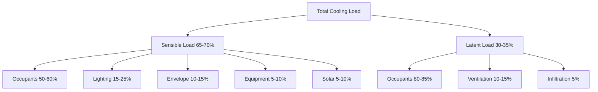

# Cooling Loads for Assembly Occupancies

Assembly spaces—theaters, auditoriums, convention centers, arenas, and houses of worship—present unique cooling load challenges due to extreme occupancy densities, intermittent usage patterns, and simultaneous peak loads. Understanding the physics of heat generation and transfer in these environments is critical for proper system sizing.

## Load Component Analysis

The total cooling load for assembly spaces is dominated by occupant heat gain, which can reach 100-300 Btu/hr per person depending on activity level and building design. Unlike office or residential applications where envelope and equipment loads are primary, assembly spaces experience cooling loads where occupants contribute 60-75% of the total heat gain.

### Total Cooling Load Equation

The comprehensive cooling load for an assembly space is expressed as:

$$Q_{total} = Q_{sensible} + Q_{latent}$$

Where:

$$Q_{sensible} = Q_{occupants,s} + Q_{lights} + Q_{envelope} + Q_{equipment} + Q_{solar}$$

$$Q_{latent} = Q_{occupants,l} + Q_{infiltration,l} + Q_{ventilation,l}$$

The sensible heat ratio (SHR) for assembly spaces typically ranges from 0.60 to 0.75, significantly lower than commercial buildings (0.75-0.85), indicating substantial latent loads.

## Occupant Load Characteristics

The ASHRAE Fundamentals Handbook provides metabolic heat generation rates for various activity levels. For assembly occupancies:

| Occupancy Type | Sensible Heat (Btu/hr·person) | Latent Heat (Btu/hr·person) | Total Heat (Btu/hr·person) |
|----------------|-------------------------------|----------------------------|---------------------------|
| Theater (matinee) | 195 | 140 | 335 |
| Theater (evening) | 195 | 140 | 335 |
| Auditorium (seated) | 195 | 140 | 335 |
| Arena (high activity) | 165 | 310 | 475 |
| Convention hall | 210 | 150 | 360 |

The occupant sensible heat gain accounts for convection and radiation from the human body, while latent heat represents moisture released through respiration and perspiration. At design conditions, a 1,000-seat theater generates approximately 195,000 Btu/hr of sensible heat and 140,000 Btu/hr of latent heat from occupants alone—equivalent to 28 tons of cooling capacity.

## Lighting and Equipment Loads

Assembly spaces require significant lighting for performance areas, with heat gains calculated as:

$$Q_{lights} = W_{installed} \times FU \times FSA$$

Where:
- $W_{installed}$ = installed lighting power (W)
- $FU$ = usage factor (0.8-1.0)
- $FSA$ = special allowance factor (1.0-1.2 for incandescent)

Modern LED theatrical lighting reduces cooling loads by 60-70% compared to legacy incandescent systems. A typical 500-seat theater may have 30,000-50,000 W of installed lighting capacity, contributing 100,000-170,000 Btu/hr to the sensible cooling load.

Sound reinforcement, projection equipment, and control systems add 5,000-15,000 W in dedicated performance venues.

## Envelope and Ventilation Considerations

Assembly spaces often feature minimal exterior wall area relative to floor area, reducing envelope loads. However, ventilation requirements dominate due to high occupancy:

$$Q_{ventilation} = 1.08 \times CFM \times \Delta T + 0.68 \times CFM \times \Delta W$$

ASHRAE Standard 62.1 mandates minimum ventilation rates of 5 cfm per person plus 0.06 cfm/ft² for assembly spaces. For a 10,000 ft² auditorium with 1,000 occupants:

- Required ventilation = (5 × 1,000) + (0.06 × 10,000) = 5,600 cfm
- At design conditions (95°F DB, 75°F WB outdoor; 75°F DB, 50% RH indoor)
- Sensible load = 1.08 × 5,600 × (95 - 75) = 120,960 Btu/hr
- Latent load = 0.68 × 5,600 × (0.0145 - 0.0093) = 19,800 Btu/hr

## Load Diversity and Timing

Unlike continuously occupied buildings, assembly spaces experience dramatic load variations:

```mermaid
gantt
    title Assembly Space Load Profile
    dateFormat HH:mm
    axisFormat %H:%M
    section Occupancy
    Unoccupied : 09:00, 5h
    Pre-event : 14:00, 1h
    Full occupancy : 15:00, 3h
    Post-event : 18:00, 1h
    section Cooling Load
    Minimal load : 09:00, 5h
    Ramping : 14:00, 1h
    Peak load : 15:00, 3h
    Decay : 18:00, 1h
```

This intermittent usage pattern creates design challenges:

1. **Thermal mass effects**: Building structure absorbs heat during occupied periods, releasing it afterward
2. **Pre-cooling requirements**: Systems must reduce space temperature 1-2 hours before occupancy
3. **Peak demand timing**: Utility demand charges impact operating costs
4. **Equipment cycling**: Frequent start-stop operation affects component longevity

## Sizing Considerations

Proper system sizing for assembly spaces requires careful analysis of simultaneous loads. The block cooling load calculation must account for:

**Diversity factors**: Not all heat sources peak simultaneously. Apply 0.85-0.95 diversity factor to total connected lighting and equipment loads.

**Safety factors**: Limit safety factors to 10-15% maximum. Oversized equipment results in poor dehumidification, short cycling, and occupant discomfort.

**Cooling load breakdown (typical 1,000-seat theater)**:

| Component | Sensible (Btu/hr) | Latent (Btu/hr) | Total (Btu/hr) | Percentage |
|-----------|-------------------|-----------------|---------------|------------|
| Occupants | 195,000 | 140,000 | 335,000 | 56% |
| Lighting | 120,000 | 0 | 120,000 | 20% |
| Ventilation | 120,000 | 20,000 | 140,000 | 23% |
| Envelope | 15,000 | 0 | 15,000 | 3% |
| Equipment | 10,000 | 0 | 10,000 | 2% |
| **Total** | **460,000** | **160,000** | **620,000** | **100%** |

This yields a total cooling requirement of 51.7 tons at design conditions.

## Design Recommendations

Based on ASHRAE Fundamentals principles and field experience:

1. **Calculate occupant loads at maximum design occupancy**—use building code occupant load, not seating count
2. **Account for latent loads explicitly**—assembly spaces require 30-35% latent capacity
3. **Consider pre-cooling strategies**—reduce unoccupied setpoint 2-3 hours before events
4. **Evaluate thermal mass benefits**—heavy construction reduces peak loads by 10-15%
5. **Design for part-load operation**—systems operate at 20-40% capacity 60-70% of operating hours
6. **Verify ventilation compliance**—outdoor air requirements often drive system size more than cooling loads

Accurate cooling load calculation for assembly spaces demands rigorous application of heat transfer principles, recognition of occupancy-driven load profiles, and proper accounting for ventilation requirements. These factors distinguish assembly space design from conventional commercial applications and require specialized engineering analysis.
