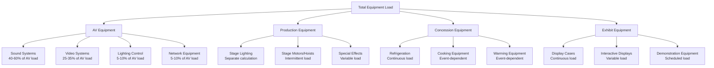
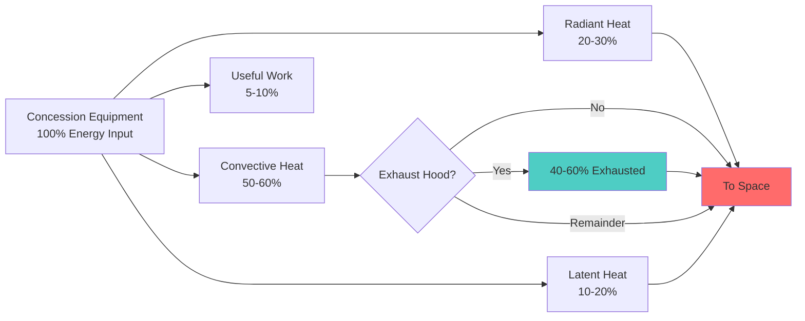

Equipment heat gain in assembly spaces represents a substantial cooling load component that demands careful evaluation. Unlike office environments, assembly venues house specialized equipment with high power densities and variable operating patterns. Accurate load estimation requires understanding equipment types, power consumption characteristics, and simultaneous operation factors.

## Equipment Heat Gain Fundamentals

Equipment converts electrical energy into useful work and waste heat. The heat gain to the conditioned space depends on equipment efficiency, operating schedule, and heat distribution between radiant and convective components.

### Basic Heat Gain Equation

The sensible heat gain from equipment is:

$$Q_{eq} = P_{input} \times F_U \times F_{rad} \times CLF$$

Where:
- $Q_{eq}$ = sensible heat gain (Btu/hr or W)
- $P_{input}$ = equipment nameplate power (W)
- $F_U$ = usage factor (actual power / nameplate power)
- $F_{rad}$ = radiation fraction reaching space
- $CLF$ = cooling load factor (accounts for thermal storage)

For direct convective loads (ventilated equipment):

$$Q_{eq,conv} = 3.41 \times P_{input} \times F_U$$

For 24-hour operation in assembly spaces, CLF approaches 1.0 due to continuous occupancy patterns.

## Audio-Visual Equipment Loads

Modern AV systems constitute the largest equipment load category in performance venues, arenas, and conference facilities.

### Sound System Components

| Equipment Type | Power Density | Usage Factor | Radiation Fraction |
|----------------|---------------|--------------|-------------------|
| Power amplifiers (rack-mounted) | 500-2000 W/unit | 0.4-0.6 | 0.35 |
| Mixing consoles | 200-800 W | 0.8-1.0 | 0.45 |
| Signal processors | 50-150 W/unit | 0.9-1.0 | 0.40 |
| Wireless mic receivers | 20-40 W/unit | 1.0 | 0.50 |
| Subwoofer amplifiers | 1000-4000 W/unit | 0.3-0.5 | 0.30 |

Amplifier load calculation:

$$Q_{amp} = 3.41 \times \sum_{i=1}^{n} (P_{rated,i} \times F_{U,i} \times F_{sim})$$

Where $F_{sim}$ = simultaneous operation factor (0.5-0.8 for multi-zone systems).

### Video and Display Equipment

**Projection Systems:**
- Conventional lamps: 2000-5000 W per projector, $F_U$ = 0.8-1.0
- LED/Laser projectors: 500-1500 W per projector, $F_U$ = 0.9-1.0
- Heat rejection: 75-85% to exhaust, 15-25% to space

**LED Video Walls and Scoreboards:**

$$Q_{LED} = A_{display} \times \rho_{pixel} \times P_{pixel} \times F_{brightness} \times 3.41$$

Where:
- $A_{display}$ = display area (ft² or m²)
- $\rho_{pixel}$ = pixel density (pixels/ft² or pixels/m²)
- $P_{pixel}$ = power per pixel at full brightness (W)
- $F_{brightness}$ = typical brightness setting (0.4-0.7)

Typical LED wall: 15-40 W/ft² (160-430 W/m²) at full brightness.

## Production Equipment Loads

Production equipment in theaters, arenas, and convention centers generates significant intermittent loads.

### Stage and Production Systems

| Equipment Category | Typical Load | Operating Pattern | Diversity Factor |
|-------------------|--------------|-------------------|------------------|
| Motorized rigging | 5-20 HP per motor | Intermittent, <5% duty cycle | 0.10-0.15 |
| Chain hoists | 1-3 HP per unit | Intermittent setup only | 0.05-0.10 |
| Turntables/lifts | 10-50 HP | Intermittent during performance | 0.15-0.25 |
| Fog/haze machines | 1000-3000 W | Intermittent effects | 0.20-0.30 |
| Pyrotechnic controllers | 500-2000 W | Intermittent, brief | 0.05 |

Motor heat gain to space:

$$Q_{motor} = \frac{2545 \times HP \times F_L}{EFF} \times (1 - EFF) \times F_{room}$$

Where:
- $HP$ = motor horsepower
- $F_L$ = load factor (actual load / rated capacity)
- $EFF$ = motor efficiency (decimal)
- $F_{room}$ = fraction of heat to room (0.0 if motor and driven equipment outside space)

## Concession and Support Equipment

Food service equipment adjacent to assembly spaces contributes substantial latent and sensible loads.

### Concession Equipment Heat Gain

| Equipment Type | Sensible Heat (Btu/hr) | Latent Heat (Btu/hr) | Usage Factor |
|----------------|------------------------|---------------------|--------------|
| Popcorn popper (12 oz) | 2400-3000 | 400-600 | 0.6-0.8 |
| Hot dog roller (30 count) | 1800-2200 | 200-300 | 0.5-0.7 |
| Nacho cheese warmer | 800-1200 | 100-150 | 0.7-0.9 |
| Coffee brewer (twin) | 1500-2000 | 800-1200 | 0.4-0.6 |
| Beverage dispenser (refrigerated) | 1200-1800 | 0 | 0.8-1.0 |
| Ice machine (500 lb/day) | 8000-10000 | 1500-2000 | 0.4-0.6 |
| Microwave oven (1200 W) | 2000-2500 | 200-300 | 0.2-0.3 |

Equipment located behind service counters typically exhausts 40-60% of heat via dedicated ventilation. Remaining heat enters the assembly space.

## Exhibit and Display Equipment

Convention centers, museums, and exhibition spaces contain diverse equipment with varying heat rejection characteristics.

**Exhibit Equipment Categories:**

1. **Display lighting (LED):** 8-15 W/ft² of exhibit space
2. **Interactive kiosks:** 200-400 W per unit, $F_U$ = 0.6-0.8
3. **Demonstration equipment:** Highly variable, survey required
4. **Charging stations:** 50-100 W per station, $F_U$ = 0.3-0.5
5. **Refrigerated displays:** 500-2000 W per case, $F_U$ = 0.9-1.0

## Equipment Diversity and Simultaneous Operation

Assembly spaces rarely operate all equipment simultaneously. Diversity factors reduce design cooling loads.

### Recommended Diversity Factors

| Facility Type | Equipment Category | Diversity Factor Range |
|---------------|-------------------|------------------------|
| Theater/Concert Hall | AV equipment | 0.7-0.85 |
| Theater/Concert Hall | Production equipment | 0.4-0.6 |
| Sports Arena | Scoreboard/video | 0.9-1.0 |
| Sports Arena | Concessions | 0.6-0.8 |
| Convention Center | Exhibit equipment | 0.5-0.7 |
| Convention Center | AV systems | 0.6-0.8 |
| Multi-purpose Venue | All equipment | 0.65-0.80 |

Total equipment load with diversity:

$$Q_{total} = \sum_{i=1}^{n} (Q_{eq,i} \times F_{div,i})$$

Apply diversity factors after calculating individual equipment loads, not to nameplate power.

## Load Estimation Methodology

**Step-by-step procedure:**

1. **Inventory equipment** by category and location
2. **Obtain nameplate data** for power consumption
3. **Determine usage factors** from owner/operator input
4. **Calculate individual loads** using appropriate equations
5. **Apply diversity factors** based on facility type and operational patterns
6. **Separate exhaust loads** from space loads
7. **Verify with metered data** from similar facilities when available

For existing facilities, sub-metered electrical data provides the most accurate load profiles. Peak demand typically occurs 1-2 hours after event start when equipment reaches steady-state operation.

## Design Considerations

- Equipment loads in assembly spaces exceed lighting and envelope loads
- AV and scoreboard equipment operate independently of occupancy in many venues
- Concession equipment peaks during intermissions and pre-event periods
- Production equipment diversity varies dramatically by event type
- Equipment upgrades occur frequently; design for 20-30% future expansion
- Coordinate with electrical engineers for accurate power data
- Consider equipment replacement cycles (3-7 years for AV, 10-15 years for concessions)

**Reference:** ASHRAE Fundamentals, Chapter 18 (Nonresidential Cooling and Heating Load Calculations), Tables 4-6 (Equipment Heat Gain).

Accurate equipment load estimation requires collaboration with facility operators, AV consultants, and food service designers to establish realistic operating scenarios and power consumption patterns for the specific venue configuration and event programming.
