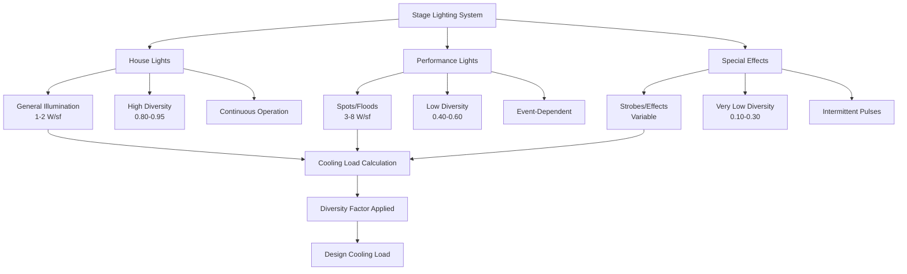
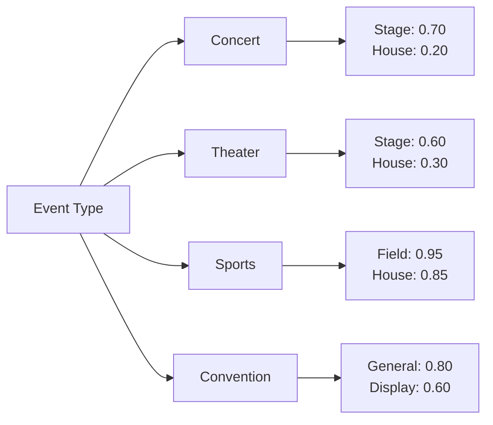

Lighting represents a significant sensible cooling load in assembly spaces, with heat gain characteristics that differ dramatically between house lighting and performance lighting systems. Accurate quantification of lighting loads requires understanding lighting power density, diversity factors, and the thermal properties of modern lighting technologies.

## Fundamental Heat Gain Equations

The instantaneous lighting heat gain is calculated using:

$$Q_{light} = W_{installed} \times F_{use} \times F_{special}$$

where:
- $Q_{light}$ = instantaneous lighting heat gain (W)
- $W_{installed}$ = total installed lighting power (W)
- $F_{use}$ = lighting use factor (fraction of lights operating)
- $F_{special}$ = special allowance factor for ballast/driver losses

For fluorescent and HID systems with remote ballasts:

$$Q_{light} = 3.41 \times W_{lamp} \times (1 + BF) \times F_{use} \times F_{SA}$$

where:
- $BF$ = ballast factor (typically 0.10-0.25 for magnetic, 0.05-0.15 for electronic)
- $F_{SA}$ = space fraction (portion of heat entering conditioned space)

For LED systems:

$$Q_{LED} = W_{fixture} \times F_{use} \times \eta_{thermal}$$

where:
- $\eta_{thermal}$ = thermal efficiency factor (0.90-0.95 for LED fixtures)

## Lighting Power Density by Space Type

ASHRAE 90.1 establishes maximum lighting power densities, but actual loads vary significantly:

| Space Type | Typical LPD (W/sf) | Design Range (W/sf) | Diversity Factor |
|------------|-------------------|---------------------|------------------|
| House Lights - Theater | 1.2 - 1.8 | 1.0 - 2.5 | 0.70 - 0.85 |
| Stage Lighting - Theater | 3.0 - 8.0 | 2.0 - 15.0 | 0.40 - 0.60 |
| Arena Event Lighting | 2.5 - 4.5 | 2.0 - 6.0 | 0.50 - 0.70 |
| Arena House Lights | 1.0 - 1.5 | 0.8 - 2.0 | 0.80 - 0.95 |
| Convention Hall | 1.5 - 2.5 | 1.2 - 3.0 | 0.70 - 0.85 |
| Auditorium Seating | 0.9 - 1.4 | 0.7 - 1.8 | 0.75 - 0.90 |
| Stadium Field Lighting | 4.0 - 12.0 | 3.0 - 20.0 | 0.60 - 0.80 |
| Lobby/Circulation | 1.0 - 1.5 | 0.8 - 2.0 | 0.85 - 0.95 |

## LED Technology Impact

LED lighting systems fundamentally alter cooling load calculations through three mechanisms:

**Heat Output Reduction**

LED fixtures convert 30-40% of electrical input to light (luminous efficacy 80-150 lm/W), compared to 10-20% for incandescent and 20-30% for fluorescent systems. The reduced waste heat directly decreases cooling loads:

$$\Delta Q = (W_{traditional} - W_{LED}) \times F_{use}$$

For a 10,000 sf theater replacing 2.0 W/sf incandescent with 0.8 W/sf LED:

$$\Delta Q = (20,000 - 8,000) \times 0.75 = 9,000 \text{ W} = 9 \text{ kW}$$

**Driver Efficiency**

LED drivers exhibit lower losses than magnetic ballasts (5-10% vs 15-25%), with most heat dissipated at the fixture rather than remotely. This affects radiant/convective split and plenum temperature calculations.

**Spectral Characteristics**

LED spectral output contains minimal infrared content, reducing radiant heat transfer to occupants and surfaces compared to incandescent sources.

## Stage and Performance Lighting

Theatrical and performance lighting generates extreme localized heat gains requiring specialized treatment:

## Diversity Factor Application

Lighting diversity represents the fraction of installed capacity operating simultaneously. Assembly spaces exhibit low diversity due to programming requirements:

**House Lights vs Performance Mode**

During performances, house lights dim while stage lighting activates. The peak cooling load occurs during transitions or rehearsals when both systems operate:

$$Q_{peak} = (W_{house} \times F_{house}) + (W_{stage} \times F_{stage})$$

For design purposes:

$$Q_{design} = \max\left[(W_{house} \times 0.90), (W_{stage} \times 0.60), (W_{house} \times 0.40 + W_{stage} \times 0.60)\right]$$

The third term typically governs, representing partial house lighting during performance setup.

**Event Type Considerations**

Different event types produce distinct lighting profiles:

## Calculation Methodology

**Step 1: Inventory Installed Capacity**

Document all lighting circuits by zone:
- House lighting systems
- Stage/performance lighting
- Architectural accent lighting
- Emergency egress lighting

**Step 2: Determine Use Factors**

Establish diversity factors based on:
- Event programming schedule
- Lighting control sequences
- Dimming system capabilities
- Operational interviews

**Step 3: Calculate Heat Gain**

Apply appropriate equations with consideration for:
- Ballast/driver location (in-space vs remote)
- Fixture mounting (direct conditioned space vs plenum)
- Radiant/convective split (affects cooling load timing)

**Step 4: Apply Safety Factors**

Add 10-15% margin for:
- Future lighting additions
- Control system failures
- Unanticipated full-bright scenarios

## Design Recommendations

**Load Calculation Approach**

- Use actual fixture schedules, not code-minimum LPD values
- Interview lighting designers for realistic diversity factors
- Calculate separate loads for house and performance modes
- Consider dimming system impact on instantaneous load

**System Design Implications**

- Zone HVAC systems to match lighting control zones
- Provide additional capacity near high-intensity fixtures
- Design for rapid load changes during lighting transitions
- Consider heat recovery from high-output fixtures

**Verification Requirements**

- Measure actual lighting power draw during commissioning
- Verify diversity factors through operational monitoring
- Adjust control sequences if measured loads exceed design
- Document as-built lighting power for future modifications

## References

ASHRAE Fundamentals Chapter 18 provides detailed lighting heat gain data, including spectral characteristics, ballast factors, and space allocation fractions for various fixture types. ASHRAE 90.1 establishes baseline lighting power densities for energy code compliance, though actual installed loads frequently exceed these minimums in assembly applications.

---

**File:** `/Users/evgenygantman/Documents/github/gantmane/hvac/content/specialty-applications-testing/specialty-hvac-applications/high-occupancy-density-hvac/cooling-loads-assembly/lighting-loads/_index.md`
