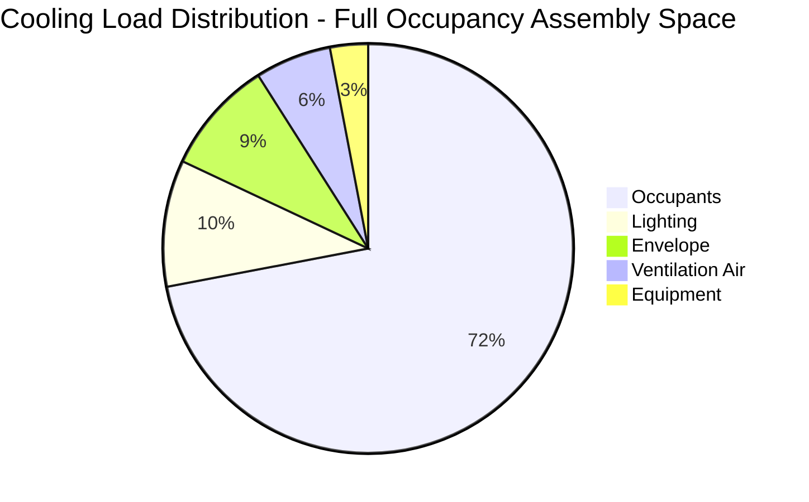
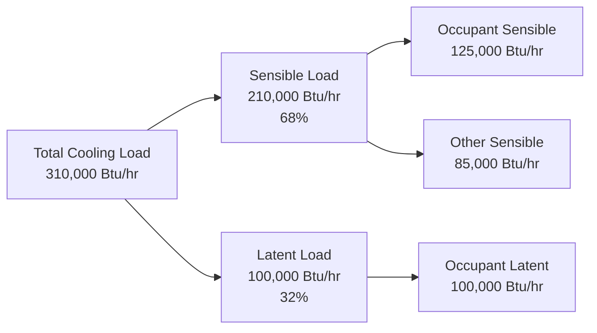
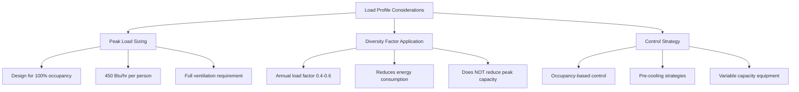

## Load Dominance in High-Occupancy Spaces

In theaters, auditoriums, lecture halls, and other assembly spaces, occupant heat gain represents 60 to 80 percent of total cooling load. This dominance fundamentally alters system design, sizing methodology, and control strategies compared to conventional commercial spaces where envelope and equipment loads prevail.

The concentration of metabolic heat generation in confined volumes creates cooling demands that exceed typical office buildings by factors of three to five per unit floor area. Understanding the physics of occupant heat rejection and its temporal characteristics is essential for proper system capacity determination.

## Occupant Heat Gain Components

Each occupant releases heat through metabolic processes, with total heat gain split between sensible and latent fractions.

**Sensible heat gain** transfers directly to air temperature through convection and radiation. This component is approximately 245 to 275 Btu/hr per seated adult at theater activity levels (ASHRAE Fundamentals, Chapter 18).

**Latent heat gain** results from moisture addition via respiration and perspiration. This component ranges from 155 to 205 Btu/hr per seated adult, depending on activity level and thermal comfort conditions.

The total heat gain per occupant is:

$$q_{occ,total} = q_{sensible} + q_{latent}$$

For typical assembly space conditions:

$$q_{occ,total} = 250 + 200 = 450 \text{ Btu/hr per person}$$

The sensible heat ratio (SHR) for occupant loads in assembly spaces typically ranges from 0.55 to 0.60:

$$SHR = \frac{q_{sensible}}{q_{sensible} + q_{latent}} = \frac{250}{450} = 0.56$$

This low SHR contrasts sharply with typical commercial buildings (SHR = 0.70 to 0.85) and drives significant dehumidification requirements.

## Load Breakdown by Component

The distribution of cooling loads in a typical 500-seat auditorium operating at full capacity:

| Load Component | Heat Gain (Btu/hr) | Percentage of Total | Notes |
|----------------|-------------------|---------------------|-------|
| Occupants (500 people) | 225,000 | 72% | Dominant load source |
| Lighting (2 W/ft²) | 30,000 | 10% | Stage and house lighting |
| Envelope (walls, roof) | 28,000 | 9% | Minimal glazing typical |
| Ventilation air | 18,000 | 6% | Outdoor air at design conditions |
| Equipment (AV, misc) | 9,000 | 3% | Sound system, projection |
| **Total Cooling Load** | **310,000** | **100%** | **Approximately 26 tons** |

## Sensible vs. Latent Load Distribution

The split between sensible and latent loads significantly impacts equipment selection:

| Load Type | Heat Gain (Btu/hr) | Percentage | System Impact |
|-----------|-------------------|------------|---------------|
| Sensible (occupants) | 125,000 | 40% | Air temperature control |
| Latent (occupants) | 100,000 | 32% | Dehumidification requirement |
| Sensible (other sources) | 85,000 | 28% | Lighting, envelope, equipment |
| **Total Load** | **310,000** | **100%** | Overall system capacity = 26 tons |

Overall space SHR:

$$SHR_{space} = \frac{125,000 + 85,000}{310,000} = 0.68$$

## Occupancy Diversity and Load Profiles

Assembly spaces rarely operate at design occupancy continuously. Diversity factors account for actual vs. design occupancy patterns.

**Full capacity events** (concerts, opening nights, peak performances) occur 10 to 20 percent of operating hours. These events establish design cooling capacity.

**Partial capacity events** (rehearsals, off-peak showings, lectures) represent 60 to 70 percent of operating hours, with occupancy ranging from 30 to 60 percent of capacity.

**Setup/breakdown periods** involve minimal occupancy but potentially high equipment and lighting loads.

Typical load profile for an evening performance:

| Time Period | Occupancy (%) | Cooling Load (%) | Duration |
|-------------|---------------|------------------|----------|
| Pre-event setup | 5% | 25% | 2 hours |
| Door opening/seating | 50% → 100% | 40% → 95% | 0.5 hours |
| Performance | 100% | 100% | 2 hours |
| Intermission | 80% | 90% | 0.25 hours |
| Performance conclusion | 100% → 0% | 100% → 15% | 0.5 hours |
| Post-event | 5% | 20% | 1 hour |

## System Sizing Implications

The dominance of occupant loads creates specific design requirements:

**Capacity must meet peak occupancy conditions.** Undersizing by even 10 percent results in unacceptable temperature rise and humidity levels during full-capacity events. The thermal mass of occupied spaces provides minimal buffering due to high occupant density.

**Dehumidification capacity must match latent load fraction.** Standard DX equipment with SHR of 0.75 to 0.80 cannot adequately dehumidify spaces with SHR below 0.70. Supplemental dehumidification or low-SHR equipment selection becomes necessary.

**Ventilation air represents a significant fraction of total load** when outdoor air requirements (typically 15 cfm per person for assembly spaces per ASHRAE 62.1) are met. At design conditions:

$$q_{ventilation} = 1.08 \times CFM \times \Delta T + 0.68 \times CFM \times \Delta W$$

For 500 occupants at 15 cfm per person with outdoor conditions at 95°F DB, 78°F WB and indoor setpoint of 75°F, 50% RH, ventilation load approaches 15 to 20 percent of total load.

**Rapid load changes require responsive capacity modulation.** Occupancy can increase from 10 to 100 percent within 30 minutes during event seating. Systems must provide sufficient capacity staging or variable-speed modulation to track these load transients without excessive temperature swing.

The load profile variability also enables energy recovery strategies during partial occupancy periods, with annual energy consumption typically 40 to 60 percent of what continuous peak operation would require.

## References

ASHRAE Handbook—Fundamentals, Chapter 18: Nonresidential Cooling and Heating Load Calculations

ASHRAE Standard 62.1: Ventilation for Acceptable Indoor Air Quality
