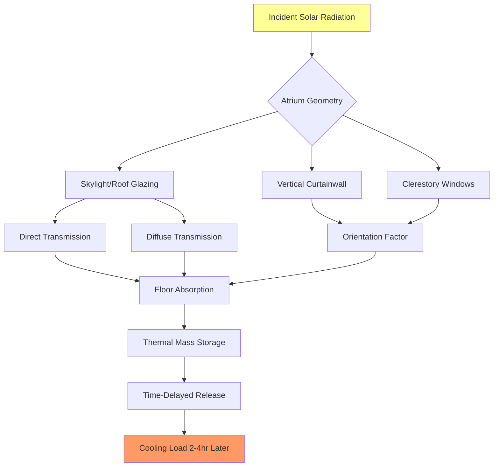
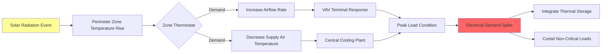

## Solar Load Fundamentals in Assembly Spaces

Solar radiation represents the dominant heat gain component in glazed assembly facilities. Large-area glazing systems, skylights, and atrium spaces introduce substantial cooling loads that vary dynamically with sun position, cloud cover, and building orientation. Assembly spaces present unique challenges due to their extensive fenestration, high ceilings, and intermittent occupancy patterns that complicate traditional solar control strategies.

The instantaneous solar heat gain through glazing is calculated using:

$$Q_{solar} = A_{glazing} \times SHGC \times SHGF \times CLF$$

where:
- $Q_{solar}$ = solar heat gain (Btu/hr or W)
- $A_{glazing}$ = effective glazing area (ft² or m²)
- $SHGC$ = solar heat gain coefficient (dimensionless)
- $SHGF$ = solar heat gain factor from tables (Btu/hr·ft² or W/m²)
- $CLF$ = cooling load factor accounting for thermal mass

## Solar Heat Gain Coefficient by Glazing Type

SHGC characterizes the fraction of incident solar radiation that becomes heat gain within the conditioned space. Assembly spaces require careful SHGC selection to balance daylighting objectives with cooling load management.

| Glazing Type | SHGC | Visible Transmittance | Application |
|--------------|------|----------------------|-------------|
| Single clear 6mm | 0.86 | 0.90 | Not recommended for assembly |
| Double clear 6mm | 0.76 | 0.81 | Limited use, north façades |
| Double bronze tint | 0.62 | 0.61 | Standard assembly glazing |
| Double low-E (ε=0.10) | 0.71 | 0.79 | Balance thermal/solar |
| Double low-E + tint | 0.39 | 0.64 | High-performance assembly |
| Triple low-E selective | 0.27 | 0.70 | Premium control applications |
| Reflective double | 0.19 | 0.15 | Maximum solar rejection |

## Skylight Solar Heat Gain Analysis

Skylights impose severe cooling loads in assembly spaces due to their horizontal orientation maximizing summer solar exposure. The effective SHGC for skylights must account for:

$$SHGC_{eff} = SHGC_{rated} \times IAC \times \frac{1}{cos(\theta)}$$

where:
- $IAC$ = interior attenuation coefficient for shading devices
- $\theta$ = angle of incidence (approaches 0° at summer noon)

Peak skylight solar heat gain factors for horizontal surfaces:

| Latitude | June Peak (Btu/hr·ft²) | Time | Design SHGC | Resulting Load (Btu/hr·ft²) |
|----------|------------------------|------|-------------|------------------------------|
| 30°N | 286 | 12:00 | 0.30 | 86 |
| 35°N | 278 | 12:00 | 0.30 | 83 |
| 40°N | 268 | 12:00 | 0.30 | 80 |
| 45°N | 255 | 12:00 | 0.30 | 77 |

Skylight systems in assembly spaces should incorporate:
- Low-SHGC glazing (SHGC ≤ 0.30)
- Motorized interior shading with automated solar tracking
- Diffusing elements to distribute light while blocking direct beam radiation
- Thermal breaks in framing to prevent conductive gains

## Atrium Space Solar Load Modeling

Multi-story atria create complex solar load patterns requiring specialized calculation methods. The total atrium solar load combines:

$$Q_{atrium} = Q_{glazed-roof} + Q_{vertical-glazing} + Q_{reflected} + Q_{thermal-storage}$$

The thermal storage term is significant in atria due to massive structures exposed to solar radiation. High-mass floors and walls absorb solar energy during occupied hours and release it during evening events, requiring extended HVAC operation.

## Orientation Impact on Vertical Glazing

Assembly spaces with extensive vertical glazing experience orientation-dependent cooling loads. Peak solar heat gain factors (Btu/hr·ft²) for double clear glass (SHGC=0.76) at 40°N latitude in July:

| Orientation | 8:00 | 10:00 | 12:00 | 14:00 | 16:00 | Peak Time |
|-------------|------|-------|-------|-------|-------|-----------|
| North | 44 | 51 | 55 | 51 | 44 | 12:00 |
| Northeast | 131 | 89 | 55 | 41 | 36 | 8:00 |
| East | 176 | 122 | 55 | 41 | 36 | 8:00 |
| Southeast | 166 | 145 | 79 | 41 | 36 | 10:00 |
| South | 36 | 79 | 103 | 79 | 36 | 12:00 |
| Southwest | 36 | 41 | 79 | 145 | 166 | 16:00 |
| West | 36 | 41 | 55 | 122 | 176 | 16:00 |
| Northwest | 36 | 41 | 55 | 89 | 131 | 16:00 |

East and west façades experience the highest instantaneous gains due to low sun angles that penetrate deep into assembly spaces. South-facing glazing receives lower peak loads but sustained exposure throughout the day.

## Solar Control Strategies for Assembly Applications

### Architectural Solutions

**External shading devices** provide the most effective solar control by intercepting radiation before it reaches glazing surfaces. Horizontal overhangs sized using:

$$L_{overhang} = H \times tan(\alpha_{critical})$$

where $H$ is the vertical distance from overhang to window sill and $\alpha_{critical}$ is the solar altitude angle at the design exclusion condition.

**Glazing specifications** should prioritize spectrally selective low-E coatings that reject near-infrared radiation while admitting visible light. For assembly spaces requiring daylighting:
- Target SHGC ≤ 0.40 for vertical glazing
- Target SHGC ≤ 0.30 for skylights and sloped glazing
- Specify visible transmittance ≥ 0.60 to maintain daylighting effectiveness

### HVAC System Responses

**Thermal zoning** must separate solar-exposed perimeter zones from interior zones. Perimeter zones should be narrow (12-15 ft depth) to prevent excessive airflow requirements from driving interior zone temperatures below setpoint.

**Dedicated outdoor air systems (DOAS)** combined with radiant cooling can effectively manage solar loads in assembly spaces. The radiant system absorbs solar radiation at surfaces before it becomes sensible cooling load in the space air, reducing required airflow and fan energy.

**Thermal energy storage** shifts cooling production from peak solar gain periods (afternoon) to off-peak hours (night), reducing electrical demand charges and improving chiller efficiency through lower condensing temperatures.

## Design Load Calculation Protocol

Per ASHRAE Fundamentals Chapter 18, solar load calculations for assembly spaces require:

1. **Establish design day conditions** including peak solar radiation values for site latitude, month, and time
2. **Calculate solar angle geometry** (altitude and azimuth) for each façade orientation
3. **Determine SHGF from tables** based on orientation, latitude, and glazing tilt
4. **Apply SHGC** for specified glazing assemblies including frame effects
5. **Apply cooling load factors** to account for thermal mass and time delay
6. **Sum all glazing surface contributions** including vertical, sloped, and horizontal elements
7. **Add interior solar absorption** for radiation transmitted to floors and furnishings

Assembly space solar loads commonly represent 40-60% of total peak cooling load, making accurate calculation critical to system sizing and energy performance.

---

**References**: ASHRAE Fundamentals (2021), Chapter 15 (Fenestration) and Chapter 18 (Nonresidential Cooling and Heating Load Calculations)
