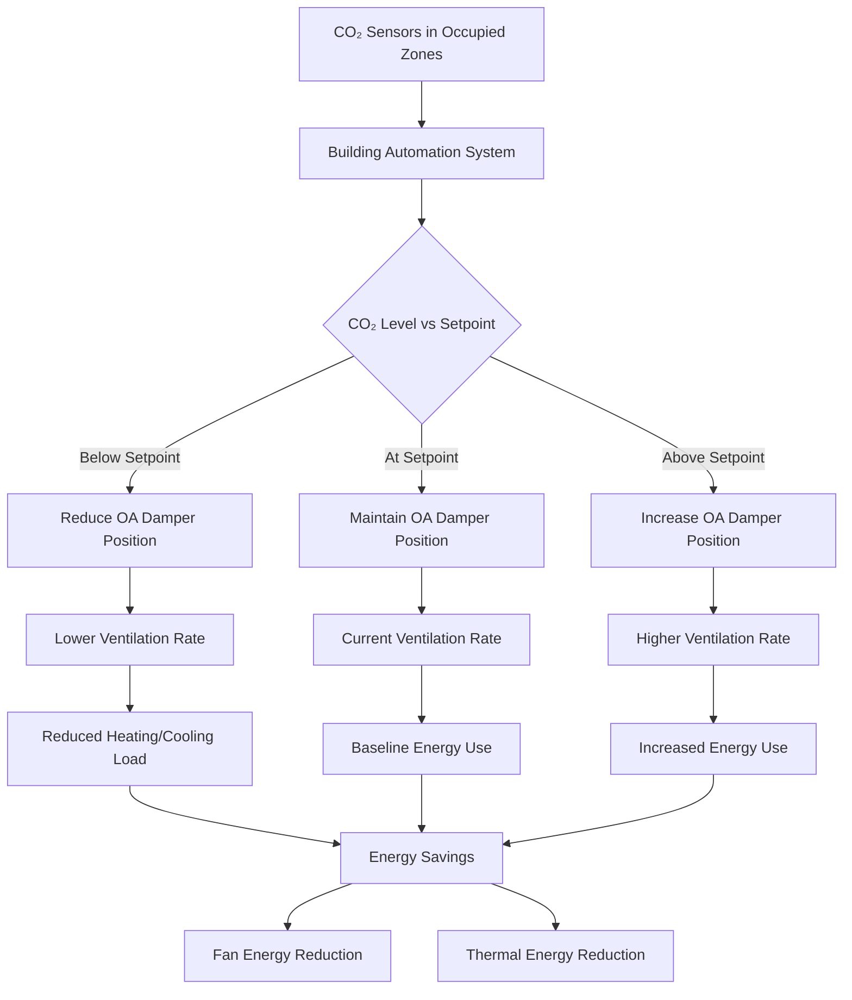
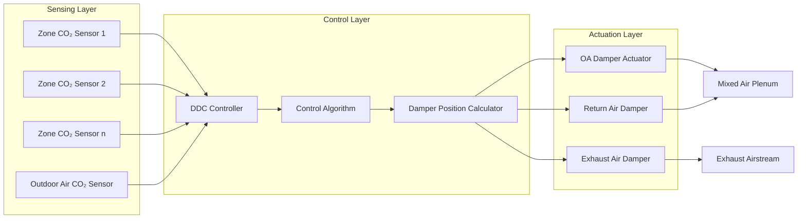

# Demand Controlled Ventilation (DCV)

Demand-controlled ventilation dynamically adjusts outdoor air intake based on real-time occupancy rather than maintaining constant ventilation rates for design occupancy. DCV systems utilize CO₂ sensors as proxy indicators for occupant density, modulating ventilation to meet actual demand while minimizing energy consumption during periods of lower occupancy.

## Fundamental Operating Principle

DCV systems operate on the principle that CO₂ concentration in indoor air correlates directly with occupant density. As occupants exhale CO₂ at approximately 0.3 L/min per person, indoor CO₂ levels rise above ambient outdoor concentrations (typically 400-450 ppm). By measuring CO₂ concentration and comparing it to setpoint thresholds, the building automation system adjusts outdoor air dampers to maintain acceptable indoor air quality while reducing unnecessary ventilation during partial occupancy periods.

The relationship between occupancy, CO₂ generation, and required ventilation rate follows:

$$\dot{m}_{CO_2} = N \cdot G_{person}$$

Where:
- $\dot{m}_{CO_2}$ = CO₂ generation rate (L/min)
- $N$ = number of occupants
- $G_{person}$ = CO₂ generation per person (≈0.3 L/min for sedentary adults)

The steady-state CO₂ concentration is:

$$C_{indoor} = C_{outdoor} + \frac{N \cdot G_{person}}{\dot{V}_{OA}}$$

Where:
- $C_{indoor}$ = indoor CO₂ concentration (ppm)
- $C_{outdoor}$ = outdoor CO₂ concentration (ppm)
- $\dot{V}_{OA}$ = outdoor air ventilation rate (CFM)

## Energy Savings Potential

DCV systems reduce ventilation energy through decreased outdoor air heating, cooling, and fan power. The annual energy savings can be estimated as:

$$E_{savings} = \sum_{i=1}^{8760} \left[\dot{V}_{design} - \dot{V}_{DCV}(i)\right] \cdot \rho \cdot c_p \cdot \left(T_{outdoor}(i) - T_{setpoint}\right) \cdot \frac{1}{\eta_{HVAC}}$$

Where:
- $\dot{V}_{design}$ = design outdoor air flow rate (CFM)
- $\dot{V}_{DCV}(i)$ = DCV-modulated flow rate at hour $i$ (CFM)
- $\rho$ = air density (0.075 lbm/ft³)
- $c_p$ = specific heat of air (0.24 BTU/lbm·°F)
- $T_{outdoor}(i)$ = outdoor temperature at hour $i$ (°F)
- $T_{setpoint}$ = indoor temperature setpoint (°F)
- $\eta_{HVAC}$ = HVAC system efficiency

Typical energy savings range from 20-60% of ventilation-related energy consumption depending on:
- Occupancy variability
- Climate zone
- Space type
- Operating schedule

## Code Requirements and Applicability

### ASHRAE 62.1 Requirements

ASHRAE 62.1 permits DCV in spaces meeting specific criteria:

**Allowed Applications:**
- Spaces with variable occupancy
- Design occupancy density ≥25 people per 1000 ft²
- CO₂ setpoint typically 1000-1200 ppm above outdoor ambient

**Prohibited Applications:**
- Spaces with significant non-occupant pollutant sources
- Areas requiring constant ventilation (laboratories, medical facilities)
- Spaces where occupancy sensors cannot accurately represent zone conditions

### ASHRAE 90.1 Energy Standard

ASHRAE 90.1 requires DCV for:
- Systems serving high-occupancy spaces (≥40 people per 1000 ft²)
- Air handler capacity >3000 CFM
- Minimum outdoor air >1200 CFM

**Exceptions:**
- Systems with economizer capability meeting 100% outdoor air requirements
- Spaces with minimum outdoor air <300 CFM per zone
- Multiple-zone systems without DDC controls

## DCV System Architecture

## Implementation Strategies

### Sensor Placement and Calibration

Critical factors for accurate DCV operation:

1. **Sensor Location**
   - Mount at breathing zone height (3-6 feet above floor)
   - Avoid locations near doors, windows, or supply diffusers
   - Multiple sensors for large or irregularly shaped zones
   - Return air duct sensors acceptable for uniform spaces

2. **Calibration Protocol**
   - Factory calibration accuracy: ±50 ppm
   - Field calibration interval: 12-24 months
   - Verification against reference-grade instrument
   - Zero-point and span adjustment procedures

3. **Sensor Technology Selection**

| Technology | Accuracy | Drift | Lifespan | Cost | Application |
|------------|----------|-------|----------|------|-------------|
| NDIR (Non-Dispersive Infrared) | ±30-50 ppm | Low | 10-15 years | $$$ | Commercial standard |
| Electrochemical | ±100 ppm | Moderate | 2-5 years | $$ | Residential, light commercial |
| Metal Oxide | ±200 ppm | High | 3-5 years | $ | Not recommended for DCV |

### Control Strategies

**Proportional Control:**
$$\dot{V}_{OA} = \dot{V}_{min} + K_p \cdot (C_{measured} - C_{setpoint})$$

Where:
- $\dot{V}_{min}$ = minimum ventilation rate per code (CFM)
- $K_p$ = proportional gain constant
- $C_{measured}$ = measured CO₂ concentration (ppm)
- $C_{setpoint}$ = target CO₂ concentration (ppm)

**Multiple-Zone Systems:**
For VAV systems serving multiple zones, the critical zone approach applies:

$$\dot{V}_{OA,system} = \max\left(\dot{V}_{min,system}, \max_{z=1}^{n}\left[\dot{V}_{OA,z}\right]\right)$$

The system outdoor air intake equals the maximum zone requirement among all zones.

### Performance Verification

**Commissioning Requirements:**
1. Verify sensor accuracy against reference instrument
2. Confirm minimum outdoor air rates under all conditions
3. Test control response across full occupancy range
4. Document baseline CO₂ levels at design occupancy
5. Verify damper response time and linearity

**Ongoing Monitoring:**
- Trend CO₂ levels and outdoor air damper position
- Compare energy consumption to baseline
- Monitor sensor drift through periodic calibration
- Alert on sensor failure or out-of-range readings

## DCV Performance Comparison

| System Type | Ventilation Control | Energy Savings | Capital Cost | Complexity | Best Application |
|-------------|-------------------|----------------|--------------|------------|------------------|
| Constant Volume | Fixed OA damper | Baseline (0%) | $ | Low | Constant occupancy spaces |
| Scheduled DCV | Time-based modulation | 10-25% | $$ | Low | Predictable schedules |
| CO₂-Based DCV | Real-time sensor control | 20-60% | $$$ | Medium | Variable occupancy |
| Occupancy Sensor DCV | People counting | 25-65% | $$$$ | High | Critical applications |
| Hybrid DCV | CO₂ + schedule + occupancy | 30-70% | $$$$$ | High | High-value applications |

## Economic Analysis

The simple payback period for DCV implementation:

$$PBP = \frac{C_{capital}}{E_{savings} \cdot C_{energy} + M_{avoided}}$$

Where:
- $C_{capital}$ = installed cost of DCV system
- $E_{savings}$ = annual energy savings (kWh or therms)
- $C_{energy}$ = blended energy cost ($/kWh or $/therm)
- $M_{avoided}$ = avoided HVAC equipment capacity costs

Typical payback periods:
- High-occupancy density spaces: 2-4 years
- Moderate occupancy variability: 4-7 years
- Low occupancy variability: 7-12 years (marginal case)

## Design Considerations

**System Integration:**
- Compatibility with existing building automation system protocols (BACnet, Modbus, LonWorks)
- Coordination with economizer controls to prevent conflicts
- Integration with demand response programs
- Interface with energy management systems for trending and optimization

**Potential Issues:**
- Sensor fouling in dusty or contaminated environments
- Time lag between occupancy changes and CO₂ response (10-30 minutes)
- Non-representative sensor locations in stratified or compartmentalized spaces
- Outdoor CO₂ concentration variations affecting control accuracy

DCV systems provide significant energy savings in spaces with variable occupancy while maintaining code-compliant ventilation rates. Proper sensor selection, placement, calibration, and control strategy implementation are critical for achieving predicted performance and energy savings.
