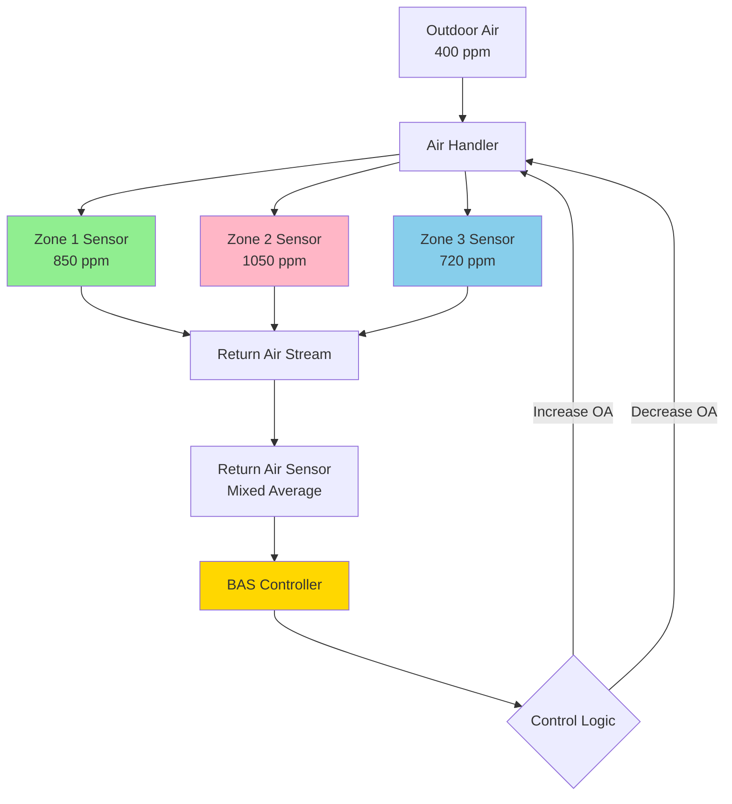
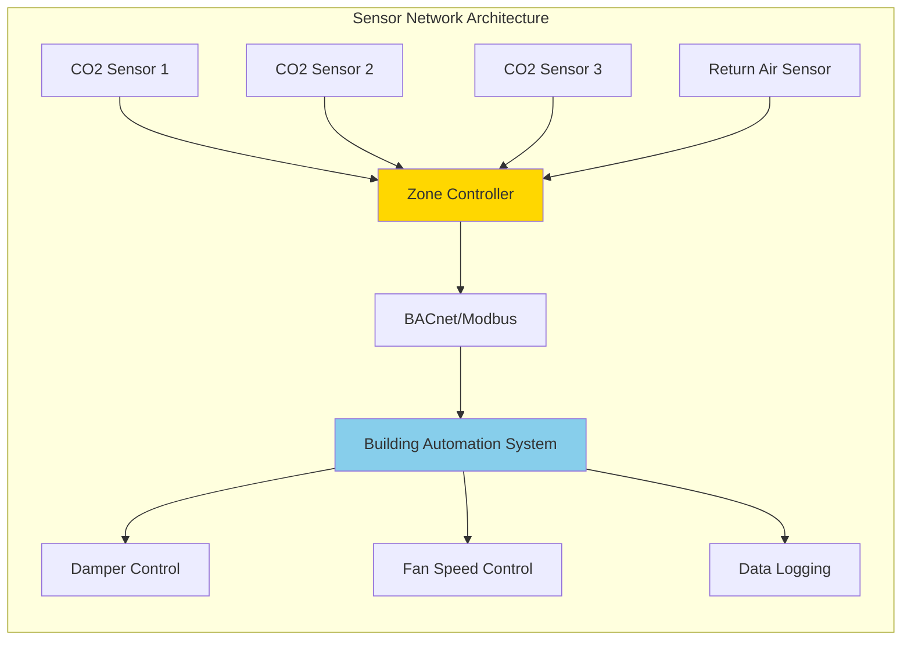

## CO2 Sensor Technology for DCV Systems

Carbon dioxide sensors serve as the primary measurement device in demand-controlled ventilation (DCV) systems, enabling real-time modulation of outdoor air delivery based on occupancy levels. The effectiveness of DCV strategies depends critically on sensor accuracy, placement, and integration with building automation systems.

### NDIR Sensor Technology

Non-dispersive infrared (NDIR) sensors represent the industry standard for HVAC applications due to their stability, accuracy, and cost-effectiveness. These sensors operate by measuring the absorption of infrared radiation at the 4.26 μm wavelength specific to CO2 molecules.

**Operating Principle:**

The sensor transmits infrared light through a sample chamber. CO2 molecules absorb energy at their characteristic wavelength, and the detector measures the intensity reduction:

$$I = I_0 e^{-\alpha C L}$$

Where:
- $I$ = transmitted light intensity (W/m²)
- $I_0$ = incident light intensity (W/m²)
- $\alpha$ = absorption coefficient (m²/mol)
- $C$ = CO2 concentration (ppm)
- $L$ = optical path length (m)

The CO2 concentration is calculated from the Beer-Lambert relationship:

$$C = \frac{1}{\alpha L} \ln\left(\frac{I_0}{I}\right)$$

### Sensor Accuracy and Performance Specifications

ASHRAE 62.1 mandates specific accuracy requirements for CO2 sensors used in DCV applications. The standard requires sensors to maintain accuracy within ±75 ppm or 5% of reading at 1000 ppm, whichever is greater.

| Sensor Grade | Accuracy at 1000 ppm | Drift Rate | Calibration Interval | Application |
|--------------|---------------------|------------|---------------------|-------------|
| Premium | ±30 ppm | <2% per year | 5 years | Critical spaces, laboratories |
| Standard | ±50 ppm | <3% per year | 3 years | Office buildings, schools |
| Economy | ±100 ppm | <5% per year | 1-2 years | Light commercial |

**Temperature and humidity compensation** is essential for accurate readings. Sensors must correct for these environmental variables:

$$C_{corrected} = C_{measured} \times K_T(T) \times K_{RH}(RH)$$

Where $K_T$ and $K_{RH}$ are temperature and humidity correction factors provided by the manufacturer.

### Sensor Calibration Methods

Three calibration approaches are employed in HVAC applications:

**1. Manual Calibration**

Technicians expose sensors to known CO2 concentrations (typically 400 ppm outdoor air and 1000 ppm reference gas):

$$Slope = \frac{C_{ref,high} - C_{ref,low}}{V_{high} - V_{low}}$$

$$Offset = C_{ref,low} - Slope \times V_{low}$$

**2. Automatic Background Calibration (ABC)**

The sensor assumes the lowest sustained reading over 7-14 days represents outdoor air (approximately 400 ppm) and adjusts automatically. This method is unsuitable for continuously occupied spaces or locations lacking periodic exposure to outdoor air.

**3. Single-Point Calibration**

The sensor is exposed to outdoor air and adjusted to 400-420 ppm. This simplified method provides adequate accuracy for most HVAC applications.

### Sensor Placement Strategy

Strategic sensor placement directly impacts DCV system performance and energy efficiency. ASHRAE 62.1 provides guidance for single-zone and multi-zone applications.

**Single-Zone Systems:**

- One sensor in the return air stream near the air handler
- Minimum 3 feet from return grille to ensure mixed air sample
- Protected from direct airflow impingement

**Multi-Zone Systems:**

Multiple sensors required when zones have different occupancy patterns:

$$V_{ot} = \sum_{i=1}^{n} V_{oi} \times \frac{CO2_i - CO2_{outdoor}}{CO2_{design} - CO2_{outdoor}}$$

Where:
- $V_{ot}$ = total outdoor air requirement (cfm)
- $V_{oi}$ = design outdoor air for zone $i$ (cfm)
- $CO2_i$ = measured CO2 in zone $i$ (ppm)
- $CO2_{design}$ = design setpoint (typically 1000-1100 ppm)

**Space Sensor Placement:**

- Mount at breathing zone height (3-6 feet above floor)
- Avoid locations near doors, windows, or ventilation diffusers
- Minimum 1 sensor per 10,000 square feet or per zone
- Additional sensors for high-density areas (conference rooms, classrooms)

### Control Integration and Algorithms

The BAS integrates CO2 sensor readings with ventilation control using proportional or stepped control strategies.

**Proportional Control:**

$$OA\% = OA_{min} + (OA_{max} - OA_{min}) \times \frac{CO2_{measured} - CO2_{setpoint,low}}{CO2_{setpoint,high} - CO2_{setpoint,low}}$$

Typical setpoints:
- $CO2_{setpoint,low}$ = 800 ppm (minimum outdoor air)
- $CO2_{setpoint,high}$ = 1000 ppm (maximum outdoor air)

**Stepped Control:**

| CO2 Level | Outdoor Air Damper Position |
|-----------|----------------------------|
| < 800 ppm | Minimum position (15-20%) |
| 800-900 ppm | 40% open |
| 900-1000 ppm | 70% open |
| > 1000 ppm | 100% open |

### Maintenance and Verification

Regular maintenance ensures sustained accuracy and system performance:

**Quarterly Checks:**
- Visual inspection for physical damage or obstruction
- Verify sensor readings against portable reference meter
- Clean optical surfaces per manufacturer instructions

**Annual Calibration:**
- Two-point calibration using outdoor air and reference gas
- Document drift from previous calibration
- Replace sensors exhibiting drift >75 ppm annually

**Performance Verification per ASHRAE 90.1:**

Verify DCV operation reduces outdoor air intake during low occupancy periods while maintaining minimum ventilation rates per ASHRAE 62.1. Energy savings potential:

$$E_{saved} = \rho \times c_p \times Q_{reduced} \times \Delta T \times h_{operation}$$

Where typical savings range from 20-40% of conditioning energy in variable-occupancy spaces.

## Sensor Selection Criteria

**Critical Factors:**
- Accuracy specification matching ASHRAE 62.1 requirements
- Temperature range compatible with installation location (-10°F to 120°F minimum)
- Output signal compatibility (4-20 mA, 0-10 VDC, BACnet, Modbus)
- Self-diagnostics and fault reporting capability
- ABC logic disable option for 24/7 occupied spaces
- Warranty period and manufacturer support

Proper sensor selection, placement, and maintenance form the foundation of effective demand-controlled ventilation systems that balance indoor air quality with energy efficiency.
