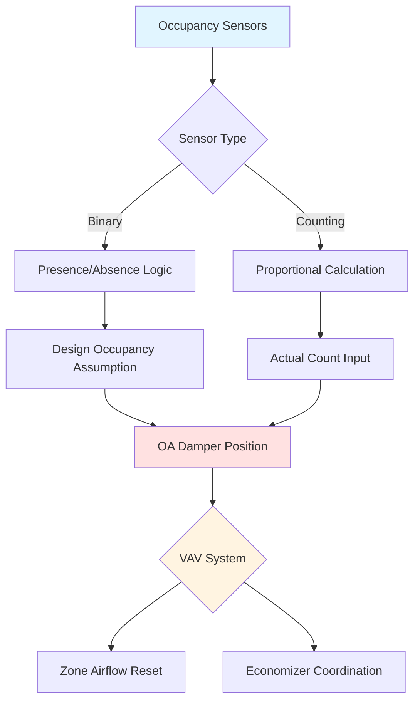

## Overview

Occupancy sensors provide real-time occupant count data to demand-controlled ventilation (DCV) systems, enabling precise outdoor air delivery based on actual space utilization rather than design occupancy. Sensor selection impacts ventilation accuracy, energy savings, and compliance with ASHRAE Standard 62.1 requirements for variable occupancy spaces.

## Sensor Technologies

### PIR (Passive Infrared) Sensors

PIR sensors detect thermal radiation from occupants within their field of view. These devices measure temperature differential between human bodies (approximately 98.6°F) and background surfaces.

**Operating Principle:**

- Pyroelectric elements detect infrared wavelengths between 8-14 μm
- Fresnel lens segments field of view into detection zones
- Motion triggers output signal when thermal signature crosses zone boundaries

**Limitations:**

- Binary detection only (occupied/vacant) rather than occupant count
- Requires motion for detection, fails with stationary occupants
- Limited range: 20-30 feet typical coverage radius
- Temperature-dependent performance degradation

### Ultrasonic Occupancy Sensors

Ultrasonic sensors transmit sound waves at 25-40 kHz and analyze reflected signals using Doppler shift principles to detect motion.

**Detection Method:**

$$f_r = f_t \left(1 + \frac{v}{c}\right)$$

Where:
- $f_r$ = received frequency (Hz)
- $f_t$ = transmitted frequency (Hz)
- $v$ = velocity of moving object (m/s)
- $c$ = speed of sound in air (343 m/s at 20°C)

**Characteristics:**

- 360-degree coverage patterns available
- Detects motion behind obstacles and partitions
- More sensitive to minor movements than PIR
- Subject to false triggers from HVAC airflow, fans

### Video Analytics Systems

Camera-based systems use computer vision algorithms to count and track occupants with high accuracy.

**Processing Architecture:**

**Advantages:**

- Accurate occupant counting (±5% in optimal conditions)
- Directional tracking (entries vs. exits)
- Occupancy density mapping
- Historical data analytics

**Design Considerations:**

- Privacy concerns require anonymization
- Lighting-dependent performance
- Higher installation and processing costs
- Network bandwidth requirements

### Occupancy Count Systems

Direct counting systems measure actual occupant numbers through physical detection points.

#### Turnstile Integration

Mechanical or optical turnstiles provide definitive entry/exit counts at controlled access points. Integration calculates net occupancy:

$$N(t) = N_0 + \sum_{i=1}^{t}(E_i - X_i)$$

Where:
- $N(t)$ = occupancy at time $t$
- $N_0$ = initial occupancy count
- $E_i$ = entries during interval $i$
- $X_i$ = exits during interval $i$

#### Beam Counter Systems

Infrared or time-of-flight sensors at doorways detect passage direction using dual-beam logic to differentiate entries from exits.

## Sensor Technology Comparison

| Technology | Count Accuracy | Coverage Area | Installation Cost | Maintenance | Privacy Impact |
|------------|---------------|---------------|-------------------|-------------|----------------|
| PIR | Binary only | 500-700 ft² | Low ($100-300) | Minimal | None |
| Ultrasonic | Binary only | 600-1000 ft² | Low ($150-400) | Minimal | None |
| Dual Technology | Binary only | 500-800 ft² | Medium ($200-500) | Minimal | None |
| Beam Counter | ±2-5% | Per doorway | Medium ($500-1500) | Low | None |
| Video Analytics | ±5-10% | 1500-3000 ft² | High ($2000-5000) | Medium | Moderate |
| Turnstile | ±1% | Per entry point | High ($3000-8000) | Medium | Low |

## Integration with Ventilation Systems

### Outdoor Air Calculation

ASHRAE 62.1 defines outdoor air requirements based on occupancy:

$$V_{ot} = R_p \times P_z + R_a \times A_z$$

Where:
- $V_{ot}$ = outdoor air flow rate (CFM)
- $R_p$ = people outdoor air rate (CFM/person)
- $P_z$ = zone population from occupancy sensors
- $R_a$ = area outdoor air rate (CFM/ft²)
- $A_z$ = zone area (ft²)

### Control Integration Strategies

**Proportional Control:**

Ventilation rate scales linearly with detected occupancy. Suitable for spaces with gradual occupancy changes.

**Stepped Control:**

Ventilation increases in discrete stages at occupancy thresholds. Reduces damper cycling in variable air volume systems.

## Occupancy Estimation Accuracy

Sensor placement and calibration directly impact ventilation precision.

**Error Propagation:**

$$\sigma_{V_{ot}} = \sqrt{\left(R_p \sigma_{P_z}\right)^2 + \left(P_z \sigma_{R_p}\right)^2}$$

Where:
- $\sigma_{V_{ot}}$ = uncertainty in outdoor air flow
- $\sigma_{P_z}$ = occupancy count uncertainty
- $\sigma_{R_p}$ = outdoor air rate uncertainty

## Design Recommendations

**Sensor Selection Criteria:**

- Binary sensors acceptable for spaces with predictable occupancy patterns
- Counting systems required for high-variability spaces (conference rooms, auditoriums, gyms)
- Video analytics justified for large assemblies exceeding 100 occupants
- Redundant sensor coverage for mission-critical applications

**Installation Guidelines:**

- Mount PIR sensors 8-12 feet above floor for optimal coverage
- Position beam counters at primary access points only
- Calibrate video systems under typical lighting and occupancy conditions
- Implement communication failure defaults to design occupancy values

**Maintenance Requirements:**

- Verify sensor accuracy quarterly through manual occupant counts
- Clean optical surfaces semi-annually
- Test communication interfaces during seasonal commissioning
- Update algorithms as space usage patterns change

## ASHRAE Standard 62.1 Compliance

Section 6.2.7 permits DCV using occupancy sensors when:

- Sensors provide occupant count or reliable presence detection
- System defaults to design occupancy upon sensor failure
- Minimum ventilation rates maintained per area component ($R_a \times A_z$)
- Commissioning verifies sensor accuracy and control response

Occupancy-based DCV typically achieves 20-40% ventilation energy savings in variable-occupancy applications while maintaining indoor air quality requirements.
