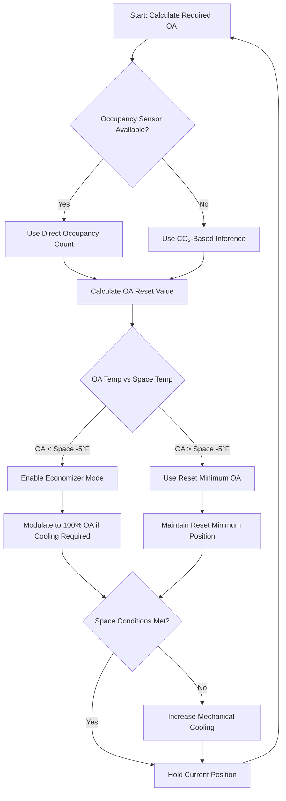
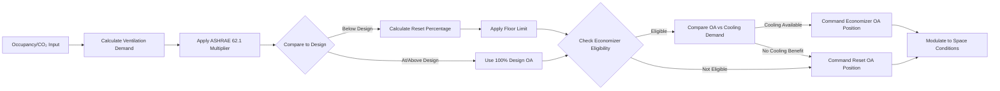

## Overview

Outdoor air (OA) reset represents an advanced control strategy that dynamically adjusts minimum ventilation rates based on actual occupancy demand while maintaining compliance with ASHRAE 62.1 ventilation requirements. This approach optimizes energy consumption by reducing unnecessary conditioning of outdoor air during periods of low occupancy while enabling economizer operation when outdoor conditions permit.

## Reset Control Fundamentals

### Occupancy-Based Reset Schedule

The minimum outdoor air setpoint adjusts proportionally to measured or inferred occupancy:

$$V_{oa,min} = V_{oa,design} \times \frac{N_{actual}}{N_{design}} + V_{oa,floor}$$

Where:
- $V_{oa,min}$ = minimum outdoor air flow rate (CFM)
- $V_{oa,design}$ = design outdoor air flow rate (CFM)
- $N_{actual}$ = actual measured occupancy (people)
- $N_{design}$ = design occupancy (people)
- $V_{oa,floor}$ = minimum floor ventilation rate (CFM)

### CO₂-Based Reset Algorithm

For spaces without direct occupancy sensing, CO₂ concentration provides an indirect measure:

$$V_{oa,reset} = V_{oa,floor} + (V_{oa,design} - V_{oa,floor}) \times \frac{C_{space} - C_{ambient}}{C_{setpoint} - C_{ambient}}$$

Where:
- $C_{space}$ = space CO₂ concentration (ppm)
- $C_{ambient}$ = outdoor CO₂ concentration (typically 400 ppm)
- $C_{setpoint}$ = design CO₂ setpoint (typically 1000-1100 ppm)

## Reset Schedule Implementation

### Typical Reset Schedules by Application

| Application | Design OA (%) | Minimum Reset (%) | Reset Basis | Response Time |
|-------------|---------------|-------------------|-------------|---------------|
| Assembly hall | 100 | 30 | CO₂ + schedule | 15-20 min |
| Classroom | 100 | 40 | CO₂ sensor | 10-15 min |
| Restaurant | 100 | 50 | CO₂ + time | 10-15 min |
| Gymnasium | 100 | 35 | CO₂ + schedule | 20-30 min |
| Theater | 100 | 25 | Occupancy count | 15-20 min |
| Conference room | 100 | 30 | CO₂ sensor | 8-12 min |

### Control Sequence Logic

## Economizer Integration

### Dual-Path Control Strategy

OA reset systems must coordinate with economizer operation to maximize energy savings:

$$\text{OA}_{damper} = \max(OA_{reset}, OA_{economizer})$$

The outdoor air damper position responds to the greater of ventilation demand or economizer cooling demand.

### Economizer Lockout Conditions

| Parameter | Enable Economizer | Disable Economizer |
|-----------|-------------------|-------------------|
| Dry-bulb temp | < 65°F | > 70°F |
| Enthalpy | < 28 BTU/lb | > 30 BTU/lb |
| Dew point | < 55°F | > 60°F |
| Differential temp | OA < RA - 5°F | OA > RA - 2°F |

## Control Logic Architecture

### Multi-Stage Reset Algorithm

## Energy Optimization

### Heating Season Benefits

During heating, OA reset reduces heating energy by conditioning less outdoor air:

$$Q_{saved} = \rho \times c_p \times V_{oa,reduced} \times (T_{space} - T_{oa}) \times 60$$

Where:
- $Q_{saved}$ = heating energy saved (BTU/hr)
- $\rho$ = air density (0.075 lb/ft³)
- $c_p$ = specific heat of air (0.24 BTU/lb·°F)
- $V_{oa,reduced}$ = outdoor air reduction from reset (CFM)
- $T_{space}$ = space temperature (°F)
- $T_{oa}$ = outdoor air temperature (°F)

### Cooling Season Optimization

When outdoor conditions are unfavorable for economizer operation, reset minimizes cooling load:

$$Q_{cooling,saved} = \rho \times V_{oa,reduced} \times (h_{oa} - h_{space}) \times 60$$

Where $h$ represents enthalpy (BTU/lb).

## ASHRAE 62.1 Compliance

### Ventilation Rate Procedure

OA reset must maintain minimum ventilation rates per ASHRAE 62.1:

$$V_{oz} = R_p \times P_z + R_a \times A_z$$

Where:
- $V_{oz}$ = outdoor air flow rate required in zone (CFM)
- $R_p$ = people outdoor air rate (CFM/person)
- $P_z$ = zone population (people)
- $R_a$ = area outdoor air rate (CFM/ft²)
- $A_z$ = zone floor area (ft²)

The reset schedule must never reduce OA below this calculated minimum.

### System Ventilation Efficiency

Multi-zone systems require the ventilation efficiency factor:

$$E_v = \frac{1 + X_s - Z_d}{1 + X_s}$$

Where:
- $E_v$ = system ventilation efficiency
- $X_s$ = uncorrected system outdoor air fraction
- $Z_d$ = zone outdoor air fraction (critical zone)

## Implementation Best Practices

**Sensor Placement:**
- Position CO₂ sensors in breathing zone (4-6 ft above floor)
- Average multiple sensors in large spaces
- Locate away from air supply diffusers and OA intakes
- Calibrate sensors quarterly

**Control Tuning:**
- Set reset floor at 50-60% of design OA for most applications
- Use 10-15 minute averaging for CO₂-based reset
- Implement 5-10 minute delay before reducing OA
- Enable faster response when increasing OA (2-5 minutes)

**Economizer Coordination:**
- Program economizer to override reset when conditions favorable
- Maintain 10-15% minimum OA during economizer operation
- Monitor mixed air temperature to prevent coil freezing
- Disable economizer if OA dewpoint exceeds 60°F in humid climates

## Performance Verification

**Required Monitoring Points:**
- Outdoor air damper position (%)
- Outdoor air flow rate (CFM)
- Mixed air temperature (°F)
- Space CO₂ concentration (ppm)
- Occupancy count or inference
- Economizer enable status

**Energy Savings Validation:**

$$\text{Savings} = \frac{E_{baseline} - E_{reset}}{E_{baseline}} \times 100\%$$

Typical savings range from 15-35% of HVAC energy consumption, depending on climate, occupancy variability, and system configuration.

## Key Engineering Considerations

Reset control effectiveness depends on accurate occupancy sensing or CO₂ measurement. Verify sensor accuracy before commissioning. Configure reset algorithms to comply with minimum ventilation requirements under all operating conditions. Coordinate with economizer controls to maximize free cooling opportunities while maintaining indoor air quality standards per ASHRAE 62.1 and local code requirements.

Design reset schedules based on actual occupancy patterns rather than theoretical maximums. Monitor system performance during the first year to optimize reset parameters and validate energy savings assumptions.