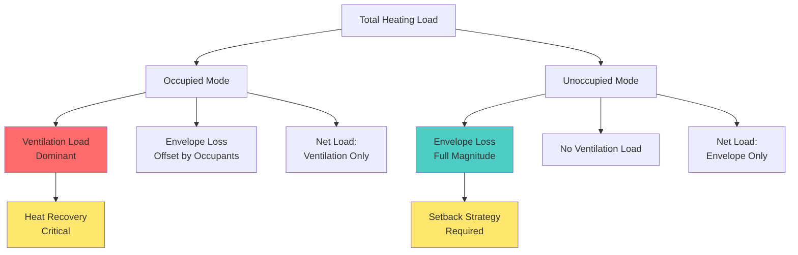
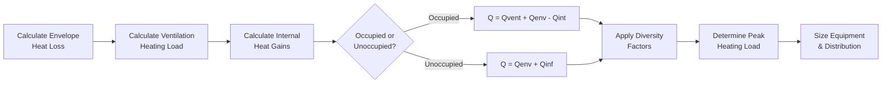

# Heating Loads in Assembly Spaces

Heating load calculations for assembly spaces present unique challenges that deviate significantly from conventional commercial applications. The primary complexity stems from high occupant densities that generate substantial internal heat gains, which can offset or eliminate space heating requirements during occupied periods while creating severe ventilation heating demands.

## Fundamental Heat Balance

The net heating load for an assembly space is determined by the energy balance:

$$Q_{heat} = Q_{envelope} + Q_{ventilation} + Q_{infiltration} - Q_{internal} - Q_{solar}$$

Where:
- $Q_{heat}$ = Net heating load (Btu/hr or kW)
- $Q_{envelope}$ = Heat loss through building envelope (Btu/hr or kW)
- $Q_{ventilation}$ = Heating load from outdoor air ventilation (Btu/hr or kW)
- $Q_{infiltration}$ = Heat loss from air leakage (Btu/hr or kW)
- $Q_{internal}$ = Internal heat gains from occupants, lighting, equipment (Btu/hr or kW)
- $Q_{solar}$ = Solar heat gain (Btu/hr or kW)

## Occupant Heat Offset Phenomenon

In assembly spaces with occupant densities exceeding 7 people per 1,000 ft², internal heat generation often surpasses envelope heat loss during occupied hours. Each occupant generates sensible heat according to activity level.

### Sensible Heat Generation by Activity

| Activity Level | Sensible Heat (Btu/hr per person) | Sensible Heat (W per person) |
|----------------|-----------------------------------|------------------------------|
| Seated at rest (theater) | 245 | 72 |
| Seated, light work | 255 | 75 |
| Standing, light activity | 315 | 92 |
| Light bench work | 315 | 92 |
| Moderate dancing | 405 | 119 |

For a 1,000-seat theater with seated occupants:

$$Q_{occupants} = 1000 \times 245 = 245,000 \text{ Btu/hr (71.8 kW)}$$

This substantial internal gain frequently eliminates space heating requirements during performances, creating a cooling need even in winter.

## Ventilation Heating Load Dominance

While occupant heat may offset envelope losses, the ventilation heating load becomes the controlling factor in assembly space design. ASHRAE Standard 62.1 mandates minimum outdoor air based on occupant density and floor area.

### Ventilation Rate Calculation

$$V_{oz} = R_p \times P_z + R_a \times A_z$$

Where:
- $V_{oz}$ = Outdoor air requirement (cfm)
- $R_p$ = People outdoor air rate (cfm/person)
- $P_z$ = Zone population
- $R_a$ = Area outdoor air rate (cfm/ft²)
- $A_z$ = Zone floor area (ft²)

For assembly spaces (theaters, auditoriums): $R_p$ = 5 cfm/person, $R_a$ = 0.06 cfm/ft²

### Ventilation Heating Load Formula

The sensible heating load for ventilation air is:

$$Q_{vent} = 1.08 \times V_{oz} \times (T_{indoor} - T_{outdoor})$$

For a 1,000-seat theater (10,000 ft² at 100 ft²/seat):

$$V_{oz} = (5 \times 1000) + (0.06 \times 10,000) = 5,600 \text{ cfm}$$

At design conditions (70°F indoor, 0°F outdoor):

$$Q_{vent} = 1.08 \times 5,600 \times 70 = 423,360 \text{ Btu/hr (124 kW)}$$

This ventilation load typically exceeds the net space heating requirement by a substantial margin.

## Envelope Heat Loss Components

Despite internal gains, envelope heat loss must be calculated for unoccupied periods and setback conditions.

$$Q_{envelope} = \sum (U \times A \times \Delta T)$$

Where:
- $U$ = Overall heat transfer coefficient (Btu/hr·ft²·°F or W/m²·K)
- $A$ = Surface area (ft² or m²)
- $\Delta T$ = Temperature difference (°F or K)

### Typical Assembly Space Envelope Characteristics

| Component | U-Factor (Btu/hr·ft²·°F) | Notes |
|-----------|--------------------------|-------|
| Walls (insulated) | 0.050 - 0.080 | Code minimum |
| Roof (insulated) | 0.030 - 0.048 | Above suspended ceiling |
| Slab-on-grade | F = 0.73 | F-factor per linear foot |
| Doors/entries | 0.35 - 0.50 | High traffic areas |
| Glazing (limited) | 0.30 - 0.40 | Assembly spaces typically minimize glazing |

## Design Considerations and Load Component Interaction

## Heating Load Calculation Methodology

## Critical Design Implications

**Ventilation Load Management**: Energy recovery ventilators (ERV) or heat recovery ventilators (HRV) are essential for assembly spaces. A properly sized heat recovery system can reduce ventilation heating load by 60-80%, recovering:

$$Q_{recovered} = \epsilon \times Q_{vent}$$

Where $\epsilon$ = heat exchanger effectiveness (0.60 - 0.80 typical)

**Operating Mode Differentiation**: Equipment sizing must account for two distinct operating modes:
1. **Occupied mode**: Ventilation load dominant, space may require cooling
2. **Unoccupied mode**: Envelope load only, full heating capacity required

**Preheat Requirements**: When bringing a space from setback temperature to occupied temperature, both envelope thermal mass and ventilation loads must be satisfied simultaneously, creating a temporary peak load that exceeds steady-state calculations.

## Reference Standards

Design procedures and load calculation methodology follow ASHRAE Fundamentals Chapter 18 (Nonresidential Cooling and Heating Load Calculations) and ASHRAE Standard 62.1 (Ventilation for Acceptable Indoor Air Quality). Load diversity factors and occupancy schedules are derived from ASHRAE Fundamentals Chapter 19 (Energy Estimating and Modeling Methods).

The critical distinction for assembly spaces is recognizing that ventilation heating loads dominate the thermal analysis, making outdoor air treatment the primary energy consumption factor rather than space conditioning.
