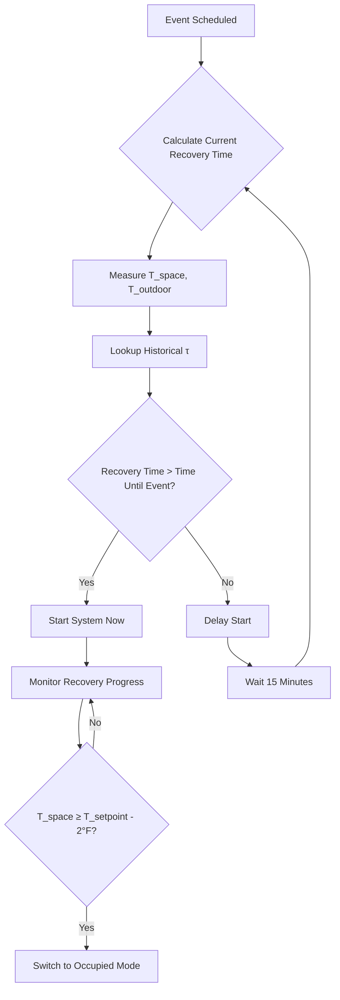

## Overview

Intermittent operation characterizes HVAC systems serving assembly spaces with irregular or predictable non-continuous occupancy patterns. These facilities—including worship centers, auditoriums, convention halls, and sports arenas—experience extended unoccupied periods followed by scheduled high-density events. Proper engineering of setback and recovery sequences yields substantial energy savings while ensuring occupant comfort at event start.

## Thermal Response Fundamentals

The thermal behavior of intermittently operated spaces depends critically on building construction characteristics and environmental conditions. During unoccupied periods, space temperature drifts toward ambient conditions at a rate governed by heat loss mechanisms.

### Heat Loss During Setback

The instantaneous heat loss during setback operation follows:

$$Q_{loss} = UA(T_{space} - T_{ambient}) + \dot{m}_{inf}c_p(T_{space} - T_{ambient})$$

Where:
- $UA$ = overall building conductance (Btu/hr·°F)
- $T_{space}$ = current space temperature (°F)
- $T_{ambient}$ = outdoor temperature (°F)
- $\dot{m}_{inf}$ = infiltration mass flow rate (lb/hr)
- $c_p$ = specific heat of air (0.24 Btu/lb·°F)

### Thermal Mass Effect

Building thermal mass moderates temperature swing rates. The effective thermal capacitance determines cooldown characteristics:

$$C_{eff} = \sum_{i} m_i c_{p,i}$$

Where $m_i$ and $c_{p,i}$ represent mass and specific heat of each building component (structure, furnishings, air volume).

## Setback Recovery Calculation

Recovery time—the period required to restore space temperature from setback to occupied setpoint—governs system start time before scheduled events.

### Recovery Time Estimation

The approximate recovery time for a space with thermal mass:

$$t_{recovery} = \frac{C_{eff}(T_{occupied} - T_{setback})}{Q_{available} - Q_{loss,avg}}$$

Where:
- $t_{recovery}$ = warm-up time (hours)
- $T_{occupied}$ = occupied setpoint temperature (typically 68-72°F)
- $T_{setback}$ = unoccupied setback temperature (°F)
- $Q_{available}$ = available heating capacity (Btu/hr)
- $Q_{loss,avg}$ = average heat loss during recovery (Btu/hr)

### Building Time Constant

The thermal time constant provides a simplified recovery estimate:

$$\tau = \frac{C_{eff}}{UA + \dot{m}_{inf}c_p}$$

Recovery to within 5% of setpoint requires approximately $3\tau$ hours.

## Operation Pattern Strategies

```mermaid
gantt
    title Weekly Operation Pattern - Worship Center
    dateFormat HH:mm
    axisFormat %H:%M

    section Sunday
    Setback 55°F    :done, 00:00, 07:00
    Warm-up         :active, 07:00, 09:00
    Occupied 70°F   :crit, 09:00, 13:00
    Setback 55°F    :done, 13:00, 24:00

    section Wednesday
    Setback 55°F    :done, 00:00, 17:00
    Warm-up         :active, 17:00, 18:30
    Occupied 70°F   :crit, 18:30, 21:00
    Setback 55°F    :done, 21:00, 24:00

    section Other Days
    Continuous Setback 55°F :done, 00:00, 24:00
```

### Setback Temperature Selection

Setback temperatures balance energy savings against recovery time and freeze protection:

| Climate Zone | Heating Setback | Cooling Setup | Considerations |
|--------------|-----------------|---------------|----------------|
| Cold (6-8) | 55-58°F | 85-90°F | Freeze protection, pipe locations |
| Moderate (3-5) | 50-55°F | 85-90°F | Condensation risk on recovery |
| Warm (1-2) | 60-65°F | 82-85°F | Humidity control during setback |

## Energy Impact Analysis

Intermittent operation reduces heating energy consumption through decreased heat loss during unoccupied periods, offset partially by cycling losses during recovery.

### Energy Savings Calculation

Net weekly energy savings compared to continuous operation:

$$E_{saved} = \int_{t_{unoccupied}} Q_{loss}(T_{occupied}) \, dt - \int_{t_{recovery}} Q_{additional} \, dt$$

Where $Q_{additional}$ represents excess energy input during accelerated warm-up.

### Cycling Loss Factor

Recovery inefficiency introduces a penalty factor:

$$\eta_{cycling} = 1 - \frac{E_{recovery,excess}}{E_{saved,setback}}$$

Typical cycling efficiencies range from 0.85-0.95 depending on recovery rate and thermal mass.

## Comparative Energy Performance

| Operating Schedule | Annual Heating Energy | Relative Savings | Recovery Starts/Year |
|-------------------|----------------------|------------------|---------------------|
| Continuous 70°F | 100% (baseline) | — | 0 |
| Night Setback 60°F | 72-78% | 22-28% | 365 |
| Weekend Setback 55°F | 68-75% | 25-32% | 156 |
| Event-Only (2×/week) | 45-55% | 45-55% | 104 |

*Based on 50,000 sq ft assembly space, climate zone 5, medium thermal mass*

## System Design Considerations

### Heating Capacity Sizing

Systems serving intermittently operated spaces require additional capacity beyond steady-state loads to achieve acceptable recovery times:

$$Q_{design} = Q_{steadystate} \times F_{pickup}$$

Pickup factors typically range from 1.2-1.5 for assembly spaces based on desired recovery time.

### Control Sequences

Optimal start algorithms adjust system start time based on:
- Current space temperature measurement
- Outdoor temperature
- Historical recovery performance
- Building thermal response characteristics

ASHRAE Guideline 36 provides sequences for optimal start/stop control in intermittently operated facilities.

## Equipment Selection

### Variable Capacity Systems

Modulating heating equipment provides advantages for intermittent operation:
- High capacity during recovery
- Efficient low-fire operation during occupied periods with high internal gains
- Reduced cycling losses

### Thermal Storage

Sensible or latent thermal storage can optimize intermittent operation:
- Pre-charge storage during off-peak periods
- Release stored energy during recovery
- Reduce peak demand charges
- Enable renewable energy time-shifting

## Special Event Considerations

Assembly spaces hosting special events require flexible scheduling:

**Rapid Response Capability**: Systems must recover from deep setback within 2-3 hours for unexpected event additions.

**Humidity Control**: Extended setback in humid climates necessitates dehumidification during recovery to prevent condensation and maintain comfort.

**Ventilation Pre-Purge**: Introduce outdoor air 30-60 minutes before occupancy to establish air quality baseline per ASHRAE 62.1.

## Code and Standard References

- **ASHRAE 90.1**: Requires automatic setback controls for spaces unoccupied >12 hours/day
- **ASHRAE 62.1**: Ventilation rates may be reduced during unoccupied periods
- **IMC Section 403.2.3**: Thermostatic controls and setback requirements
- **ASHRAE Guideline 36**: Optimal start/stop control sequences

## Verification and Commissioning

Verify intermittent operation performance through:
- Recovery time measurement under various outdoor conditions
- Setback depth achievement during unoccupied periods
- Schedule accuracy and adherence
- Energy consumption comparison to baseline predictions

Proper commissioning of intermittent operation strategies ensures the predicted energy savings materialize in actual operation while maintaining occupant comfort expectations.
