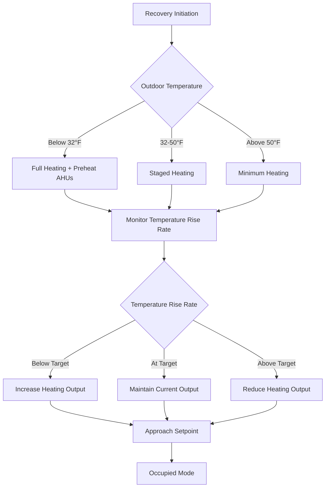
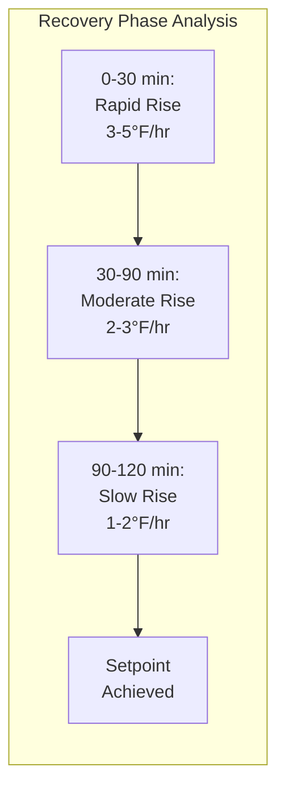

## Overview

Setback recovery in assembly spaces presents unique challenges due to high thermal mass, large volume-to-occupancy ratios, and intermittent use patterns. Proper recovery strategy design ensures occupant comfort at event start while minimizing energy consumption during unoccupied periods.

## Recovery Time Calculation

The fundamental recovery time equation accounts for building thermal capacitance and available heating capacity:

$$t_{recovery} = \frac{C_{building} \cdot (T_{setpoint} - T_{setback})}{Q_{available} - Q_{losses}}$$

Where:
- $t_{recovery}$ = recovery time (hours)
- $C_{building}$ = effective building thermal capacitance (Btu/°F)
- $T_{setpoint}$ = occupied setpoint temperature (°F)
- $T_{setback}$ = setback temperature (°F)
- $Q_{available}$ = available heating capacity (Btu/hr)
- $Q_{losses}$ = envelope heat losses during recovery (Btu/hr)

### Effective Thermal Capacitance

For assembly spaces, calculate effective thermal capacitance including structural mass:

$$C_{building} = \sum (m_i \cdot c_{p,i} \cdot f_i)$$

Where:
- $m_i$ = mass of component i (lb)
- $c_{p,i}$ = specific heat of material i (Btu/lb·°F)
- $f_i$ = engagement factor (0.3-0.8 for typical recovery periods)

**Material Engagement Factors:**

| Material | 2-Hour Recovery | 4-Hour Recovery | 8-Hour Recovery |
|----------|----------------|----------------|----------------|
| Concrete slab | 0.35 | 0.50 | 0.70 |
| Concrete block | 0.40 | 0.55 | 0.75 |
| Gypsum board | 0.80 | 0.90 | 0.95 |
| Steel structure | 0.60 | 0.75 | 0.85 |

## Recovery Curve Characteristics

## Temperature Rise Profile

## Recovery Time Targets

ASHRAE 90.1 does not mandate specific recovery times but requires optimal start controls for buildings >10,000 ft². Typical assembly space targets:

| Space Type | Setback ΔT | Target Recovery | Equipment Sizing Factor |
|-----------|-----------|----------------|------------------------|
| Theater/auditorium | 10-15°F | 2-3 hours | 1.5-2.0× design load |
| Arena/stadium | 8-12°F | 3-4 hours | 1.3-1.5× design load |
| Convention center | 10-12°F | 2-3 hours | 1.4-1.7× design load |
| Religious facility | 12-18°F | 2-4 hours | 1.6-2.2× design load |

## Optimal Start Control Strategy

Optimal start algorithms adjust equipment start time based on current conditions and learned building response.

### Basic Optimal Start Algorithm

$$t_{start} = t_{occupancy} - \left(K_1 \cdot \Delta T + K_2 \cdot (T_{outdoor} - T_{ref}) + K_3\right)$$

Where:
- $t_{start}$ = equipment start time
- $t_{occupancy}$ = scheduled occupancy time
- $\Delta T$ = $(T_{setpoint} - T_{current})$
- $K_1$ = temperature difference coefficient (typically 8-15 min/°F)
- $K_2$ = outdoor temperature coefficient (typically 1-3 min/°F)
- $K_3$ = base time offset (typically 15-30 min)
- $T_{ref}$ = reference outdoor temperature (typically 40-50°F)

### Adaptive Learning

Modern controls employ adaptive algorithms that refine coefficients based on actual performance:

$$K_{1,new} = K_{1,old} + \alpha \cdot \frac{(t_{actual} - t_{predicted})}{\Delta T}$$

Where $\alpha$ is the learning rate (typically 0.1-0.3).

## Thermal Mass Effects

High thermal mass in assembly spaces significantly impacts recovery characteristics.

**Thermal Mass Benefits:**
- Reduces temperature swing during unoccupied periods
- Provides thermal energy storage during recovery
- Dampens outdoor temperature fluctuations

**Thermal Mass Challenges:**
- Extends recovery time requirements
- Increases equipment sizing factor
- Complicates control algorithm tuning

### Mass-to-Volume Ratio Impact

$$R_{mv} = \frac{\sum (m_i \cdot c_{p,i})}{V \cdot \rho_{air} \cdot c_{p,air}}$$

Where:
- $R_{mv}$ = mass-to-volume ratio (dimensionless)
- $V$ = conditioned space volume (ft³)
- $\rho_{air}$ = air density (0.075 lb/ft³)
- $c_{p,air}$ = air specific heat (0.24 Btu/lb·°F)

**Typical Assembly Space Values:**

| Construction Type | $R_{mv}$ | Recovery Multiplier |
|------------------|---------|---------------------|
| Light frame | 1-3 | 1.0-1.2 |
| Heavy frame | 3-6 | 1.2-1.5 |
| Concrete/masonry | 6-12 | 1.5-2.0 |
| Below-grade | 10-20 | 2.0-2.5 |

## Recovery Enhancement Strategies

### Outdoor Air Reset During Recovery

Minimize outdoor air to design minimum (ASHRAE 62.1 ventilation rates apply only during occupancy):

$$Q_{OA,recovery} = \max(0.15 \text{ cfm/ft}^2, 500 \text{ cfm})$$

This maintains slight building pressurization while minimizing heating load.

### Economizer Lockout

Disable economizer operation during recovery to maximize heating coil capacity. Enable only when:

$$T_{space} \geq (T_{setpoint} - 2°F) \text{ AND } t \geq (t_{occupancy} - 30 \text{ min})$$

### Staged Equipment Operation

Sequence heating equipment to optimize efficiency:

1. **Phase 1 (0-30% recovery):** Activate all heating stages, 100% return air
2. **Phase 2 (30-70% recovery):** Modulate to maintain target rise rate
3. **Phase 3 (70-100% recovery):** Reduce to occupied mode, introduce ventilation air

## Equipment Sizing for Recovery

Total heating capacity must accommodate both envelope losses and thermal mass recovery:

$$Q_{total} = Q_{design} + Q_{recovery}$$

Where:

$$Q_{recovery} = \frac{C_{building} \cdot \Delta T_{setback}}{t_{recovery,target}}$$

For assembly spaces with 2-3 hour recovery targets, this typically results in 1.4-2.0× design heating load capacity.

### Economizer Contribution

When outdoor conditions permit, economizer operation can reduce mechanical cooling during shoulder seasons but provides no heating benefit. Do not credit economizer capacity toward recovery heating requirements.

## Control Sequence Optimization

**Recommended Recovery Sequence:**

1. **Pre-start (t - 5 min):** Enable fans, verify operation
2. **Initial recovery (t + 0 min):** Full heating, minimum OA, economizer locked out
3. **Mid recovery (50% complete):** Begin modulating heating output
4. **Late recovery (80% complete):** Increase OA to design minimum
5. **Occupied transition (90% complete):** Enable economizer, full occupied mode
6. **Occupied mode (100%):** Normal control sequences active

## Design Recommendations

**Per ASHRAE 90.1-2019 Section 6.4.3.3.3:** Buildings >10,000 ft² must employ automatic time clock control with optimum start capabilities. For assembly spaces specifically:

- Implement adaptive optimal start with minimum 30-day learning period
- Size heating equipment for 2-3 hour recovery from 10-15°F setback
- Monitor and trend recovery performance monthly
- Adjust setback depth based on unoccupied duration and outdoor temperature
- Consider separate setback strategies for conditioned vs. unconditioned periods

**Verification Testing:** Commission optimal start by testing at various outdoor temperatures and setback conditions to verify occupancy targets are met within ±2°F at scheduled time.

## Performance Metrics

Track these key performance indicators to optimize recovery strategy:

- Percentage of occupancy periods meeting temperature target (target: >95%)
- Average recovery energy per degree-hour (Btu/°F·hr)
- Optimal start accuracy (target: ±15 minutes)
- Equipment runtime during recovery vs. occupied periods
- Seasonal recovery time trends

---

*Reference: ASHRAE Handbook—HVAC Applications, Chapter 4 (Places of Assembly); ASHRAE Standard 90.1-2019; ASHRAE Guideline 36-2021*