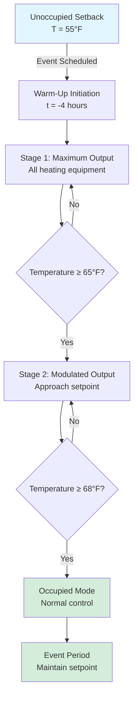
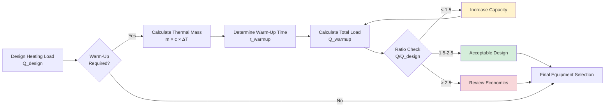

## Overview

Warm-up requirements in high-occupancy density spaces differ fundamentally from conventional building applications due to extended unoccupied periods, massive thermal mass, and the necessity for rapid temperature recovery before events. The heating system must elevate interior temperatures from setback conditions to occupied setpoints within a specified timeframe while compensating for envelope heat loss and thermal storage effects.

## Warm-Up Load Calculation

The total warm-up heating capacity combines three distinct components: sensible heating of air volume, thermal storage in building mass, and ongoing envelope losses during the warm-up period.

### Total Warm-Up Capacity

$$Q_{warm-up} = Q_{sensible} + Q_{thermal\ mass} + Q_{envelope}$$

Where:
- $Q_{warm-up}$ = total warm-up heating capacity (Btu/h)
- $Q_{sensible}$ = air sensible heating load
- $Q_{thermal\ mass}$ = thermal storage heating load
- $Q_{envelope}$ = envelope heat loss during warm-up

### Air Sensible Heating Load

$$Q_{sensible} = \frac{1.08 \times V \times \rho \times (T_{occ} - T_{setback})}{t_{warm-up}}$$

Where:
- $V$ = conditioned space volume (ft³)
- $\rho$ = air density correction factor (use 1.0 at sea level)
- $T_{occ}$ = occupied space temperature (°F)
- $T_{setback}$ = setback temperature (°F)
- $t_{warm-up}$ = allowable warm-up time (hours)
- 1.08 = constant for air (Btu/(h·ft³·°F))

### Thermal Mass Contribution

Building thermal mass absorbs significant energy during warm-up. The thermal storage load depends on mass weight, specific heat, and temperature rise.

$$Q_{thermal\ mass} = \frac{\sum(m_i \times c_i \times \Delta T \times f_i)}{t_{warm-up}}$$

Where:
- $m_i$ = mass of component *i* (lb)
- $c_i$ = specific heat of material *i* (Btu/(lb·°F))
- $\Delta T$ = temperature rise (°F)
- $f_i$ = fraction of mass actively heated during warm-up period
- $t_{warm-up}$ = warm-up time (hours)

**Typical Specific Heat Values:**

| Material | Specific Heat (Btu/(lb·°F)) | Active Fraction (2-hr warm-up) |
|----------|----------------------------|--------------------------------|
| Concrete | 0.22 | 0.15-0.25 |
| Steel | 0.12 | 0.30-0.40 |
| Gypsum board | 0.26 | 0.40-0.60 |
| Seating (plastic) | 0.35 | 0.50-0.70 |

The active fraction represents the portion of building mass that reaches equilibrium within the warm-up period. Deeper structural elements contribute minimally during short warm-up cycles.

### Envelope Heat Loss During Warm-Up

Envelope losses continue throughout the warm-up period and must be included in capacity calculations.

$$Q_{envelope} = UA \times (T_{avg} - T_{outdoor})$$

Where:
- $U$ = overall heat transfer coefficient (Btu/(h·ft²·°F))
- $A$ = envelope area (ft²)
- $T_{avg}$ = average space temperature during warm-up = $(T_{occ} + T_{setback})/2$
- $T_{outdoor}$ = outdoor design temperature (°F)

## Capacity Sizing Methodology

ASHRAE applications guidance recommends oversizing heating capacity for assembly spaces to achieve acceptable warm-up performance. The capacity ratio approach compares installed heating capacity to steady-state design loads.

### Recommended Capacity Ratios

$$\text{Capacity Ratio} = \frac{Q_{warm-up}}{Q_{design\ steady-state}}$$

**Typical Capacity Ratios by Application:**

| Application Type | Warm-Up Time | Capacity Ratio | Notes |
|------------------|--------------|----------------|-------|
| Indoor arena | 2-3 hours | 1.8-2.2 | Consider thermal mass |
| Stadium (enclosed) | 3-4 hours | 1.5-1.8 | Lower occupancy density |
| Convention center | 2-4 hours | 1.6-2.0 | Varies by event schedule |
| Performing arts | 2-3 hours | 1.7-2.1 | Acoustic considerations |

Capacity ratios below 1.5 typically result in inadequate warm-up performance, while ratios exceeding 2.5 provide diminishing returns and increase first costs without proportional benefit.

## Warm-Up Sequence and Control Strategy

## Pre-Occupancy Conditioning Timeline

The warm-up sequence must account for equipment staging, distribution lag, and thermal mass response characteristics.

**Typical 4-Hour Warm-Up Timeline:**

| Time to Event | Activity | Space Temperature | Equipment Status |
|---------------|----------|-------------------|------------------|
| -4:00 hours | Warm-up start | 55°F (setback) | All equipment energized |
| -3:30 hours | Initial response | 58-60°F | Maximum output |
| -3:00 hours | Temperature rise | 62-64°F | Maximum output |
| -2:30 hours | Approaching target | 65-66°F | Begin modulation |
| -2:00 hours | Near setpoint | 67-68°F | Modulated control |
| -1:00 hours | Final stabilization | 68-69°F | Steady-state |
| 0:00 hours | Event start | 68°F (occupied) | Normal operation |

## Design Considerations

**Equipment Selection:**
- Use multiple heating stages to allow proportional warm-up control
- Select equipment with rapid response characteristics (forced air preferred over radiant for quick recovery)
- Consider heat pump performance degradation at low ambient temperatures during morning startup

**Distribution System:**
- Size ductwork and piping for peak warm-up flow rates, not steady-state conditions
- Minimize thermal mass in distribution systems (prefer air over hydronic for warm-up applications)
- Ensure adequate mixing to prevent stratification in high-ceiling spaces

**Control Optimization:**
- Program warm-up start time based on outdoor temperature and setback duration
- Implement adaptive algorithms that learn building thermal response
- Monitor warm-up performance and adjust lead time accordingly

**Thermal Mass Management:**
- Consider internal mass placement—centrally located mass responds faster than perimeter
- Evaluate temporary setback limits to reduce extreme warm-up loads
- For frequently used spaces, limit setback depth to 10-12°F below occupied setpoint

## Code and Standard References

**ASHRAE Standards:**
- ASHRAE 90.1: Energy Standard for Buildings—setback and warm-up requirements
- ASHRAE Handbook—HVAC Applications, Chapter 5 (Places of Assembly): warm-up capacity recommendations
- ASHRAE Guideline 36: High-Performance Sequences of Operation for HVAC Systems—optimal start algorithms

**Key Design Criteria:**
- Maximum allowable warm-up time: 4 hours (typical code maximum for setback recovery)
- Minimum heating capacity ratio: 1.5× steady-state load
- Temperature drift during warm-up: not to exceed 2°F/hour in final approach phase

## Practical Application Example

For a 500,000 ft³ indoor arena with design heating load of 2,000,000 Btu/h, targeting 2.5-hour warm-up from 55°F to 68°F setpoint:

**Air sensible load:** 1.08 × 500,000 × 1.0 × (68-55) / 2.5 = 2,808,000 Btu/h

**Thermal mass** (estimated 20% of sensible): 561,600 Btu/h

**Envelope loss** (at average 61.5°F indoor): 1,500,000 Btu/h

**Total warm-up capacity:** 4,869,600 Btu/h

**Capacity ratio:** 4,869,600 / 2,000,000 = 2.43

This ratio falls within acceptable range (1.5-2.5) and provides adequate warm-up performance while avoiding excessive oversizing.

---

**File:** `/Users/evgenygantman/Documents/github/gantmane/hvac/content/specialty-applications-testing/specialty-hvac-applications/high-occupancy-density-hvac/heating-loads-assembly/warm-up-requirements/_index.md`