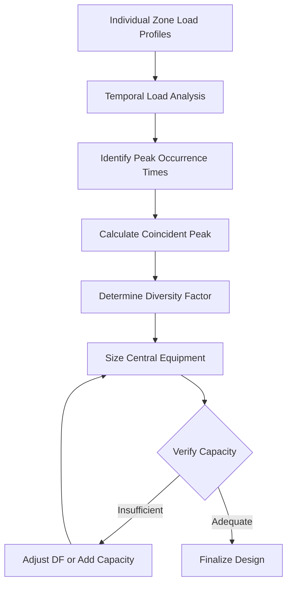
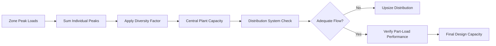

## Fundamental Concepts

Load diversity represents the statistical reality that not all HVAC loads reach their maximum values simultaneously in multi-zone or high-occupancy systems. This principle enables significant optimization in equipment sizing while maintaining adequate capacity for actual operating conditions.

The diversity factor quantifies the relationship between the sum of individual peak loads and the actual coincident system peak:

$$\text{Diversity Factor} = \frac{\sum_{i=1}^{n} \text{Individual Peak Loads}}{\text{Coincident System Peak Load}}$$

A diversity factor greater than 1.0 indicates that individual zone peaks do not occur simultaneously, permitting reduced central equipment capacity compared to simple arithmetic summation.

## Physical Basis for Load Diversity

### Time-Dependent Load Variations

Different building zones experience peak loads at different times due to:

- **Solar heat gain variations**: East-facing zones peak in morning hours, west-facing zones in afternoon
- **Occupancy patterns**: Assembly areas may fill sequentially rather than instantaneously
- **Equipment schedules**: Kitchen loads, lighting, and audiovisual systems operate on distinct schedules
- **Thermal mass effects**: Zones with different construction respond at different rates to ambient conditions

### Statistical Load Distribution

In large assembly spaces with multiple zones, the probability that all zones simultaneously operate at design peak approaches zero as the number of zones increases. ASHRAE Fundamentals Chapter 18 provides guidance on diversity applications for various building types.

## Diversity Factor Application

### Typical Diversity Values

| Building Type | Number of Zones | Diversity Factor | Application Notes |
|--------------|----------------|------------------|-------------------|
| Assembly halls | 5-10 zones | 1.15-1.25 | Consider event scheduling |
| Convention centers | 10-20 zones | 1.25-1.40 | Meeting room independence |
| Sports arenas | 15-30 zones | 1.20-1.35 | Seating vs. concourse loads |
| Educational assembly | 8-15 zones | 1.30-1.50 | Class schedule variations |
| Mixed-use venues | 12-25 zones | 1.35-1.55 | Function diversity |

### Calculation Methodology

The diversified system capacity is calculated as:

$$Q_{\text{system}} = \frac{\sum_{i=1}^{n} Q_{\text{peak,i}}}{DF}$$

Where:
- $Q_{\text{system}}$ = Required central equipment capacity (tons or kW)
- $Q_{\text{peak,i}}$ = Individual zone peak load (tons or kW)
- $DF$ = Diversity factor (dimensionless)
- $n$ = Number of zones

## Load Profile Analysis

### Hourly Load Summation

For rigorous analysis, calculate the system load for each hour of the design day:

$$Q_{\text{system}}(t) = \sum_{i=1}^{n} Q_{i}(t)$$

The true coincident peak is:

$$Q_{\text{coincident}} = \max_{t \in [0,24]} \left[ Q_{\text{system}}(t) \right]$$

This approach captures actual simultaneity effects rather than relying on tabulated diversity factors.

## Non-Coincident Load Considerations

### Occupancy Diversity

Assembly venues exhibit significant occupancy diversity based on event types and scheduling:

- **Sequential events**: Attendees move between spaces, creating load migration
- **Partial occupancy**: Not all assembly areas operate at design capacity simultaneously
- **Event duration**: Short-duration peaks allow thermal mass to buffer loads

The effective occupancy diversity factor:

$$DF_{\text{occ}} = \frac{\sum \text{Design Occupancy per Zone}}{\text{Peak Simultaneous Occupancy}}$$

### Ventilation Load Diversity

Outdoor air requirements scale with actual occupancy, creating additional diversity:

$$\dot{Q}_{\text{vent,diversified}} = \dot{m}_{\text{OA}} \cdot c_p \cdot \Delta T \cdot \frac{1}{DF_{\text{occ}}}$$

Where $\dot{m}_{\text{OA}}$ represents the sum of individual zone outdoor air mass flow rates.

## Equipment Sizing Optimization

### Chiller Plant Diversity

Multiple chillers serving diverse loads operate more efficiently than a single unit:

$$\text{Plant Diversity} = \frac{\sum \text{Chiller Capacities}}{\text{Design Plant Load with Diversity}}$$

Typical chiller plant diversity ranges from 1.10 to 1.30 for large assembly facilities, accounting for:
- Staged equipment operation
- Redundancy requirements
- Load growth allowance
- Simultaneous maintenance

### Distribution System Implications

Critical distinction: **Zone distribution systems must handle individual zone peak loads** regardless of central plant diversity. Diversity applies primarily to central heating/cooling generation equipment, not to zone-level air handling or terminal units.

Duct and pipe sizing must accommodate:

$$\dot{Q}_{\text{zone distribution}} = Q_{\text{zone peak}} \times \text{Safety Factor}$$

Where safety factors of 1.05 to 1.15 account for load uncertainty, not diversity.

## Verification and Monitoring

### Design Verification Steps

1. **Document load assumptions**: Record event schedules, occupancy patterns, and operational modes
2. **Calculate hourly profiles**: Develop 24-hour load profiles for design day conditions
3. **Identify coincident peak**: Determine actual simultaneous maximum from hour-by-hour summation
4. **Apply conservative factors**: Use lower diversity values for critical applications
5. **Plan measurement**: Install metering to validate assumed diversity post-occupancy

### Post-Occupancy Validation

Monitor actual loads to confirm design assumptions:

$$DF_{\text{actual}} = \frac{\sum Q_{\text{zone peak, measured}}}{\max[Q_{\text{system, measured}}(t)]}$$

If actual diversity exceeds design values by more than 10%, consider adjusting control strategies or equipment staging to capitalize on available capacity margin.

## Critical Design Constraints

**Never apply diversity to**:
- Individual zone equipment sizing
- Fire/life safety ventilation requirements
- Code-minimum outdoor air quantities
- Emergency cooling loads

**Apply diversity conservatively for**:
- Mission-critical facilities requiring redundancy
- Buildings with unpredictable scheduling
- Systems with limited operational data
- First-time assembly venue types

Diversity factors represent risk-managed capacity reduction. Engineering judgment, ASHRAE guidelines, and operational experience must inform every application to ensure adequate capacity under actual coincident conditions.
