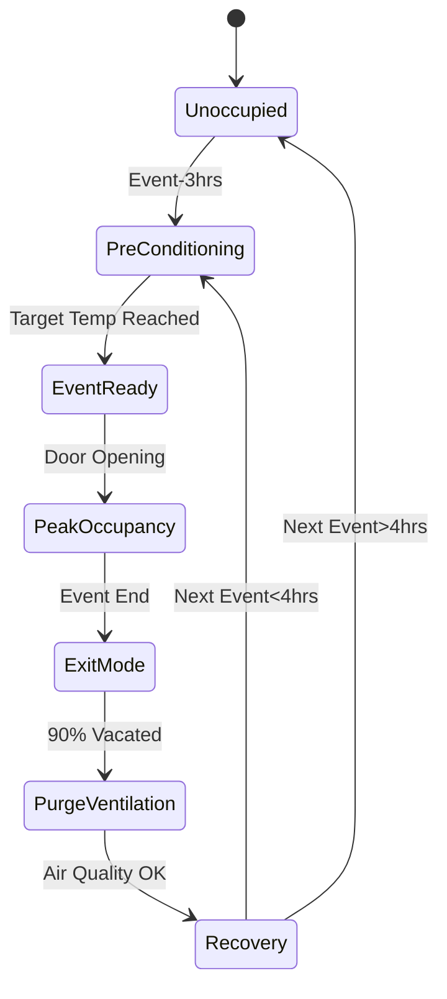

## Event-Based HVAC Scheduling

Event schedules in high-occupancy venues create intermittent thermal loads that require strategic pre-conditioning, peak capacity management, and post-event recovery protocols. The temporal nature of event occupancy enables load diversity strategies that reduce installed capacity and operational costs while maintaining occupant comfort.

## Pre-Conditioning Load Calculations

Pre-event conditioning establishes baseline thermal conditions before occupant arrival. The required pre-conditioning time depends on building thermal mass, outdoor conditions, and target setpoints.

### Pre-Conditioning Time Equation

The time required to condition a space from initial temperature $T_i$ to target temperature $T_t$ is:

$$t_{precool} = \frac{C_p \cdot m_{air} \cdot (T_i - T_t)}{Q_{sys} - Q_{infiltration}}$$

where $C_p$ is specific heat capacity (1.006 kJ/kg·K), $m_{air}$ is air mass in the conditioned space, $Q_{sys}$ is system cooling capacity, and $Q_{infiltration}$ accounts for envelope heat gains during pre-conditioning.

### Thermal Mass Considerations

For spaces with significant thermal mass (concrete, masonry), the effective conditioning time increases:

$$t_{effective} = t_{precool} \cdot \left(1 + \frac{C_{mass} \cdot m_{mass}}{C_{air} \cdot m_{air}}\right)$$

where $C_{mass}$ and $m_{mass}$ represent the thermal mass properties.

## Event Load Profiles

Event occupancy generates predictable thermal load patterns that enable optimized HVAC scheduling.

```mermaid
gantt
    title Event Day HVAC Load Profile
    dateFormat HH:mm
    axisFormat %H:%M

    section Pre-Event
    System Startup           :a1, 06:00, 1h
    Pre-Conditioning         :a2, 07:00, 2h
    Final Adjustment         :a3, 09:00, 1h

    section Event Period
    Door Opening             :b1, 10:00, 30m
    Peak Occupancy           :crit, b2, 10:30, 3h
    Exit Period              :b3, 13:30, 1h

    section Post-Event
    Purge Ventilation        :c1, 14:30, 1h
    Temperature Recovery     :c2, 15:30, 2h
    System Shutdown          :c3, 17:30, 30m
```

## Occupancy-Based Load Diversity

The diversity factor for multiple events accounts for non-coincident peak loads across different venues or time periods.

### Diversity Factor Calculation

$$DF_{event} = \frac{\sum_{i=1}^{n} Q_{peak,i}}{\max(Q_{simultaneous})}$$

where $Q_{peak,i}$ represents individual event peak loads and $Q_{simultaneous}$ is the maximum coincident load.

| Number of Event Spaces | Typical Diversity Factor | Design Load Multiplier |
|-------------------------|-------------------------|------------------------|
| 1 venue | 1.00 | 1.00 |
| 2 venues | 0.85-0.90 | 0.90 |
| 3-4 venues | 0.75-0.85 | 0.80 |
| 5+ venues | 0.65-0.80 | 0.75 |

## Event Scheduling Patterns

### Single Event Daily Schedule

### Multi-Event Coordination

For facilities hosting overlapping events, HVAC scheduling coordinates system capacity across zones.

$$Q_{total,t} = \sum_{i=1}^{n} \left[Q_{sensible,i}(t) + Q_{latent,i}(t)\right] \cdot OF_i(t)$$

where $OF_i(t)$ is the occupancy fraction (0 to 1) for event $i$ at time $t$.

## Peak Load Management Strategies

### Demand-Controlled Ventilation

Minimum outdoor air during pre-conditioning reduces load:

$$Q_{precool,reduced} = Q_{sensible,envelope} + (OA_{min} \cdot \rho \cdot C_p \cdot \Delta T)$$

During occupancy, ventilation increases to ASHRAE 62.1 requirements:

$$OA_{event} = \max\left(\frac{R_p \cdot P_z + R_a \cdot A_z}{E_z}, V_{min}\right)$$

where $R_p$ = 5 cfm/person for assembly spaces (ASHRAE 62.1 Table 6.2.2.1).

## Post-Event Recovery

Post-event periods require ventilation purging and temperature recovery.

### Purge Ventilation Duration

$$t_{purge} = \frac{V_{space} \cdot N_{ACH,required}}{Q_{OA,max}}$$

ASHRAE 62.1 recommends 3-5 air changes for post-occupancy purging in assembly spaces.

### Temperature Recovery Optimization

Post-event setpoint recovery balances energy costs against next-event readiness:

$$E_{recovery} = \int_{t_{end}}^{t_{next}} Q_{sys}(t) \cdot dt$$

Optimal recovery timing minimizes this integral while meeting next-event pre-conditioning requirements.

## Seasonal Event Variations

Event scheduling patterns vary seasonally, affecting HVAC design and operation.

| Season | Pre-Conditioning Time | Peak Load Factor | Post-Event Duration |
|--------|----------------------|------------------|---------------------|
| Summer (>85°F OAT) | 3-4 hours | 1.15-1.25 | 2-3 hours |
| Shoulder (65-85°F) | 2-3 hours | 1.00 | 1.5-2 hours |
| Winter (<65°F OAT) | 2-2.5 hours | 0.85-0.95 | 1-1.5 hours |

## Control Sequence Integration

Building automation systems integrate event schedules with HVAC control sequences.

## Design Considerations

1. **System Capacity**: Size equipment for peak event loads with appropriate diversity factors, not continuous operation
2. **Thermal Storage**: Leverage building mass for load shifting during pre-conditioning periods
3. **Zoning**: Separate event spaces allow independent scheduling and reduced simultaneous peak loads
4. **Energy Recovery**: ERV/HRV systems reduce pre-conditioning loads during transition periods
5. **Monitoring**: Real-time occupancy sensors override scheduled events when actual attendance deviates from predictions

## ASHRAE Standards Application

- **ASHRAE 62.1**: Ventilation rates for assembly occupancy (5 cfm/person minimum)
- **ASHRAE 55**: Thermal comfort during event occupancy (operative temperature 68-76°F)
- **ASHRAE 90.1**: Automatic setback controls and demand-controlled ventilation requirements
- **ASHRAE Handbook - HVAC Applications**: Chapter 5 (Places of Assembly) provides specific guidance for event venue HVAC design

## Operational Best Practices

Effective event HVAC scheduling requires coordination between facility operations, HVAC controls, and event management. Pre-event checklists verify system readiness, while post-event reviews optimize future scheduling parameters based on actual performance data.

