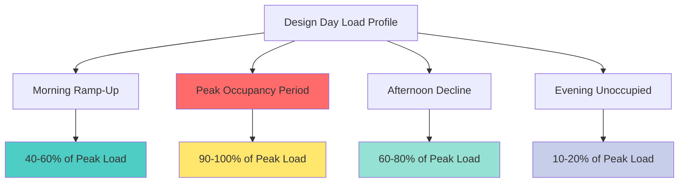
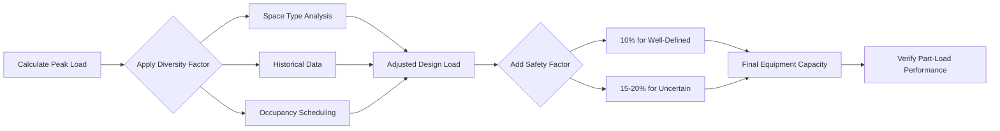

## Overview

Peak and average load analysis is critical for high-occupancy density spaces where simultaneous full occupancy rarely occurs. Proper application of diversity factors prevents equipment oversizing while maintaining adequate capacity for actual operating conditions. ASHRAE Fundamentals provides load diversity data for various occupancy types, enabling engineers to optimize equipment selection based on realistic load profiles rather than theoretical maximums.

## Peak Load Determination

Peak design load represents the maximum simultaneous cooling or heating demand when all heat sources operate at full capacity. This condition rarely occurs in practice.

### Peak Load Components

The total peak load combines all contributing factors:

$$Q_{\text{peak}} = Q_{\text{sensible}} + Q_{\text{latent}} = (Q_{\text{envelope}} + Q_{\text{occupants,sens}} + Q_{\text{lighting}} + Q_{\text{equipment}}) + (Q_{\text{occupants,lat}} + Q_{\text{ventilation,lat}})$$

Where:
- $Q_{\text{envelope}}$ = heat gain through building envelope (Btu/hr)
- $Q_{\text{occupants,sens}}$ = sensible heat from occupants at design density (Btu/hr)
- $Q_{\text{lighting}}$ = lighting heat gain (Btu/hr)
- $Q_{\text{equipment}}$ = equipment and appliance heat gain (Btu/hr)
- $Q_{\text{occupants,lat}}$ = latent heat from occupants (Btu/hr)
- $Q_{\text{ventilation,lat}}$ = latent load from outdoor air (Btu/hr)

For high-occupancy spaces, the occupant load dominates:

$$Q_{\text{occupants}} = N_{\text{design}} \times (q_{\text{sens}} + q_{\text{lat}})$$

Where:
- $N_{\text{design}}$ = design occupancy (persons)
- $q_{\text{sens}}$ = sensible heat per person (230-450 Btu/hr depending on activity)
- $q_{\text{lat}}$ = latent heat per person (200-550 Btu/hr depending on activity)

## Average Load Profiles

Average loads reflect actual operating conditions with typical occupancy patterns, equipment usage, and envelope loads varying throughout the day.

### Time-Averaged Load Calculation

$$Q_{\text{avg}} = \frac{1}{T} \int_0^T Q(t) \, dt$$

For discrete hourly data:

$$Q_{\text{avg}} = \frac{\sum_{i=1}^{24} Q_i}{24}$$

Typical average-to-peak ratios for high-occupancy spaces range from 0.50 to 0.70, meaning average loads are 50-70% of peak design loads.

## Diversity Factor Application

The diversity factor accounts for non-simultaneous operation of loads:

$$F_{\text{diversity}} = \frac{Q_{\text{coincident}}}{Q_{\text{peak,individual}}}$$

Where:
- $F_{\text{diversity}}$ = diversity factor (dimensionless, < 1.0)
- $Q_{\text{coincident}}$ = actual simultaneous load (Btu/hr)
- $Q_{\text{peak,individual}}$ = sum of individual peak loads (Btu/hr)

### Diversity Factors by Space Type

| Space Type | Occupancy Diversity | Equipment Diversity | Overall Diversity | Typical Avg/Peak Ratio |
|-----------|-------------------|-------------------|------------------|----------------------|
| **Auditorium** | 0.95-1.00 | 0.80-0.90 | 0.85-0.95 | 0.50-0.60 |
| **Conference Center** | 0.70-0.85 | 0.60-0.75 | 0.65-0.80 | 0.55-0.65 |
| **Arena/Stadium** | 0.90-0.98 | 0.85-0.95 | 0.85-0.95 | 0.45-0.55 |
| **Movie Theater** | 0.85-0.95 | 0.90-1.00 | 0.85-0.95 | 0.50-0.60 |
| **Classroom Building** | 0.60-0.75 | 0.50-0.70 | 0.55-0.70 | 0.60-0.70 |
| **Convention Hall** | 0.75-0.90 | 0.70-0.85 | 0.70-0.85 | 0.55-0.65 |

Reference: ASHRAE Fundamentals, Chapter 18 - Nonresidential Cooling and Heating Load Calculations.

## Design Load Selection

The design load for equipment sizing incorporates diversity factors while maintaining adequate capacity:

$$Q_{\text{design}} = Q_{\text{peak}} \times F_{\text{diversity}} \times F_{\text{safety}}$$

Where $F_{\text{safety}}$ typically ranges from 1.10 to 1.20 for critical applications.

### Sizing Strategy Considerations

**For Central Systems:**
- Use diversity factors at system level
- Size for coincident peak of all zones
- Apply 10-15% safety factor for extreme conditions

**For Zone-Level Equipment:**
- Minimal diversity factor (0.90-1.00)
- Size closer to calculated peak
- Individual zone peaks rarely coincide with system peak

## Oversizing Penalty

Excessive oversizing based on unrealistic peak loads results in:

### Energy Penalties

$$\text{COP}_{\text{part-load}} = \text{COP}_{\text{rated}} \times \left(\frac{Q_{\text{actual}}}{Q_{\text{capacity}}}\right)^{0.3}$$

Operating at 50% capacity reduces COP by approximately 15-20%.

### Performance Issues

- Reduced dehumidification at low loads (short cycling)
- Poor temperature control from oversized capacity
- Increased first cost with minimal safety benefit
- Higher maintenance costs on larger equipment

### Economic Impact

For equipment operating at average loads 60% of design:

$$\text{Energy Cost Penalty} \approx 1.15 \times \text{Baseline Cost}$$

This 15% energy penalty accumulates over 15-20 year equipment life, often exceeding initial cost savings from "conservative" oversizing.

## Recommended Approach

1. **Calculate true peak load** using ASHRAE procedures with design occupancy
2. **Determine realistic diversity factor** from ASHRAE tables or historical data
3. **Apply 10-15% safety factor** for uncertainty, not 20-30% arbitrary margins
4. **Verify part-load performance** of selected equipment at expected average loads
5. **Consider multiple smaller units** instead of single oversized unit for better turndown

The optimal design balances adequate capacity for actual peak conditions with efficient operation during the 90-95% of operating hours at average loads.

## Load Profile Documentation

```mermaid
gantt
    title Typical Daily Load Profile - Conference Center
    dateFormat HH:mm
    axisFormat %H:%M

    section Load Percentage
    Unoccupied (15%) :done, 00:00, 07:00
    Morning Setup (45%) :active, 07:00, 08:30
    Peak Morning (85%) :crit, 08:30, 12:00
    Lunch Diversity (60%) :active, 12:00, 13:00
    Peak Afternoon (90%) :crit, 13:00, 16:00
    Evening Decline (50%) :active, 16:00, 18:00
    Night Setback (20%) :done, 18:00, 24:00
```

This profile demonstrates why sizing for continuous 100% peak results in significant oversizing relative to actual thermal demand throughout operating hours.
