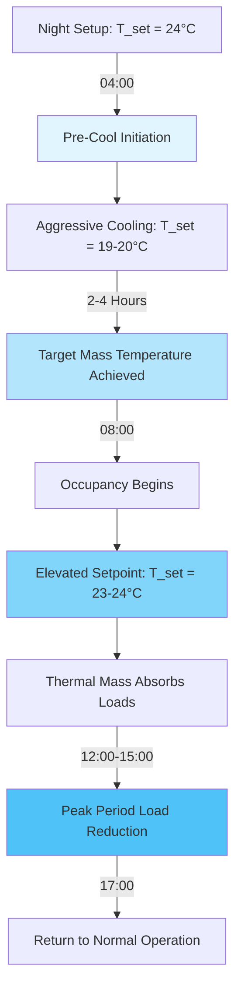
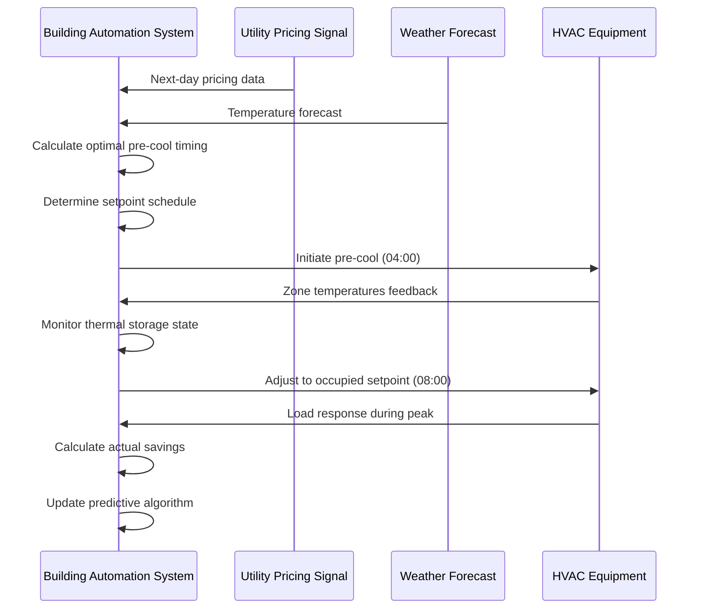

## Pre-Cooling Strategy Fundamentals

Pre-cooling leverages building thermal mass as passive energy storage to reduce peak cooling loads during high-occupancy periods. This strategy operates by sub-cooling the building structure 2-4 hours before occupancy, allowing the cooled mass to absorb sensible heat gains during peak periods while reducing instantaneous cooling requirements.

The effectiveness of pre-cooling depends on three primary factors:

- **Thermal mass magnitude**: Concrete, masonry, and gypsum board heat capacity
- **Coupling effectiveness**: Surface area exposure and convective heat transfer coefficients
- **Load profile characteristics**: Timing and magnitude of internal heat gains

## Thermal Mass Energy Storage

The energy storage capacity of building thermal mass follows fundamental heat transfer principles. The total sensible heat absorbed by structural mass during pre-cooling is:

$$Q_{storage} = \sum_{i=1}^{n} m_i c_{p,i} \Delta T_i$$

Where:
- $Q_{storage}$ = total thermal energy stored (kJ)
- $m_i$ = mass of component i (kg)
- $c_{p,i}$ = specific heat capacity of material i (kJ/kg·K)
- $\Delta T_i$ = temperature depression of component i (K)

For typical concrete structures, the effective thermal mass per unit floor area can be estimated:

$$M_{eff} = \rho_{concrete} \cdot t_{slab} \cdot A_{floor} \cdot f_{coupling}$$

Where $f_{coupling}$ represents the coupling effectiveness factor (typically 0.6-0.8 for exposed slabs, 0.3-0.5 for carpeted or covered surfaces). The specific heat of concrete is approximately 0.88 kJ/kg·K with density of 2300 kg/m³.

The rate of heat absorption from the space to the thermal mass during occupied hours follows:

$$\dot{Q}_{mass} = hA(T_{air} - T_{mass,avg})$$

Where h is the combined convective heat transfer coefficient (typically 5-10 W/m²·K for horizontal surfaces, 8-15 W/m²·K for vertical surfaces).

## Pre-Cooling Sequence and Timing

The optimal pre-cooling sequence balances energy storage capacity against compressor energy consumption and occupant comfort requirements.

### Pre-Cooling Timeline

| Time Period | Setpoint | Cooling Mode | Objective |
|-------------|----------|--------------|-----------|
| 00:00-04:00 | 24°C | Night Setback | Minimize overnight energy |
| 04:00-08:00 | 19-20°C | Pre-Cool Aggressive | Maximize thermal storage |
| 08:00-12:00 | 23-24°C | Occupied Moderate | Utilize stored cooling |
| 12:00-15:00 | 23-24°C | Peak Period | Peak demand reduction |
| 15:00-17:00 | 22-23°C | Standard Cooling | Return to normal |
| 17:00-24:00 | 24°C | Night Setback | Energy conservation |

## Peak Demand Reduction Calculations

The instantaneous cooling load reduction during peak periods can be quantified by comparing heat absorption rates:

$$\dot{Q}_{reduction} = \dot{Q}_{mass} - \dot{Q}_{system,precool}$$

For a typical 10,000 ft² (930 m²) high-occupancy space with 150 mm concrete slab:

**Without Pre-Cooling:**
- Peak cooling load: 35-40 W/m² = 32.5-37.2 kW
- Peak electrical demand: 11-13 kW (COP = 3.0)

**With Pre-Cooling:**
- Peak cooling load: 25-30 W/m² = 23.3-27.9 kW
- Peak electrical demand: 7.8-9.3 kW
- Demand reduction: 25-30%

The thermal mass provides temporary cooling at an effective rate:

$$\dot{Q}_{mass,effective} = \frac{m_{eff} c_p \Delta T_{available}}{t_{peak}}$$

For a 4-hour peak period with 3°C available temperature rise, this provides sustained load offset.

## Energy and Cost Optimization

Pre-cooling strategy effectiveness depends critically on utility rate structures. Time-of-use (TOU) rates create economic incentive for load shifting.

### Energy Cost Analysis

**Typical TOU Rate Structure:**

| Period | Hours | Rate ($/kWh) | Strategy |
|--------|-------|--------------|----------|
| Off-Peak | 22:00-08:00 | 0.08-0.12 | Pre-cool during this window |
| Mid-Peak | 08:00-12:00, 18:00-22:00 | 0.15-0.20 | Moderate cooling, use storage |
| On-Peak | 12:00-18:00 | 0.25-0.45 | Minimize cooling, maximize storage utilization |

The economic benefit calculation:

$$Savings = (kW_{reduction} \times Demand_{charge}) + \sum_{period} (kWh_{shifted} \times \Delta Rate_{period})$$

Typical demand charge savings range from $15-25/kW-month. For the example 3-4 kW peak reduction, monthly demand charge savings alone equal $45-100.

## Implementation Considerations per ASHRAE Standards

ASHRAE Standard 90.1 Section 6.4.3.3 addresses precooling and optimal start/stop controls. Key requirements:

- **Temperature limits**: Pre-cooling setpoints must not violate health and safety requirements (typically not below 18°C)
- **Humidity control**: Pre-cooling may require enhanced dehumidification capacity
- **Control deadbands**: Minimum 1.1°C deadband between heating and cooling per Standard 90.1
- **Optimal start algorithms**: ASHRAE Guideline 36 provides control sequences for building mass precooling

ASHRAE Research Project RP-1404 demonstrated that pre-cooling strategies achieve:
- 15-30% peak demand reduction in buildings with exposed thermal mass
- 8-15% reduction in daily cooling energy consumption under appropriate utility rate structures
- Optimal pre-cool duration of 2-4 hours depending on mass exposure and occupancy load magnitude

## Control Strategy Integration

Effective pre-cooling requires sophisticated building automation:

The control system must integrate multiple data streams to optimize performance while maintaining occupant comfort within ASHRAE Standard 55 thermal comfort boundaries.

## Practical Application

Pre-cooling proves most effective in:
- Buildings with significant exposed thermal mass (concrete, masonry)
- High-occupancy facilities with predictable load schedules
- Regions with substantial TOU rate differentials
- Climate zones with significant diurnal temperature swing

Marginal effectiveness occurs in:
- Light-frame construction with minimal thermal mass
- 24-hour operation facilities
- Regions with flat utility rate structures
- Spaces with dominant latent cooling loads
