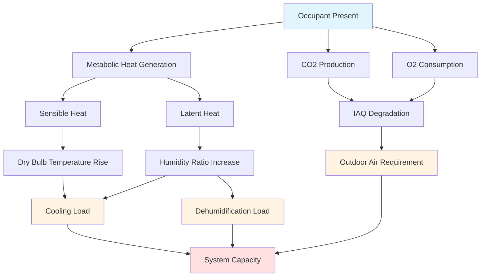

Occupant loads represent the single largest contributor to cooling requirements in high-occupancy density spaces. Each person introduces both sensible and latent heat gains to the conditioned space, with the balance between these components shifting based on activity level and space temperature. Accurate quantification of occupant loads is fundamental to proper HVAC system sizing and outdoor air delivery.

## Metabolic Heat Generation

Human metabolism continuously produces heat through biochemical processes. This total heat gain (THG) divides into sensible and latent components based on activity level and environmental conditions.

### Total Heat Gain per Occupant

$$q_{total} = q_{sensible} + q_{latent}$$

Where:
- $q_{total}$ = total metabolic heat gain (W or Btu/hr)
- $q_{sensible}$ = convective and radiative heat transfer to air (W or Btu/hr)
- $q_{latent}$ = heat associated with moisture addition (W or Btu/hr)

### Sensible Heat Ratio

The sensible heat ratio (SHR) quantifies the fraction of total heat that affects dry-bulb temperature:

$$SHR = \frac{q_{sensible}}{q_{total}}$$

For sedentary adults at typical indoor conditions, SHR ranges from 0.55 to 0.65. As activity increases or space temperature rises, the latent fraction increases, reducing SHR.

## ASHRAE Heat Gain Values

ASHRAE Fundamentals provides occupant heat gain data based on activity level and space temperature. The following table presents typical values for moderately active adults:

| Activity Level | Total Heat (Btu/hr) | Sensible (Btu/hr) | Latent (Btu/hr) | SHR |
|----------------|---------------------|-------------------|-----------------|-----|
| Seated, quiet | 400 | 245 | 155 | 0.61 |
| Seated, light work | 450 | 255 | 195 | 0.57 |
| Standing, light work | 550 | 265 | 285 | 0.48 |
| Walking, 2 mph | 700 | 305 | 395 | 0.44 |
| Dancing, moderate | 900 | 360 | 540 | 0.40 |

These values assume a space temperature of 75°F (24°C) with 50% relative humidity. At higher temperatures, latent heat increases while sensible heat decreases.

## High Occupancy Density Challenges

Spaces with occupant densities exceeding 10 persons per 1000 ft² present specific design challenges that distinguish them from conventional applications.

### Latent Load Dominance

In high-density spaces, latent loads from occupants frequently exceed sensible loads, creating a cooling coil load profile opposite to that of typical commercial spaces. This shifts the design emphasis:

- Standard offices: SHR = 0.70-0.80 (sensible-dominant)
- Theaters/auditoriums: SHR = 0.55-0.65
- Gymnasiums/dance studios: SHR = 0.40-0.50 (latent-dominant)

Systems designed without recognizing latent dominance will maintain dry-bulb temperature but fail to control humidity, leading to occupant discomfort and potential mold growth.

### Load Calculation Example

For a lecture hall with 200 occupants (seated, light work):

$$q_{sensible,total} = 200 \times 255 = 51,000 \text{ Btu/hr} = 4.25 \text{ tons}$$

$$q_{latent,total} = 200 \times 195 = 39,000 \text{ Btu/hr} = 3.25 \text{ tons}$$

$$q_{total} = 90,000 \text{ Btu/hr} = 7.5 \text{ tons}$$

The system must remove 7.5 tons of cooling, with 43% being latent. Standard VAV systems sized only for sensible load would be undersized by 76%.

## CO2 Generation and Ventilation

Occupants produce carbon dioxide through respiration, with generation rates directly proportional to metabolic rate.

### CO2 Production Rate

$$\dot{V}_{CO_2} = R_{met} \times N_{occ}$$

Where:
- $\dot{V}_{CO_2}$ = CO2 generation rate (cfm or L/s)
- $R_{met}$ = metabolic CO2 production per person (typically 0.005-0.007 cfm/person)
- $N_{occ}$ = number of occupants

### Required Outdoor Air

Using ASHRAE Standard 62.1 ventilation rate procedure:

$$V_{oz} = R_p \times P + R_a \times A$$

Where:
- $V_{oz}$ = outdoor air requirement (cfm)
- $R_p$ = per-person outdoor air rate (cfm/person)
- $P$ = occupant count
- $R_a$ = per-area outdoor air rate (cfm/ft²)
- $A$ = floor area (ft²)

For assembly spaces, $R_p$ = 5 cfm/person minimum. High-density applications often require 15-20 cfm/person to maintain CO2 below 1000 ppm during peak occupancy.

## Load Component Interaction

## Design Considerations

Accurate occupant load determination requires consideration of multiple factors:

1. **Design Occupancy**: Use maximum anticipated occupancy, not average. Building codes provide minimum occupant densities by space type.

2. **Diversity Factor**: Apply only when statistical evidence supports simultaneous occupancy below maximum. Conservative designs avoid diversity factors for high-density applications.

3. **Schedule**: Occupant loads vary temporally. Peak cooling loads may not coincide with peak occupancy if solar or equipment loads dominate at different times.

4. **Activity Level**: Verify assumed activity levels with actual space use. Gyms, dance studios, and sports facilities generate significantly higher loads than sedentary spaces.

## System Response Requirements

HVAC systems serving high-occupancy spaces must respond to rapid load changes:

$$\tau = \frac{m \times c_p}{\dot{m}_{air} \times c_p} = \frac{V \times \rho}{ACH \times \rho} = \frac{V}{ACH}$$

Where:
- $\tau$ = space time constant (hours)
- $V$ = space volume (ft³)
- $ACH$ = air changes per hour

High-density spaces require 6-12 ACH to maintain acceptable time constants under 10 minutes. Lower air change rates result in temperature swings during occupancy transitions.

## Summary

Occupant loads in high-density applications drive HVAC system design through three primary mechanisms: sensible heat affecting temperature, latent heat affecting humidity, and CO2 generation requiring outdoor air ventilation. Systems must accommodate latent-dominant load profiles, provide adequate dehumidification capacity, and deliver sufficient outdoor air to maintain indoor air quality. Failure to properly quantify and address these interconnected load components results in inadequate system performance and occupant discomfort regardless of total cooling capacity installed.
