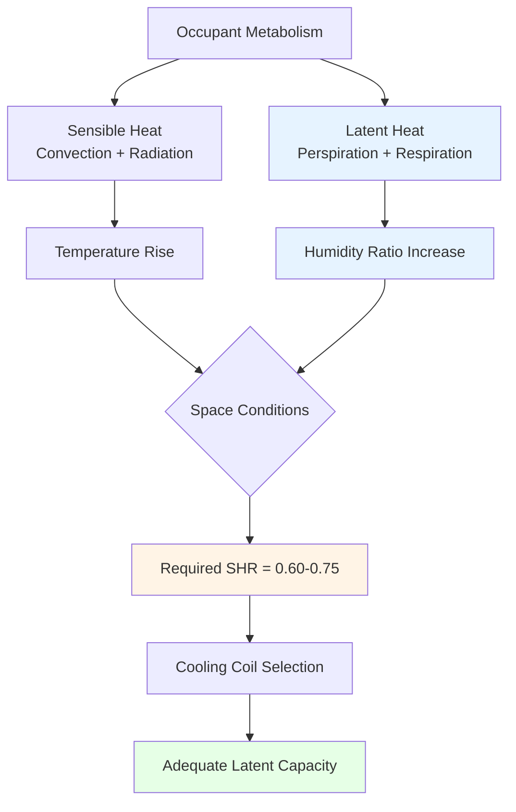
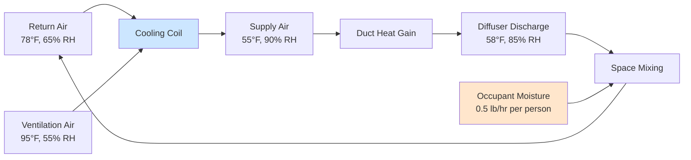

## Occupant Latent Heat Generation

Human occupants generate latent heat through two primary physiological mechanisms: perspiration (evaporation from skin) and respiration (moisture in exhaled breath). The latent heat component represents 20-50% of total metabolic heat release depending on activity level and environmental conditions.

The total latent heat gain from occupants is calculated as:

$$Q_{lat} = N \cdot q_{lat} \cdot CLF$$

Where:
- $Q_{lat}$ = total latent heat gain (Btu/hr or W)
- $N$ = number of occupants
- $q_{lat}$ = latent heat gain per person (Btu/hr)
- $CLF$ = cooling load factor (typically 1.0 for latent loads)

### Moisture Generation Mechanism

The moisture generation rate from occupants is expressed as:

$$\dot{m}_{moisture} = N \cdot \frac{q_{lat}}{h_{fg}}$$

Where:
- $\dot{m}_{moisture}$ = moisture generation rate (lb/hr or kg/hr)
- $h_{fg}$ = latent heat of vaporization (1050 Btu/lb or 2440 kJ/kg at standard conditions)

This moisture addition increases the space humidity ratio:

$$\Delta W = \frac{\dot{m}_{moisture}}{\dot{m}_{air}} = \frac{N \cdot q_{lat}}{h_{fg} \cdot \rho_{air} \cdot \dot{V}}$$

Where:
- $\Delta W$ = humidity ratio increase (lb moisture/lb dry air)
- $\dot{V}$ = ventilation airflow rate (CFM or m³/s)
- $\rho_{air}$ = air density (0.075 lb/ft³ or 1.2 kg/m³)

## Latent Load by Activity Level

ASHRAE Fundamentals provides standardized latent heat generation rates based on activity intensity:

| Activity Level | Sensible Heat (Btu/hr) | Latent Heat (Btu/hr) | Total Heat (Btu/hr) | SHR |
|----------------|------------------------|----------------------|---------------------|-----|
| Seated at rest | 245 | 105 | 350 | 0.70 |
| Seated, light work | 255 | 145 | 400 | 0.64 |
| Standing, light work | 250 | 200 | 450 | 0.56 |
| Walking 2 mph | 250 | 250 | 500 | 0.50 |
| Light bench work | 275 | 275 | 550 | 0.50 |
| Moderate dancing | 305 | 545 | 850 | 0.36 |
| Heavy work/athletics | 345 | 705 | 1050 | 0.33 |

**Note:** Values assume 75°F space temperature. Latent fraction increases as space temperature rises.

## Sensible Heat Ratio Impact

The sensible heat ratio (SHR) for occupied spaces is calculated as:

$$SHR = \frac{Q_{sensible}}{Q_{sensible} + Q_{latent}}$$

High-density occupancy drives SHR down to 0.60-0.75, significantly below the typical cooling coil SHR of 0.75-0.80. This mismatch creates humidity control challenges requiring specialized equipment selection.

## Dehumidification Requirements

### Coil Performance Requirements

To handle high latent loads, the cooling coil must achieve sufficient moisture removal:

$$\dot{m}_{removed} = \rho_{air} \cdot \dot{V} \cdot (W_{entering} - W_{leaving})$$

Where:
- $W_{entering}$ = entering air humidity ratio
- $W_{leaving}$ = leaving air humidity ratio

The apparatus dew point (ADP) must be selected to provide adequate latent capacity:

$$ADP_{required} = T_{space} - \frac{Q_{total}}{1.08 \cdot \dot{V} \cdot BF}$$

Where $BF$ is the coil bypass factor (typically 0.05-0.15 for dehumidification applications).

## Moisture Load Distribution

High-occupancy spaces experience time-varying latent loads:

| Time Period | Occupancy Factor | Latent Load Factor | Effective SHR |
|-------------|------------------|-----------------------|---------------|
| Pre-occupancy | 0% | 0% | 0.95 |
| Partial occupancy | 50% | 50% | 0.82 |
| Full occupancy | 100% | 100% | 0.68 |
| Post-occupancy | 10% | 5% | 0.90 |

**Latent load diversity** accounts for simultaneous occupancy patterns. Design diversity factors range from 0.75-0.95 depending on space function.

## Design Considerations

**Critical parameters for high-latent-load applications:**

1. **Supply air temperature**: Lower supply air temperatures (52-55°F) improve dehumidification but require careful condensation control
2. **Coil rows**: 6-8 row coils with face velocities below 500 FPM maximize moisture removal
3. **Reheat strategies**: Subcool-and-reheat approaches maintain humidity control during partial load
4. **Dedicated outdoor air systems (DOAS)**: Separately condition ventilation air to reduce space latent load
5. **Desiccant dehumidification**: Supplement mechanical cooling in extreme latent load conditions (SHR < 0.65)

**Relative humidity control challenges:**

- Occupant comfort range: 30-60% RH per ASHRAE Standard 55
- Mold prevention: maintain below 60% RH per ASHRAE Standard 62.1
- Condensation avoidance: surface temperatures must exceed dew point
- Part-load operation: reduced sensible loads increase space RH if latent capacity is insufficient

## System Selection Criteria

Select HVAC equipment based on space SHR requirements:

$$\frac{Q_{lat,space}}{Q_{sen,space}} \leq \frac{Q_{lat,coil}}{Q_{sen,coil}}$$

When space latent load fraction exceeds coil latent capacity fraction, supplemental dehumidification is required. This commonly occurs in theaters, auditoriums, gymnasiums, and assembly spaces where occupant density exceeds 15 ft²/person and activity levels are moderate to high.

**Reference:** ASHRAE Handbook—Fundamentals, Chapter 18: Nonresidential Cooling and Heating Load Calculations (metabolic heat generation rates and occupancy load profiles).
