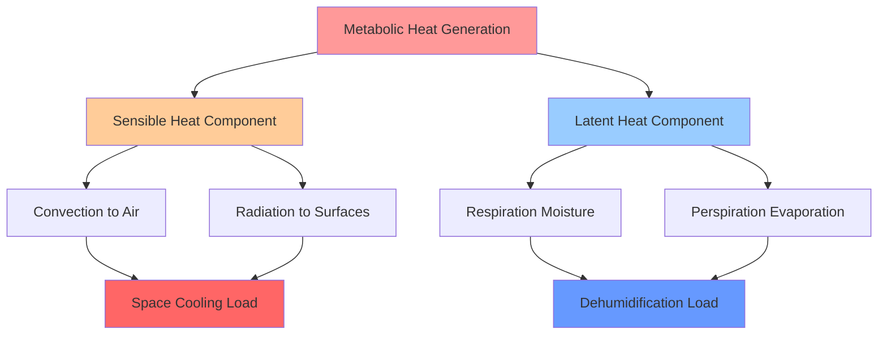
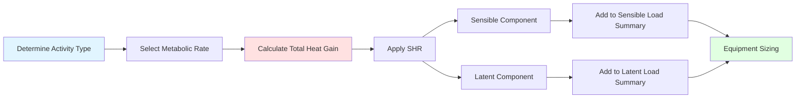

## Overview

Metabolic heat gain represents the thermal energy released by human occupants through biological processes. In high-occupancy applications such as theaters, auditoriums, gymnasiums, and assembly spaces, metabolic heat constitutes a significant portion of the total cooling load. Accurate quantification of this heat source is essential for proper equipment sizing and maintaining acceptable indoor environmental conditions.

Human metabolism generates heat through oxidation of nutrients, with the rate dependent on activity level, body size, and environmental conditions. This heat manifests as both sensible (affecting dry-bulb temperature) and latent (affecting humidity) components, with the ratio varying based on activity intensity and ambient conditions.

## Fundamental Relationships

The total metabolic heat gain per person is expressed as:

$$Q_{total} = Q_{sensible} + Q_{latent}$$

Where the sensible heat ratio (SHR) defines the partition:

$$SHR = \frac{Q_{sensible}}{Q_{total}}$$

For a space with multiple occupants:

$$Q_{occupants} = N \times q_{person} \times CLF$$

Where:
- $N$ = number of occupants
- $q_{person}$ = heat gain per person (Btu/hr)
- $CLF$ = cooling load factor (typically 1.0 for continuously occupied spaces)

## Metabolic Rate by Activity Level

ASHRAE Fundamentals provides standardized metabolic rates for various activities. The following table presents values for common assembly and institutional applications:

| Activity Level | Total Heat (Btu/hr) | Sensible (Btu/hr) | Latent (Btu/hr) | SHR |
|----------------|--------------------:|------------------:|----------------:|----:|
| Seated, at rest | 250 | 210 | 40 | 0.84 |
| Seated, light work | 300 | 230 | 70 | 0.77 |
| Standing, light activity | 350 | 245 | 105 | 0.70 |
| Walking slowly (2 mph) | 400 | 250 | 150 | 0.63 |
| Light bench work | 400 | 265 | 135 | 0.66 |
| Dancing (moderate) | 550 | 280 | 270 | 0.51 |
| Heavy work/exercise | 750 | 315 | 435 | 0.42 |
| Athletics, gymnasium | 850 | 345 | 505 | 0.41 |

*Values based on ASHRAE Fundamentals, Chapter 18, adjusted for typical air-conditioned space conditions (75°F, 50% RH)*

## Sensible and Latent Heat Components

The partition between sensible and latent heat depends on activity intensity and space temperature. As activity level increases, a greater fraction of metabolic heat is rejected as latent heat through perspiration and respiration.

The sensible-to-latent ratio shift has critical implications for system design. High-activity spaces require greater dehumidification capacity relative to sensible cooling, affecting equipment selection, coil design, and psychrometric performance.

## Activity-Specific Design Considerations

**Seated Assembly (Theaters, Auditoriums, Lecture Halls)**

For seated, quiet activities:
- Use 250-300 Btu/hr per person
- SHR typically 0.77-0.84
- Sensible load dominates
- Standard cooling coils adequate

**Standing Assembly (Retail, Museums, Exhibitions)**

For standing with light movement:
- Use 350-400 Btu/hr per person
- SHR typically 0.63-0.70
- Balanced sensible/latent loads
- Consider dehumidification capacity

**Active Assembly (Dance Halls, Gymnasiums, Fitness Centers)**

For moderate to heavy activity:
- Use 550-850 Btu/hr per person
- SHR typically 0.41-0.51
- Latent load dominates
- Dedicated dehumidification often required

## Load Calculation Methodology

**Calculation Example:**

For a 500-person auditorium with seated occupants:

$$Q_{sensible} = 500 \times 230 = 115,000 \text{ Btu/hr} = 9.6 \text{ tons}$$

$$Q_{latent} = 500 \times 70 = 35,000 \text{ Btu/hr} = 2.9 \text{ tons}$$

$$Q_{total} = 150,000 \text{ Btu/hr} = 12.5 \text{ tons}$$

## Design Factors and Adjustments

**Temperature Dependency**

Metabolic heat rejection increases at higher ambient temperatures as the body works harder to maintain thermal equilibrium. The adjustment factor:

$$q_{adjusted} = q_{75°F} \times \left(1 + 0.01(T_{space} - 75)\right)$$

**Diversity Factors**

Actual occupancy rarely reaches design capacity simultaneously. Apply diversity factors based on space type:
- Theaters/auditoriums: 0.90-1.00
- Retail spaces: 0.50-0.70
- Gymnasiums: 0.60-0.80
- Restaurants: 0.70-0.90

**Transient Effects**

In intermittently occupied spaces, occupants represent a transient load. The thermal storage effect of furnishings and structure dampens the instantaneous cooling requirement, justifying cooling load factors less than 1.0 in some applications.

## System Design Implications

The magnitude and characteristics of metabolic loads influence multiple system design parameters:

1. **Ventilation Requirements**: ASHRAE Standard 62.1 mandates minimum outdoor air rates based on occupancy, often 5-7.5 CFM/person for assembly spaces

2. **Dehumidification Capacity**: High-activity applications require supply air dew points of 50-55°F, necessitating enhanced coil performance or dedicated dehumidification

3. **Air Distribution**: Higher occupant density demands increased air change rates (6-15 ACH typical) to maintain temperature uniformity and dilute bioeffluents

4. **Equipment Selection**: Latent-dominated loads favor lower sensible heat ratios (0.65-0.75) in packaged equipment selection to prevent humidity issues

Proper accounting for metabolic heat gain, with accurate activity level assumptions and sensible-latent partitioning, ensures occupant comfort while preventing equipment oversizing and energy waste in high-density applications.
