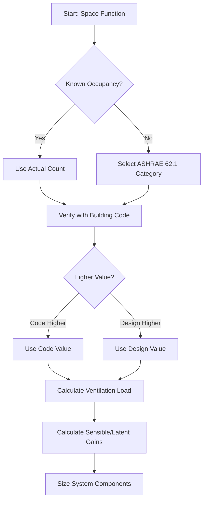

Occupancy density represents the number of occupants per unit floor area and serves as the fundamental parameter for sizing ventilation systems, calculating cooling loads, and determining outdoor air requirements. Accurate density values directly impact energy consumption, indoor air quality, and system capacity.

## Fundamental Density Calculations

The relationship between occupancy density, floor area, and total occupants follows:

$$N = \frac{A}{D}$$

Where:
- $N$ = Number of occupants (persons)
- $A$ = Floor area (ft²)
- $D$ = Occupancy density (ft²/person)

Alternatively, density factor calculation:

$$D = \frac{A_f}{N_{design}}$$

Where $A_f$ is the floor area of the occupied zone and $N_{design}$ is the design occupant count.

## ASHRAE 62.1 Occupancy Categories

ASHRAE Standard 62.1 establishes default occupancy densities for ventilation system design when actual occupant loads are unknown. These values represent typical worst-case scenarios:

| Space Type | Density (ft²/person) | Occupant Load (persons/1000 ft²) |
|-----------|----------------------|----------------------------------|
| Office - Open plan | 100 | 10 |
| Office - Private | 200 | 5 |
| Conference room | 20 | 50 |
| Retail - Sales floor | 30 | 33 |
| Retail - Storage | 300 | 3 |
| Restaurant - Dining | 15 | 67 |
| Kitchen - Commercial | 200 | 5 |
| Classroom - General | 25 | 40 |
| Corridor | 100 | 10 |
| Lobby | 20 | 50 |

## High-Density Assembly Spaces

Assembly occupancies present the most challenging HVAC design conditions due to extreme densities and variable loads:

### Standing and Concert Venues

**Standing room density**: 2-5 ft²/person
- Concert venues (standing): 3-5 ft²/person
- Festival seating: 4-7 ft²/person
- Dance floors: 5-10 ft²/person

**Seated assembly density**: 5-20 ft²/person
- Theater seating (fixed): 10-15 ft²/person
- Movable chairs: 7-10 ft²/person
- Church pews: 12-18 ft²/person

### Sports and Entertainment

**Arena occupancy**: 10-30 ft²/person
- Basketball arena: 15-20 ft²/person (including circulation)
- Ice hockey arena: 20-25 ft²/person
- Stadium seating: 10-15 ft²/person (seat area only)

## Design Occupancy Determination

The design process requires comparison between multiple sources:

1. **Building code requirements** (IBC, local amendments)
2. **ASHRAE 62.1 default values**
3. **Actual operational data** (when available)
4. **Owner requirements** or program specifications

Use the most conservative (highest occupancy) value for system sizing.

## Occupant Load Calculation Methods

### Method 1: Floor Area Method

$$N = \frac{A_{net}}{D_{code}}$$

Where $A_{net}$ excludes non-occupiable spaces (mechanical rooms, storage, circulation in some codes).

### Method 2: Fixed Seating Method

For spaces with fixed seating:

$$N = N_{seats} + \frac{A_{standing}}{D_{standing}}$$

This combines actual seat count with standing area calculations.

### Method 3: Mixed-Use Method

For spaces with multiple functions:

$$N_{total} = \sum_{i=1}^{n} \frac{A_i}{D_i}$$

Calculate each zone independently and sum.

## Building Code Requirements

International Building Code (IBC) occupant load factors often differ from ASHRAE 62.1 values:

| IBC Occupancy Classification | Load Factor (ft²/person) | Purpose |
|------------------------------|--------------------------|---------|
| Assembly - Concentrated (A-1) | 7 net / 15 gross | Egress sizing |
| Assembly - Standing (A-3) | 5 net / 15 gross | Egress sizing |
| Assembly - Unconcentrated (A-3) | 15 net | Egress sizing |
| Business (B) | 150 gross | Egress sizing |
| Educational (E) | 20 net / 50 gross | Egress sizing |
| Mercantile (M) | 30 gross (sales) | Egress sizing |

**Critical distinction**: IBC values size egress systems (exits, stairs), while ASHRAE 62.1 values size HVAC systems. HVAC design may require higher occupancies than code minimums.

## Ventilation Load Impact

Outdoor air requirement per ASHRAE 62.1:

$$V_{oz} = R_p \times P_z + R_a \times A_z$$

Where:
- $V_{oz}$ = Outdoor air flow (cfm)
- $R_p$ = People outdoor air rate (cfm/person)
- $P_z$ = Zone population (from density calculation)
- $R_a$ = Area outdoor air rate (cfm/ft²)
- $A_z$ = Zone floor area (ft²)

Higher occupancy density directly increases the people component, often dominating the outdoor air calculation in high-density spaces.

## Design Considerations

**Diversity factors**: Actual simultaneous occupancy rarely reaches design maximum. Apply diversity factors of 0.7-0.9 for energy modeling but never for peak capacity sizing.

**Temporal variation**: Assembly spaces experience extreme swings from zero occupants to peak capacity within minutes. Systems must respond to:
- Rapid CO₂ buildup during ingress
- Peak latent loads (100-400 Btu/hr per person)
- Transient temperature rise

**Verification**: Demand-controlled ventilation (DCV) with CO₂ sensing provides real-time verification of actual occupancy versus design assumptions.

**Code compliance**: When design occupancy exceeds code minimums for HVAC purposes, document the basis for egress review. Higher HVAC occupancies do not require additional exits unless they exceed egress load factors.

## Practical Application

For a 5,000 ft² conference center ballroom:

**ASHRAE 62.1 default**: 5 ft²/person → 1,000 occupants
**IBC standing assembly**: 5 ft²/person → 1,000 occupants
**Owner requirement**: 750 persons (tables for 10, 75 tables)

Design for 1,000 persons to meet worst-case standing reception configuration, even if typical use involves fewer occupants with tables.
