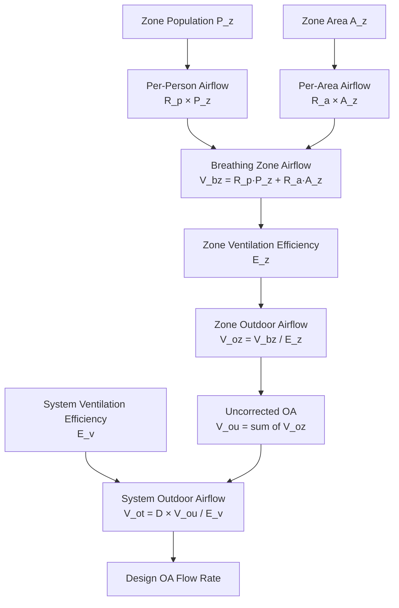

## ASHRAE 62.1 Ventilation Rate Procedure

High occupancy density spaces require careful analysis of outdoor air requirements due to the combined effects of human bioeffluent generation and area-based contaminant sources. ASHRAE 62.1 establishes the Ventilation Rate Procedure (VRP) as the prescriptive method for determining minimum outdoor air requirements.

The total breathing zone outdoor airflow $V_{bz}$ combines per-person and per-area components:

$$V_{bz} = R_p \cdot P_z + R_a \cdot A_z$$

where:
- $V_{bz}$ = breathing zone outdoor airflow, cfm
- $R_p$ = outdoor air rate required per person, cfm/person
- $P_z$ = zone population, persons
- $R_a$ = outdoor air rate required per unit area, cfm/ft²
- $A_z$ = zone floor area, ft²

### Physical Basis of Dual Components

The dual-component approach reflects two distinct contaminant generation mechanisms. The per-person component $R_p \cdot P_z$ addresses bioeffluents generated by human metabolism—primarily carbon dioxide, water vapor, and body odors. These scale linearly with occupancy and dominate in high-density spaces.

The per-area component $R_a \cdot A_z$ addresses contaminants from building materials, furnishings, and cleaning products. These sources emit continuously regardless of occupancy but become proportionally less significant as occupant density increases.

## Occupancy Categories and Design Values

ASHRAE 62.1 Table 6.2.2.1 specifies ventilation rates for various space types. High occupancy density spaces include:

| Space Type | $R_p$ (cfm/person) | $R_a$ (cfm/ft²) | Default Occupancy (ft²/person) |
|------------|-------------------|-----------------|-------------------------------|
| Auditorium seating | 5 | 0.06 | 5 |
| Places of religious worship | 5 | 0.06 | 7 |
| Lecture classroom | 7.5 | 0.06 | 25 |
| Conference/meeting | 5 | 0.06 | 20 |
| Corridors | - | 0.06 | - |
| Lobbies | 7.5 | 0.06 | 10 |
| Gym/stadium seating | 7.5 | 0.06 | 5 |

The low default occupancies (5–10 ft²/person) for assembly spaces indicate design expectations of 100–200+ persons per 1000 ft², making the per-person component dominant.

## Breathing Zone Calculations

The breathing zone is defined as the region within an occupied space between 3 and 72 inches above the floor and more than 2 feet from walls or fixed air-handling equipment. Breathing zone outdoor airflow must account for system-level effects including ventilation efficiency.

The zone outdoor airflow $V_{oz}$ corrects for imperfect mixing using zone air distribution effectiveness $E_z$:

$$V_{oz} = \frac{V_{bz}}{E_z}$$

For overhead air distribution systems (typical in assembly spaces), $E_z = 1.0$ when supply air temperature differential ΔT < 15°F. For displacement ventilation systems common in tall spaces, $E_z$ can reach 1.2, reducing required outdoor air by 17%.

## System-Level Outdoor Air Requirements

Multiple-zone systems require additional correction for diversity between zones. The uncorrected outdoor air intake $V_{ou}$ is the sum of all zone requirements:

$$V_{ou} = \sum_{all\ zones} V_{oz}$$

The system outdoor air intake $V_{ot}$ accounts for system ventilation efficiency $E_v$ and occupancy diversity $D$:

$$V_{ot} = \frac{D \cdot V_{ou}}{E_v}$$

### Diversity Factor

The diversity factor $D$ recognizes that not all zones reach peak occupancy simultaneously. ASHRAE 62.1 requires $D = 1.0$ (no diversity credit) unless specific operating schedules demonstrate predictable diversity patterns.

For spaces with documented occupancy patterns, diversity analysis can yield significant reductions:

$$D = \frac{\sum_{peak} P_z}{\sum_{design} P_z}$$

Example: A convention center with a 5,000-person main hall and 2,000-person exhibit space may have $D = 0.71$ if historical data shows maximum concurrent attendance of 5,000 persons (never 7,000).

### System Ventilation Efficiency

System ventilation efficiency $E_v$ depends on supply-to-outdoor air ratio and varies by system type:

For single-zone systems:
$$E_v = 1.0$$

For 100% outdoor air systems:
$$E_v = 1.0$$

For multiple-zone recirculating systems, $E_v$ is calculated from the critical zone (zone requiring highest outdoor air fraction):

$$E_v = \frac{1 + X_s - Z_{pz}}{1 + X_s}$$

where $X_s = V_{ou}/V_{ps}$ (uncorrected outdoor air fraction) and $Z_{pz}$ is the zone outdoor air fraction of the critical zone.

## High Density Design Considerations

### Calculation Example: 1,000-Person Auditorium

Given:
- Auditorium: 10,000 ft² with 1,000 seats (10 ft²/person)
- $R_p = 5$ cfm/person, $R_a = 0.06$ cfm/ft²
- Overhead supply, $E_z = 1.0$
- 100% outdoor air system, $E_v = 1.0$

Breathing zone airflow:
$$V_{bz} = (5)(1000) + (0.06)(10000) = 5000 + 600 = 5600\ \text{cfm}$$

Zone outdoor airflow:
$$V_{oz} = \frac{5600}{1.0} = 5600\ \text{cfm}$$

System outdoor airflow (single zone):
$$V_{ot} = \frac{1.0 \times 5600}{1.0} = 5600\ \text{cfm}$$

At 10 ft²/person, the per-person component contributes 89% of total ventilation requirement. At lower densities (e.g., 50 ft²/person), the area component becomes more significant, but absolute airflow demand decreases.

## Breathing Zone Design Strategies

High occupancy spaces benefit from several design approaches to improve ventilation effectiveness:

**Underfloor Air Distribution**: Delivers outdoor air directly to the breathing zone with $E_z = 1.2$, reducing required airflow by 17%.

**Displacement Ventilation**: Low-velocity supply near the floor creates upward convection plumes around occupants, achieving $E_z = 1.2$ for cooling applications.

**Dedicated Outdoor Air Systems (DOAS)**: Separates ventilation from sensible cooling, ensuring outdoor air requirements are met independent of thermal loads. Particularly effective when occupancy varies significantly.

**Variable Air Volume Considerations**: VAV systems serving high-density spaces must maintain minimum outdoor airflow during all operating conditions. Primary airflow reduction below the minimum required for ventilation violates ASHRAE 62.1.

## Transient Occupancy Adjustments

Spaces with rapid occupancy changes (e.g., theaters between shows, lecture halls between classes) experience transient CO₂ accumulation. The time constant for air quality equilibration is:

$$\tau = \frac{V_{room}}{V_{oz}}$$

For a 10,000 ft³ auditorium with 5,600 cfm outdoor air, $\tau = 1.8$ minutes. After 3$\tau$ (5.4 minutes), CO₂ reaches 95% of steady-state concentration.

Pre-occupancy purge strategies accelerate return to baseline conditions. Operating at 150% design outdoor airflow for 2$\tau$ before occupancy ensures acceptable initial conditions.

## Code Compliance and Documentation

The International Mechanical Code (IMC) Section 403 adopts ASHRAE 62.1 by reference, making the VRP legally enforceable. Design documentation must include:

1. Zone-by-zone population and area calculations
2. Breathing zone outdoor airflow for each zone
3. Zone air distribution effectiveness justification
4. System outdoor air intake calculation
5. Diversity factor justification (if credit taken)
6. Control sequences ensuring minimum outdoor air

Commissioning verification requires measuring outdoor airflow at design conditions and confirming control sequences maintain minimum flow during all operating modes.

## Summary

Ventilation requirements for high occupancy density spaces are dominated by the per-person component, which addresses human bioeffluent generation. ASHRAE 62.1 provides a physics-based methodology combining occupant and area sources, correcting for ventilation efficiency, and accounting for system configuration. Proper application ensures acceptable indoor air quality while optimizing energy consumption in spaces where ventilation represents the largest mechanical cooling load component.
