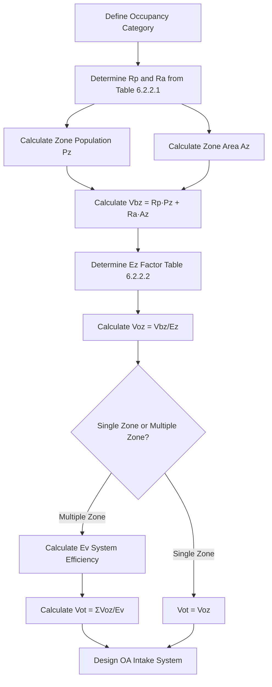
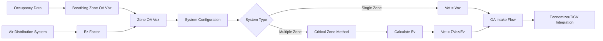

## Assembly Space Ventilation Requirements

ASHRAE Standard 62.1 classifies assembly spaces as high-occupancy-density environments requiring specific outdoor air (OA) ventilation rates to maintain acceptable indoor air quality. These spaces present unique challenges due to variable occupant loads, temporal usage patterns, and elevated metabolic CO₂ generation rates.

### ASHRAE 62.1 Assembly Categories

The standard defines assembly occupancies in Table 6.2.2.1 with prescribed minimum ventilation rates based on occupant density and floor area.

| Occupancy Category | People Component (Rp) | Area Component (Ra) | Default Occupant Density | Air Class |
|-------------------|----------------------|-------------------|------------------------|-----------|
| Auditorium seating area | 5 cfm/person | 0.06 cfm/ft² | 150 ft²/person | 1 |
| Place of religious worship | 5 cfm/person | 0.06 cfm/ft² | 120 ft²/person | 1 |
| Courtrooms | 5 cfm/person | 0.06 cfm/ft² | 60 ft²/person | 1 |
| Legislative chambers | 5 cfm/person | 0.06 cfm/ft² | 50 ft²/person | 1 |
| Libraries | 5 cfm/person | 0.12 cfm/ft² | 100 ft²/person | 1 |
| Lobbies/pre-function | 5 cfm/person | 0.06 cfm/ft² | 150 ft²/person | 1 |
| Theaters - performance | 5 cfm/person | 0.06 cfm/ft² | 150 ft²/person | 1 |
| Stages | 10 cfm/person | 0.06 cfm/ft² | 70 ft²/person | 2 |
| Sports arena seating | 7.5 cfm/person | 0.06 cfm/ft² | 150 ft²/person | 1 |
| Stadiums - spectator areas | 7.5 cfm/person | 0.06 cfm/ft² | 150 ft²/person | 1 |
| Standing spectator areas | 7.5 cfm/person | 0.06 cfm/ft² | 5 ft²/person | 1 |

### Ventilation Rate Procedure (VRP) Calculation

The breathing zone outdoor airflow requirement for assembly spaces follows the dual-component methodology established in Section 6.2.2.1.

$$V_{bz} = R_p \cdot P_z + R_a \cdot A_z$$

Where:
- $V_{bz}$ = breathing zone outdoor airflow (cfm)
- $R_p$ = outdoor air required per person (cfm/person)
- $P_z$ = zone population (number of people)
- $R_a$ = outdoor air required per unit area (cfm/ft²)
- $A_z$ = zone floor area (ft²)

For theater auditorium with 300 seats and 45,000 ft² floor area:

$$V_{bz} = (5 \text{ cfm/person} \times 300 \text{ people}) + (0.06 \text{ cfm/ft}^2 \times 45,000 \text{ ft}^2)$$

$$V_{bz} = 1,500 + 2,700 = 4,200 \text{ cfm}$$

### Zone Air Distribution Effectiveness (Ez)

The zone air distribution effectiveness factor accounts for incomplete mixing within the occupied zone. ASHRAE 62.1 Table 6.2.2.2 provides Ez values based on air distribution configuration.

For ceiling supply with floor return (typical assembly space configuration):

$$E_z = 1.0$$

For displacement ventilation with low-velocity supply:

$$E_z = 1.2$$

The zone outdoor airflow requirement incorporates Ez:

$$V_{oz} = \frac{V_{bz}}{E_z}$$

For the theater example with overhead supply:

$$V_{oz} = \frac{4,200}{1.0} = 4,200 \text{ cfm}$$

### System Ventilation Efficiency (Ev)

Multiple-zone systems require system-level efficiency calculations per Section 6.2.7. The critical zone method determines the minimum system outdoor air intake.

$$V_{ot} = \frac{\sum_{all\ zones} V_{oz}}{E_v}$$

Where $E_v$ represents system ventilation efficiency:

$$E_v = \frac{1 + X_s - Z_d}{1 + X_s - E_z \cdot Z_d}$$

System parameters:
- $X_s$ = uncorrected outdoor air fraction
- $Z_d$ = zone outdoor air fraction for critical zone
- $E_z$ = zone air distribution effectiveness

### High-Density Assembly Considerations

Assembly spaces with occupant densities exceeding 100 people per 1,000 ft² require additional analysis:

**Peak Load Management**
- Time-variable occupancy schedules demand responsive ventilation control
- CO₂-based demand control ventilation (DCV) optimizes OA delivery during partial occupancy
- Setback ventilation during unoccupied periods reduces conditioning energy

**System Capacity Requirements**
- Total system airflow must accommodate both ventilation and sensible/latent cooling loads
- Typical assembly space cooling loads: 400-600 cfm/ton
- Minimum OA often represents 30-50% of total system airflow at design occupancy

**Air Change Rate Verification**
Assembly spaces typically achieve 4-8 air changes per hour (ACH) at full occupancy:

$$\text{ACH} = \frac{V_{ot} \times 60}{V_{space}}$$

For 300-seat theater with 540,000 ft³ volume at 12-ft ceiling:

$$\text{ACH} = \frac{4,200 \times 60}{540,000} = 4.7 \text{ ACH}$$

### VRP Calculation Workflow

### System Efficiency Factors for Assembly Applications

Multiple-zone assembly facilities (convention centers, performing arts centers) require careful Ev analysis. The primary air fraction method applies when zones share common supply air distribution.

**Critical Zone Identification**
The zone requiring the highest outdoor air fraction determines system performance:

$$Z_{cz} = \frac{V_{oz}}{V_{dz}}$$

Where $V_{dz}$ is the discharge airflow to the zone.

For efficient system operation:
- Minimize diversity factor between zones
- Balance supply airflow distribution to match OA requirements
- Consider dedicated OA systems (DOAS) for high-density assembly zones

### Implementation Requirements

ASHRAE 62.1 Section 6.2.9 mandates documentation of ventilation design parameters:
- Design occupant density basis
- Outdoor air ventilation rates for each zone
- System ventilation efficiency calculations for multiple-zone systems
- Air distribution effectiveness assumptions
- Control system integration for variable occupancy

Assembly space ventilation systems must maintain minimum outdoor airflow under all operating conditions while avoiding over-ventilation penalties during reduced occupancy periods through properly implemented demand control strategies.
