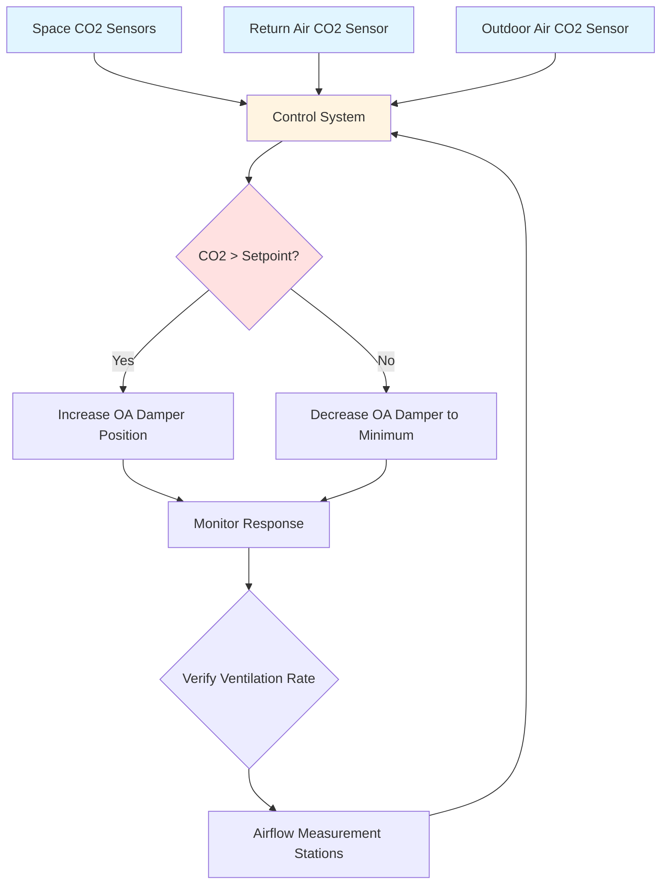
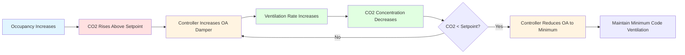

## CO2 as an Occupancy Proxy

Carbon dioxide concentration serves as a reliable surrogate for occupancy in high-density spaces. Human metabolic activity generates CO2 at predictable rates, making it an effective indicator for demand-controlled ventilation (DCV) strategies. ASHRAE 62.1 recognizes CO2-based DCV as an acceptable method for modulating outdoor air ventilation in spaces with variable and unpredictable occupancy.

The fundamental relationship between occupancy and CO2 generation derives from human respiration. An adult at rest produces approximately 0.3 CFH (cubic feet per hour) of CO2, while moderate activity levels increase this to 0.5-0.6 CFH per person. This metabolic generation rate forms the basis for calculating required ventilation rates.

## CO2 Generation Rate

The volumetric CO2 generation rate per person depends on metabolic activity level:

$$\dot{V}_{CO_2} = \frac{M \cdot RQ}{k}$$

Where:
- $\dot{V}_{CO_2}$ = CO2 generation rate (CFM)
- $M$ = metabolic rate (met)
- $RQ$ = respiratory quotient (typically 0.83)
- $k$ = conversion factor (21,600 for standard conditions)

For sedentary office work (1.2 met):

$$\dot{V}_{CO_2} = \frac{1.2 \times 0.83}{21,600} \times 1,000 = 0.0046\text{ CFM} = 0.28\text{ CFH}$$

The steady-state indoor CO2 concentration is calculated using mass balance:

$$C_i = C_o + \frac{N \cdot \dot{V}_{CO_2}}{\dot{Q}_{oa}}$$

Where:
- $C_i$ = indoor CO2 concentration (ppm)
- $C_o$ = outdoor CO2 concentration (typically 400-450 ppm)
- $N$ = number of occupants
- $\dot{Q}_{oa}$ = outdoor air ventilation rate (CFM)

## CO2 Monitoring System Architecture

## CO2 Sensor Placement Strategies

Proper sensor placement is critical for accurate occupancy detection and effective ventilation control.

**Space-Level Sensors:**
- Install at breathing zone height (3-6 feet above floor)
- Locate in representative areas of high occupancy
- Avoid placement near doors, operable windows, or supply air diffusers
- Position away from direct exposure to occupant exhalation (minimum 3 feet)
- Use multiple sensors in large spaces (>10,000 sq ft)

**Return Air Sensors:**
- Install in the return air ductwork or plenum
- Locate upstream of any recirculation dampers
- Provide well-mixed sampling point with adequate air velocity (>500 FPM)
- Consider sensor averaging when multiple return air paths exist

**Outdoor Air Sensors:**
- Position in outdoor air intake stream before mixing
- Protect from direct weather exposure while ensuring representative sampling
- Install at minimum 10 feet from exhaust discharge points

## CO2 Setpoints and Control Thresholds

| Application Type | CO2 Setpoint (ppm) | Outdoor Air Baseline (ppm) | Control Dead Band (ppm) |
|------------------|-------------------|---------------------------|------------------------|
| Office Spaces | 1000-1100 | 400-450 | ±50 |
| Conference Rooms | 1000-1200 | 400-450 | ±75 |
| Classrooms | 1000-1100 | 400-450 | ±50 |
| Lecture Halls | 1000-1200 | 400-450 | ±75 |
| Gymnasiums | 900-1000 | 400-450 | ±50 |
| Assembly Spaces | 1000-1200 | 400-450 | ±75 |

ASHRAE 62.1 does not mandate specific CO2 setpoints but requires that DCV systems maintain the prescribed ventilation rates. The common 1000-1200 ppm range provides sufficient margin above outdoor levels (typically 400-450 ppm) to allow effective control while maintaining acceptable indoor air quality.

## Control Strategies

**Proportional Control:**
The outdoor air damper position modulates proportionally based on CO2 differential:

$$D = D_{min} + \frac{(D_{max} - D_{min}) \cdot (C_{measured} - C_{setpoint})}{C_{max} - C_{setpoint}}$$

Where:
- $D$ = damper position (%)
- $D_{min}$ = minimum outdoor air damper position for code compliance
- $D_{max}$ = maximum damper position (typically 100%)
- $C_{measured}$ = current space CO2 concentration
- $C_{setpoint}$ = target CO2 concentration
- $C_{max}$ = maximum acceptable CO2 concentration (typically setpoint + 200 ppm)

**Multiple Sensor Averaging:**
When multiple space sensors are deployed:

$$C_{avg} = \frac{\sum_{i=1}^{n} C_i}{n}$$

Alternatively, use the maximum reading strategy where ventilation responds to the highest sensor reading to ensure adequate ventilation in all zones.

## Demand-Controlled Ventilation Implementation

**Control Sequence:**

1. **Initialize:** Establish outdoor air CO2 baseline during unoccupied periods
2. **Monitor:** Continuously measure space and return air CO2 concentrations
3. **Calculate:** Determine CO2 differential between space and outdoor air
4. **Modulate:** Adjust outdoor air damper position based on control algorithm
5. **Verify:** Confirm actual outdoor air delivery through airflow measurement
6. **Override:** Maintain code-minimum ventilation regardless of CO2 reading

## Sensor Technology and Maintenance

**NDIR Sensors:**
Non-dispersive infrared (NDIR) sensors represent the standard for HVAC CO2 monitoring. Key specifications include:

- Measurement range: 0-2000 ppm (minimum)
- Accuracy: ±50 ppm or ±5% of reading
- Response time: <2 minutes for 90% step change
- Auto-calibration capability for long-term stability
- Operating temperature range compatible with HVAC conditions

**Calibration Requirements:**
- Factory calibration valid for 5-7 years with auto-calibration enabled
- Field verification annually using calibrated reference gas (1000 ppm typical)
- Automatic background calibration (ABC) logic assumes periodic exposure to outdoor air
- Manual calibration required if ABC disabled or sensor relocated

## Ventilation Rate Verification

CO2-based control must verify that minimum outdoor air requirements per ASHRAE 62.1 are maintained:

$$\dot{V}_{ot} = R_p \cdot P_z + R_a \cdot A_z$$

Where:
- $\dot{V}_{ot}$ = outdoor air flow rate required (CFM)
- $R_p$ = outdoor air rate per person (CFM/person)
- $P_z$ = zone population
- $R_a$ = outdoor air rate per unit area (CFM/sq ft)
- $A_z$ = zone floor area (sq ft)

DCV systems reduce $R_p$ component dynamically but never below code-prescribed minimums. Airflow measurement stations must confirm actual outdoor air delivery matches calculated requirements.

## System Commissioning

Successful CO2 monitoring implementation requires comprehensive commissioning:

- Verify sensor accuracy at multiple concentration levels (outdoor air, 1000 ppm, 1500 ppm)
- Confirm proper sensor placement and sampling conditions
- Test control sequences through full occupancy range
- Validate minimum outdoor air delivery at low occupancy
- Document baseline outdoor air CO2 concentration for local conditions
- Train facility operators on system operation and sensor maintenance

Properly designed and commissioned CO2 monitoring systems deliver substantial energy savings in high-occupancy spaces while maintaining code-compliant ventilation and superior indoor air quality.
