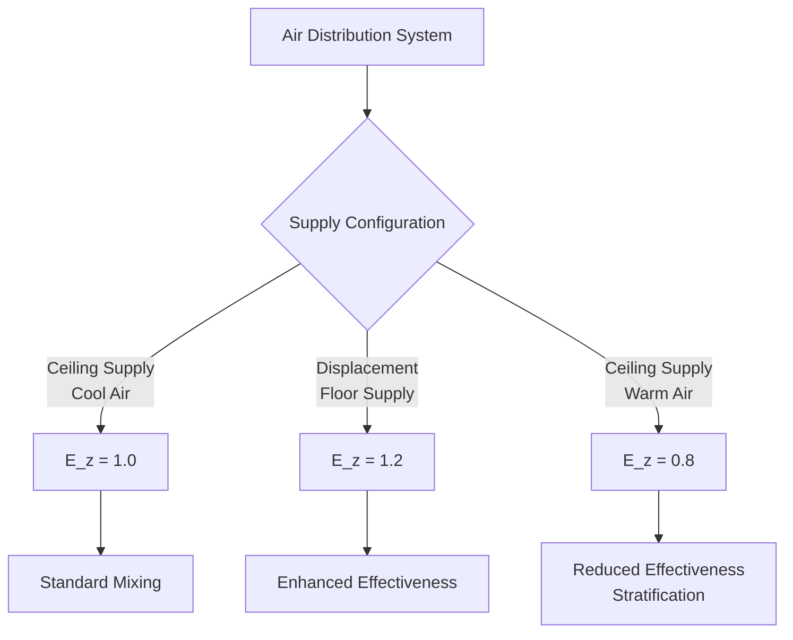
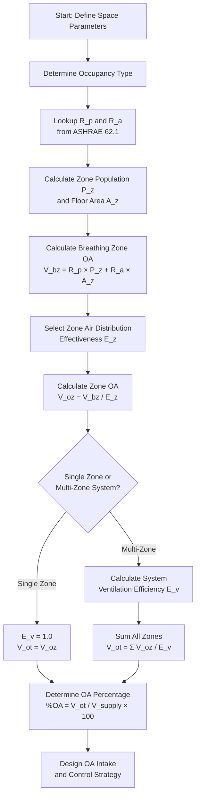

## Overview

Minimum ventilation rates establish the baseline outdoor air (OA) requirements for acceptable indoor air quality in occupied spaces. ASHRAE Standard 62.1 defines these requirements using the Ventilation Rate Procedure, which combines per-person rates and per-area rates to determine the breathing zone outdoor airflow.

The calculation methodology accounts for occupant density, space use, contaminant generation rates, and air distribution effectiveness to ensure adequate dilution of indoor air contaminants.

## Ventilation Rate Procedure

The breathing zone outdoor airflow represents the minimum OA required at the occupant breathing level before accounting for system losses and distribution inefficiencies.

### Breathing Zone Calculation

$$V_{bz} = R_p \cdot P_z + R_a \cdot A_z$$

Where:
- $V_{bz}$ = breathing zone outdoor airflow (cfm)
- $R_p$ = outdoor airflow rate required per person (cfm/person)
- $P_z$ = zone population (number of people)
- $R_a$ = outdoor airflow rate required per unit area (cfm/ft²)
- $A_z$ = zone floor area (ft²)

### Zone Outdoor Airflow

The zone outdoor airflow adjusts the breathing zone requirement for air distribution effectiveness:

$$V_{oz} = \frac{V_{bz}}{E_z}$$

Where:
- $V_{oz}$ = zone outdoor airflow (cfm)
- $E_z$ = zone air distribution effectiveness (typically 0.8 to 1.2)

## Minimum Ventilation Rates by Occupancy

ASHRAE 62.1 Table 6.2.2.1 specifies minimum ventilation rates for various occupancy categories. High-occupancy spaces require particular attention due to elevated metabolic CO₂ generation.

| Occupancy Category | $R_p$ (cfm/person) | $R_a$ (cfm/ft²) | Default Density (people/1000 ft²) |
|-------------------|-------------------|----------------|----------------------------------|
| Auditoriums | 5 | 0.06 | 150 |
| Places of religious worship | 5 | 0.06 | 120 |
| Theaters | 5 | 0.06 | 150 |
| Arenas (playing field) | 7.5 | 0.06 | 70 |
| Gymnasiums (playing floor) | 7.5 | 0.06 | 30 |
| Spectator seating | 7.5 | 0.06 | 150 |
| Stadiums (playing field) | 7.5 | 0.06 | 70 |
| Conference rooms | 5 | 0.06 | 50 |
| Lecture halls | 7.5 | 0.06 | 65 |
| Classrooms | 10 | 0.12 | 35 |

### Higher Rates for Active Occupancies

Spaces with elevated metabolic activity require increased ventilation rates to manage higher CO₂ production and thermal loads. Arenas, stadiums, and gymnasiums use 7.5 cfm/person compared to 5 cfm/person for sedentary assembly spaces.

## System Ventilation Efficiency

Multi-zone systems require correction for unequal distribution of outdoor air and varying zone loads. The system ventilation efficiency accounts for these factors:

$$V_{ot} = \frac{\sum_{all\ zones} V_{oz}}{E_v}$$

Where:
- $V_{ot}$ = outdoor air intake flow (cfm)
- $E_v$ = system ventilation efficiency (dimensionless, ≤ 1.0)

### Determining System Efficiency

For single-zone systems: $E_v = 1.0$

For 100% outdoor air systems: $E_v = 1.0$

For multi-zone recirculating systems:

$$E_v = \frac{1 + X_s - Z_d}{1 + X_s - Z_{d,max}}$$

Where:
- $X_s$ = uncorrected system outdoor air fraction
- $Z_d$ = zone outdoor air fraction for design
- $Z_{d,max}$ = maximum zone outdoor air fraction

## Outdoor Air Percentage Calculation

The outdoor air percentage determines the proportion of supply airflow that must be outdoor air:

$$\%OA = \frac{V_{ot}}{V_{supply}} \times 100$$

For a specific zone:

$$\%OA_{zone} = \frac{V_{oz}}{V_{supply,zone}} \times 100$$

### Minimum OA Fraction

At design cooling conditions, the minimum outdoor air fraction prevents excessive outdoor air intake:

$$X_{min} = \frac{V_{ot}}{V_{supply,total}}$$

This value establishes the economizer changeover point and minimum damper position.

## Ventilation Effectiveness Factor

The zone air distribution effectiveness ($E_z$) quantifies how efficiently delivered outdoor air reaches the breathing zone. Values depend on air distribution configuration and thermal stratification.

### Standard Effectiveness Values

| Air Distribution Type | $E_z$ Value | Application |
|----------------------|------------|-------------|
| Ceiling supply, cool air | 1.0 | Standard mixing ventilation |
| Displacement ventilation | 1.2 | Floor-level supply, thermal stratification |
| Ceiling supply, warm air | 0.8 | Heating mode, buoyancy reduces effectiveness |
| Under-floor supply | 1.0 | Properly designed systems |

## Calculation Workflow

## Design Example

Calculate minimum ventilation for a 10,000 ft² theater with 1,500 occupants:

**Given:**
- Theater occupancy: $R_p$ = 5 cfm/person, $R_a$ = 0.06 cfm/ft²
- $P_z$ = 1,500 people
- $A_z$ = 10,000 ft²
- $E_z$ = 1.0 (ceiling supply, cooling mode)
- Single-zone system: $E_v$ = 1.0

**Calculation:**

Breathing zone outdoor airflow:
$$V_{bz} = (5 \times 1,500) + (0.06 \times 10,000) = 7,500 + 600 = 8,100\ \text{cfm}$$

Zone outdoor airflow:
$$V_{oz} = \frac{8,100}{1.0} = 8,100\ \text{cfm}$$

Outdoor air intake:
$$V_{ot} = \frac{8,100}{1.0} = 8,100\ \text{cfm}$$

If supply airflow is 40,000 cfm:
$$\%OA = \frac{8,100}{40,000} \times 100 = 20.3\%$$

## Critical Considerations

**Demand-Controlled Ventilation (DCV):**
Spaces with variable occupancy may reduce outdoor air during periods of lower occupancy based on CO₂ sensing or occupancy counting. The area component ($R_a \cdot A_z$) remains constant regardless of occupancy.

**Economizer Integration:**
The minimum outdoor air requirement establishes the lower limit for economizer operation. Below this threshold, outdoor air intake cannot be reduced even when mechanical cooling is not required.

**High-Altitude Correction:**
Volumetric flow rates remain unchanged at altitude. The reduced air density results in proportionally reduced mass flow and oxygen delivery, but ASHRAE 62.1 rates are not adjusted for altitude.

**Dynamic Reset:**
Advanced control strategies may reset ventilation rates based on actual occupancy, but must never fall below the area-based minimum ($R_a \cdot A_z$).

## Compliance Verification

Verify minimum ventilation compliance through:

1. **Design calculations** documenting $V_{bz}$, $V_{oz}$, and $V_{ot}$ for each zone
2. **Airflow measurements** at outdoor air intake under minimum OA conditions
3. **Control sequence testing** verifying minimum damper positions maintain required flows
4. **CO₂ monitoring** confirming indoor concentrations remain below 1,100 ppm (700 ppm above outdoor ambient)

The minimum outdoor air intake must be maintained whenever spaces are occupied, regardless of thermal load conditions or economizer status.
