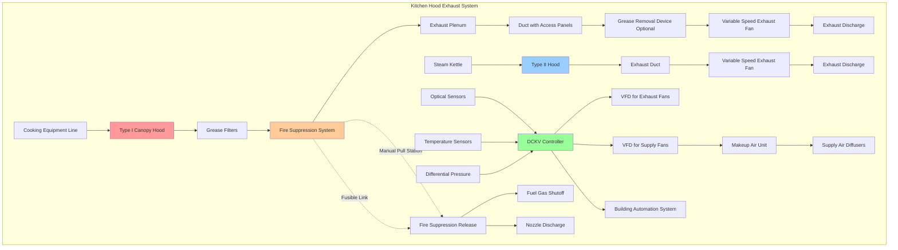

## Hood Classification

Commercial kitchen hood exhaust systems in hotel facilities require proper classification based on the cooking processes and effluent characteristics. Hood selection directly impacts fire safety, energy consumption, and indoor air quality.

**Type I Grease Hoods** are required for cooking equipment producing grease-laden vapors. These hoods incorporate listed grease filters, fire suppression systems, and grease collection devices. Type I hoods serve equipment such as ranges, fryers, griddles, broilers, and ovens operating above 400°F. The hood construction must meet UL 710 standards with 16-gauge stainless steel minimum and welded seams for structural integrity and cleanability.

**Type II Heat and Moisture Hoods** handle non-grease-laden effluent from dishwashers, steam kettles, pasta cookers, and low-temperature ovens. Type II hoods do not require grease filters or fire suppression systems but must effectively capture heat and moisture to prevent condensation and maintain kitchen comfort.

## Exhaust Rate Calculations

Exhaust flow rates depend on hood type, cooking equipment duty, and hood geometry. The primary calculation methodologies include equipment-based and area-based approaches.

For Type I hoods using the equipment-based method, exhaust rates are determined by cooking appliance type and duty classification:

$$Q_{exhaust} = \sum_{i=1}^{n} (L_i \times W_i \times CFM_i)$$

where $Q_{exhaust}$ is total exhaust flow rate (CFM), $L_i$ is appliance length (ft), $W_i$ is appliance width (ft), and $CFM_i$ is the specified CFM per square foot for appliance $i$.

For wall-mounted canopy hoods, an area-based calculation applies:

$$Q_{canopy} = A_{hood} \times V_{capture}$$

where $A_{hood}$ is the hood face area (ft²) and $V_{capture}$ is the capture velocity, typically 100-150 FPM for wall canopy hoods.

For island hoods requiring containment from all sides:

$$Q_{island} = P_{hood} \times H_{hood} \times V_{capture}$$

where $P_{hood}$ is hood perimeter (ft), $H_{hood}$ is vertical distance from cooking surface to hood (ft), and $V_{capture}$ is 150-200 FPM.

## Exhaust Rates by Cooking Equipment

| Equipment Type | Duty Classification | Exhaust Rate (CFM/ft²) | Hood Type |
|----------------|---------------------|------------------------|-----------|
| Charbroiler | Heavy | 300-400 | Type I |
| Underfired Broiler | Heavy | 400-500 | Type I |
| Ranges (open burner) | Medium | 200-250 | Type I |
| Griddle (flat) | Medium | 200-250 | Type I |
| Convection Oven | Light | 150-200 | Type I or II |
| Fryer (open deep fat) | Heavy | 250-300 | Type I |
| Salamander Broiler | Medium | 250-300 | Type I |
| Rotisserie | Medium | 250-300 | Type I |
| Conveyor Pizza Oven | Light | 200-250 | Type I |
| Steam Kettle | N/A | 100-150 | Type II |
| Compartment Steamer | N/A | 150-200 | Type II |
| Dishwasher | N/A | 75-100 | Type II |

## Demand Controlled Kitchen Ventilation

Demand controlled kitchen ventilation (DCKV) systems modulate exhaust and supply airflow based on actual cooking activity rather than operating at full capacity continuously. DCKV systems reduce energy consumption by 30-60% in typical hotel kitchen operations with variable cooking loads.

**Temperature-Based Controls** measure temperature at multiple points beneath the hood. As cooking activity increases, plume temperature rises, signaling the control system to increase exhaust and supply fan speeds. This method provides reliable operation but may not respond to smoke or steam without significant heat production.

**Optical Sensors** detect smoke opacity beneath the hood, providing direct measurement of effluent generation. Optical systems respond quickly to all cooking activities but require regular cleaning to maintain accuracy.

**Multi-Sensor Arrays** combine temperature, optical, and differential pressure inputs for optimal performance across diverse cooking scenarios. These systems provide the highest energy savings while maintaining capture and containment effectiveness.

DCKV systems must maintain minimum airflow rates per NFPA 96, typically 50-70% of design flow during idle periods to ensure adequate capture during startup and prevent grease accumulation in ductwork.

## Variable Speed Exhaust Fans

Variable speed exhaust fans enable DCKV operation and offer significant advantages over constant-volume systems. Fan power consumption varies with the cube of speed:

$$P_{fan} = P_{design} \times \left(\frac{CFM_{actual}}{CFM_{design}}\right)^3$$

Reducing exhaust flow to 50% design reduces fan power to 12.5% of design power, creating substantial energy savings in facilities operating extended hours.

Variable frequency drives (VFDs) controlling exhaust fans must coordinate with supply air fan VFDs to maintain proper pressurization relationships. Kitchen spaces should maintain -0.02 to -0.05 inches w.c. relative to adjacent dining areas to prevent odor migration while avoiding excessive negative pressure that compromises door operation.

## Fire Suppression Integration

Fire suppression systems for Type I hoods must comply with UL 300 standards for wet chemical suppression of cooking equipment fires. The suppression system integrates with the exhaust system through several critical interfaces:

**Automatic Fuel Shutoff** disconnects gas and electrical power to cooking equipment upon suppression system activation, preventing re-ignition.

**Exhaust Fan Shutdown** stops the exhaust fan during suppression discharge to prevent drawing suppressing agent away from the fire and to eliminate oxygen supply.

**Manual Pull Stations** located at kitchen exits enable manual activation at distances not exceeding 20 feet travel from any point in the kitchen.

**Fusible Links** provide automatic activation at temperatures indicating fire conditions, typically rated at 155°F to 360°F depending on location and normal operating temperatures.

**Suppression Nozzles** positioned in the hood plenum, duct, and over individual appliances ensure complete coverage of all grease-laden surfaces.

## Code Compliance

**NFPA 96** Standard for Ventilation Control and Fire Protection of Commercial Cooking Operations establishes minimum requirements for kitchen exhaust system design, installation, operation, and maintenance. Key provisions include:

- Exhaust duct clearances of 18 inches from combustible construction
- Exhaust duct construction from 16-gauge carbon steel minimum with continuously welded joints
- Grease duct cleaning frequencies based on cooking volume and grease production
- Makeup air provision to within 10% of exhaust airflow
- Hood overhang of 6 inches beyond cooking equipment on open sides

**UL 710** Standard for Exhaust Hoods for Commercial Cooking Equipment governs hood construction and testing. Listed hoods demonstrate adequate grease capture and structural integrity under fire conditions.

**IMC Chapter 5** establishes exhaust rate minimums, makeup air requirements, and duct construction standards. Local amendments may impose more stringent requirements, particularly for fire suppression system design and inspection frequencies.

Hotel kitchen designs must coordinate exhaust system compliance with fire alarm systems, ensuring suppression activation signals building fire alarm panels without initiating unnecessary evacuations during normal suppression events.
