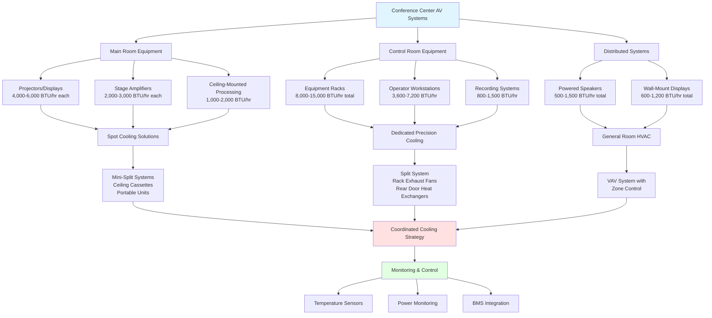

Audio-visual equipment in modern conference centers represents a substantial thermal load that demands careful HVAC coordination. High-power projectors, processing equipment, amplification systems, and control electronics generate concentrated heat that can compromise equipment reliability, shorten service life, and create uncomfortable conditions for operators. Effective thermal management requires understanding equipment-specific cooling requirements and implementing targeted strategies that complement the overall room conditioning system.

## Projector and Display Equipment Heat Generation

High-lumen projectors, particularly those rated above 5,000 lumens, generate significant heat through lamp operation or laser light source inefficiencies. A typical 10,000-lumen laser projector dissipates approximately 1,200-1,500 W as heat, with older lamp-based models generating even higher thermal loads.

The sensible heat load from projectors is calculated as:

$$Q_{\text{proj}} = P_{\text{rated}} \times \eta_{\text{heat}} \times 3.412$$

where $Q_{\text{proj}}$ is the heat load in BTU/hr, $P_{\text{rated}}$ is the rated power consumption in watts, and $\eta_{\text{heat}}$ is the fraction converted to heat (typically 0.85-0.95). For a 10,000-lumen projector drawing 1,400 W:

$$Q_{\text{proj}} = 1400 \times 0.90 \times 3.412 = 4,299 \text{ BTU/hr}$$

Large-format LED video walls generate lower heat per unit area than projection systems but still require consideration. A typical LED panel dissipates 150-250 W/m² at full brightness. Ceiling-mounted or recessed projectors benefit from dedicated exhaust provisions that remove heat directly from the mounting cavity before it enters the occupied space.

## Sound System and Amplifier Cooling Requirements

Professional audio amplifiers operate at 60-75% efficiency under typical loads, converting the remainder to waste heat. A 2,000 W amplifier operating at 70% efficiency generates:

$$Q_{\text{amp}} = P_{\text{amp}} \times (1 - \eta_{\text{amp}}) \times 3.412 = 2000 \times 0.30 \times 3.412 = 2,047 \text{ BTU/hr}$$

Equipment racks housing multiple amplifiers, signal processors, and network switches create concentrated heat loads ranging from 5,000-15,000 BTU/hr per rack. Rack-mounted equipment requires controlled inlet air temperature between 64-75°F for optimal reliability, with maximum inlet temperatures not exceeding 80°F.

Active loudspeakers with integrated amplification add distributed loads throughout the space. A typical powered loudspeaker dissipates 150-400 W depending on power rating and utilization.

## Control Room and Equipment Rack Cooling

Technical control rooms housing AV control systems, video switching equipment, and operator workstations require dedicated cooling separate from the main conference space. Control room thermal loads typically include:

| Equipment Type | Typical Heat Load | Quantity Factor |
|---------------|------------------|----------------|
| Video processor/switcher | 600-1,200 BTU/hr | 1-3 units |
| Audio DSP processor | 300-600 BTU/hr | 1-2 units |
| Control system processor | 200-400 BTU/hr | 1-2 units |
| Network switch (48-port) | 400-800 BTU/hr | 2-4 units |
| Recording/streaming equipment | 800-1,500 BTU/hr | 1-2 units |
| Operator workstations | 1,200-1,800 BTU/hr | 2-4 stations |

Control rooms should maintain 68-72°F with relative humidity between 40-50%. Dedicated split systems or precision cooling units provide better control than relying on the building HVAC system, particularly during extended events or when the main conference space operates at different setpoints.

Equipment racks require vertical airflow management with proper cable routing to prevent hot air recirculation. Blanking panels should fill unused rack spaces to maintain consistent front-to-back airflow. Rack-mounted fans or rear exhaust systems actively remove heat from enclosed cabinets.

## Spot Cooling for AV Equipment

Concentrated AV loads in specific locations often benefit from spot cooling solutions rather than oversizing the entire room's HVAC system. Ceiling-mounted cassette units positioned above projector locations or equipment areas provide targeted cooling without affecting overall room comfort.

Portable spot coolers (6,000-12,000 BTU/hr capacity) offer flexibility for temporary installations or events with variable equipment configurations. These units exhaust heat through flexible ducts routed to return air plenums or directly outdoors.

For permanent installations, mini-split systems dedicated to equipment areas allow independent temperature control. A typical approach uses one outdoor condensing unit serving multiple indoor evaporators positioned at equipment concentration points.

## Coordination with Lighting Loads

Conference center lighting systems contribute substantial heat, particularly with legacy incandescent and halogen fixtures. LED conversion reduces lighting heat loads by 60-75%, allowing reallocation of cooling capacity to AV equipment.

The total sensible heat load combines lighting and AV contributions:

$$Q_{\text{total}} = Q_{\text{lighting}} + Q_{\text{AV}} + Q_{\text{occupants}} + Q_{\text{envelope}}$$

Dimming systems reduce both lighting power and associated heat generation proportionally. During presentations with reduced lighting levels, the HVAC system should modulate cooling output to prevent overcooling while maintaining adequate AV equipment cooling.

Intelligent lighting control systems can communicate with building automation systems to optimize HVAC response to changing thermal loads throughout event cycles.

## Future-Proofing for Evolving Technology

Conference center AV systems evolve rapidly, requiring HVAC infrastructure that accommodates increasing power density. Design strategies include:

**Infrastructure capacity**: Size electrical and HVAC distribution systems for 125-150% of initial loads to accommodate future upgrades without major renovation.

**Modular cooling**: Deploy scalable cooling solutions with capacity to add zones or increase output as technology advances.

**Flexible ducting**: Install oversized duct infrastructure with capped branches positioned near likely equipment locations for easy future connections.

**Monitoring capability**: Integrate temperature and power monitoring at critical equipment locations to detect thermal issues before equipment failure.

**Network readiness**: Specify IoT-ready HVAC controls that can integrate with evolving building management and AV control protocols.

Emerging technologies like 8K projection, immersive audio systems, and extended reality equipment will increase thermal loads. Planning for 40-50% growth in AV equipment heat generation over 10-year facility lifecycles ensures adequate cooling capacity for technological advancement.

## AV Equipment Heat Generation Summary

| Equipment Category | Power Range (W) | Heat Generation (BTU/hr) | Cooling Strategy |
|-------------------|-----------------|-------------------------|------------------|
| Laser projector (5,000-10,000 lumens) | 800-1,500 | 2,700-5,100 | Spot cooling + exhaust |
| Lamp projector (5,000-10,000 lumens) | 1,200-2,000 | 4,000-6,800 | Dedicated exhaust |
| LED video wall (per m²) | 150-250 | 500-850 | Room HVAC |
| LCD/LED display (75-98") | 250-450 | 850-1,500 | Room HVAC |
| Power amplifier (2,000 W) | 400-800 | 1,400-2,700 | Rack cooling |
| Powered loudspeaker | 100-300 | 340-1,000 | Room HVAC |
| Video processor/switcher | 300-600 | 1,000-2,000 | Rack cooling |
| Audio DSP processor | 100-200 | 340-680 | Rack cooling |
| Network switch (48-port PoE) | 200-400 | 680-1,400 | Rack cooling |
| Control system processor | 80-150 | 270-500 | Rack cooling |
| Media server/playback | 400-800 | 1,400-2,700 | Rack cooling |
| Operator workstation | 350-550 | 1,200-1,900 | Room HVAC |

Effective thermal management of conference center AV equipment requires close coordination between AV designers, electrical engineers, and HVAC professionals during the design phase. Load calculations should account for simultaneous operation of all equipment at rated capacity, even if typical usage patterns suggest lower average loads. This conservative approach ensures equipment reliability during peak demand periods and extends the operational life of expensive AV investments.
