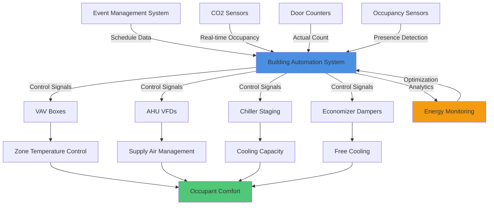

## Occupancy Variation Challenges

Conference centers present unique HVAC challenges due to extreme occupancy fluctuations. A ballroom may sit empty for hours, then accommodate 500 attendees within minutes. This rapid transition from minimal to maximum occupancy demands responsive, efficient systems capable of maintaining comfort across a 10:1 or greater occupancy range.

Traditional fixed-capacity systems sized for peak occupancy waste substantial energy during the 60-80% of operating hours when spaces are lightly occupied or vacant. Effective conference center HVAC design requires sophisticated controls, variable capacity equipment, and predictive strategies.

## Wide Occupancy Range Design

Conference spaces require systems designed for both extremes. The design occupancy range typically spans from 5% minimum (setup crew, A/V technicians) to 100% maximum (keynote sessions, banquets). This creates conflicting requirements:

**Peak Occupancy Requirements:**
- Ventilation rates of 5-7.5 cfm per person minimum
- Sensible cooling from occupants: 250 BTU/hr per person
- Latent cooling from occupants: 200 BTU/hr per person
- Rapid temperature recovery capability

**Minimum Occupancy Requirements:**
- Reduced outdoor air to maintain building pressurization
- Part-load efficiency down to 10-20% capacity
- Reduced air distribution to prevent overcooling and drafts
- Humidity control during low-load conditions

The total ventilation requirement varies dramatically:

$$V_{ot} = V_{bz} \times D = \left(\frac{R_p \times P_z}{E_z} + \frac{R_a \times A_z}{E_z}\right) \times D$$

Where $V_{ot}$ is total outdoor air, $R_p$ is per-person requirement (typically 5 cfm), $P_z$ is zone population, $R_a$ is area component, $A_z$ is zone area, $E_z$ is zone air distribution effectiveness, and $D$ is occupancy diversity factor (1.0 for conference spaces).

For a 10,000 sf ballroom:
- Vacant: 500 cfm (envelope loads only)
- 500 occupants: 2,500+ cfm outdoor air minimum

## CO2-Based Demand Controlled Ventilation

CO2 sensors provide real-time occupancy feedback, enabling ventilation rates to track actual conditions rather than design assumptions. Conference centers benefit significantly from DCV due to highly variable schedules.

**DCV Control Strategy:**

$$V_{oa} = V_{min} + \left(\frac{C_{space} - C_{outdoor}}{C_{target} - C_{outdoor}}\right) \times (V_{max} - V_{min})$$

Where $V_{oa}$ is outdoor air flow, $V_{min}$ is minimum outdoor air (typically 0.06 cfm/sf), $C_{space}$ is measured CO2, $C_{outdoor}$ is outdoor CO2 (typically 400 ppm), and $C_{target}$ is setpoint (typically 1000 ppm).

**Sensor Placement Considerations:**
- Multiple sensors in large spaces (minimum one per 10,000 sf)
- Return air locations avoiding direct exhaust plumes
- 4-6 feet above floor in occupied zone
- Averaging algorithms to prevent hunting from local variations

Properly implemented DCV in conference centers typically reduces ventilation energy by 40-60% compared to fixed outdoor air systems, with faster payback than most building types due to extreme occupancy variations.

## Rapid Response to Occupancy Changes

Conference events often begin with minimal warning. The HVAC system must detect occupancy changes and respond within 10-15 minutes to prevent comfort complaints during critical opening sessions.

**Response Strategies:**

1. **Fast-Acting Sensors:** Occupancy sensors or door counters trigger immediate response
2. **Variable Speed Fans:** Ramping from 20% to 100% within 2-3 minutes
3. **Staged Equipment:** Sequential start of multiple units rather than single large unit
4. **Thermal Mass Management:** Pre-cooling structure to buffer initial load spike

Air change rates must increase proportionally with occupancy. The required response time depends on space volume and turnover:

$$t_{response} = \frac{V_{space}}{Q_{supply}} \times N_{ach,required}$$

Where $t_{response}$ is time to achieve conditions, $V_{space}$ is room volume, $Q_{supply}$ is supply airflow, and $N_{ach,required}$ is air changes needed for recovery (typically 3-4).

Variable air volume systems with variable speed drives respond most effectively, achieving flow changes in seconds rather than the minutes required by inlet vane dampers or constant speed systems.

## Pre-Conditioning Before Events

Integration with event scheduling systems enables proactive pre-conditioning, eliminating complaints during event start while minimizing energy waste. The building management system receives event calendars and initiates HVAC ramp-up at calculated times.

**Pre-Conditioning Timeline:**

| Event Size | Pre-Condition Start | Temperature Recovery | Ventilation Start |
|------------|-------------------|---------------------|-------------------|
| Small (<50) | 30 min prior | 20 min prior | 15 min prior |
| Medium (50-200) | 60 min prior | 45 min prior | 30 min prior |
| Large (200-500) | 90 min prior | 60 min prior | 45 min prior |
| Very Large (>500) | 120 min prior | 90 min prior | 60 min prior |

Pre-cooling calculations account for thermal mass cooling and occupancy load removal:

$$Q_{precool} = (UA \times \Delta T) + (m_{thermal} \times c_p \times \Delta T_{structure})$$

Typical conference spaces require pulling down from 78°F (unoccupied setpoint) to 72°F (occupied setpoint) before events. Pre-conditioning during off-peak hours or cooler morning periods significantly reduces peak demand charges.

## Part-Load Efficiency Requirements

Conference centers operate at part-load 70-85% of annual hours. Equipment selection must prioritize part-load efficiency over peak efficiency.

**Part-Load Optimization Strategies:**

1. **Multiple Smaller Units:** Four 25-ton units outperform one 100-ton unit at part-load
2. **Variable Speed Compressors:** Maintain high efficiency down to 20-30% capacity
3. **Hot Gas Bypass Avoidance:** Wasteful at light loads; use digital scroll or VFD instead
4. **Economizer Integration:** Free cooling during shoulder seasons and morning setup
5. **Supply Fan Turndown:** Cubic relationship between flow and fan power yields dramatic savings

The integrated part-load value (IPLV) provides better performance indication than full-load EER for conference applications:

$$IPLV = 0.01A + 0.42B + 0.45C + 0.12D$$

Where A, B, C, D represent efficiency at 100%, 75%, 50%, and 25% capacity respectively. Conference centers should weight 50% and 25% performance even more heavily than standard IPLV calculations suggest.

Variable refrigerant flow (VRF) systems excel in conference applications, maintaining COP above 3.0 down to 20% load compared to conventional systems dropping to COP 2.0 or below.

## Occupancy Sensing and Scheduling Integration

Modern conference centers integrate multiple data sources to optimize HVAC response:

**Sensing Technologies:**
- **CO2 Sensors:** Primary occupancy indicator, 1000 ppm setpoint
- **Passive Infrared (PIR):** Motion detection for vacancy determination
- **Door Counters:** Direct occupancy measurement at entry points
- **Wi-Fi Analytics:** Smartphone counting for predictive occupancy
- **Seat Pressure Sensors:** High-accuracy count in tiered seating

**Scheduling Integration:**
- Event management system API integration
- Automatic setpoint and schedule updates
- Conflict resolution between scheduled and sensed occupancy
- Historical data analysis for improved predictive algorithms

## Occupancy Scenario HVAC Response

| Occupancy Level | Typical Schedule | OA Ventilation | Cooling Output | Supply Airflow | System Response |
|-----------------|------------------|----------------|----------------|----------------|-----------------|
| Vacant (0%) | Overnight, off-days | 500 cfm (min) | 0-5 tons | 2,000 cfm | Setback mode, minimal operation |
| Setup (5-10%) | 2-4 hrs pre-event | 750 cfm | 5-10 tons | 3,000 cfm | Pre-conditioning, temperature pull-down |
| Light (25%) | Breakout sessions | 1,500 cfm | 15-25 tons | 6,000 cfm | Reduced capacity, economizer priority |
| Moderate (50%) | Mid-size events | 2,500 cfm | 35-50 tons | 10,000 cfm | Standard operation, balanced mode |
| Heavy (75%) | Large conferences | 3,500 cfm | 60-75 tons | 14,000 cfm | High capacity, all equipment online |
| Peak (100%) | Keynotes, banquets | 5,000 cfm | 90-100 tons | 18,000 cfm | Maximum output, backup systems ready |

## System Architecture for Variable Occupancy

The optimal conference center HVAC architecture combines central plant efficiency with zone-level flexibility:

**Central Plant:**
- Multiple chillers with 25-40% individual capacity
- Variable primary flow with pressure-independent control valves
- Waterside economizer for shoulder season operation
- Thermal storage for peak shaving during major events

**Air-Side Distribution:**
- Dedicated outdoor air systems (DOAS) with energy recovery
- Variable air volume terminal boxes with DDC controls
- Pressure-independent VAV boxes preventing hunting
- Perimeter heating for vacant/setup periods

**Control Integration:**
- Predictive algorithms using historical occupancy patterns
- Real-time adjustment based on actual sensor feedback
- Automatic optimal start/stop calculations
- Demand response integration for utility incentive capture

This multi-layered approach ensures energy efficiency during the majority of operating hours while maintaining rapid response capability for the peak occupancy events that define conference center success.

## Performance Verification

Ongoing monitoring validates system performance across the occupancy spectrum:

- Energy use intensity normalized by occupancy-hours
- Complaint tracking correlated to occupancy transitions
- Equipment runtime and cycling frequency analysis
- Part-load efficiency verification through trend data
- Pre-conditioning effectiveness measured by recovery time

Conference centers implementing comprehensive occupancy-responsive HVAC systems typically achieve 30-50% energy savings compared to traditional fixed-capacity approaches while improving occupant comfort during the critical event periods that drive facility reputation and revenue.
