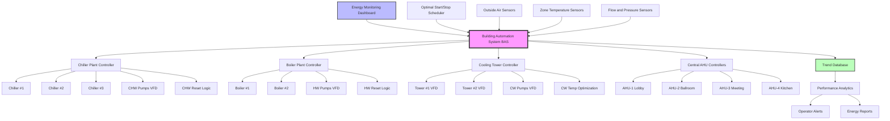

Central HVAC system control represents the highest level of energy management in hotel facilities, coordinating multiple equipment components to deliver conditioned air while minimizing operating costs. Modern building automation systems enable sophisticated optimization strategies that substantially reduce energy consumption compared to basic on/off control.

## Chiller Plant Optimization Strategies

Chiller plant optimization focuses on operating multiple chillers at their most efficient loading points while meeting the building's cooling demand. The coefficient of performance (COP) for a chiller varies with load:

$$\text{COP} = \frac{Q_{\text{cooling}}}{W_{\text{compressor}}}$$

where $Q_{\text{cooling}}$ represents cooling capacity (tons) and $W_{\text{compressor}}$ is compressor power input (kW).

**Sequencing strategies include:**

- **Optimal loading:** Distributing load across multiple chillers to maximize plant efficiency rather than running one chiller at high load
- **Chilled water reset:** Raising supply water temperature when cooling loads decrease, reducing compressor lift
- **Condenser water optimization:** Lowering condenser water temperature to improve chiller efficiency when ambient conditions permit

The relationship between chiller lift and efficiency:

$$\text{Power}_{\text{ratio}} = \frac{T_{\text{cond}} - T_{\text{evap}}}{T_{\text{evap,base}} - T_{\text{cond,base}}}$$

Reducing condenser water temperature by 5°F can improve chiller efficiency by 3-5% depending on chiller type and loading.

**Load allocation algorithms** calculate the most efficient combination of chillers to meet demand. For a two-chiller system, the control system evaluates total plant power at various loading combinations:

$$W_{\text{total}} = W_{\text{ch1}}(L_1) + W_{\text{ch2}}(L_2) + W_{\text{pumps}} + W_{\text{towers}}$$

where $L_1$ and $L_2$ represent individual chiller loads constrained by $L_1 + L_2 = L_{\text{total}}$.

## Boiler Plant Sequencing

Boiler sequencing manages multiple boilers to match heating demand while maximizing combustion efficiency. Condensing boilers achieve highest efficiency at lower return water temperatures:

$$\eta_{\text{boiler}} = \frac{Q_{\text{output}}}{Q_{\text{fuel}} \times \text{HHV}}$$

**Control strategies include:**

- **Lead-lag rotation:** Alternating which boiler serves as primary to equalize runtime and wear
- **Outdoor reset:** Modulating hot water supply temperature based on outdoor air temperature
- **Return temperature management:** Maintaining low return temperatures to enable condensing operation
- **Modulating burner control:** Operating boilers at partial fire rather than cycling on/off

The reset schedule relationship:

$$T_{\text{HWS}} = T_{\text{HWS,design}} - \left(\frac{T_{\text{OA}} - T_{\text{OA,design}}}{T_{\text{OA,balance}} - T_{\text{OA,design}}}\right) \times (T_{\text{HWS,design}} - T_{\text{HWS,min}})$$

## Cooling Tower Optimization

Cooling towers consume significant energy through fan operation but directly impact chiller efficiency. The optimization balance:

$$W_{\text{tower}} + W_{\text{chiller}}(T_{\text{cw}}) = \text{minimum}$$

**Control approaches:**

- **Variable speed fan control:** Modulating fan speed to maintain optimal condenser water temperature
- **Cell staging:** Operating minimum number of tower cells to meet load
- **Approach control:** Targeting specific approach to wet bulb temperature rather than fixed setpoint
- **Free cooling integration:** Utilizing tower water directly when outdoor conditions permit

The tower fan power relationship:

$$W_{\text{fan}} = W_{\text{design}} \times \left(\frac{\text{RPM}}{\text{RPM}_{\text{design}}}\right)^3$$

## Central Air Handling Unit Control

Central AHUs serving multiple zones require coordinated control of cooling coils, heating coils, and supply fans:

**Supply air temperature reset** adjusts based on zone demands:

$$T_{\text{SA}} = T_{\text{SA,min}} + (T_{\text{SA,max}} - T_{\text{SA,min}}) \times \left(1 - \frac{N_{\text{cooling}}}{N_{\text{total}}}\right)$$

where $N_{\text{cooling}}$ represents zones calling for cooling.

**Static pressure reset** reduces fan energy when zone dampers are not fully open:

$$SP_{\text{setpoint}} = SP_{\text{min}} + (SP_{\text{max}} - SP_{\text{min}}) \times \text{Max(Damper Positions)}$$

Fan energy savings follow the fan laws:

$$\frac{W_2}{W_1} = \left(\frac{\text{CFM}_2}{\text{CFM}_1}\right)^3$$

## Energy Monitoring and Trending

Continuous monitoring enables performance verification and fault detection:

- **Real-time dashboards:** Displaying current equipment efficiency, energy consumption, and operating costs
- **Historical trending:** Tracking performance over time to identify degradation
- **Benchmarking:** Comparing actual performance against design or baseline conditions
- **Alarm management:** Notifying operators of efficiency deviations

Key performance indicators include:

$$\text{kW/ton}_{\text{plant}} = \frac{W_{\text{chillers}} + W_{\text{pumps}} + W_{\text{towers}}}{Q_{\text{total}}}$$

$$\text{Boiler efficiency} = \frac{\text{BTU output}}{\text{BTU fuel input}} \times 100\%$$

## Optimal Start/Stop Programs

Optimal start/stop algorithms minimize runtime while ensuring occupied comfort:

$$t_{\text{start}} = t_{\text{occupied}} - K \times (T_{\text{setpoint}} - T_{\text{current}})$$

where $K$ represents the learned system response constant (minutes/°F).

The algorithm adapts based on:
- Building thermal mass
- Outdoor temperature
- System capacity
- Historical performance data

Energy savings from optimal start/stop typically range from 10-20% of HVAC energy consumption by eliminating unnecessary early starts and equipment operation during unoccupied periods.

## Control Strategies and Energy Savings

| Control Strategy | Typical Energy Savings | Implementation Complexity | Payback Period |
|-----------------|------------------------|---------------------------|----------------|
| Chiller plant optimization | 15-25% | High | 2-4 years |
| Chilled water reset | 5-10% | Medium | 1-2 years |
| Condenser water optimization | 8-12% | Medium | 1-3 years |
| Boiler sequencing | 10-15% | Medium | 2-3 years |
| Hot water reset | 8-12% | Low | <1 year |
| Cooling tower VFD control | 30-50% (tower fans) | Medium | 1-2 years |
| Supply air temperature reset | 10-20% (AHU fans) | Low | 1-2 years |
| Static pressure reset | 20-40% (AHU fans) | Medium | 1-2 years |
| Optimal start/stop | 10-20% | Low | <1 year |
| Demand-based ventilation | 15-25% | Medium | 2-3 years |

## Central Plant Control Architecture

## Integration and Communication

Modern central plant control relies on integrated communication protocols:

- **BACnet:** Industry-standard protocol for HVAC equipment communication
- **Modbus:** Common for variable frequency drives and metering equipment
- **LON:** Legacy protocol still present in many existing systems
- **OPC:** Enabling integration with energy management and analytics platforms

Successful implementation requires comprehensive points lists, network architecture planning, and cybersecurity measures to protect building control systems from unauthorized access.

## Performance Verification

Continuous commissioning validates that control sequences achieve intended savings:

1. **Baseline establishment:** Document pre-optimization energy consumption
2. **Implementation:** Deploy control strategies systematically
3. **Measurement:** Track post-implementation performance
4. **Adjustment:** Fine-tune control parameters based on actual building response
5. **Documentation:** Maintain records of setpoints, sequences, and performance

The normalized energy consumption metric accounts for weather variations:

$$\text{Energy}_{\text{normalized}} = \frac{\text{Energy}_{\text{actual}}}{\text{Degree Days}_{\text{actual}}} \times \text{Degree Days}_{\text{baseline}}$$

Central system control optimization represents the most cost-effective energy conservation measure in hotel facilities, typically delivering 20-35% total HVAC energy savings with 2-4 year payback periods through improved equipment efficiency and reduced runtime.
