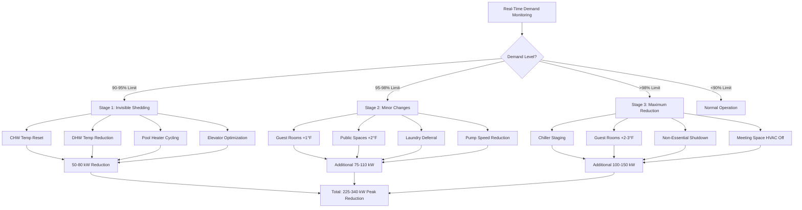

## Load Shedding Fundamentals for Hotels

Electrical demand charges represent 30-50% of hotel utility costs, creating substantial financial incentive for peak load reduction. Load shedding temporarily curtails non-critical electrical consumption during high-demand periods to limit peak billing demand and participate in utility demand response programs offering financial incentives.

Hotels present unique load shedding opportunities and constraints. Large concentrated loads (chillers, boilers, pumps) enable significant instantaneous demand reduction, while guest comfort requirements impose strict limits on acceptable curtailment strategies. Successful hotel load shedding balances aggressive energy reduction with imperceptible guest impact.

Peak demand occurs during hot summer afternoons (2-6 PM) when cooling loads, domestic hot water recovery from checkout cleaning, and laundry operations coincide. A 400-room hotel might experience peak electrical demand of 1,200-1,800 kW, with HVAC systems contributing 650-900 kW (54-60% of total).

Reducing peak demand from 1,500 kW to 1,350 kW (150 kW reduction) produces significant savings:

$$Savings_{annual} = \Delta P_{peak} \times Rate_{demand} \times 12 = 150 \text{ kW} \times \$18/\text{kW} \times 12 = \$32,400/\text{year}$$

Many hotels achieve 100-200 kW peak reduction through coordinated load shedding with payback periods under 2 years for required monitoring and control infrastructure.

## Demand Response Program Participation

Utility demand response programs compensate customers for voluntary load reduction during grid stress events, providing additional revenue beyond demand charge savings.

### Program Types and Compensation

**Capacity Programs**: Annual payments for committed load reduction capability regardless of activation frequency. Hotel agrees to shed minimum 100 kW within 30 minutes of utility notification. Typical compensation: $50-120 per kW-year of committed capacity.

For 150 kW commitment: Annual revenue = 150 kW × $80/kW = $12,000

Programs typically allow 10-15 events per summer, each lasting 2-4 hours. Penalties apply for non-performance during called events.

**Energy Payment Programs**: Compensation based on actual kWh reduced during events. Baseline load established from previous non-event days, measured reduction compensated at premium rate.

Event settlement calculation:

$$Payment = (Load_{baseline} - Load_{actual}) \times Duration \times Rate_{energy}$$

Hotel baseline load 1,400 kW, event load 1,250 kW, 3-hour event, $0.50/kWh rate:

$$Payment = (1400 - 1250) \times 3 \times \$0.50 = \$225$$

**Real-Time Pricing Response**: Hotels on real-time or time-of-use rates shed load when energy prices spike above economic threshold. Automated systems monitor price signals and initiate shedding when marginal energy cost exceeds shedding implementation cost.

### Automated Demand Response Integration

OpenADR (Automated Demand Response) protocols enable utility signals to trigger pre-programmed hotel load shedding sequences without manual intervention.

Integration architecture:

```
Utility DR Signal (OpenADR 2.0b)
    ↓
Hotel Gateway/Middleware
    ↓
Building Automation System
    ↓
Load Shedding Sequence Execution
```

OpenADR event levels map to hotel shedding stages:

- **Moderate (Level 1)**: Voluntary, minimal guest impact, 50-75 kW reduction
- **High (Level 2)**: Recommended participation, noticeable operational changes, 100-150 kW reduction
- **Special (Level 3)**: Emergency grid conditions, maximum feasible reduction, 150-250 kW reduction

Automated response reduces event notification-to-execution time from 15-30 minutes (manual) to 2-5 minutes (automated), maximizing compensation and grid support effectiveness.

## Load Shedding Priority Sequences

Structured priority sequences ensure load reduction begins with lowest-impact systems, escalating only if demand continues exceeding targets.

### Stage 1: Invisible Load Reduction (90-95% of Limit)

Initial shedding strategies imperceptible to guests and staff:

**Chilled Water Temperature Reset**: Increase chilled water supply temperature from 42°F to 44-45°F. Terminal equipment (air handlers, fan coils) compensate through increased flow or longer run times. Chiller power reduction:

$$\Delta P_{chiller} = P_{baseline} \times \left(1 - \frac{COP_{new}}{COP_{baseline}}\right)$$

For chiller operating at 5.5 COP (42°F CHW), increasing to 44°F improves COP to 5.8:

$$\Delta P = 400 \text{ kW} \times \left(1 - \frac{5.8}{5.5}\right) = -22 \text{ kW savings (increase)}$$

Temperature increase actually reduces chiller efficiency slightly, but enables chiller capacity reduction if loads permit staging down one machine.

**Condenser Water Temperature Increase**: Reduce cooling tower fan speed, allowing condenser water temperature to rise from 75°F to 80°F. Chiller efficiency decreases approximately 1.5% per °F increase, but tower fan power drops 40-60%:

Tower fan power reduction: 15 kW
Chiller power increase: 400 kW × 1.5% × 5°F = 30 kW
Net change: +15 kW demand (not beneficial for DR)

This strategy works better in reverse—tower fans already at minimum during low load, this option unavailable.

**Domestic Hot Water Temperature Reduction**: Lower storage tank setpoint from 140°F to 135°F. Delivered hot water temperature decreases minimally (120°F to 118°F), imperceptible to guests. Standby heat loss and recovery energy both decrease:

$$Q_{reduction} = m \times c_p \times \Delta T = 500 \text{ gal} \times 8.33 \text{ lb/gal} \times 1.0 \times 5°F = 20,825 \text{ Btu}$$

For electric water heater operating at 4,500W elements cycling 40% of time:
Power reduction: 4.5 kW × 40% × (135-120)/(140-120) = 1.35 kW per heater

**Elevator Regenerative Braking**: Modern elevator drives with regenerative braking can export power during descent. Dispatching algorithms prioritize down trips and group calls to maximize regeneration during peak periods. Typical savings: 5-12 kW for 4-elevator hotel installation.

**Pool and Spa Heater Cycling**: Defer pool heating during peak hours. Thermal mass of 50,000-gallon pool maintains temperature within 1-2°F during 4-hour shed period:

$$\Delta T = \frac{Q_{loss} \times t}{m \times c_p}$$

Pool heat loss 150,000 Btu/hr (covered pool), 4-hour shed period:

$$\Delta T = \frac{150,000 \times 4}{50,000 \times 8.33 \times 1.0} = 1.44°F$$

Electric pool heater power: 30-50 kW reduction

**Stage 1 Total Reduction**: 50-80 kW with zero guest impact

### Stage 2: Minor Operational Changes (95-98% of Limit)

Moderate shedding with minimal but potentially noticeable impacts:

**Occupied Guest Room Temperature Adjustment**: Increase cooling setpoint 1°F in all occupied rooms (vacant rooms already at setback). Average guest will not notice 1°F change, and individual thermostat control allows override if uncomfortable.

For 400-room hotel with 75% occupancy (300 occupied rooms), each PTAC consuming 1.2 kW at full cooling:

$$\Delta P = N_{rooms} \times P_{PTAC} \times Reduction_{factor}$$

Assuming 40% of rooms actively cooling and 1°F setpoint increase reduces runtime 15%:

$$\Delta P = 300 \times 0.40 \times 1.2 \times 0.15 = 21.6 \text{ kW}$$

**Public Space Temperature Relaxation**: Increase lobby, corridor, and meeting space cooling setpoints 2°F. Spaces transition from 72°F to 74°F over 15-20 minutes. Occupants acclimating from 95°F outdoor conditions generally do not perceive difference.

10 public space air handlers averaging 15 tons each, 50% loaded:
Power reduction: 10 × 15 × 0.5 × 1.0 kW/ton × 0.25 = 18.75 kW

**Kitchen and Laundry Demand Limiting**: Defer starting new laundry loads during peak period. Kitchen equipment (ovens, fryers) continues operation, but dishwashers delay start cycles until after peak period.

Laundry power: 25-40 kW reduction
Kitchen power: 8-15 kW reduction

**Secondary Pump Variable Speed Reduction**: Reduce chilled water and heating water distribution pump speeds to minimum acceptable differential pressure. Terminal units receive slightly reduced flow but adequate for 1-2°F setpoint increase.

Three secondary pumps, 20 HP each, operating at 75% speed/flow:
Current power: 3 × 20 × 0.75³ × 0.746 = 18.9 kW

Reducing to 65% speed:
Reduced power: 3 × 20 × 0.65³ × 0.746 = 11.6 kW
Savings: 7.3 kW

**Stage 2 Total Reduction**: 75-110 kW additional (cumulative 125-190 kW)

### Stage 3: Maximum Feasible Reduction (>98% of Limit)

Emergency shedding with noticeable guest and operational impacts, reserved for critical demand events:

**Chiller Staging**: If multiple chillers operating, stage off one unit entirely. Remaining chiller(s) operate at higher load factor (better efficiency) but cannot meet full cooling demand, causing gradual temperature rise.

For hotel with two 300-ton chillers, both running at 60% (360 tons total load):
Shutting down one chiller forces remaining unit to 100%+ capacity, unable to meet full load.

Space temperature increases 2-3°F over 90-minute period before second chiller restarts.

Power reduction: 300 tons × 0.60 × 0.9 kW/ton = 162 kW

**Full Guest Room Setpoint Increase**: Raise occupied room setpoints 2-3°F. More likely to generate guest complaints and thermostat overrides, reducing effectiveness.

Potential reduction: 40-60 kW (assuming 50% override rate)

**Non-Essential System Shutdown**: Disable all non-critical loads:
- Decorative lighting and water features: 5-10 kW
- Exterior building lighting (except emergency/exit): 8-15 kW
- Back-of-house HVAC (storage, mechanical rooms): 12-20 kW
- Meeting space HVAC (if unoccupied): 20-40 kW

**Stage 3 Total Reduction**: 200-300 kW cumulative (Stage 1 + 2 + 3)



## Pre-Cooling and Thermal Storage Strategies

Pre-cooling exploits building thermal mass to shift cooling production from peak to off-peak hours, reducing peak demand without installed thermal energy storage systems.

### Building Thermal Mass Pre-Cooling

Hotels contain substantial thermal mass in concrete structure, gypsum walls, furnishings, and finishes. Pre-cooling this mass during morning hours creates "stored cooling" that maintains comfortable conditions during afternoon peak with reduced or eliminated chiller operation.

**Pre-Cooling Strategy**:

6:00 AM - 11:00 AM (off-peak hours):
- Reduce cooling setpoints 2-3°F below normal (69-70°F vs. 72°F)
- Operate chillers at full capacity even if outdoor conditions mild
- Maximize air handler flow rates for rapid space cooling
- Goal: Reduce building mass temperature to 68-70°F

11:00 AM - 6:00 PM (peak period):
- Increase setpoints to 74-75°F
- Allow building temperature to drift upward using thermal mass
- Minimize or eliminate chiller operation
- Reduced air handler operation (lower fan power)

Effectiveness calculation for 100,000 ft² hotel with 8" concrete floors and masonry exterior:

Thermal mass = Volume × Density × Specific heat

Concrete: 100,000 ft² × (8/12) ft × 150 lb/ft³ × 0.20 Btu/lb-°F = 20,000,000 Btu/°F

Pre-cool from 72°F to 69°F: Stored energy = 20,000,000 × 3 = 60,000,000 Btu

During peak period, allowing drift from 69°F to 75°F:
Released energy = 20,000,000 × 6 = 120,000,000 Btu

Equivalent cooling over 6-hour period:

$$Q_{average} = \frac{120,000,000 \text{ Btu}}{6 \text{ hours}} = 20,000,000 \text{ Btu/hr} = 1,667 \text{ tons}$$

This represents stored cooling capacity supplementing or replacing chiller operation during peak. Actual performance depends on:

- Building envelope quality (lower loads = longer drift period)
- Occupancy level (guests generate 300-450 Btu/hr heat each)
- Outdoor temperature and solar gains
- Ventilation rates (outdoor air introduces heat load)

Conservative design achieves 40-60% peak load reduction for 3-4 hours before space temperatures exceed comfort thresholds.

### Dedicated Thermal Energy Storage

Ice storage and chilled water storage systems explicitly shift cooling production to off-peak hours, eliminating or drastically reducing peak-period chiller operation.

**Ice Storage Partial Storage Design**:

400-room hotel, 600-ton peak cooling load, 8-hour peak period (10 AM - 6 PM)

Strategy: Install 400-ton chiller + ice storage for 200-ton capacity

Nighttime charging (10 PM - 6 AM, 8 hours):
- Chiller produces ice at 15°F, capacity derated to 350 tons
- Energy stored: 350 tons × 8 hours = 2,800 ton-hours

Daytime operation (10 AM - 6 PM, 8 hours):
- Building load: 600 tons average × 8 hours = 4,800 ton-hours required
- Chiller operates at 400 tons: 400 × 8 = 3,200 ton-hours
- Ice storage discharges: 4,800 - 3,200 = 1,600 ton-hours
- Remaining stored capacity: 2,800 - 1,600 = 1,200 ton-hours (reserve)

Peak demand reduction: 600 tons (without storage) - 400 tons (with storage) = 200 tons

Electrical savings:

$$\Delta P = 200 \text{ tons} \times 0.85 \text{ kW/ton} = 170 \text{ kW}$$

Annual demand charge savings: 170 kW × $18/kW × 12 months = $36,720

Additional energy savings if utility offers time-of-use rates with off-peak discount.

**Chilled Water Storage**:

Stratified chilled water tanks provide simpler alternative to ice storage without phase-change complexity. Typical design: 50,000-100,000 gallon tank storing 42°F water, supplying 38°F water through thermal stratification.

Storage capacity calculation:

$$Q_{storage} = m \times c_p \times \Delta T = V \times \rho \times c_p \times \Delta T$$

For 75,000-gallon tank with 15°F temperature differential:

$$Q = 75,000 \text{ gal} \times 8.33 \text{ lb/gal} \times 1.0 \times 15 = 9,371,250 \text{ Btu} = 781 \text{ ton-hours}$$

Smaller capacity than ice storage (ice provides 144 Btu/lb latent heat vs. 15 Btu/lb sensible) but simpler operation and no glycol requirements.

## Guest Comfort Protection During DR Events

Maintaining acceptable comfort during load shedding events prevents guest complaints and protects hotel reputation.

### Comfort Threshold Management

Human thermal comfort depends on air temperature, humidity, air velocity, radiant temperature, activity level, and clothing. Hotels must maintain conditions within acceptable ranges despite load curtailment.

ASHRAE Standard 55 comfort zone for typical hotel occupancy:

- Temperature: 68-76°F (cooling season, light activity)
- Relative humidity: 30-60%
- Air velocity: <50 FPM (to avoid draft sensation)

Load shedding strategies maintain conditions within these boundaries:

**Temperature Drift Rates**: Gradual temperature changes (≤0.5°F per 15 minutes) remain imperceptible to most occupants. Rapid changes (>1°F per 15 minutes) create discomfort and complaints.

Acceptable drift during 4-hour DR event:
Maximum increase: 0.5°F per 15 min × 16 intervals = 8°F total

Starting from 72°F setpoint, space reaching 80°F exceeds comfort threshold. Limit actual drift to 3-4°F (75-76°F final temperature).

**Humidity Control Maintenance**: Reducing cooling capacity may compromise dehumidification, particularly in humid climates. Strategies:

- Maintain minimum air handler operation for dehumidification even if sensible cooling suspended
- Use desiccant dehumidification systems independent of cooling system
- Pre-dehumidify spaces during morning hours (reduce RH to 35-40% before DR event)

**Guest Override Authority**: Allow occupied room thermostats to override automated setpoint increases. Typical override rates: 15-25% of rooms during Stage 1 shedding, 35-50% during Stage 2.

Design shedding sequences assuming 30% override rate to ensure demand targets remain achievable despite guest intervention.

### Zone-Based Priority Protection

Protect critical guest areas while accepting wider temperature ranges in less sensitive spaces:

| Zone Type | Normal Setpoint | DR Setpoint | Max Acceptable | Priority |
|-----------|----------------|-------------|----------------|----------|
| Occupied guest rooms | 72°F | 73°F | 75°F | High |
| Lobby / reception | 72°F | 74°F | 76°F | High |
| Meeting rooms (occupied) | 72°F | 74°F | 77°F | Medium |
| Restaurant / bar | 71°F | 73°F | 75°F | High |
| Corridors | 74°F | 76°F | 80°F | Low |
| Back of house | 76°F | 78°F | 82°F | Low |
| Vacant guest rooms | 80°F | 82°F | 85°F | None |
| Storage / mechanical | 85°F | Off | 95°F | None |

Automated systems shed loads in reverse priority order: storage areas first, then back-of-house, corridors, public spaces, and guest rooms last.

### Guest Communication During Events

Proactive communication during severe DR events (Stage 3) minimizes complaints:

- Digital signage: "Participating in energy conservation program today 2-6 PM"
- Guest room TV welcome screens: Brief explanation of minor temperature adjustments
- Front desk staff briefing: Prepared responses to comfort inquiries
- Rapid response protocol: Maintenance staff prioritizes HVAC-related guest calls during events

Transparency about demand response participation often generates positive guest feedback regarding hotel's environmental commitment.

## Equipment Cycling Strategies

Rotating loads on/off in short cycles reduces average demand while maintaining some level of service to all areas.

### Duty Cycling Fundamentals

Duty cycling operates equipment at reduced runtime percentage by controlling on/off cycling:

$$Power_{average} = Power_{rated} \times DutyCycle_{percent}$$

Equipment operating at 60% duty cycle (on 6 minutes, off 4 minutes per 10-minute period):

$$P_{avg} = 100 \text{ kW} \times 0.60 = 60 \text{ kW average demand}$$

Effective for loads with thermal mass or storage providing buffer during off-cycles:

**Space Conditioning**: Air handling units cycle on/off while ductwork, building mass, and supply air in distribution system maintains temperature during off-cycle. Maximum 50% duty cycle to prevent comfort complaints.

**Domestic Hot Water**: Electric water heater elements cycle with storage tank providing hot water during off-periods. Can tolerate 25-40% duty cycle depending on simultaneous demand.

**Pool Heating**: Large water volume thermal mass enables 0-25% duty cycle (defer all heating during peak) with minimal temperature change.

**Refrigeration**: Walk-in coolers and freezers tolerate 60-80% cycling due to insulated envelope and product thermal mass.

### Group Rotating Sequences

Divide similar loads into multiple groups, cycling each group on different schedules to maintain partial operation:

Example: Hotel with 6 guest room air handler serving 60 rooms each (360 rooms total)

Group assignments:
- Group A: AHU-1 and AHU-2 (120 rooms)
- Group B: AHU-3 and AHU-4 (120 rooms)
- Group C: AHU-5 and AHU-6 (120 rooms)

15-minute rotating cycle:
- Minutes 0-5: Groups A and B on, Group C off (240 rooms served)
- Minutes 5-10: Groups A and C on, Group B off (240 rooms served)
- Minutes 10-15: Groups B and C on, Group A off (240 rooms served)

Average duty cycle: 66.7% (two of three groups operating continuously)

Total AHU power: 6 × 25 HP × 0.746 kW/HP = 112 kW
Average demand with cycling: 112 kW × 0.667 = 74.7 kW
Savings: 37.3 kW

Each guest room experiences 5 minutes of no air handler operation per 15-minute period. Room temperature drifts <0.5°F during off-cycle, unnoticeable to occupants.

### Cycling Control Logic

Modern building automation systems implement sophisticated cycling:

```
FOR each equipment group:
  IF (demand > threshold) AND (cycle_permitted):
    IF (time_on >= minimum_runtime):
      IF (space_temp < setpoint + offset):
        CONTINUE operation
      ELSE:
        TURN OFF equipment
        SET off_time = current_time
    END IF
  END IF

  IF equipment OFF:
    IF (time_off >= off_duration) OR (space_temp > setpoint + max_offset):
      TURN ON equipment
      SET on_time = current_time
    END IF
  END IF
END FOR
```

Key parameters:
- **minimum_runtime**: Prevents short-cycling damage (5-10 minutes typical)
- **off_duration**: Target off-cycle period (3-10 minutes)
- **max_offset**: Maximum temperature deviation before forcing restart (2-3°F)

Advanced algorithms adjust cycling based on outdoor temperature, occupancy, and current demand level.

## Automated vs Manual Load Shedding

Load shedding implementation ranges from fully manual (operator-initiated) to fully automated (system-initiated), with hybrid approaches common.

### Fully Automated Shedding

Building automation system continuously monitors electrical demand via pulse meters or BACnet integration with utility meter. When measured demand approaches limit, automated sequences initiate without human intervention.

**Advantages**:
- Immediate response (30-60 second detection-to-action)
- Consistent execution (no human error or delay)
- Optimal sequencing based on real-time conditions
- 24/7 operation (covers unexpected peaks)
- Data logging and performance verification

**Implementation Requirements**:
- Real-time demand monitoring (±2% accuracy, <15 second latency)
- BAS integration with all controlled equipment
- Robust control logic with safety interlocks
- Override capabilities for emergency situations
- Regular testing and validation

**Typical Control Sequence**:

```
CONTINUOUSLY:
  measure_demand = utility_meter.read_kW()
  demand_threshold = contract_demand × 0.95

  IF measure_demand > demand_threshold:
    shed_level = calculate_required_reduction()

    IF shed_level <= 75 kW:
      execute_stage_1()
    ELSE IF shed_level <= 150 kW:
      execute_stage_1()
      execute_stage_2()
    ELSE:
      execute_stage_1()
      execute_stage_2()
      execute_stage_3()
    END IF

    SET shed_active = TRUE
    LOG event_details()
  END IF

  IF shed_active AND (measure_demand < demand_threshold × 0.85):
    restore_normal_operation()
    SET shed_active = FALSE
    LOG event_completion()
  END IF
```

### Manual Operator-Initiated Shedding

Facility operators monitor demand and manually execute load reduction procedures when approaching limits.

**Advantages**:
- Operator judgment considers factors beyond demand (VIP guests, special events)
- Simpler implementation (no demand monitoring integration)
- Lower initial cost
- Easier to explain/justify to management

**Disadvantages**:
- Slower response (5-15 minutes detection-to-action)
- Requires 24/7 staffing or missed overnight/weekend peaks
- Inconsistent execution (varies by operator experience)
- No automated documentation

**Implementation**:
- Written procedures for each shedding stage
- Dedicated monitoring display showing real-time demand
- Checklist-based execution process
- Post-event reporting requirement

### Hybrid Approaches

Combine automated monitoring and alerts with manual execution approval:

1. BAS monitors demand continuously
2. When approaching threshold, system alerts operator via:
   - Audible alarm at operator workstation
   - Text message / email to on-call staff
   - Flashing graphic on BAS displays
3. Operator reviews conditions and initiates appropriate shedding stage
4. BAS executes selected sequence automatically
5. Operator monitors results and adjusts as needed

This approach provides automated detection speed with human judgment for execution decisions.

## Load Shedding Strategy Comparison

| System/Strategy | Demand Reduction | Guest Impact | Implementation Complexity | Response Time |
|-----------------|------------------|--------------|---------------------------|---------------|
| **CHW Temperature Reset** | 5-15 kW | None | Low | 5-10 min |
| **DHW Temperature Reduction** | 3-8 kW per heater | None | Low | Immediate |
| **Pool Heater Cycling** | 30-50 kW | None | Low | Immediate |
| **Guest Room +1°F** | 15-30 kW | Minimal | Medium | 10-15 min |
| **Public Space +2°F** | 15-25 kW | Minimal | Medium | 10-15 min |
| **Laundry Deferral** | 25-40 kW | Operational | Medium | Immediate |
| **Pump Speed Reduction** | 5-10 kW | None | Medium | 2-5 min |
| **Chiller Staging** | 100-200 kW | Moderate | High | 15-30 min |
| **Guest Room +2-3°F** | 30-50 kW | Moderate-High | High | 10-15 min |
| **Meeting Space Shutdown** | 20-40 kW | High (if occupied) | Low | Immediate |
| **Pre-Cooling** | 100-300 kW | None | High | 4-6 hours |
| **Thermal Storage** | 150-400 kW | None | Very High | Design phase |

## Performance Monitoring and Optimization

Continuous monitoring validates load shedding effectiveness and identifies improvement opportunities.

### Key Performance Indicators

**Peak Demand Reduction**: Compare monthly peak demand before and after load shedding implementation:

$$Reduction_{percent} = \frac{Peak_{baseline} - Peak_{current}}{Peak_{baseline}} \times 100$$

Baseline peak: 1,450 kW
Post-implementation peak: 1,290 kW
Reduction: (1,450 - 1,290) / 1,450 × 100 = 11.0%

**Demand Response Event Success Rate**: Percentage of DR events meeting committed load reduction:

$$Success_{rate} = \frac{Events_{successful}}{Events_{total}} \times 100$$

Season with 12 DR events, meeting commitment in 11:
Success rate = 11/12 × 100 = 91.7%

**Guest Complaint Correlation**: Track HVAC-related guest complaints during shedding events vs. normal operations. Acceptable increase: <5% complaint rate rise during events.

**Cost Savings Verification**:

$$Savings_{verified} = (\Delta Demand \times Rate_{demand} \times 12) + Revenue_{DR}$$

150 kW reduction, $18/kW demand charge, $8,000 annual DR revenue:
Savings = (150 × $18 × 12) + $8,000 = $40,400/year

### Continuous Improvement Process

1. **Baseline establishment**: Document pre-implementation peak demand patterns
2. **Strategy deployment**: Implement automated shedding sequences
3. **Performance measurement**: Track demand reduction and guest feedback
4. **Sequence refinement**: Adjust setpoints, durations, and priorities based on results
5. **Seasonal optimization**: Modify strategies for shoulder season vs. peak summer
6. **Annual review**: Evaluate financial performance and adjust participation levels

Regular testing (monthly during non-peak periods) ensures shedding sequences execute correctly when needed. Automated systems log all activations for performance analysis and utility program verification.

---

*Effective hotel load shedding integrates automated demand monitoring, structured priority sequences, guest comfort protection, and thermal storage strategies to achieve 100-200 kW peak reduction with minimal operational impact, delivering $25,000-50,000 annual savings and supporting grid reliability through demand response program participation.*
