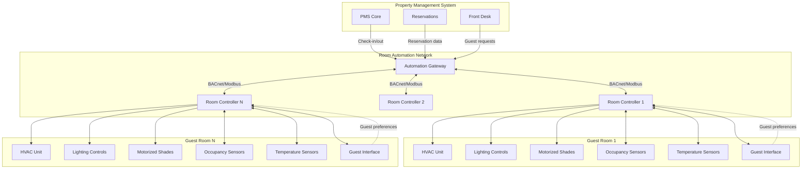

Guest room automation systems represent the convergence of HVAC control, lighting management, and motorized shading into unified platforms that optimize energy consumption while maintaining guest comfort. These integrated systems can reduce guest room energy usage by 20-45% compared to traditional standalone controls while enhancing the guest experience through personalized environmental control.

## System Integration Architecture

Modern guest room automation integrates multiple building systems through a central controller or gateway device that manages all environmental parameters.

### HVAC Integration Components

The HVAC integration layer connects room automation to climate control equipment:

- **Fancoil unit control**: Modulating valve position, fan speed selection (low/medium/high), and operational mode switching
- **PTAC/VRF interface**: Digital or analog communication with packaged terminal units or variable refrigerant flow indoor units
- **Temperature sensing**: Multiple sensor placement (wall-mounted, return air, ceiling) for accurate space temperature measurement
- **Occupancy detection**: PIR sensors, door contacts, and bed sensors for presence verification
- **Window/door monitoring**: Magnetic contacts that trigger HVAC setback when openings are detected

The system calculates room energy consumption based on operational parameters:

$$E_{room} = \int_0^t \left(Q_{cooling}(t) + Q_{heating}(t) + P_{fan}(t)\right) dt$$

where $Q_{cooling}$ and $Q_{heating}$ represent thermal loads and $P_{fan}$ is fan power consumption over time period $t$.

### Lighting and Shading Coordination

Automated lighting and motorized shading systems work in concert with HVAC to minimize overall energy consumption:

- **Occupancy-based lighting**: Automatic shutoff after room vacation with progressive dimming warnings
- **Daylight harvesting**: Photocell-based dimming of perimeter fixtures when natural light is sufficient
- **Motorized shades**: Automated deployment to reduce solar heat gain during peak cooling periods
- **Scene integration**: Coordinated positioning of shades and lighting levels for different activities

The solar heat gain reduction from automated shading can be quantified:

$$Q_{solar,reduced} = A_{window} \cdot SHGC \cdot I_{solar} \cdot (1 - \eta_{shade})$$

where $A_{window}$ is window area, $SHGC$ is solar heat gain coefficient, $I_{solar}$ is incident solar radiation, and $\eta_{shade}$ is shading effectiveness (typically 0.60-0.85 for automated systems).

## Guest Interface Design

The guest interface must balance functionality with intuitive operation, as guests spend minimal time learning control systems.

### Interface Modalities

**Tablet-based controls** mounted at bedside or entry provide graphical interfaces with temperature adjustment, lighting scenes, and shade positioning. Touch interfaces should use large buttons (minimum 44x44 pixels) and clear iconography.

**Mobile applications** allow guests to control room environments from smartphones, enabling pre-arrival conditioning and remote adjustment. Apps must function on both iOS and Android platforms with offline capability for critical functions.

**Voice control integration** with Amazon Alexa, Google Assistant, or proprietary hotel voice assistants enables hands-free operation. Voice commands should support natural language processing: "Set temperature to 70 degrees" or "Close the shades."

**Physical controls** remain essential as backup interfaces. Wall-mounted thermostats should override automated settings and provide immediate tactile feedback.

### Scene Programming for Energy Savings

Pre-programmed scenes optimize energy consumption while supporting guest activities:

| Scene Name | HVAC Setpoint | Lighting Level | Shade Position | Energy Reduction |
|------------|---------------|----------------|----------------|------------------|
| Checkout | 85°F cooling / 60°F heating | All off | 50% open | 45-60% |
| Vacant | 82°F cooling / 62°F heating | All off | Auto solar | 35-50% |
| Sleep | Guest temp - 2°F | 5% nightlight | Closed | 15-25% |
| Away | Guest temp ± 4°F | All off | Auto solar | 25-40% |
| Welcome | 72°F | Entry + ambient 75% | 30% open | Baseline |
| Occupied | Guest preference | Scene-based | Guest control | 5-15% |

The "Away" scene activates after 30-45 minutes of no motion detection, while "Checkout" triggers via PMS integration upon guest departure.

## Property Management System Integration

PMS integration enables automated scene transitions based on reservation and occupancy status:

- **Pre-arrival conditioning**: Room brought to comfort conditions 30-60 minutes before check-in
- **Checkout detection**: Immediate transition to vacant mode upon PMS checkout confirmation
- **Maintenance coordination**: HVAC and lighting remain active during housekeeping periods
- **VIP preferences**: Pre-loaded temperature and lighting settings for repeat guests

Communication protocols typically use BACnet IP, Modbus TCP, or proprietary APIs with RESTful interfaces for bidirectional data exchange.

## Guest Preference Learning Systems

Advanced automation platforms incorporate machine learning algorithms that adapt to individual guest behavior patterns.

### Learning Mechanisms

**Temperature preference tracking** records guest adjustments to initial setpoints and applies learned preferences to subsequent stays. The system calculates preferred temperature as:

$$T_{preferred} = T_{initial} + \frac{1}{n}\sum_{i=1}^{n}\Delta T_i$$

where $\Delta T_i$ represents each adjustment made during previous stays.

**Temporal pattern recognition** identifies when guests typically adjust conditions (morning wake-up, evening return) and proactively makes those changes.

**Scene usage analysis** tracks which lighting and shading scenes guests activate most frequently and adjusts default behaviors accordingly.

### Privacy and Security Considerations

Guest room automation systems must address significant privacy and data security concerns:

**Data collection transparency**: Hotels must clearly disclose what information automation systems collect (temperature preferences, occupancy patterns, room entry/exit times).

**Data retention policies**: Guest preference data should be anonymized or deleted after checkout unless guests explicitly opt into retention for future stays.

**Network segmentation**: Room automation networks must be isolated from guest WiFi and other hotel networks to prevent unauthorized access.

**Encryption requirements**: All communications between guest interfaces and controllers should use TLS 1.3 or equivalent encryption protocols.

**Camera and microphone policies**: If voice assistants are deployed, clear indication of when microphones are active and explicit opt-out mechanisms must be provided.

**Access logging**: All remote access to room controls by hotel staff should be logged with timestamps and personnel identification for audit purposes.

Physical security measures include tamper-evident enclosures for controllers and disabling of USB/ethernet ports accessible to guests on interface devices.

## Energy Impact Quantification

The cumulative energy savings from comprehensive room automation can be calculated as:

$$\Delta E_{annual} = N_{rooms} \times \left[\sum_{i=1}^{n}(E_{baseline,i} - E_{automated,i}) \times h_i\right] \times 365$$

where $N_{rooms}$ is total room count, $E_{baseline}$ and $E_{automated}$ are energy consumption rates for each operational mode, and $h_i$ represents hours per day in each mode.

For a 300-room hotel with properly configured automation, annual energy savings typically range from 800,000-1,400,000 kWh, representing utility cost reductions of $80,000-$180,000 at typical commercial electricity rates.

## Implementation Recommendations

Successful room automation deployment requires careful attention to commissioning, staff training, and ongoing optimization. Controllers must be programmed with appropriate deadbands (±2°F minimum) to prevent hunting, and occupancy sensor timeout values should be calibrated based on actual guest behavior patterns observed during pilot installations.

Integration testing with PMS systems should verify all state transitions before property-wide deployment, and fallback modes must be established for network or controller failures to ensure guest comfort is maintained even during system outages.
