## Fan Coil System Fundamentals

Fan coil units (FCUs) represent the predominant climate control solution for hotel guest rooms, offering individual room control, reasonable first cost, and operational flexibility. The system delivers conditioned air through a cabinet-mounted unit containing a fan, heating and cooling coils, and air filter, connected to central chilled water and hot water plants.

The fundamental advantage of FCU systems lies in their ability to provide simultaneous heating and cooling to different zones while maintaining individual guest control over temperature setpoints. This capability proves essential in hospitality applications where adjacent rooms may have vastly different thermal loads and occupancy patterns.

## Two-Pipe vs Four-Pipe System Configurations

The selection between two-pipe and four-pipe systems represents the most critical design decision for hotel fan coil installations.

**Two-Pipe Systems** utilize a single supply and return pair that alternates between hot water and chilled water seasonally. The central plant switches between heating and cooling modes based on outdoor temperature or calendar date. While offering lower installation cost, two-pipe systems cannot provide simultaneous heating and cooling, creating operational challenges during shoulder seasons when south-facing rooms require cooling while north-facing rooms need heating.

**Four-Pipe Systems** employ separate supply and return pairs for chilled water and hot water, enabling year-round availability of both heating and cooling at each fan coil unit. The significantly higher installation cost (approximately 40-60% more than two-pipe) is offset by superior guest comfort and operational flexibility.

### System Comparison

| Parameter | Two-Pipe System | Four-Pipe System |
|-----------|----------------|------------------|
| Piping Cost | Lower (baseline) | 40-60% higher |
| Simultaneous H/C | No | Yes |
| Guest Comfort | Good | Excellent |
| Shoulder Season Performance | Limited | Full capability |
| Typical Application | Budget/midscale hotels | Upscale/luxury hotels |
| Control Complexity | Simple | Moderate |
| Energy Efficiency | Good | Better (optimized loads) |
| Maintenance Access | Standard | More valve points |

## Fan Coil Unit Configurations

Fan coil units install in either vertical or horizontal orientations depending on architectural constraints and performance requirements.

**Vertical Fan Coil Units** mount beneath windows or along exterior walls, typically recessed into a cabinet or enclosure. The vertical configuration provides:

- Direct treatment of cold window surfaces, reducing downdrafts
- Convenient guest access to controls
- Compact floor space footprint
- Simplified condensate drainage (gravity flow)
- Easier filter maintenance

Standard vertical unit dimensions range from 24-30 inches wide, 30-42 inches high, and 10-14 inches deep, fitting within typical guest room furniture layouts.

**Horizontal Fan Coil Units** install above ceilings or within closet spaces, distributing air through ductwork. This configuration offers:

- Improved architectural aesthetics (concealed equipment)
- Reduced noise transmission to occupied space
- Greater flexibility in air distribution
- Potential for dedicated outdoor air integration

The horizontal arrangement requires more vertical clearance (minimum 18-24 inches) and creates condensate pumping requirements, adding complexity and maintenance points.

## Hydronic System Design

Coil sizing calculations determine required water flow rates and temperature differentials. The fundamental heat transfer equation:

$$Q = \dot{m} \cdot c_p \cdot \Delta T$$

where $Q$ represents the room load (Btu/hr), $\dot{m}$ is water mass flow rate (lb/hr), $c_p$ equals specific heat of water (1.0 Btu/lb-°F), and $\Delta T$ is the temperature difference across the coil (°F).

For a typical 400 ft² guest room with a cooling load of 9,000 Btu/hr and 10°F temperature differential:

$$\dot{m} = \frac{Q}{c_p \cdot \Delta T} = \frac{9000}{1.0 \times 10} = 900 \text{ lb/hr}$$

Converting to volumetric flow: $900 \text{ lb/hr} \div 500 \text{ lb/ft}^3 \times 60 \text{ min/hr} = 1.8 \text{ gpm}$

**Chilled Water Systems** typically operate at 42-45°F supply temperature with 10-12°F differential. Design considerations include:

- Minimum flow velocity of 2 fps to prevent air accumulation
- Maximum velocity of 4 fps to limit noise and erosion
- Balancing valves at each unit for flow regulation
- Two-way control valves for variable flow operation

**Hot Water Systems** commonly utilize 140-180°F supply temperatures with 20-30°F differentials. Higher temperature differentials reduce required flow rates and pipe sizes, but increase condensation risk on supply piping requiring more extensive insulation.

## Condensate Management

Proper condensate drainage proves critical for preventing water damage and microbial growth. During cooling operation, coils generate condensate at rates proportional to latent load:

$$\dot{m}_{condensate} = \frac{Q_{latent}}{h_{fg}}$$

where $Q_{latent}$ represents latent cooling load and $h_{fg}$ equals enthalpy of vaporization (approximately 1,050 Btu/lb at typical coil conditions).

For a guest room with 2,500 Btu/hr latent load: $\dot{m}_{condensate} = 2500/1050 = 2.4 \text{ lb/hr} = 0.29 \text{ gal/hr}$

**Drainage System Requirements:**

- Minimum 3/4-inch drain line diameter
- 1/8 inch per foot minimum slope for gravity drainage
- P-trap with minimum 2-inch seal depth to prevent airflow
- Cleanout access points every 50 feet
- Overflow protection with secondary drain or sensor
- Insulated drain piping in areas below dew point temperature

Horizontal fan coil units require condensate pumps rated for total dynamic head including vertical lift plus piping friction. Pumps must handle peak condensate generation with adequate reserve capacity (typically 150% of calculated peak).

## Acoustic Performance and Guest Comfort

Sound levels directly impact guest satisfaction and hotel ratings. Fan coil units generate noise from fan operation, airflow turbulence, and water flow through control valves.

Target sound levels for hotel guest rooms range from NC-25 to NC-30 (approximately 30-35 dBA), with luxury properties often specifying NC-25 or lower. Fan coil selection must consider sound power levels at all fan speeds:

- Low speed: NC-25 to NC-30 maximum
- Medium speed: NC-30 to NC-35 maximum
- High speed: NC-35 to NC-40 maximum

**Acoustic Control Strategies:**

- Specify fan coil units with sound-rated performance data
- Install vibration isolation pads beneath vertical units
- Use flexible piping connections to prevent structure-borne noise
- Select two-way control valves with characterized flow for quiet operation
- Provide adequate clearance around units to prevent air turbulence
- Limit air discharge velocity to 400-500 fpm at grilles
- Position units away from headboard walls when possible

## Filter Access and Maintenance

Maintenance accessibility directly affects system performance and operational costs. Guest room fan coil filters require monthly inspection and quarterly replacement under typical operating conditions.

**Filter Specifications:**

- MERV 7-8 rating for standard applications
- MERV 10-11 for enhanced indoor air quality
- 1-inch pleated disposable filters (most common)
- 2-inch filters for extended service intervals
- Magnetic filter frames for tool-free removal

Vertical fan coil units provide superior maintenance access through front-mounted panels or removable grilles. Design clearances must accommodate filter removal without furniture relocation (minimum 24 inches clear space).

Horizontal units require ceiling access panels positioned directly below filter locations, with adequate clearance for filter slide-out (typically 30 inches minimum). Coordinate access panel locations with architectural reflected ceiling plans to avoid conflicts with light fixtures, sprinkler heads, or other ceiling-mounted equipment.

**Maintenance Programming:**

- Establish filter replacement schedules based on occupancy patterns
- Monitor pressure drop across coils to detect fouling
- Inspect condensate pans quarterly for biological growth
- Verify control valve operation annually
- Clean coil surfaces every 2-3 years depending on environmental conditions

## System Configuration Diagram

```mermaid
graph TB
    subgraph "Four-Pipe Fan Coil System"
        A[Central Chiller Plant] -->|42°F Supply| B[CHW Supply Main]
        B --> C[Fan Coil Unit - Room 1]
        B --> D[Fan Coil Unit - Room 2]
        C -->|52°F Return| E[CHW Return Main]
        D -->|52°F Return| E
        E --> A

        F[Central Boiler Plant] -->|160°F Supply| G[HW Supply Main]
        G --> C
        G --> D
        C -->|140°F Return| H[HW Return Main]
        D -->|140°F Return| H
        H --> F

        C --> I[Condensate Drain - Room 1]
        D --> J[Condensate Drain - Room 2]
        I --> K[Building Drainage System]
        J --> K
    end

    subgraph "Fan Coil Unit Components"
        L[Return Air] --> M[Filter]
        M --> N[Cooling Coil]
        N --> O[Heating Coil]
        O --> P[Fan]
        P --> Q[Supply Air to Room]
        N -.->|Condensate| R[Drain Pan]
        R --> S[P-Trap]
        S --> T[Drain Line]
    end

    style A fill:#e1f5ff
    style F fill:#ffe1e1
    style C fill:#f0f0f0
    style D fill:#f0f0f0
```

Fan coil systems continue to dominate hotel guest room HVAC applications due to their proven reliability, guest control capabilities, and reasonable lifecycle costs. Proper system selection, installation, and maintenance ensure optimal thermal comfort while minimizing acoustic disturbances and operational expenses.
