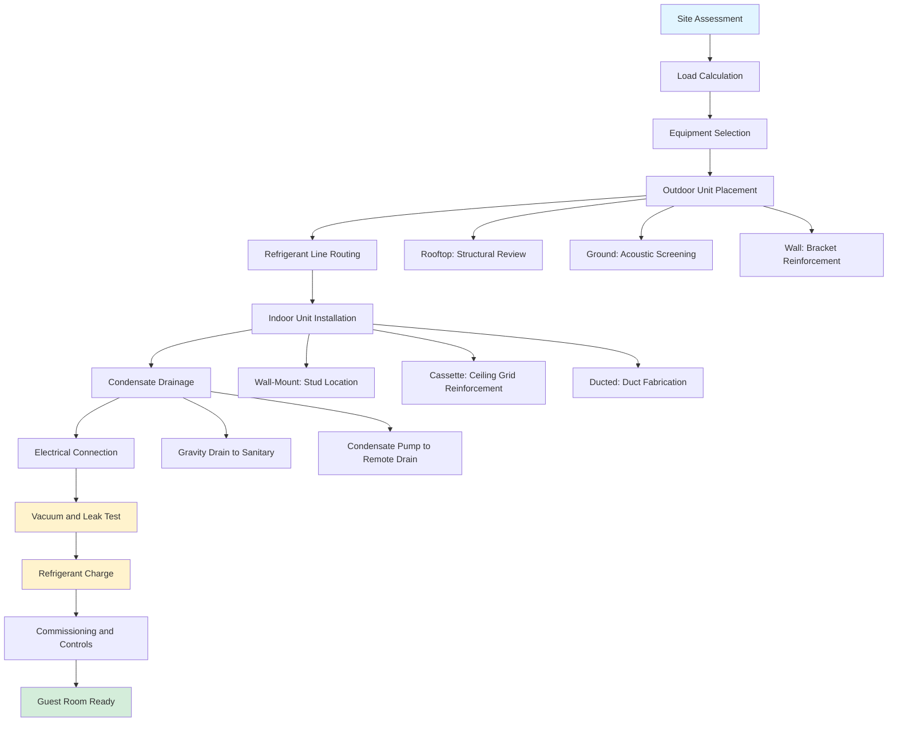

## Overview of Mini-Split Systems in Hospitality

Mini-split systems provide flexible, energy-efficient climate control for hotel guest rooms, particularly advantageous during renovations and in facilities where central duct distribution is impractical. These systems consist of outdoor condensing units connected to indoor air handlers via refrigerant lines, offering both ductless and ducted configurations to suit various architectural constraints.

The primary appeal for hotel applications lies in individual room control, reduced installation complexity compared to traditional ducted systems, and the ability to implement zoned comfort without major structural modifications.

## Ductless vs. Ducted Mini-Split Options

**Ductless Mini-Split Systems** mount wall-hung, ceiling-cassette, or floor-standing indoor units directly in guest rooms. These eliminate ductwork entirely, making them ideal for:

- Historic building conversions where ceiling space is limited
- Boutique hotels with unique architectural features
- Renovation projects minimizing guest disruption
- Properties with inadequate vertical shaft space

**Ducted Mini-Split Systems** connect to short-run ductwork concealed above ceilings or in soffits, providing:

- Flush ceiling grilles for aesthetic integration
- Multiple supply points in larger rooms
- Better dehumidification through longer air contact with coils
- Reduced wall-mounted equipment visibility

Cooling capacity for typical guest rooms ranges from 9,000 to 18,000 BTU/hr, with heating capacities varying by compressor technology and outdoor temperature conditions.

## Advantages for Hotel Renovations

Mini-split systems excel in renovation scenarios:

**Installation Flexibility**: Refrigerant line sets (typically 1/4" liquid and 3/8" to 1/2" suction lines) require only 3-inch penetrations through walls, compared to 12-24 inch duct shafts for conventional systems. This preserves structural integrity and minimizes construction disruption.

**Phased Implementation**: Hotels can upgrade room-by-room or floor-by-floor without shutting down entire wings, maintaining revenue during renovations.

**Energy Recovery**: Replacing aging PTAC units with inverter-driven mini-splits can reduce energy consumption by 30-50% through:

- Variable capacity compressor operation matching load
- Elimination of outdoor air infiltration around wall sleeves
- Higher SEER ratings (18-30 vs. 8-12 for PTACs)

**Reduced Noise**: Modern mini-split indoor units operate at 19-35 dBA, significantly quieter than PTAC units (40-50 dBA), enhancing guest comfort.

## Multi-Zone Configurations for Suites

Suite accommodations benefit from multi-zone mini-split systems connecting multiple indoor units (2-8 zones) to a single outdoor condensing unit. The outdoor unit capacity must satisfy:

$$Q_{outdoor} = \sum_{i=1}^{n} Q_{indoor,i} \times CF$$

where $Q_{outdoor}$ is outdoor unit capacity, $Q_{indoor,i}$ is each indoor unit's capacity, and $CF$ is the connection factor (typically 1.0-1.3 depending on manufacturer and simultaneous operation assumptions).

**Zone Distribution Example** for a two-bedroom suite:

- Living room: 12,000 BTU/hr ceiling cassette
- Master bedroom: 9,000 BTU/hr wall-mounted unit
- Second bedroom: 9,000 BTU/hr wall-mounted unit
- Outdoor unit: 36,000 BTU/hr (connection factor 1.2)

Each zone maintains independent temperature control, accommodating varying occupancy patterns and guest preferences.

## Condensate Management Requirements

Proper condensate drainage is critical for reliable operation:

**Gravity Drainage**: Indoor units require minimum 1/4 inch per foot slope on condensate lines to drain points. In multi-story installations, vertical risers terminate at floor drains or connection to sanitary systems.

**Condensate Pump Systems**: Where gravity drainage is impossible, integral or auxiliary condensate pumps lift water to remote drain points. Pumps must handle peak condensate production:

$$\dot{m}_{condensate} = \frac{Q_{latent}}{h_{fg}}$$

where $\dot{m}_{condensate}$ is condensate mass flow rate (lb/hr), $Q_{latent}$ is latent cooling capacity (BTU/hr), and $h_{fg}$ is latent heat of vaporization (approximately 1,050 BTU/lb at standard conditions).

For a 12,000 BTU/hr unit with 30% latent capacity: $\dot{m}_{condensate} = \frac{3,600}{1,050} = 3.4$ lb/hr (approximately 0.4 gallons/hr).

**Condensate Line Sizing**: Minimum 3/4-inch ID tubing prevents airlock and ensures positive drainage. Lines must be insulated where routed through conditioned spaces to prevent secondary condensation.

**Overflow Protection**: Secondary drain pans with independent drainage or overflow switches prevent water damage from primary drain blockages—essential for ceiling-mounted cassettes above guest rooms.

## Outdoor Unit Placement Considerations

Outdoor condensing unit location significantly impacts system performance, aesthetics, and maintenance:

**Rooftop Placement**: Common for multi-story hotels, requiring:

- Structural evaluation for equipment weight and vibration
- Refrigerant line length limitations (typically 150-200 ft maximum)
- Vertical rise considerations affecting compressor oil return
- Acoustic barriers if near penthouse suites or rooftop amenities

**Ground-Level Placement**: Suitable for low-rise properties:

- Sound attenuation screens maintaining minimum 3-ft clearance for airflow
- Security fencing preventing vandalism or tampering
- Elevated platforms in flood-prone areas (minimum 12 inches above base flood elevation)
- Landscaping integration while maintaining service access

**Exterior Wall Mounting**: Used in limited applications:

- Reinforced brackets capable of supporting 100-300 lb units plus snow/ice loads
- Vibration isolation pads reducing structure-borne transmission
- Clearance from operable windows (minimum 10 ft) and air intakes (20 ft)
- Aesthetic screening compatible with building facade

**Line Length and Elevation Constraints**: Refrigerant circuit performance degrades beyond manufacturer-specified limits. For elevation differences exceeding 50 ft, oil traps every 30-40 ft of vertical rise ensure proper compressor lubrication.

## Maintenance Access and Servicing

Accessible design facilitates routine maintenance and emergency service:

**Indoor Unit Service Clearances**: Maintain 12-inch minimum clearance above ceiling cassettes for filter access, 6 inches on sides for electrical disconnects, and full front panel swing clearance for coil cleaning.

**Filter Maintenance**: Establish 2-4 week filter cleaning schedules based on occupancy and local air quality. Washable mesh filters reduce operating costs compared to disposable media.

**Refrigerant Service Ports**: Locate outdoor units with adequate clearance (36 inches on service side) for gauge manifold connection, refrigerant recovery, and compressor replacement if needed.

**Access During Guest Occupancy**: Schedule preventive maintenance during low-occupancy periods. Wall-mounted units allow quick filter service without displacing guests; ceiling cassettes may require room vacancy during extended coil cleaning.

**Remote Monitoring Integration**: Connect mini-split systems to building management systems (BMS) via BACnet, Modbus, or proprietary protocols, enabling:

- Fault detection and diagnostics reducing service response time
- Energy monitoring and demand limiting during peak periods
- Occupancy-based setback automation when rooms are vacant
- Predictive maintenance scheduling based on runtime hours

## Mini-Split Configuration Comparison

| Configuration | Indoor Unit Type | Typical Capacity | Applications | Advantages | Limitations |
|--------------|------------------|------------------|--------------|------------|-------------|
| **Single-Zone Ductless** | Wall-mounted | 9,000-18,000 BTU/hr | Standard guest rooms | Lowest cost, simple installation | Visible equipment, direct airflow |
| **Single-Zone Ducted** | Concealed duct | 9,000-24,000 BTU/hr | Rooms requiring aesthetic integration | Flush grilles, distributed air | Higher installation cost, requires ceiling space |
| **Single-Zone Cassette** | Ceiling cassette | 9,000-24,000 BTU/hr | Rooms with adequate ceiling height | 360° airflow, even distribution | Requires 12-inch plenum depth |
| **Multi-Zone (2-4 zones)** | Mixed types | 18,000-48,000 BTU/hr total | Junior suites, multi-room units | Independent zone control, single outdoor unit | Complex refrigerant piping |
| **Multi-Zone (5-8 zones)** | Mixed types | 48,000-96,000 BTU/hr total | Large suites, boutique hotel floors | Maximum flexibility, centralized equipment | Outdoor unit size, advanced controls |

## Installation Workflow

## Design Considerations Summary

Successful mini-split implementation in hotels requires balancing performance, aesthetics, and operational efficiency. Key design priorities include:

1. **Right-sizing equipment** to avoid short-cycling and humidity control issues
2. **Minimizing refrigerant line lengths** to maintain efficiency and oil return
3. **Ensuring positive condensate drainage** with backup overflow protection
4. **Locating outdoor units** for serviceability while minimizing noise transmission
5. **Integrating controls** for energy management and guest comfort

When properly designed and maintained, mini-split systems deliver superior comfort, energy performance, and operational flexibility compared to traditional PTAC units or central systems in hotel applications.
