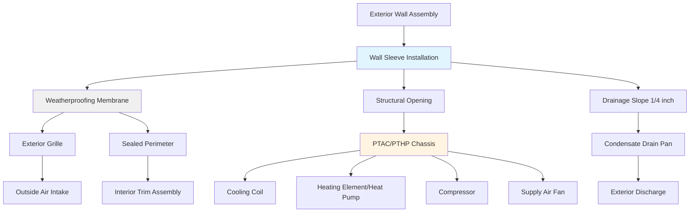

## PTAC and PTHP Unit Types and Capabilities

Packaged Terminal Air Conditioners (PTAC) and Packaged Terminal Heat Pumps (PTHP) represent the most widely deployed climate control systems in the hospitality industry. These self-contained units integrate all refrigeration components into a single chassis installed through an exterior wall.

**PTAC units** provide cooling and either electric resistance or no heating capability. Standard capacities range from 7,000 to 15,000 BTU/hr, with 9,000 and 12,000 BTU/hr being most common for typical guest rooms. The cooling capacity required can be estimated using:

$$Q_{cooling} = Q_{sensible} + Q_{latent} = (1.08 \times CFM \times \Delta T) + (0.68 \times CFM \times \Delta W)$$

where $\Delta T$ is the temperature difference (°F) and $\Delta W$ is the humidity ratio difference (grains/lb).

**PTHP units** utilize reverse-cycle refrigeration for both cooling and heating modes, offering superior heating efficiency compared to electric resistance. Heat pump operation becomes less effective below approximately 35°F outdoor temperature, at which point supplemental electric resistance heating engages automatically.

Modern units feature digital controls with programmable thermostats, occupancy sensors for setback operation, and various ventilation modes. Premium models include:

- Variable-speed compressors for improved comfort and efficiency
- Heat recovery ventilators for fresh air introduction with energy recovery
- Integrated air purification systems
- Remote monitoring capabilities for facility management

## Wall Sleeve Installation Requirements

The wall sleeve serves as the permanent structural component that houses the PTAC/PTHP chassis. Proper installation requires careful attention to building envelope integrity.

**Sleeve placement** must account for structural considerations, with the bottom of the sleeve typically 12-18 inches above finished floor to allow for furniture placement while maintaining accessibility for maintenance. Sleeves must not penetrate structural elements without engineering approval.

**Weatherproofing** is critical to prevent water infiltration and air leakage. The installation sequence includes:

1. Rough opening sized 1/2 inch larger than sleeve dimensions
2. Application of self-adhered waterproofing membrane at opening perimeter
3. Sleeve insertion with continuous bead of sealant at wall interface
4. Exterior grille secured with sealed fastener penetrations
5. Interior trim installation with gasket seal to wall finish

**Sleeve pitch** must slope 1/4 inch toward the exterior to ensure condensate drainage. Improper pitch causes water accumulation inside the unit, leading to corrosion and microbial growth.

**Electrical considerations** require dedicated 208-230V circuits, typically 20A for units up to 12,000 BTU/hr and 30A for larger capacities. Receptacles must be located to allow complete chassis removal without disconnecting power during maintenance.

## Sound Ratings and Guest Comfort

Acoustic performance directly impacts guest satisfaction and is a critical selection criterion. PTAC/PTHP noise originates from compressor operation, fan motor, and airflow turbulence.

**Sound levels** are rated in two conditions:
- **Operating sound** (compressor running): 45-55 dBA typical, with premium units achieving 42-48 dBA
- **Fan-only mode**: 38-45 dBA typical

Guest rooms should target maximum sound levels of 40-45 dBA for mid-tier properties and 35-40 dBA for upscale hotels. Units rated above 50 dBA generate frequent guest complaints.

**Noise reduction strategies** include:
- Compressor isolation mounting to minimize vibration transmission
- Acoustic insulation within the unit cabinet
- Swept fan blade designs to reduce air turbulence
- Variable-speed operation avoiding high-noise full-capacity modes

## Energy Efficiency Standards

The U.S. Department of Energy establishes minimum efficiency standards for PTAC and PTHP equipment under 10 CFR Part 431. Current standards implemented in 2022 represent significant improvements over previous requirements.

| Capacity Range | PTAC Cooling EER | PTHP Cooling EER | PTHP Heating COP |
|---|---|---|---|
| < 7,000 BTU/hr | 11.9 | 11.9 | 3.2 |
| 7,000-9,999 BTU/hr | 11.3 | 11.3 | 3.2 |
| 10,000-12,999 BTU/hr | 10.7 | 10.8 | 3.2 |
| 13,000-15,000 BTU/hr | 10.0 | 10.1 | 3.0 |

**Energy Efficiency Ratio (EER)** is calculated as:

$$EER = \frac{Q_{cooling} \text{ (BTU/hr)}}{P_{input} \text{ (W)}}$$

**Coefficient of Performance (COP)** for heating mode:

$$COP = \frac{Q_{heating} \text{ (BTU/hr)}}{P_{input} \text{ (W)} \times 3.412}$$

Premium efficiency models exceed minimum standards by 15-25%, with units achieving EER values of 12.5-13.5 for 9,000 BTU/hr capacity. The energy cost savings over a 10-12 year unit lifespan typically justify the 20-30% higher initial equipment cost.

## Maintenance and Replacement Considerations

PTAC/PTHP systems require regular maintenance to maintain performance and extend service life. The self-contained design allows individual unit servicing without affecting other guest rooms.

**Routine maintenance intervals:**
- **Filter cleaning/replacement**: Monthly during heavy-use seasons, quarterly during low occupancy
- **Coil cleaning**: Annually for both evaporator and condenser coils
- **Condensate pan treatment**: Quarterly application of biocide tablets
- **Full inspection**: Annually including refrigerant charge verification, electrical connection tightness, control calibration

**Service life** ranges from 10-15 years depending on usage intensity, maintenance quality, and environmental conditions. Coastal installations experience accelerated corrosion, reducing lifespan to 8-10 years without specialized coatings.

**Replacement strategies** fall into two categories:

1. **Reactive replacement**: Units replaced upon failure, resulting in emergency service calls and guest disruption
2. **Planned replacement cycles**: Systematic replacement based on unit age, typically 12 years, allowing bulk purchasing discounts and scheduled installation during low-occupancy periods

The planned approach reduces total lifecycle costs by 15-20% through avoided emergency service premiums and improved bulk pricing.

**Chassis vs. complete replacement**: Modern sleeve standards allow chassis-only replacement when sleeves remain in serviceable condition. Complete replacement becomes necessary when:
- Sleeve corrosion compromises structural integrity
- Water damage to wall assembly
- Changes in unit sizing requirements
- Sleeve dimensions incompatible with current product offerings

## Applications by Hotel Class

PTAC/PTHP selection criteria vary significantly across hotel market segments based on guest expectations, operational priorities, and budget constraints.

**Economy/Limited Service Hotels** (roadside motels, budget chains):
- Standard efficiency units (minimum DOE compliance)
- 9,000-12,000 BTU/hr capacity
- Basic mechanical controls acceptable
- Sound ratings 48-52 dBA acceptable
- First-cost minimization prioritized
- PTAC with electric resistance heating common

**Mid-Tier Hotels** (business hotels, select-service brands):
- Above-minimum efficiency (EER 11.5-12.5)
- Digital controls with programmable setback
- Sound ratings 44-48 dBA target
- PTHP preferred for operating cost reduction
- 10-year replacement cycles typical

**Upscale/Full-Service Hotels** (higher-end chains, boutique properties):
- Premium efficiency models (EER 12.5+)
- Ultra-quiet operation (40-44 dBA)
- Advanced controls with occupancy sensing
- Aesthetic exterior grille designs
- More frequent replacement cycles (8-10 years)
- Often replaced with central systems during major renovations

**Extended-Stay Properties**:
- PTHP strongly preferred due to longer occupancy periods
- Enhanced filtration for improved air quality
- Individual metering capabilities desirable
- Durability prioritized over first cost

The PTAC/PTHP approach remains dominant in new hotel construction for properties under 4 stories due to low first cost, simple installation, individual room control, and straightforward maintenance requirements. Central system alternatives become economically competitive primarily in high-rise structures or properties where superior acoustics justify the significant cost premium.
