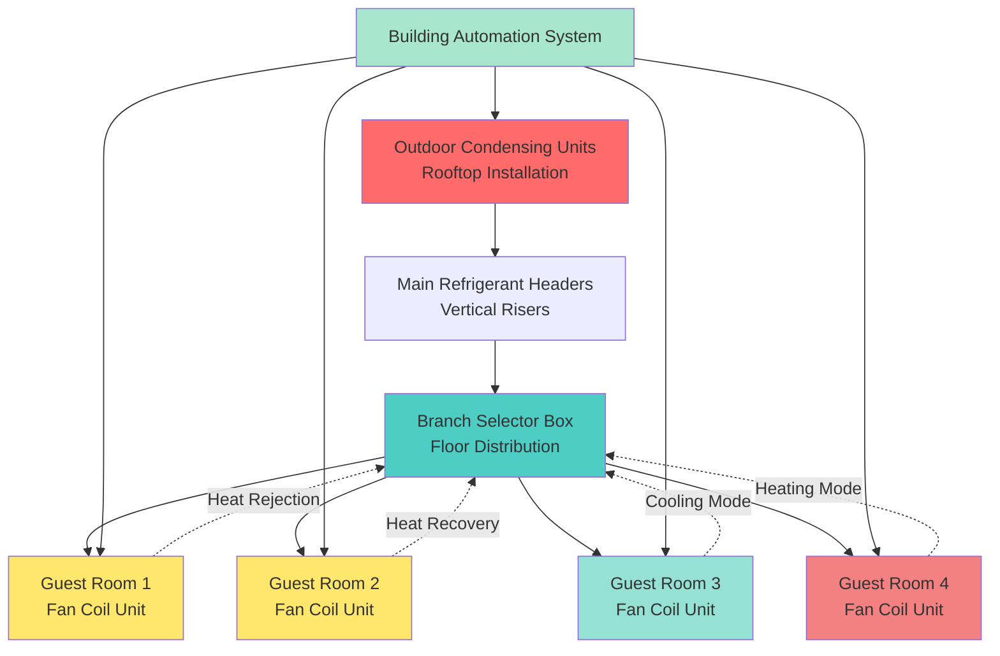

Variable Refrigerant Flow (VRF) systems have emerged as a transformative technology for hotel HVAC applications, offering unprecedented flexibility, energy efficiency, and guest comfort control. These systems utilize variable-speed compressors and electronic expansion valves to modulate refrigerant flow precisely to individual guest rooms based on real-time demand.

## VRF System Architecture for Hotels

Hotel VRF installations typically employ a distributed architecture with central outdoor condensing units connected to multiple indoor fan coil units via refrigerant piping networks. The configuration consists of:

**Outdoor Units**: High-capacity condensing units (20-72 tons typical) installed on rooftops or mechanical yards, equipped with variable-speed inverter-driven compressors and multiple refrigerant circuits for redundancy.

**Refrigerant Piping Distribution**: Main headers run vertically through mechanical shafts, with branch circuits extending horizontally through corridors to serve individual guest rooms. Piping runs can extend up to 1,000 feet from outdoor units with elevation differences up to 360 feet, enabling flexible building layouts.

**Indoor Fan Coil Units**: Concealed ceiling cassettes, ducted units, or wall-mounted terminals installed in each guest room, typically ranging from 7,000-18,000 BTU/hr capacity. Units operate independently with individual thermostats, allowing precise temperature control.

**Branch Selector Boxes (BS Boxes)**: Junction boxes that distribute refrigerant from main headers to individual indoor units while enabling simultaneous heating and cooling operation across different zones.

## Heat Recovery Between Rooms

Heat recovery VRF systems represent a significant advancement for hotels, capturing thermal energy rejected from rooms in cooling mode and redirecting it to rooms requiring heating. This simultaneous heating and cooling capability delivers substantial energy savings.

The heat recovery process operates through refrigerant circuit management. When Room A requires cooling (rejecting heat) and Room B requires heating, the system transfers thermal energy directly between zones via the refrigerant network, bypassing the outdoor unit entirely. Only the difference between heating and cooling loads requires outdoor unit operation.

Energy savings from heat recovery range from 20-40% compared to conventional systems, with greatest benefits during shoulder seasons when some rooms require heating (north-facing, vacant) while others need cooling (occupied, south-facing).

The system effectiveness can be quantified:

$$\eta_{HR} = \frac{Q_{recovered}}{Q_{heating} + Q_{cooling}} \times 100\%$$

where $\eta_{HR}$ represents heat recovery efficiency, $Q_{recovered}$ is the thermal energy transferred between zones, and $Q_{heating}$ and $Q_{cooling}$ are the total heating and cooling loads.

## Individual Room Control Capabilities

VRF systems provide guest room control flexibility unmatched by conventional systems. Each room functions as an independent zone with dedicated thermostat control, allowing guests to adjust temperature in 0.5°F increments and select operational modes (cool, heat, auto, fan only).

Advanced integration enables:

**Occupancy-Based Control**: Door switches and motion sensors communicate with the VRF network controller to implement setback strategies when rooms are unoccupied, reducing energy consumption by 25-35% without sacrificing guest comfort.

**Remote Management**: Property management system (PMS) integration allows housekeeping staff to precondition rooms before guest arrival and facilities managers to implement energy policies during extended vacancies.

**Quiet Operation**: Indoor units operate at sound levels of 25-35 dBA on low speed, essential for guest satisfaction. Variable-speed operation maintains sound levels below NC-30 criteria for sleeping areas.

## Energy Efficiency Advantages

VRF systems achieve exceptional efficiency through multiple mechanisms:

**Variable Capacity Modulation**: Inverter-driven compressors adjust output from 10-100% to match building loads precisely, eliminating cycling losses inherent in fixed-capacity systems. Seasonal Energy Efficiency Ratio (SEER) values reach 18-22, compared to 12-14 for conventional split systems.

**Part-Load Performance**: Hotels rarely operate at peak design conditions. VRF systems maintain high efficiency at part-load through compressor turndown and refrigerant flow control. Integrated Part-Load Value (IPLV) ratings of 20-25 EER reflect real-world performance.

The annual energy consumption can be estimated:

$$E_{annual} = \sum_{i=1}^{8760} \frac{Q_i}{COP_i \times PLR_i}$$

where $Q_i$ is the hourly cooling/heating load, $COP_i$ is the coefficient of performance at operating conditions, and $PLR_i$ is the part-load ratio efficiency modifier.

**Reduced Distribution Losses**: Refrigerant piping experiences minimal thermal loss compared to chilled water or ducted air systems. Refrigerant energy density allows smaller pipe sizes (1/2" - 2" copper) versus 4-12" hydronic piping.

## System Comparison

| Parameter | VRF System | Conventional PTAC | 4-Pipe Fan Coil |
|-----------|------------|-------------------|-----------------|
| SEER/EER | 18-22 / 13-15 | 9-11 / 9-10 | 12-14 / 11-12 |
| Individual Room Control | Fully Variable | On/Off or 2-Stage | Modulating Valve |
| Heat Recovery | Yes (HR Models) | No | No |
| Noise Level (dBA) | 25-35 | 45-52 | 35-42 |
| Maintenance Location | Indoor Access | Through-Wall | Indoor Access |
| Ventilation Air | Separate DOAS Required | Integrated Option | Separate System |
| Refrigerant Charge (lb/ton) | 6-10 | 3-5 | N/A (Water System) |
| Piping Size (Typical) | 1/2" - 1-1/8" Copper | Factory Piping | 3/4" - 1-1/4" Water |

## First Cost vs Operating Cost Analysis

VRF systems require higher initial investment compared to conventional hotel HVAC options:

**First Cost Premium**: VRF installation costs range $8,000-$12,000 per room versus $4,500-$6,500 for PTAC units and $6,000-$9,000 for 4-pipe fan coil systems. The premium reflects specialized equipment, refrigerant piping installation, and controls integration.

**Operating Cost Savings**: Annual energy savings of 30-45% typically yield 4-7 year simple payback periods. A 200-room hotel consuming 450,000 kWh/year for HVAC at $0.12/kWh can save $18,000-$24,000 annually with VRF implementation.

Life cycle cost analysis over 20-year equipment life demonstrates VRF economic superiority:

$$LCC = FC + \sum_{t=1}^{20} \frac{OC_t + MC_t}{(1+r)^t}$$

where $LCC$ is life cycle cost, $FC$ is first cost, $OC_t$ is operating cost in year t, $MC_t$ is maintenance cost, and $r$ is the discount rate (typically 3-5%).

**Maintenance Considerations**: VRF systems require specialized technician training and refrigerant leak detection protocols. Annual maintenance costs average $150-$250 per room versus $100-$175 for PTAC units, offset by extended equipment life (20-25 years VRF versus 10-15 years PTAC).

## Integration with Building Automation

Modern VRF systems integrate seamlessly with hotel building automation systems (BAS) through standardized communication protocols:

**BACnet/Modbus Integration**: VRF network controllers communicate with central BAS platforms, providing system-wide monitoring, alarming, and control capabilities. Integration enables energy dashboards displaying real-time consumption by zone, floor, or entire property.

**Property Management System Linkage**: PMS integration synchronizes HVAC operation with reservation data. Systems automatically adjust setpoints based on check-in/check-out schedules, optimizing energy use while ensuring guest comfort upon arrival.

**Demand Response Capability**: Grid-interactive controls allow participation in utility demand response programs. During peak periods, VRF systems can shed 15-30% of cooling capacity through temporary setpoint adjustments across unoccupied rooms, generating rebate revenue while maintaining occupied room comfort.

**Centralized Diagnostics**: Remote monitoring identifies refrigerant leaks, filter maintenance requirements, and compressor performance degradation before failures occur, reducing emergency service calls and extending equipment life.

The combination of superior efficiency, flexible control, and operational intelligence positions VRF technology as the preferred HVAC solution for new hotel construction and major renovations where refrigerant piping installation is feasible.
