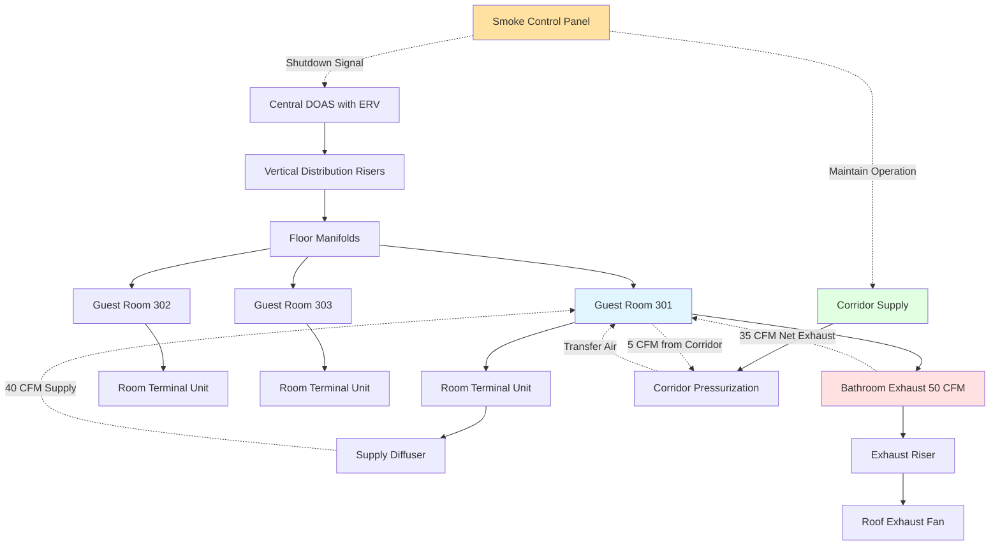

## Overview

Hotel guest room ventilation presents unique challenges requiring careful balance between energy efficiency, indoor air quality, guest comfort, and life safety. Unlike residential applications, hotel rooms experience variable occupancy patterns, transient guests with diverse expectations, and stringent code requirements for exhaust and smoke control.

The primary ventilation challenge in hotel design stems from intermittent occupancy coupled with continuous HVAC operation expectations. A 200-room hotel may have occupancy ranging from 30% to 100% throughout the year, yet guests expect immediate comfort upon room entry.

## Ventilation Strategies for Guest Rooms

### Dedicated Outdoor Air Systems (DOAS)

DOAS configurations provide continuous ventilation independent of in-room terminal units. Central air handlers deliver conditioned outdoor air to each guest room at 15-25 CFM per room, as specified by ASHRAE 62.1 for hotel/motel guest rooms.

The outdoor air quantity per room follows:

$$Q_{oa} = R_p \times P + R_a \times A$$

where $Q_{oa}$ is outdoor air flow rate (CFM), $R_p$ is outdoor air rate per person (5 CFM/person), $P$ is design occupancy (typically 2 persons), $R_a$ is outdoor air rate per area (0.06 CFM/ft²), and $A$ is room floor area (ft²).

For a 350 ft² standard guest room:

$$Q_{oa} = 5 \times 2 + 0.06 \times 350 = 10 + 21 = 31 \text{ CFM}$$

DOAS systems incorporate energy recovery ventilators (ERVs) achieving 60-80% sensible and latent effectiveness, significantly reducing conditioning loads.

### Individual Room Ventilation

Four-pipe fan coil units or packaged terminal air conditioners (PTACs) with outdoor air intake dampers provide individual room control. This approach allows occupancy-based ventilation modulation through:

- Door position sensors activating ventilation upon room entry
- Occupancy sensors maintaining minimum ventilation during vacancy
- CO₂ sensors enabling demand-controlled ventilation

The energy penalty for continuous outdoor air delivery to unoccupied rooms is substantial:

$$E_{penalty} = 1.08 \times Q_{oa} \times \Delta T \times h_{unoccupied}$$

where $E_{penalty}$ is annual energy penalty (Btu), $\Delta T$ is temperature difference between outdoor and setpoint (°F), and $h_{unoccupied}$ is annual unoccupied hours.

### Ventilation System Comparison

| Strategy | Energy Efficiency | IAQ Control | Capital Cost | Maintenance |
|----------|------------------|-------------|--------------|-------------|
| **DOAS with ERV** | Excellent | Excellent | High | Moderate |
| **DOAS without ERV** | Fair | Excellent | Moderate | Low |
| **Individual OA Intakes** | Good (with controls) | Good | Low | Moderate |
| **Infiltration Only** | Poor | Poor | Very Low | None |
| **Transfer Air from Corridor** | Good | Fair | Low | Low |

## Bathroom Exhaust and Makeup Air

Bathroom exhaust requirements typically specify 50 CFM continuous or 20 CFM continuous with 50 CFM intermittent operation. The exhaust air must be made up to prevent excessive room depressurization.

The makeup air pathway options include:

1. **Direct outdoor air supply** - Outdoor air delivered to room equals or exceeds exhaust rate
2. **Transfer air from corridor** - Undercut doors or transfer grilles permit corridor air infiltration
3. **Balanced ventilation** - Dedicated makeup air system serves multiple rooms

Room pressure relative to corridor should maintain slight positive pressure (+0.01 to +0.03 in. w.c.) to prevent corridor odor migration. The pressure relationship is governed by:

$$\Delta P = \frac{(Q_{supply} - Q_{exhaust})^2 \times \rho}{2 \times C^2 \times A^2}$$

where $\Delta P$ is pressure difference (in. w.c.), $Q_{supply}$ and $Q_{exhaust}$ are flow rates (CFM), $\rho$ is air density (lb/ft³), $C$ is flow coefficient, and $A$ is leakage area (ft²).

For a room with 40 CFM supply and 35 CFM exhaust through a 1-inch undercut door (approximately 24 in² opening):

$$\Delta P \approx +0.02 \text{ in. w.c. (positive pressure)}$$

## Corridor and Room Pressure Relationships

Proper pressure cascading ensures odor control and smoke management. The typical hierarchy maintains:

- **Guest rooms**: +0.01 to +0.03 in. w.c. relative to corridor
- **Corridors**: +0.03 to +0.05 in. w.c. relative to outdoors
- **Stairwells**: +0.08 to +0.10 in. w.c. relative to corridors (pressurization active)

This cascading arrangement prevents contamination migration while supporting smoke control objectives.

## Smoke Control Integration

Hotel ventilation systems integrate with smoke control per NFPA 92 and International Building Code requirements. Key considerations include:

**Supply Air Shutdown**: In-room supply air systems shut down during fire alarm to prevent smoke distribution through ductwork.

**Exhaust Continuation**: Bathroom exhaust fans may continue operation if serving single rooms with fire-rated duct penetrations.

**Corridor Pressurization**: Corridor supply air systems maintain positive pressure to prevent smoke infiltration to egress paths.

**Stairwell Pressurization**: Dedicated stairwell pressurization systems maintain 0.10 in. w.c. minimum with all doors closed, 0.05 in. w.c. minimum across open door.

## Balancing Energy Efficiency with IAQ

The tension between energy conservation and indoor air quality requires intelligent controls:

**Occupancy-Based Ventilation**: Reducing outdoor air to 5-10 CFM during vacancy while maintaining 30-40 CFM when occupied reduces annual ventilation energy by 40-60%.

**Demand-Controlled Ventilation (DCV)**: CO₂ sensors modulate outdoor air based on measured concentration, targeting 800-1000 ppm maximum.

**Energy Recovery**: ERVs recovering 70% of conditioning energy from exhaust air reduce ventilation loads by:

$$Q_{recovered} = 1.08 \times Q_{oa} \times \Delta T \times \varepsilon$$

where $\varepsilon$ is ERV effectiveness (0.70 typical).

For 30 CFM outdoor air with 30°F temperature difference:

$$Q_{recovered} = 1.08 \times 30 \times 30 \times 0.70 = 680 \text{ Btu/hr per room}$$

## Guest Expectations for Fresh Air

Modern guests expect immediate air quality upon room entry, particularly in urban or high-traffic locations. Survey data indicates:

- 78% of guests consider air quality important to satisfaction
- 65% notice stale or musty odors within first 5 minutes
- 42% would request room change due to poor air quality

Meeting these expectations requires:

1. **Pre-occupancy purge cycles** - Ventilation boost 30 minutes before check-in
2. **Rapid air change capability** - Minimum 4-6 air changes per hour capacity
3. **Filtration enhancement** - MERV 11-13 filters for particulate removal
4. **Continuous low-level ventilation** - 10-15 CFM minimum during vacancy

The guest room air change rate determines odor clearance time:

$$t = \frac{\ln(C_0/C_f)}{ACH} \times 60$$

where $t$ is time to achieve target concentration (minutes), $C_0$ is initial contaminant concentration, $C_f$ is final concentration, and $ACH$ is air changes per hour.

To reduce odor concentration by 90% with 5 ACH:

$$t = \frac{\ln(1/0.1)}{5} \times 60 = \frac{2.3}{5} \times 60 = 28 \text{ minutes}$$

This calculation demonstrates why pre-occupancy ventilation boost cycles prove essential for guest satisfaction.

## Best Practices

Successful hotel guest room ventilation integrates multiple strategies:

- Design for 150% of code minimum outdoor air to accommodate DCV turndown
- Provide individual room pressure monitoring in luxury properties
- Install bathroom exhaust timers with 20-minute minimum run after occupancy
- Commission pressure relationships under various occupancy scenarios
- Specify acoustic criteria (NC 30-35) compatible with continuous ventilation
- Plan maintenance access to in-room ventilation components

These approaches deliver guest satisfaction while maintaining operational efficiency and code compliance.
