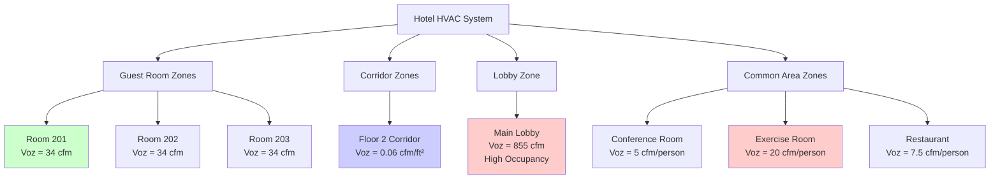

ASHRAE Standard 62.1, *Ventilation for Acceptable Indoor Air Quality*, establishes minimum ventilation requirements for hotel facilities to ensure occupant health, comfort, and acceptable indoor air quality. Hotel designers and operators must understand these requirements to achieve compliant, energy-efficient ventilation systems.

## Guest Room Outdoor Air Requirements

ASHRAE 62.1 specifies outdoor air requirements for hotel guest rooms based on two components: occupant density and floor area.

**Ventilation Rate Procedure:**

$$V_{oz} = R_p \times P_z + R_a \times A_z$$

Where:
- $V_{oz}$ = outdoor air requirement for the zone (cfm)
- $R_p$ = people outdoor air rate (5 cfm/person for guest rooms)
- $P_z$ = zone population (design occupancy)
- $R_a$ = area outdoor air rate (0.06 cfm/ft² for guest rooms)
- $A_z$ = zone floor area (ft²)

**Example Calculation:**

For a 400 ft² guest room with 2 occupants:

$$V_{oz} = (5 \text{ cfm/person} \times 2) + (0.06 \text{ cfm/ft}^2 \times 400 \text{ ft}^2)$$

$$V_{oz} = 10 + 24 = 34 \text{ cfm}$$

This represents the minimum outdoor air required at the breathing zone level. Actual system outdoor air intake must account for system ventilation efficiency.

## ASHRAE 62.1 Ventilation Rates for Hotel Spaces

| Space Type | People Outdoor Air Rate (cfm/person) | Area Outdoor Air Rate (cfm/ft²) | Default Occupant Density (people/1000 ft²) |
|-----------|--------------------------------------|----------------------------------|-------------------------------------------|
| Guest Rooms | 5 | 0.06 | 5 |
| Corridors | 0 | 0.06 | 0 |
| Lobbies | 7.5 | 0.06 | 30 |
| Conference Rooms | 5 | 0.06 | 50 |
| Exercise Rooms | 20 | 0.06 | 40 |
| Laundry Rooms | 0 | 0.12 | 0 |
| Public Restrooms | 0 | 0.12 | 70 |

## Corridor Ventilation Requirements

Hotel corridors require area-based ventilation only, with no occupant component due to transient use:

$$V_{oz,corridor} = 0.06 \text{ cfm/ft}^2 \times A_z$$

Corridors must maintain positive pressure relative to guest rooms to prevent odor migration. Transfer air from guest rooms may contribute to corridor ventilation if properly designed. Ensure corridor supply air provides sufficient dilution and directional airflow away from critical spaces.

## Lobby and Common Area Ventilation

Lobbies experience high, variable occupancy requiring substantially more outdoor air:

$$V_{oz,lobby} = (7.5 \text{ cfm/person} \times P_z) + (0.06 \text{ cfm/ft}^2 \times A_z)$$

For a 3,000 ft² lobby with design occupancy of 90 people (30 people/1000 ft²):

$$V_{oz,lobby} = (7.5 \times 90) + (0.06 \times 3000) = 675 + 180 = 855 \text{ cfm}$$

Common areas including conference rooms, exercise facilities, and restaurants each have specific requirements detailed in ASHRAE 62.1 Table 6.2.2.1.

## System Ventilation Efficiency

The breathing zone outdoor air calculated above must be adjusted for distribution effectiveness using the zone air distribution effectiveness ($E_z$) and system ventilation efficiency ($E_v$).

**Zone Outdoor Air Flow:**

$$V_{oz} = \frac{V_{bz}}{E_z}$$

Where $E_z$ typically equals 1.0 for ceiling supply of cool air or 0.8 for other configurations.

**System Outdoor Air Intake:**

$$V_{ot} = \frac{\sum{\text{all zones } V_{oz}}}{E_v}$$

The system ventilation efficiency $E_v$ accounts for non-uniform distribution of outdoor air to zones. For multi-zone recirculating systems:

$$E_v = \frac{1 + X_s - Z_d}{1 + X_s}$$

Where:
- $X_s$ = uncorrected outdoor air fraction at system level
- $Z_d$ = zone outdoor air fraction for critical zone (highest $V_{oz}/V_{dz}$ ratio)

This calculation ensures adequate outdoor air delivery to all zones, particularly those with high outdoor air requirements relative to their supply air.

## Demand Controlled Ventilation Applications

Demand controlled ventilation (DCV) reduces energy consumption by modulating outdoor air based on actual occupancy rather than design values. ASHRAE 62.1 permits DCV in spaces with variable, unpredictable occupancy.

**Suitable Hotel Applications:**
- Conference rooms and meeting spaces
- Ballrooms and event facilities
- Exercise rooms
- Restaurants and dining areas

**DCV Implementation:**

Use CO₂ sensors to estimate occupancy and adjust ventilation accordingly:

$$V_{oz} = R_p \times P_{actual} + R_a \times A_z$$

Where $P_{actual}$ is derived from measured CO₂ concentration. Sensors must be properly located and calibrated. Area-based ventilation ($R_a \times A_z$) remains constant regardless of occupancy.

Guest rooms typically do not justify DCV due to relatively constant occupancy patterns and modest outdoor air requirements.

## Documentation and Commissioning Requirements

ASHRAE 62.1 Section 8 requires comprehensive documentation including:

**Design Documentation:**
- Outdoor air intake calculations for all zones
- System ventilation efficiency calculations
- Equipment schedules with airflow rates
- Control sequences for outdoor air dampers
- DCV sensor locations and setpoints

**Installation Documentation:**
- As-built drawings showing actual damper and sensor locations
- Outdoor air measurement station details
- Verification of minimum damper positions

**Commissioning Procedures:**
1. Verify outdoor air intake flow rates at design conditions
2. Test and balance all zone supply airflows
3. Confirm proper damper operation and minimum positions
4. Calibrate CO₂ sensors if DCV is implemented
5. Verify control sequences under all operating modes
6. Document outdoor air fraction at multiple system loads

**Operations and Maintenance:**
- Provide building operators with design outdoor air requirements
- Establish filter replacement schedules
- Create damper inspection and maintenance procedures
- Implement CO₂ sensor calibration protocols (annual minimum)

Proper commissioning ensures the designed ventilation system operates as intended, delivering adequate outdoor air throughout building occupancy while minimizing energy waste. Recommissioning every 3-5 years maintains performance over the building lifecycle.

---

*Compliance with ASHRAE 62.1 ensures hotel guests experience healthy indoor air quality while optimizing energy efficiency through proper system design, accurate calculations, and thorough commissioning verification.*