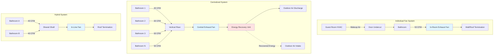

# Hotel Bathroom Exhaust Systems

Hotel bathroom exhaust systems remove moisture, odors, and contaminants from guest bathrooms while maintaining acceptable acoustic levels and minimizing energy consumption. These systems face unique challenges compared to residential applications, including higher occupancy turnover, stricter noise limitations (typically NC 30-35), and the need for reliable operation across hundreds of rooms. Design approaches range from individual in-room exhaust fans to centralized multi-story exhaust systems, each with distinct performance characteristics, maintenance requirements, and energy implications.

## Exhaust Rate Requirements

### Code Minimum Exhaust Rates

**International Mechanical Code (IMC) Section 403:**
- Intermittent exhaust: 50 CFM minimum
- Continuous exhaust: 20 CFM minimum

**ASHRAE 62.1 Table 6-4 (Hotel/Motel Guest Rooms):**
- Toilet room exhaust: 25 CFM per room (continuous)
- Combined with bedroom ventilation requirement: 5 CFM/person + 0.06 CFM/ft²

**Effective exhaust calculation:**

$$Q_{exhaust} = \max(Q_{IMC}, Q_{ASHRAE})$$

Where:
- $Q_{IMC}$ = Code-required exhaust rate (20 CFM continuous or 50 CFM intermittent)
- $Q_{ASHRAE}$ = Standard-required exhaust rate (25 CFM)

For typical 350 ft² hotel room with bathroom:

$$Q_{required} = 5 \times 2 + 0.06 \times 350 = 31 \text{ CFM}$$

Combined bathroom exhaust typically provides 25-30 CFM of this total ventilation requirement.

### Moisture Removal Capacity

**Moisture generation from showering:**

$$m_{moisture} = \rho_{air} \times Q \times (W_{bathroom} - W_{supply})$$

Where:
- $\rho_{air}$ = Air density (0.075 lb/ft³ at standard conditions)
- $Q$ = Exhaust rate (CFM)
- $W_{bathroom}$ = Bathroom humidity ratio (lb moisture/lb dry air)
- $W_{supply}$ = Supply air humidity ratio (lb moisture/lb dry air)

**Typical shower generation:** 0.3-0.5 lb/h moisture
**Required removal rate at 50 CFM:** 0.4-0.6 lb/h (adequate for typical shower)
**Required removal rate at 20 CFM:** 0.16-0.24 lb/h (marginal, requires longer run time)

## Operating Strategies

### Continuous Exhaust

**Characteristics:**
- 20-30 CFM constant operation
- Provides base ventilation for room
- Integrated with room HVAC makeup air
- Lower fan speed, quieter operation

**Advantages:**
- Consistent odor and moisture control
- No guest interaction required
- Simplified controls
- Contributes to whole-room ventilation per ASHRAE 62.1

**Disadvantages:**
- Continuous energy consumption
- Year-round heating/cooling penalty
- Difficulty with energy recovery (low pressure differential)

**Typical application:** High-end hotels, suites, extended-stay properties.

### Intermittent Exhaust

**Characteristics:**
- 50-70 CFM during bathroom occupancy
- Activated by light switch, occupancy sensor, or humidity sensor
- Run-on timer: 15-30 minutes post-occupancy
- Fan cycles based on demand

**Control strategies:**

1. **Light switch activation:**
   - Simplest control
   - Fan runs whenever light is on
   - Run-on timer continues operation after light off

2. **Humidity sensor activation:**
   - Threshold typically 60-65% RH
   - Fan runs until humidity drops below setpoint
   - Prevents unnecessary operation
   - More complex control, higher cost

3. **Occupancy sensor activation:**
   - Ceiling-mounted or in-fan PIR sensor
   - Detects bathroom entry
   - Timer maintains operation after vacancy

**Advantages:**
- Lower average energy consumption
- Reduced heating/cooling penalty
- Higher flow during peak demand (faster moisture removal)

**Disadvantages:**
- Requires supplemental ventilation for ASHRAE 62.1 compliance
- Higher noise potential at full speed
- Control complexity and maintenance

**Typical application:** Mid-range hotels, budget properties, retrofit applications.

## System Configurations

### Individual In-Room Exhaust Fans

**Configuration:**
- Wall or ceiling-mounted fan per bathroom
- Direct discharge to exterior or corridor
- Self-contained motor and housing
- Independent operation per room

**Fan sizing:**

$$SP_{required} = \Delta P_{duct} + \Delta P_{terminal} + \Delta P_{hood}$$

Where:
- $\Delta P_{duct}$ = Duct friction loss (typically 0.05-0.15 in w.c.)
- $\Delta P_{terminal}$ = Wall cap or roof jack loss (0.02-0.05 in w.c.)
- $\Delta P_{hood}$ = Grille pressure drop (0.02-0.03 in w.c.)

**Typical static pressure:** 0.10-0.25 in w.c. at rated CFM

**Advantages:**
- Simple installation
- No cross-contamination between rooms
- Localized maintenance (failure affects single room)
- Lower first cost for small properties

**Disadvantages:**
- Multiple exterior penetrations
- Higher total fan energy (multiple small fans less efficient)
- Difficult to implement energy recovery
- Variable exterior appearance

### Centralized Exhaust Systems

**Configuration:**
- Central exhaust fan (rooftop or mechanical room)
- Vertical or horizontal duct risers
- Branch ducts to individual bathrooms
- Constant or variable volume operation

**System pressure calculation:**

$$SP_{total} = \Delta P_{branch} + \Delta P_{riser} + \Delta P_{fittings} + \Delta P_{intake}$$

Typical centralized system pressure: 0.5-1.5 in w.c.

**Advantages:**
- Single exterior penetration (rooftop termination)
- Higher fan efficiency (larger fan, better part-load performance)
- Energy recovery feasible
- Consistent architectural appearance
- Central maintenance access

**Disadvantages:**
- Higher first cost (ductwork installation)
- Cross-contamination risk without backflow dampers
- System failure affects multiple rooms
- Balancing complexity

**Balancing requirements:**
- Individual room flow measurement at grille
- Balancing dampers at branch takeoffs
- Target ±10% of design flow per room
- Re-balance after filter changes or modifications

### Hybrid Systems

**Configuration:**
- Shared exhaust shaft (1-2 bathrooms per shaft)
- Individual in-line fans or shared fan
- Reduced penetrations vs individual fans
- Reduced ductwork vs fully centralized

**Application:** 4-10 story properties, renovation projects with structural constraints.

## Makeup Air Pathways

### Door Undercuts

**Required undercut for makeup air:**

$$A_{required} = \frac{Q}{V_{max}}$$

Where:
- $Q$ = Exhaust rate (CFM)
- $V_{max}$ = Maximum acceptable velocity (typically 200-300 FPM)
- $A_{required}$ = Free area (ft²)

**For 50 CFM exhaust at 250 FPM:**

$$A_{required} = \frac{50}{250} = 0.20 \text{ ft}^2 = 29 \text{ in}^2$$

**Typical door dimensions:**
- Door width: 30-36 in
- Required undercut: 0.75-1.0 in
- Provides 22-36 in² free area

**Considerations:**
- Acoustic transmission through undercut
- Light transmission (guest privacy)
- Smoke control (fire code requirements may limit undercut)
- Vermin entry prevention

### Transfer Grilles

**Alternative to undercuts:**
- Grille installed in bathroom door or wall
- Acoustic baffles reduce sound transmission
- Typical size: 8×6 in to 12×8 in
- Free area: 40-80 in² (with damper/baffle)

**Pressure loss through transfer grille:**

$$\Delta P = \left(\frac{Q}{C \times A}\right)^2$$

Where:
- $C$ = Flow coefficient (0.6-0.8 for baffled grille)
- $A$ = Free area (ft²)

Target pressure drop: <0.05 in w.c. to prevent whistling.

### Supply Air Pathways

**Direct supply to bathroom:**
- 10-20 CFM conditioned air to bathroom
- Reduces exhaust penalty
- Provides slight positive pressure when exhaust off
- Requires separate supply duct

**Supply to adjacent bedroom:**
- Makeup air enters bedroom from HVAC unit
- Transfers to bathroom via door undercut
- Most common approach in hotels
- Bedroom slightly positive relative to bathroom

## Acoustic Design

### Noise Criteria for Guest Bathrooms

| Location | NC Limit | dBA Limit | Design Target |
|----------|----------|-----------|---------------|
| Luxury hotel bathroom | NC 30 | 35 dBA | NC 28 |
| Mid-range hotel bathroom | NC 35 | 40 dBA | NC 33 |
| Budget hotel bathroom | NC 40 | 45 dBA | NC 38 |
| Adjacent bedroom | NC 30 | 35 dBA | NC 28 |

### Fan Sound Generation

**Manufactured fan sound power:**

$$L_w = L_{w,ref} + 10 \log_{10}\left(\frac{Q}{Q_{ref}}\right) + 20 \log_{10}\left(\frac{SP}{SP_{ref}}\right)$$

Where:
- $L_{w,ref}$ = Reference sound power level (dB)
- $Q$, $Q_{ref}$ = Actual and reference flow rates
- $SP$, $SP_{ref}$ = Actual and reference static pressures

**Sound attenuation measures:**
1. Select fans with low sone ratings (1.0-2.0 sones for hotel applications)
2. Duct-mounted fans (separation from occupied space)
3. Flexible duct connectors (vibration isolation)
4. Lined ductwork (fiberglass or foam lining, 10-20 dB attenuation)
5. Reduced fan speed (continuous low-speed operation)

**Ductborne noise attenuation:**

$$L_{p,room} = L_w - 10 \log_{10}(4 \pi r^2) - \alpha L - TL_{ceiling}$$

Where:
- $L_w$ = Fan sound power level (dB)
- $r$ = Distance from grille (ft)
- $\alpha$ = Duct attenuation (dB/ft)
- $L$ = Duct length (ft)
- $TL_{ceiling}$ = Ceiling transmission loss (dB)

**Typical attenuation:** 0.5-1.5 dB/ft for 6-inch flex duct with insulation.

### Structure-Borne Noise

**Vibration isolation requirements:**
- Flexible duct connector at fan: 4-6 in length minimum
- Resilient ceiling mounting: spring or rubber isolators
- Structural separation: avoid rigid connection to bedroom wall

**For roof-mounted centralized fans:**
- Vibration isolators: 1-2 in deflection spring mounts
- Inertia base for fans >1 HP
- Flexible duct connections at fan inlet/outlet

## Energy Recovery

### Sensible Recovery from Bathroom Exhaust

**Energy penalty from bathroom exhaust:**

$$Q_{heat} = \rho \times C_p \times Q_{exhaust} \times \Delta T$$

Where:
- $\rho$ = Air density (0.075 lb/ft³)
- $C_p$ = Specific heat (0.24 Btu/lb·°F)
- $Q_{exhaust}$ = Exhaust rate (CFM)
- $\Delta T$ = Temperature difference (°F)

**For 30 CFM continuous exhaust, 70°F temperature difference:**

$$Q_{heat} = 0.075 \times 0.24 \times 30 \times 70 = 38 \text{ Btu/h per room}$$

For 200-room hotel: 7,600 Btu/h = 0.63 tons continuous load.

**Annual energy cost (electric heat):**

$$Cost = \frac{Q_{heat} \times Hours \times \$/kWh}{3,412 \text{ Btu/kWh}}$$

200-room hotel, $0.12/kWh: $2,000-3,000/year in heating/cooling penalty.

### Energy Recovery Strategies

**1. Central Energy Recovery Ventilator (ERV):**
- Centralized exhaust system required
- Combined bathroom exhaust + outdoor air intake
- 60-80% sensible effectiveness
- 50-70% latent effectiveness
- Payback: 5-8 years for continuous exhaust systems

**2. Exhaust Air Heat Pump:**
- Heat pump extracts energy from exhaust air
- Preheats domestic hot water or supplies heat
- Coefficient of Performance (COP): 2.5-3.5
- Application limited to large properties (100+ rooms)

**3. Demand-Controlled Exhaust:**
- Intermittent operation based on occupancy/humidity
- Reduces average exhaust volume
- 30-50% energy savings vs continuous operation
- Lower recovery equipment cost justification

## Design Considerations

### Pressurization Control

**Target bathroom pressure:**
- 5-10 Pa negative relative to bedroom
- Prevents odor migration
- Ensures proper door undercut flow direction

**Excessive negative pressure issues:**
- Door closing difficulty (>15 Pa differential)
- Whistling at undercut (>20 Pa)
- Inadequate makeup air pathway

### Condensation Prevention

**Duct insulation requirements:**
- Exterior ductwork: R-8 minimum (2 in fiberglass)
- Interior vertical risers: R-4 minimum (1 in fiberglass)
- Prevents condensation during humid operation

**Moisture accumulation in centralized systems:**
- Pitch horizontal runs 1/4 in per ft toward drain
- Install drip legs at low points
- Condensate drains at base of vertical risers

### Fire and Smoke Considerations

**Fire damper requirements:**
- Typically not required for bathroom exhaust <2,000 CFM
- Required at rated wall/floor penetrations
- Check local code amendments

**Smoke control interaction:**
- Bathroom exhaust fans may continue operation during fire alarm
- Provides smoke removal from fire floor
- Coordinate with smoke control narrative

### Maintenance Access

**Critical maintenance points:**
- Fan motor and impeller (annual inspection)
- Duct cleaning access (every 3-5 years for centralized systems)
- Exhaust grille cleaning (quarterly by housekeeping)
- Filter replacement for ERV systems (quarterly to semi-annual)

**Design for serviceability:**
- Access panels at all fan locations
- Accessible dampers and controls
- Clear labeling of room assignments on centralized systems

## Performance Verification

### Commissioning Measurements

**Individual room verification:**
- Exhaust flow at grille: ±10% of design
- Bathroom static pressure: -5 to -10 Pa relative to bedroom
- Sound level in bathroom: Meet NC criteria
- Run-on timer function (intermittent systems)

**System verification:**
- Total system flow: ±10% of design
- Fan power draw: ±10% of specified
- Energy recovery effectiveness: >90% of rated (if applicable)

**Test instruments:**
- Balometer (grille flow measurement)
- Manometer (pressure measurement)
- Sound level meter (acoustic verification)

Hotel bathroom exhaust systems require careful integration of ventilation performance, energy efficiency, and acoustic comfort. Successful designs balance code compliance, guest experience, and operational cost through appropriate system selection, proper sizing, and attention to makeup air pathways and noise control. Energy recovery opportunities exist for properties with centralized continuous exhaust systems, while intermittent exhaust strategies provide energy savings for properties prioritizing lower first cost and operational simplicity.
