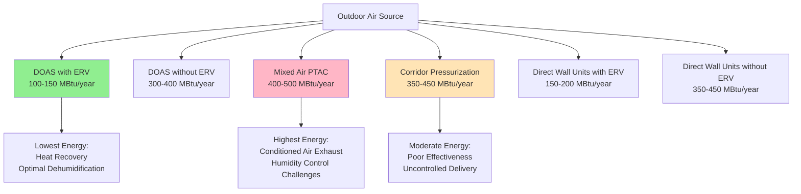

## Overview

Outdoor air delivery to hotel guest rooms presents unique engineering challenges balancing indoor air quality requirements, energy efficiency, occupancy variations, and distributed control needs. The selection of outdoor air delivery method significantly impacts system performance, energy consumption, and occupant comfort across varying operating conditions.

## Dedicated Outdoor Air Systems (DOAS)

DOAS represents the most energy-efficient approach for hotels, separating ventilation from sensible cooling loads. A central air handling unit conditions 100% outdoor air to neutral or slightly cool conditions, delivering it independently to guest rooms.

**System Configuration**

DOAS typically operates at 55-60°F supply temperature with dehumidification to 0.008-0.009 lb water/lb dry air. The required outdoor airflow per room follows:

$$Q_{oa} = N \cdot V_{oa,person} + A \cdot V_{oa,area}$$

where $N$ = occupant count (typically 2 per room), $V_{oa,person}$ = 5 cfm/person minimum (ASHRAE 62.1), $A$ = room area, and $V_{oa,area}$ = 0.06 cfm/ft².

For a typical 400 ft² guest room:

$$Q_{oa} = 2(5) + 400(0.06) = 10 + 24 = 34 \text{ cfm}$$

**Energy Recovery Integration**

DOAS achieves maximum efficiency when coupled with energy recovery ventilators (ERV) providing 70-80% sensible and latent effectiveness. Annual energy recovery:

$$Q_{recovered} = Q_{oa} \cdot \rho \cdot c_p \cdot (T_{oa} - T_{ra}) \cdot \varepsilon \cdot h_{annual}$$

where $\varepsilon$ = heat recovery effectiveness, $h_{annual}$ = operating hours. For a 200-room hotel operating 8760 hours annually in mixed climate, energy recovery can save 800-1200 MBtu/year.

**Advantages**

- Independent control of ventilation and thermal loads
- Optimal dehumidification performance
- Reduced in-room equipment capacity requirements
- Centralized filtration and treatment
- Superior energy efficiency with heat recovery

**Limitations**

- Higher initial installation cost
- Requires dedicated ductwork infrastructure
- Complex control integration with room HVAC units
- Floor space requirements for mechanical equipment

## Mixed Air Systems with Economizers

Traditional packaged terminal air conditioners (PTAC) or fan coil systems incorporate outdoor air through mixed air economizers, combining outdoor and return air upstream of cooling coils.

**Economizer Operation Modes**

The system operates in three distinct modes based on outdoor conditions:

1. **Minimum outdoor air**: $Q_{oa} = Q_{oa,min}$ when $T_{oa} > T_{return}$
2. **Economizer cooling**: $Q_{oa} = Q_{oa,min}$ to $Q_{total}$ when $T_{oa,opt} < T_{oa} < T_{return}$
3. **100% outdoor air**: $Q_{oa} = Q_{total}$ when $T_{oa} < T_{oa,opt}$

The optimal outdoor air temperature for economizer activation:

$$T_{oa,opt} = T_{setpoint} - \frac{Q_{internal}}{\dot{m} \cdot c_p}$$

For typical guest room with 1500 Btu/h internal gains and 400 cfm total airflow:

$$T_{oa,opt} = 72 - \frac{1500}{400 \cdot 0.075 \cdot 0.24 \cdot 60} = 72 - 3.5 = 68.5°F$$

**Implementation Challenges**

- Limited economizer effectiveness in PTAC applications due to wall-mounted constraints
- Humidity control complications during economizer operation
- Difficulty maintaining minimum outdoor air during low cooling loads
- Freeze protection requirements in cold climates

## Corridor Pressurization Methods

Corridor pressurization delivers conditioned outdoor air to guest room corridors at positive pressure (+0.02 to +0.05 in. w.g. relative to rooms), allowing controlled infiltration through door undercuts.

**Airflow Calculations**

Required corridor pressurization airflow depends on door undercut leakage:

$$Q_{leak} = C \cdot A \cdot \sqrt{\Delta P}$$

where $C$ = 800-1000 cfm/(ft² · in. w.g.^0.5^) for door undercut, $A$ = undercut area (typically 0.5-0.75 in. × 36 in. = 0.13-0.19 ft²), $\Delta P$ = pressure difference.

For 0.03 in. w.g. pressure differential and 0.15 ft² undercut:

$$Q_{leak} = 900 \cdot 0.15 \cdot \sqrt{0.03} = 23 \text{ cfm per room}$$

**System Performance Factors**

- Corridor air changes: 8-12 ACH typical for adequate distribution
- Door opening frequency impacts pressure stability
- Elevator shaft interaction affects pressure maintenance
- Varies significantly with door closure quality and building leakage

**Advantages and Limitations**

Advantages include no in-room ductwork, simple implementation in existing buildings, and reduced individual room equipment complexity. Limitations include uncontrolled delivery rates, poor air distribution effectiveness ($E_v$ = 0.6-0.8 vs. 1.0 for direct delivery), potential odor transfer between rooms, and difficulty verifying code compliance.

## Direct-to-Room Outdoor Air Delivery

Direct systems deliver outdoor air through dedicated ductwork or wall penetrations directly to individual guest rooms, providing controlled ventilation independent of thermal conditioning systems.

**Duct-Free Wall Units**

Through-wall outdoor air ventilators integrate supply fan, filtration, and optional heat recovery in compact units installed through exterior wall. Typical specifications:

- Airflow range: 20-80 cfm per unit
- Sound levels: 25-35 dBA at minimum speed
- Heat recovery effectiveness: 65-75% (if equipped)
- Power consumption: 15-40 watts

**Ducted Distribution**

Central fan systems distribute outdoor air through low-pressure ductwork (0.2-0.4 in. w.g. static). Design considerations include:

- Individual room balancing dampers or VAV terminals
- Noise attenuation: NC 30-35 maximum in occupied spaces
- Duct sizing for 500-700 fpm velocity to minimize noise
- Air distribution effectiveness factors

## Air Distribution Effectiveness

Ventilation effectiveness factor $E_v$ quantifies how well delivered outdoor air reaches breathing zones:

$$V_{bz} = \frac{V_{oz}}{E_v}$$

where $V_{bz}$ = breathing zone outdoor airflow, $V_{oz}$ = required outdoor air.

| Delivery Method | $E_v$ | Breathing Zone Impact |
|----------------|-------|----------------------|
| Ceiling diffuser (well-mixed) | 1.0 | Baseline |
| Displacement ventilation | 1.2 | 17% reduction in required airflow |
| Undercut door transfer | 0.7 | 43% increase in required airflow |
| PTAC direct discharge | 0.8 | 25% increase in required airflow |

Poor distribution effectiveness significantly increases required outdoor air quantities and associated energy penalties.

## Energy Implications

Annual energy consumption varies dramatically by delivery method. Comparative analysis for 200-room hotel in mixed climate (4000 HDD, 1200 CDD):

**Energy Components**

Total outdoor air conditioning energy:

$$E_{oa} = E_{sensible} + E_{latent} + E_{fan}$$

Sensible heating/cooling:

$$E_{sensible} = Q_{oa} \cdot \rho \cdot c_p \cdot \sum_{h=1}^{8760}|T_{oa} - T_{supply}| \cdot (1 - \varepsilon)$$

Latent cooling (dehumidification):

$$E_{latent} = Q_{oa} \cdot \rho \cdot h_{fg} \cdot \sum_{h=1}^{8760}(W_{oa} - W_{supply})_{+}$$

where $h_{fg}$ = 1060 Btu/lb water latent heat, $(...)_+$ indicates positive values only.

Fan energy depends on system pressure:

$$E_{fan} = \frac{Q_{oa} \cdot \Delta P \cdot h_{annual}}{6356 \cdot \eta_{fan}}$$

For DOAS with 2.5 in. w.g. total pressure and 55% fan efficiency at 34 cfm per room:

$$E_{fan} = \frac{34 \cdot 2.5 \cdot 8760}{6356 \cdot 0.55} = 214 \text{ kWh/room-year}$$

## Delivery Method Comparison

| Method | First Cost | Operating Cost | IAQ Control | Retrofit Feasibility | Occupant Control |
|--------|-----------|----------------|-------------|---------------------|------------------|
| DOAS with ERV | High | Very Low | Excellent | Difficult | Limited |
| DOAS without ERV | Medium-High | Medium | Excellent | Difficult | Limited |
| Mixed Air PTAC | Low | High | Fair | Easy | Good |
| Corridor Pressurization | Low-Medium | Medium | Poor | Easy | None |
| Direct Wall Units (ERV) | Medium | Low | Good | Easy | Excellent |
| Direct Wall Units (no ERV) | Low-Medium | Medium-High | Good | Easy | Excellent |

## Selection Criteria

Optimal outdoor air delivery method selection depends on multiple project-specific factors:

**New Construction**: DOAS with energy recovery provides lowest lifecycle cost despite higher first cost, particularly in extreme climates requiring significant dehumidification or heating.

**Renovation Projects**: Direct-to-room wall units offer best balance of performance and installation feasibility when central systems cannot be incorporated.

**Budget-Constrained Projects**: Corridor pressurization provides code-minimum compliance at lowest cost but compromises energy efficiency and IAQ quality.

**High-End Properties**: DOAS with individual room control integration delivers superior comfort, humidity control, and energy efficiency supporting premium positioning.

The engineering analysis must evaluate climate severity, utility costs, occupancy patterns, building configuration, and long-term operational priorities to determine the optimal solution for each specific application.
