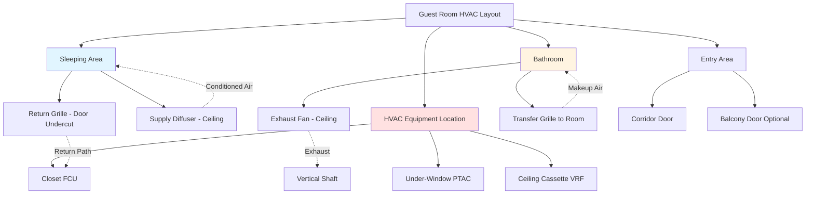

Guest room HVAC design directly impacts guest satisfaction, online reviews, and repeat business. Successful systems balance individual comfort control, quiet operation, energy efficiency, and integration with building automation. The challenge lies in providing personalized climate control for hundreds of rooms while maintaining operational costs and reliability.

## Guest Comfort Expectations and Standards

Modern hotel guests expect precise temperature control, quiet operation, and rapid response to adjustments. ASHRAE Standard 55 establishes thermal comfort parameters, but hospitality design typically exceeds these minimums.

**Temperature Control Requirements:**
- Setpoint range: 65-80°F (18-27°C)
- Temperature stability: ±2°F (±1°C)
- Recovery time: Room to setpoint within 30 minutes
- Unoccupied setback: 55°F heating / 85°F cooling

**Design Conditions:**
- Indoor: 72°F (22°C) DB, 50% RH
- Outdoor: Local 1% design conditions
- Occupancy: 2 persons per room
- Ventilation: 15 cfm/person minimum per ASHRAE 62.1

Guest room cooling load calculation:

$$Q_{total} = Q_{sensible} + Q_{latent}$$

$$Q_{sensible} = Q_{envelope} + Q_{occupants} + Q_{lighting} + Q_{equipment} + Q_{infiltration}$$

Typical load breakdown per standard room (300 ft²):

$$Q_{total} = 9,000 - 12,000 \text{ Btu/h} \text{ (cooling)}$$

$$Q_{heating} = 6,000 - 9,000 \text{ Btu/h}$$

## Room-Level Temperature Control Options

### Packaged Terminal Air Conditioners (PTAC)

PTAC units dominate mid-scale and economy hotels due to low first cost, individual metering capability, and simplified maintenance. Each unit serves one room with through-wall installation.

**Advantages:**
- Individual control and billing potential
- No central plant or ductwork required
- Room-by-room replacement and maintenance
- Familiar guest operation

**Disadvantages:**
- Higher operating costs (EER 9.5-11.5 typical)
- Noise from compressor and fan
- Limited filtration (MERV 4-6)
- Street-side noise infiltration through louvers

### Fan Coil Units (FCU)

Four-pipe fan coil systems provide superior comfort and efficiency for upscale properties. Central chillers and boilers supply chilled and hot water to in-room terminal units.

**Performance Benefits:**
- Quiet operation (NC 25-30 achievable)
- Better filtration (MERV 8-11)
- Higher efficiency with central plants
- Simultaneous heating/cooling availability

**Load Calculation for FCU Sizing:**

$$\dot{Q}_{coil} = \dot{m} \times c_p \times \Delta T$$

For chilled water (10°F ΔT):

$$\text{GPM} = \frac{Q_{Btu/h}}{500 \times \Delta T}$$

### Variable Refrigerant Flow (VRF)

VRF systems increasingly serve luxury and boutique hotels, offering individual room control with high efficiency and heat recovery between rooms.

**System Characteristics:**
- SEER 18-20+ ratings
- Modulating capacity 10-100%
- Simultaneous heating/cooling
- Distributed condensing units

## Noise Criteria for Guest Satisfaction

Acoustic performance critically affects guest sleep quality and satisfaction. Target NC-35 maximum in sleeping areas, NC-30 for luxury properties.

**Noise Control Strategies:**

1. **Equipment Selection:**
   - PTAC: Sound rating ≤45 dBA @ 3 ft
   - FCU: ≤35 dBA low speed, ≤40 dBA high speed
   - VRF indoor units: ≤28 dBA low speed

2. **Installation Details:**
   - Vibration isolation pads under all equipment
   - Flexible connections on piping
   - Acoustical lining in air handlers
   - Proper mounting to avoid structure-borne transmission

3. **Duct Design (FCU/Central Systems):**
   - Maximum velocity: 800 fpm in room
   - Lined ductwork: 1" fiberglass, 1.5 lb/ft³ density
   - Avoid fittings near diffusers
   - Sound attenuators where needed

## Air Distribution and Diffuser Placement

Effective air distribution eliminates drafts, prevents short-circuiting, and maintains uniform temperature throughout the room.

**Diffuser Placement Guidelines:**

| Location | Type | Considerations |
|----------|------|----------------|
| Over bed | Slot or round | Avoid direct airflow on occupants |
| Entry area | Ceiling diffuser | Throw to reach sleeping area |
| Window wall | Linear slot | Counteract envelope loads |
| PTAC discharge | Adjustable louvers | Guest control of direction |

**Air Distribution Principles:**

- Supply air velocity at occupied zone: <50 fpm
- Temperature differential: 15-20°F cooling, 30-40°F heating
- Diffuser throw: 0.75 × room length at 50 fpm terminal velocity
- Return location: Low on wall or door undercut (≥1" gap, 80 in² free area)

## Bathroom Exhaust Integration

Bathroom exhaust removes moisture and odors while maintaining slight negative pressure relative to the bedroom. Proper integration prevents IAQ issues and mold growth.

**Exhaust Requirements:**
- Airflow: 50 cfm continuous or 70 cfm intermittent
- Sound: ≤1.5 sones (≈30 dBA) for guest satisfaction
- Moisture sensor activation common in upscale properties
- Vertical shaft exhaust to roof, no common plenums

**Integration with Room HVAC:**

The bathroom exhaust creates a makeup air requirement. Three approaches address this:

1. **Transfer Grille:** 6" × 12" grille in bathroom door allows room air to flow to bath (simplest, most common)

2. **Dedicated Outdoor Air:** Central DOAS provides makeup air directly to bathroom (prevents room depressurization)

3. **Return Air Path:** Low wall grille returns bath air to HVAC unit (concerns with moisture, not recommended)

**Moisture Control Calculation:**

Bathroom exhaust must remove shower moisture generation:

$$\dot{m}_{moisture} = \frac{Q_{latent}}{h_{fg}}$$

For 70 cfm exhaust removing 2,000 Btu/h latent:

$$\Delta \omega = \frac{2,000}{0.68 \times 70 \times 1,076} \approx 0.039 \text{ lb}_w/\text{lb}_{da}$$

## Balcony Door Infiltration Management

Guest rooms with balcony doors experience significant infiltration loads, particularly in high-rise buildings with stack effect and wind pressure.

**Infiltration Load Calculation:**

$$Q_{inf} = \dot{V} \times \rho \times c_p \times \Delta T$$

For 100 cfm infiltration with 20°F ΔT:

$$Q_{sensible} = 100 \times 1.08 \times 20 = 2,160 \text{ Btu/h}$$

$$Q_{latent} = 100 \times 0.68 \times \Delta \omega \times 1,076$$

**Mitigation Strategies:**

1. **Weatherstripping:** Compression seals with minimum 3/16" contact width
2. **Vestibule Design:** Recessed door with alcove reduces direct wind
3. **Pressurization:** Slight positive room pressure (0.01-0.02" w.c.) when occupied
4. **Door Selection:** Multi-point locking, thermal breaks, low-E glass
5. **Equipment Sizing:** Add 20-30% capacity for rooms with balconies

**Stack Effect Pressure:**

High-rise hotels experience vertical pressure differentials:

$$\Delta P = C_s \times h \times \Delta T$$

Where $C_s = 0.0000319$ for IP units, $h$ = height (ft), $\Delta T$ = indoor-outdoor temperature difference.

20th floor in winter (70°F indoor, 20°F outdoor, 200 ft height):

$$\Delta P = 0.0000319 \times 200 \times 50 = 0.32 \text{ in w.c.}$$

This significant pressure drives infiltration through any balcony door leakage paths.

## Design Criteria by Hotel Class

| Parameter | Economy | Mid-Scale | Upscale | Luxury |
|-----------|---------|-----------|---------|--------|
| **System Type** | PTAC | PTAC/FCU | FCU/VRF | FCU/VRF |
| **Cooling Capacity** | 9,000 Btu/h | 10,000 Btu/h | 12,000 Btu/h | 12,000+ Btu/h |
| **Heating Capacity** | 6,000 Btu/h | 7,500 Btu/h | 9,000 Btu/h | 9,000+ Btu/h |
| **Noise Level** | NC-40 | NC-35 | NC-30 | NC-25 |
| **Thermostat** | Manual | Programmable | Digital | Smart/App |
| **Ventilation** | 15 cfm/person | 15 cfm/person | 20 cfm/person | 25 cfm/person |
| **Filtration** | MERV 4-6 | MERV 6-8 | MERV 8-11 | MERV 11-13 |
| **Controls** | Basic | Occupancy | BMS integrated | Full automation |
| **Recovery Time** | 60 min | 45 min | 30 min | 20 min |
| **Humidity Control** | None | Summer only | Year-round | Precision |

## Energy Management Integration

Modern hotel HVAC systems integrate with property management systems (PMS) for automated energy savings:

**Occupancy-Based Control:**
- Keycard activation: HVAC switches to occupied mode
- Checkout detection: Deep setback within 30 minutes
- Extended vacancy: System off after 24 hours

**Savings Potential:**

Unoccupied setback from 72°F to 55°F heating / 85°F cooling:

$$\text{Annual Savings} = \sum (Q_{reduced} \times \text{Hours Vacant} \times \text{Cost})$$

Typical 60% occupancy hotel saves 25-35% HVAC energy with occupancy controls.

**Advanced Strategies:**
- Window/door contacts trigger setback when open
- Motion sensors detect actual presence vs. keycard only
- AI learning optimizes pre-conditioning before check-in
- Demand response curtailment during peak pricing

Successful guest room HVAC design requires balancing first cost, operating efficiency, maintenance accessibility, and guest satisfaction. The system choice depends on hotel classification, local climate, energy costs, and ownership priorities. Proper design, installation, and commissioning ensure guests experience the comfort they expect while operators achieve acceptable lifecycle costs.
