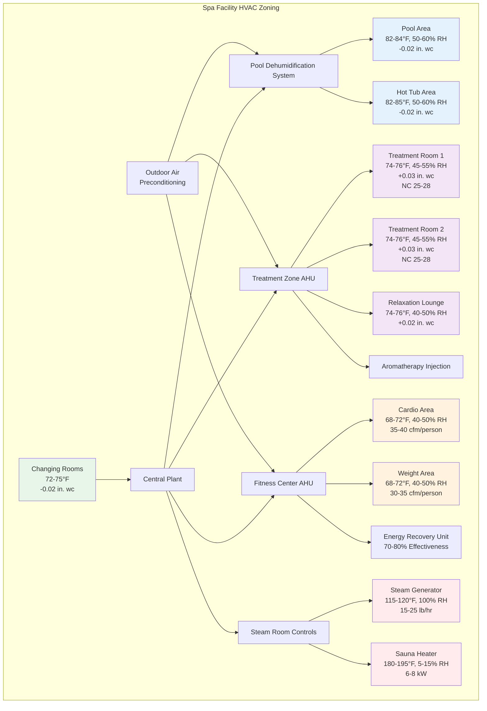

Resort and spa facilities impose the most demanding environmental control requirements in hospitality design. These spaces combine extreme humidity loads from pools and steam rooms, stringent air quality standards for treatment areas, temperature precision requirements for guest comfort, and aesthetic considerations that constrain equipment visibility and noise. Successful spa HVAC design integrates moisture control, thermal comfort, air quality management, and energy efficiency while maintaining the serene atmosphere essential to guest experience.

## Pool and Hot Tub Area Dehumidification

Natatorium and spa pool environments generate massive moisture loads requiring dedicated dehumidification systems. Water evaporation rates depend on water temperature, air temperature, relative humidity, and air velocity across water surfaces. Calculate evaporation rate using:

$$E = A \times (1 + 0.1V) \times (P_w - P_a) \times F$$

where $E$ is evaporation rate (lb/hr), $A$ is water surface area (ft²), $V$ is air velocity over water (mph), $P_w$ is saturated vapor pressure at water temperature (in. Hg), $P_a$ is partial vapor pressure of room air (in. Hg), and $F$ is activity factor (0.5 for unoccupied, 1.0 for occupied, 1.5 for active use).

A typical 400 ft² spa pool at 86°F in a 82°F, 60% RH space with moderate activity generates:

$$P_w = 1.29 \text{ in. Hg (at 86°F)}$$
$$P_a = 0.60 \times 1.14 = 0.68 \text{ in. Hg (at 82°F, 60% RH)}$$
$$E = 400 \times (1 + 0.1 \times 5) \times (1.29 - 0.68) \times 1.0 = 366 \text{ lb/hr}$$

This 366 lb/hr moisture load requires 395,000 Btu/hr latent cooling capacity (1,080 Btu/lb × 366 lb/hr), overwhelming conventional air conditioning systems. Dedicated pool dehumidification systems address this load through:

**Refrigerant-Based Dehumidifiers**: Self-contained units cool air below dewpoint to condense moisture, then reheat using refrigerant condenser heat. These systems achieve 60-80 lb/hr moisture removal per unit while recovering 60-70% of cooling energy as reheat. Typical installations require 5-6 units for a 400 ft² spa pool, providing redundancy and energy efficiency through modular staging.

**Desiccant Dehumidification**: Solid or liquid desiccants absorb moisture from air, then regenerate using waste heat or natural gas. These systems excel in low-temperature applications (spa pools below 82°F) where refrigerant systems lose efficiency. Energy consumption runs 2,500-3,500 Btu per lb of moisture removed, 20-30% higher than refrigerant systems but necessary for deep dehumidification (below 50% RH).

**Outdoor Air Integration**: Dehumidification systems must process outdoor air separately before introducing to pool space. In humid climates, untreated outdoor air at 90°F, 70% RH (humidity ratio 0.0155 lb/lb) mixed with pool air increases moisture load substantially. Dedicated outdoor air systems (DOAS) with energy recovery precondition ventilation air to 50-55°F, 90% RH before delivery.

Room design conditions balance comfort against condensation risk. Maintain pool spaces at 82-84°F (2-4°F above water temperature) with 50-60% RH to prevent surface condensation on windows, walls, and ceilings. Lower humidity (40-50% RH) prevents condensation but increases evaporation rates and energy consumption.

## Spa Treatment Room Conditioning

Treatment rooms require precise environmental control unavailable from standard hotel systems. Massage therapy, facials, body treatments, and hydrotherapy sessions demand stable temperatures, draft-free air delivery, and silent operation to maintain relaxation atmosphere.

Temperature control maintains 74-76°F during treatments, adjustable to 76-78°F for hot stone massage or 72-74°F for vigorous treatments. Individual room control enables therapists to customize conditions for treatment type and client preference. Supply air temperature must stay within 8-10°F of room setpoint to prevent thermal plumes and drafts on disrobed clients.

Air distribution uses ceiling-mounted displacement ventilation or low-velocity wall diffusers positioned away from treatment tables. Supply air velocity at client level must remain below 20 fpm to prevent draft sensation. This requires oversized ductwork and diffusers operating at 0.02-0.03 in. wc pressure drop versus 0.05-0.08 in. wc in conventional spaces.

Acoustic requirements demand NC 25-28 for premium spas, necessitating:
- Variable-speed fans with acoustically lined housings
- Lined ductwork with acoustical duct lining throughout supply and return paths
- Low-velocity design (400-600 fpm in ducts versus 800-1200 fpm conventional)
- Vibration isolation on all equipment using 1.5-2.0" deflection spring isolators
- Pressure-rated acoustical louvers on outdoor air intakes

Humidity control maintains 45-55% RH to prevent dry skin sensation during extended treatments while avoiding excess moisture. Treatment rooms adjacent to wet areas (hydrotherapy, steam rooms) require positive pressurization (+0.03 in. wc) to prevent moisture migration and maintain air quality.

## Sauna and Steam Room Ventilation

Sauna and steam rooms present opposing ventilation challenges: saunas require minimal ventilation to maintain dry heat, while steam rooms demand substantial exhaust to control excess moisture.

**Traditional Saunas**: Dry saunas operate at 180-195°F with 5-15% RH, generating negligible moisture load. Ventilation serves only to provide fresh air (1-2 air changes per hour) and remove body odors. Supply air enters near floor level (18-24" above floor) to avoid cooling effect on occupants, exhausting through adjustable vents near ceiling. Natural convection drives air circulation; mechanical ventilation must deliver air at low velocity (<100 fpm) to avoid disrupting thermal stratification essential to sauna experience.

Heater capacity runs 6-8 kW for 60-80 ft³ spaces, sized to achieve 180-190°F in 30-40 minutes from cold start. Electrical service must accommodate continuous 70-100 amp loads at 240V. Controls maintain setpoint ±5°F through modulating solid-state relays cycling heater elements.

**Steam Rooms**: Steam generators inject 15-25 lb/hr of steam into 80-100 ft³ spaces, maintaining 115-120°F at 100% RH. This creates 16,000-27,000 Btu/hr sensible and latent load requiring dedicated exhaust. Calculate required exhaust flow:

$$Q_{exhaust} = \frac{S_{steam} \times 1080}{(\omega_{room} - \omega_{supply}) \times 60}$$

where $S_{steam}$ is steam injection rate (lb/hr), $\omega_{room}$ and $\omega_{supply}$ are humidity ratios. For 20 lb/hr steam generation with exhaust to outdoors:

$$Q_{exhaust} = \frac{20 \times 1080}{(0.45 - 0.01) \times 60} = 818 \text{ cfm}$$

Exhaust systems require 800-1000 cfm for typical residential-sized steam rooms, increasing proportionally for commercial installations. Makeup air must be heated to 100-110°F before introduction to prevent drafts and maintain room temperature. Steam-rated exhaust fans with sealed motors and corrosion-resistant construction survive 115°F, 100% RH conditions.

Walls, ceilings, and doors require vapor barriers and insulation (R-20 minimum) to prevent condensation in adjacent spaces. Sloped ceilings (1/4" per foot minimum) direct condensate to walls rather than dripping on occupants.

## Fitness Center Ventilation Requirements

Fitness centers generate extreme sensible and latent loads from occupant activity, equipment heat, and perspiration moisture. Calculate design loads using metabolic rates appropriate to activity intensity:

| Activity | Sensible (Btu/hr-person) | Latent (Btu/hr-person) | Total (Btu/hr-person) |
|----------|-------------------------|------------------------|---------------------|
| Weight training | 375 | 875 | 1,250 |
| Cardio machines | 200 | 1,050 | 1,250 |
| Aerobics class | 200 | 1,100 | 1,300 |
| Yoga/Pilates | 250 | 450 | 700 |

A 2,000 ft² fitness center with 15 cardio machines, 10 weight stations, and 25 peak occupants generates:

$$Q_{sensible} = (15 \times 200) + (10 \times 375) = 6,750 \text{ Btu/hr}$$
$$Q_{latent} = (15 \times 1,050) + (10 \times 875) = 24,500 \text{ Btu/hr}$$

The 24,500 Btu/hr latent load (22.7 lb/hr moisture) dominates design, requiring either low supply air temperatures (48-52°F) for simultaneous sensible and latent cooling or dedicated dehumidification with reheat.

Ventilation rates substantially exceed code minimums to manage CO₂ and body odors. ASHRAE 62.1 mandates 20 cfm/person for fitness centers, but acceptable air quality requires 30-40 cfm/person during peak use. For 25 occupants:

$$Q_{OA} = 25 \times 35 = 875 \text{ cfm}$$

This outdoor air represents 40-60% of total supply air in fitness applications versus 10-15% in offices, magnifying outdoor air heating and cooling loads. Energy recovery ventilators (ERV) with 70-80% sensible and latent effectiveness reduce conditioning energy by 50-65% compared to unrecovered outdoor air.

Air distribution requires high air change rates (8-12 ACH) to manage thermal stratification and provide occupant cooling through air motion. Supply diffusers direct air toward equipment and activity areas at 50-100 fpm velocity at 6 ft above floor, creating air motion sensation that enhances comfort perception despite elevated dry bulb temperatures. Design supply air temperature 18-22°F below room setpoint to satisfy latent loads while providing adequate sensible cooling.

## Aromatherapy and Odor Control

Spa facilities implement aromatherapy for therapeutic benefit and ambiance while requiring robust odor control to prevent cross-contamination between treatment modalities and maintain air quality standards.

**Aromatherapy Distribution**: Essential oil diffusion systems inject micro-particles into supply air or provide localized diffusion in treatment rooms. Central diffusion requires:
- Dedicated injection points downstream of filters to prevent oil accumulation on media
- Stainless steel or glass injection nozzles resistant to essential oil chemistry
- Programmable controls for scent intensity and scheduling
- Annual duct cleaning to remove oil residue

Typical diffusion rates run 0.5-2.0 mL/hr per 1,000 ft³ of conditioned space. Over-application creates headaches and respiratory irritation; under-application fails to achieve therapeutic or ambiance goals. Individual room systems avoid cross-contamination but increase maintenance requirements.

**Odor Control Strategy**: Spa environments generate odors from treatments (hot oils, herbal preparations), body perspiration, and pool chemicals. Effective odor control requires:

**Pressurization Hierarchy**: Maintain positive pressure in clean areas (treatment rooms, relaxation lounges) relative to odor-generating spaces (fitness centers, changing rooms, wet areas). Typical pressure differentials:
- Treatment rooms: +0.03 to +0.05 in. wc relative to corridors
- Corridors: +0.02 in. wc relative to changing rooms
- Changing rooms: -0.02 in. wc (negative) to contain odors
- Pool areas: -0.02 to -0.04 in. wc (negative) to contain chloramine odors

**Air Changes and Filtration**: High ventilation rates (6-10 ACH) in odor-source areas combined with MERV 13-14 filtration and activated carbon filters control particulate and gaseous contaminants. Carbon filters require replacement every 6-12 months depending on load intensity; pressure drop monitoring indicates saturation.

**Exhaust Strategy**: Dedicated exhaust from changing areas, restrooms, and fitness zones prevents odor recirculation. Exhaust-only ventilation in these zones (no mechanical supply) creates negative pressure drawing air from adjacent positive-pressure corridors, establishing natural air flow from clean to soiled.

## Outdoor-Indoor Air Quality Transition

Resort spas frequently incorporate outdoor elements—treatment cabanas, meditation gardens, infinity pools—requiring HVAC design that manages transitions between conditioned and unconditioned spaces without compromising efficiency or comfort.

**Open-Air Treatment Spaces**: Outdoor or semi-outdoor treatment cabanas in temperate climates rely on radiant heating/cooling with minimal mechanical ventilation. Infrared radiant heaters (3-5 kW per cabana) provide spot heating in cool weather without disturbing natural ventilation. Heated ceilings or floors (80-90°F surface temperature) extend shoulder season use. Ceiling fans (100-200 cfm) provide air motion and insect control without enclosing space.

**Transition Zones**: Vestibules and air curtains separate high-humidity pool areas from dry interior spaces. Air curtains mounted at doorways deliver 800-1,200 fpm discharge velocity creating an invisible barrier that reduces moisture migration by 60-80% when doors open. Vestibules with two sets of doors and intermediate conditioning provide superior separation but require 60-100 ft² per opening.

**Outdoor Air Economizer Integration**: Resort locations in mild climates leverage outdoor air for free cooling when conditions permit. However, spa pools and fitness centers impose year-round humidity control requirements limiting economizer operation. Evaluate economizer benefit using integrated part-load value (IPLV) accounting for actual operating hours at various outdoor conditions versus additional humidity control energy. In marine climates (75-85°F, 60-80% RH most of year), economizer operation saves minimal energy due to latent cooling requirements.

## Design Conditions for Spa Spaces

| Space Type | Temperature (°F) | Relative Humidity (%) | Ventilation (cfm/person or ACH) | Noise Criteria | Pressure |
|------------|------------------|----------------------|--------------------------------|----------------|----------|
| Treatment rooms | 74-76 | 45-55 | 25 cfm/person | NC 25-28 | +0.03 in. wc |
| Relaxation lounge | 74-76 | 40-50 | 20 cfm/person | NC 28-30 | +0.02 in. wc |
| Pool area | 82-84 | 50-60 | 6-8 ACH | NC 35-40 | -0.02 in. wc |
| Hot tub area | 82-85 | 50-60 | 8-10 ACH | NC 35-40 | -0.02 in. wc |
| Steam room | 115-120 | 100 | 10-15 ACH | NC 40-45 | Neutral |
| Sauna | 180-195 | 5-15 | 1-2 ACH | NC 40-45 | Neutral |
| Fitness center | 68-72 | 40-50 | 35-40 cfm/person | NC 35-40 | Neutral |
| Changing rooms | 72-75 | 40-50 | 1.5 cfm/ft² | NC 35-40 | -0.02 in. wc |
| Corridors | 72-76 | 40-55 | 0.06 cfm/ft² | NC 35-40 | +0.02 in. wc |

## Spa Facility HVAC Zones

Resort and spa HVAC systems demand specialized expertise beyond conventional hospitality design. The combination of extreme moisture loads, precision conditioning requirements, stringent acoustic criteria, and aesthetic constraints requires integrated design addressing thermodynamics, air quality, controls, and guest experience. Successful installations balance technical performance with operational simplicity, ensuring spa environments maintain their therapeutic atmosphere while achieving energy efficiency targets. Equipment redundancy, sophisticated controls, and comprehensive maintenance programs prove essential to sustained performance in these demanding applications.
