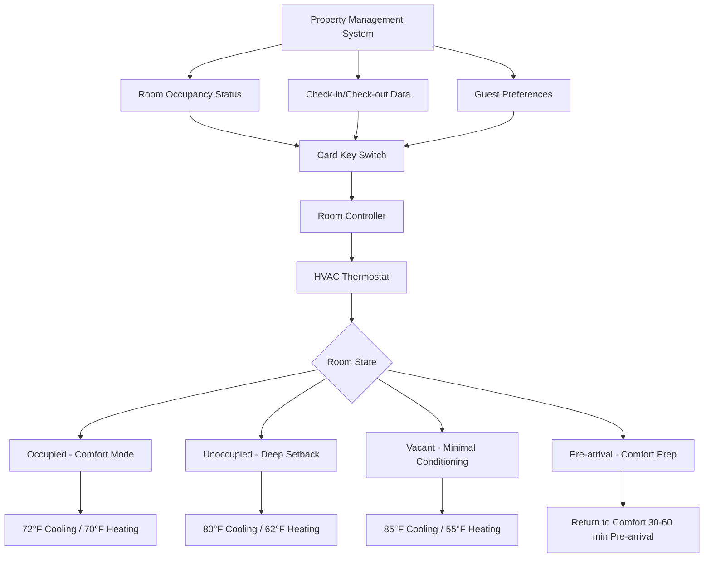

Card key HVAC integration represents one of the most effective energy conservation strategies in hospitality facilities. By linking room occupancy detection to climate control systems, hotels reduce energy consumption during unoccupied periods while ensuring immediate comfort when guests return. This technology balances operational cost reduction with guest experience requirements.

## Key Card Switch Operation and Types

Card key switches detect room occupancy based on guest key card insertion and removal. When guests insert their key card into the wall-mounted switch, power flows to the HVAC system for normal operation. Upon key removal when leaving the room, the switch signals the thermostat to enter energy-saving setback mode.

**Common Switch Types:**

| Switch Type | Operation Principle | Typical Applications | Response Time |
|------------|---------------------|---------------------|---------------|
| Mechanical Contact | Physical card insertion closes circuit | Economy hotels, retrofits | Immediate |
| Magnetic Reed | Magnets in card activate reed switches | Mid-range properties | <1 second |
| RFID Proximity | Card proximity detected electronically | Luxury hotels, modern systems | <0.5 seconds |
| Smart Card Reader | Encrypted card data authentication | High-security applications | 1-2 seconds |

The mechanical contact type offers simplicity and reliability but provides no security verification. RFID proximity systems enable touch-free operation and integrate seamlessly with access control, though at higher initial cost.

## Property Management System Integration

Modern card key HVAC systems integrate with hotel property management systems (PMS) to optimize energy use throughout the guest lifecycle. This integration enables coordinated control based on reservation data, housekeeping schedules, and guest preferences.

## Setback and Setforward Sequences

The energy savings from card key systems derive from temperature setbacks during unoccupied periods. The magnitude and timing of these setbacks significantly impact both energy consumption and guest satisfaction.

**Typical Setback Sequences:**

1. **Immediate Setback (0-5 minutes after key removal):** Small setback of 2-3°F to maintain near-comfort conditions for brief absences
2. **Intermediate Setback (5-30 minutes):** Moderate setback of 4-6°F for extended departures
3. **Deep Setback (30+ minutes):** Full setback of 8-10°F for maximum energy savings

The setforward sequence upon key insertion restores comfort conditions. Modern systems employ predictive algorithms that adjust setforward timing based on outdoor conditions and system capacity.

The time required to restore comfort depends on room load and equipment capacity:

$$t_{recovery} = \frac{m \cdot c_p \cdot \Delta T}{Q_{capacity} \cdot 3600}$$

Where:
- $t_{recovery}$ = recovery time (hours)
- $m$ = room air mass (kg)
- $c_p$ = specific heat of air (1.006 kJ/kg·K)
- $\Delta T$ = temperature difference (K)
- $Q_{capacity}$ = HVAC unit capacity (kW)

For a typical 400 ft² hotel room with 10,000 BTU/hr (2.93 kW) HVAC capacity recovering from an 8°F (4.4 K) setback:

$$t_{recovery} = \frac{480 \text{ kg} \cdot 1.006 \text{ kJ/kg·K} \cdot 4.4 \text{ K}}{2.93 \text{ kW} \cdot 3600 \text{ s/hr}} = 0.20 \text{ hours} \approx 12 \text{ minutes}$$

## Check-in and Check-out HVAC Automation

PMS integration enables automated HVAC control based on guest arrival and departure schedules. This pre-conditioning optimizes energy use while ensuring room comfort at check-in.

**Check-in Automation:**
- System receives expected arrival time from PMS
- HVAC begins pre-conditioning 30-60 minutes before scheduled check-in
- Room reaches comfort setpoint by guest arrival
- Eliminates energy waste from continuous vacant room conditioning

**Check-out Automation:**
- PMS signals checkout completion to HVAC system
- Controller transitions from occupied to vacant mode
- Deep setback applied immediately rather than waiting for card removal
- Room maintained at minimal conditioning until next reservation

Hotels with inconsistent check-in times benefit most from arrival-based pre-conditioning, as rooms remain in deep setback until needed rather than conditioning all afternoon.

## Override Capabilities for VIP Guests

High-value guests and VIP programs require override capabilities to disable energy-saving setbacks. These overrides maintain continuous comfort regardless of key card status.

**Override Implementation Methods:**

1. **PMS Flag Override:** VIP status in PMS automatically disables setback for designated rooms
2. **Manual Override Switch:** In-room switch allows guests to disable card key control
3. **Time-limited Override:** Guest-initiated override maintains comfort for preset duration (4-24 hours)
4. **Mobile App Control:** Guests control room temperature remotely via hotel mobile application

The manual override switch typically includes a "guest in room" button that maintains comfort mode without card insertion. This accommodates guests who prefer continuous conditioning or have multiple occupants.

## Energy Savings from Key Card Control

Card key HVAC control delivers substantial energy savings through reduced runtime during unoccupied periods. Actual savings depend on climate, guest occupancy patterns, and setback magnitude.

**Energy Savings by System Type:**

| Climate Zone | System Type | Average Daily Vacancy Hours | Energy Savings | Annual Cost Reduction per Room |
|--------------|-------------|----------------------------|----------------|-------------------------------|
| Hot-Humid | Cooling Only | 8-12 hours | 30-40% | $180-$280 |
| Hot-Dry | Cooling Only | 10-14 hours | 35-45% | $200-$320 |
| Mixed | Heat Pump | 8-10 hours | 25-35% | $160-$240 |
| Cold | Heating Primary | 6-8 hours | 20-30% | $140-$220 |

The energy savings percentage can be calculated based on setback duration and load reduction:

$$E_{savings} = \frac{t_{unoccupied} \cdot (Q_{occupied} - Q_{setback})}{24 \cdot Q_{occupied}} \cdot 100\%$$

Where:
- $E_{savings}$ = energy savings percentage
- $t_{unoccupied}$ = average daily unoccupied hours
- $Q_{occupied}$ = HVAC load at occupied setpoint (kW)
- $Q_{setback}$ = HVAC load at setback setpoint (kW)

For a hotel room averaging 10 hours daily vacancy with 70% load reduction during setback:

$$E_{savings} = \frac{10 \cdot (Q_{occupied} - 0.3 \cdot Q_{occupied})}{24 \cdot Q_{occupied}} \cdot 100\% = \frac{10 \cdot 0.7}{24} \cdot 100\% = 29\%$$

## System Design Considerations

Effective card key HVAC integration requires careful attention to guest experience and system reliability. Poorly implemented systems create guest dissatisfaction that outweighs energy savings benefits.

**Critical Design Factors:**

- **Failsafe Operation:** System defaults to occupied mode upon communication failure to prevent guest discomfort
- **Bypass Capability:** Maintenance staff access rooms without triggering occupancy for service activities
- **Gradual Setback:** Staged temperature changes prevent abrupt comfort loss when guests forget key cards
- **Status Indication:** Visual feedback confirms system mode without requiring thermostat interaction

Card key systems work best in limited-service hotels where guests spend significant daytime hours away from rooms. Extended-stay properties see reduced savings due to higher average occupancy patterns.

The return on investment for card key HVAC systems typically ranges from 1.5 to 3 years in hot climates with high cooling loads, and 2.5 to 4 years in moderate climates. Installation costs vary from $150-$400 per room depending on existing infrastructure and integration complexity.

When combined with other energy conservation measures such as occupancy sensors, lighting controls, and efficient equipment, card key HVAC integration forms part of a comprehensive energy management strategy that can reduce overall hotel energy consumption by 40-50% compared to uncontrolled operation.
