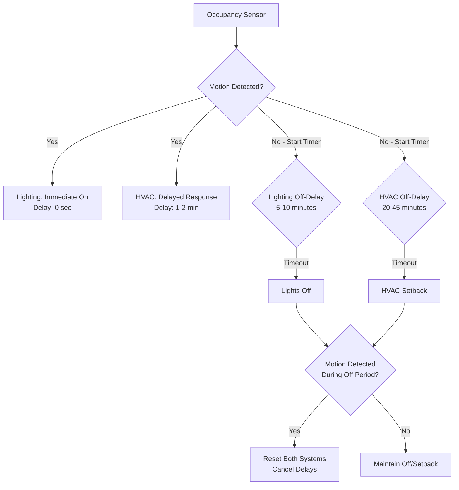

## Sensor Technology Overview

Occupancy sensors provide automatic HVAC setback during periods of guest absence, reducing energy consumption while maintaining comfort upon room reoccupancy. Hotels employ occupancy sensing as an alternative or supplement to property management system (PMS) integration, particularly in properties lacking PMS infrastructure or requiring redundant occupancy detection. Sensor selection involves balancing detection accuracy, guest privacy, false trigger avoidance, and cost considerations.

Three primary technologies dominate hotel occupancy sensing: passive infrared (PIR), ultrasonic, and dual-technology systems combining both approaches. Each technology exhibits distinct characteristics affecting suitability for guest room applications.

## Passive Infrared Sensor Technology

PIR sensors detect infrared radiation changes caused by warm bodies moving within the detection field. Human body temperature (approximately 98.6°F) contrasts with typical room temperatures (68-75°F), creating detectable IR signature changes when guests move. PIR sensors contain pyroelectric elements behind segmented Fresnel lenses focusing IR radiation onto detector elements. Movement across lens segments generates differential signals triggering occupancy indication.

### PIR Detection Characteristics

PIR sensitivity depends on movement direction relative to sensor. Motion directly toward or away from sensor generates minimal signal change, while lateral movement across detection zones produces strong response. This directional sensitivity requires strategic placement ensuring guests cross detection zones during normal room activities.

Temperature differential between occupant and background affects detection reliability. In very warm climates where room temperatures approach body temperature during unoccupied periods, PIR sensitivity decreases. Rooms at 85°F setback temperature provide only 13°F differential compared to 30°F differential at 68°F occupied temperature, potentially causing detection failures.

Detection range varies with mounting height and lens design. Wall-mounted sensors typically cover 15-20 feet at 4-foot mounting height, while ceiling-mounted units achieve 20-30 feet coverage at 8-10 feet height. Guest room applications favor wall mounting at thermostat height (48-52 inches) for aesthetic integration and focused coverage of occupied zones.

### PIR Advantages and Limitations

PIR sensors offer low cost ($10-30 per sensor), simple installation, low power consumption (0.5-2 W), and proven reliability in HVAC applications. They introduce no emitted signals avoiding potential RF interference or privacy concerns from active sensing technologies.

Limitations include inability to detect stationary occupants. Guests sleeping, reading, or working at desks without movement trigger false vacancy detection. Time delay settings mitigate this by requiring sustained absence before setback initiation, but conservative delays (30-45 minutes) reduce energy savings while aggressive delays (10-15 minutes) increase false vacancy risk.

Temperature effects degrade performance in extreme conditions. High room temperatures during summer setback periods reduce detection reliability. Direct sunlight on sensors creates false triggers from rapid temperature changes on walls or furniture. Mounting location must avoid direct solar exposure and heat sources (lighting, electronics).

## Ultrasonic Sensor Technology

Ultrasonic sensors emit high-frequency sound waves (25-40 kHz) inaudible to humans and detect frequency shifts in reflected signals caused by moving objects—the Doppler effect. Room occupants moving toward or away from sensor create frequency shifts proportional to movement velocity, triggering occupancy indication.

### Ultrasonic Detection Principles

Ultrasonic sensors transmit continuous or pulsed ultrasonic waves filling the detection zone. Stationary objects reflect waves at transmitted frequency, while moving objects create frequency-shifted reflections. Sensor electronics compare transmitted and received frequencies, detecting shifts indicating motion.

Detection pattern differs fundamentally from PIR. Ultrasonic sensors detect any motion within coverage area regardless of direction, including movement directly toward or away from sensor. This omnidirectional sensitivity provides more complete coverage but increases susceptibility to false triggers from HVAC airflow moving curtains, papers, or door motion.

Ultrasonic wavelength (approximately 0.5 inches at 27 kHz) reflects from small objects that PIR ignores. HVAC supply air moving curtains or drapes, door opening/closing, and even ceiling fan operation may trigger occupancy indication. Guest room applications require careful selection of mounting location and sensitivity adjustment to minimize false positives.

### Ultrasonic Performance Characteristics

Range and coverage exceed PIR sensors. Single ultrasonic sensors cover 30-40 feet with wide (120-180°) beam patterns, potentially monitoring entire guest room from single mounting location. Ceiling mounting provides optimal coverage distributing detection throughout room volume rather than focusing on specific zones.

Environmental factors affect performance differently than PIR. Temperature, humidity, and air pressure influence sound wave propagation velocity but rarely cause significant detection errors within typical HVAC operating ranges. Acoustic absorption by furnishings, carpeting, and drapes reduces effective range but improves performance by reducing reflections from adjacent spaces.

Power consumption (2-5 W) exceeds PIR sensors due to continuous or frequent ultrasonic transmission. Battery-powered wireless sensors favor PIR technology for extended battery life, while line-powered sensors accommodate ultrasonic energy requirements.

## Dual-Technology Sensor Systems

Dual-technology sensors combine PIR and ultrasonic detection in single device, requiring both technologies to confirm occupancy (AND logic) or allowing either technology to indicate occupancy (OR logic). AND logic minimizes false triggers since both independent technologies must detect motion, while OR logic maximizes detection reliability since either technology suffices.

### AND Logic Configuration

AND logic requires simultaneous PIR infrared detection and ultrasonic Doppler detection before confirming occupancy. This dramatically reduces false triggers from air currents (trigger ultrasonic only), direct sunlight (trigger PIR only), or electrical noise (unlikely to affect both technologies simultaneously). False trigger rate decreases by factor of 10-100 compared to single-technology sensors.

Guest room applications favor AND logic for setback control. False occupancy triggers waste energy by preventing setback during vacant periods, while false vacancy causes discomfort by initiating setback during occupancy. AND logic prioritizes avoiding false vacancy—if either technology detects motion, room remains in occupied mode protecting guest comfort. Setback initiates only when both technologies confirm absence.

Detection delay increases with AND logic since guests must generate motion detectable by both sensor types. PIR requires lateral movement while ultrasonic detects any motion including direct approach. Normal guest room activities (walking, reaching, turning) typically trigger both sensors within 5-10 seconds, acceptable for HVAC applications.

### OR Logic Configuration

OR logic indicates occupancy when either PIR or ultrasonic detects motion, maximizing detection reliability at expense of increased false trigger potential. This configuration suits lighting control where false-off events frustrate occupants more than false-on events waste energy. HVAC applications rarely employ OR logic since false occupancy triggers prevent energy-saving setback.

## Sensor Placement Strategies

Optimal sensor placement ensures reliable occupancy detection throughout guest room while avoiding false triggers from adjacent spaces, exterior conditions, or HVAC operation. Hotel guest rooms present unique challenges including furniture variation between rooms, bathroom doorways requiring detection, and guest privacy expectations limiting surveillance-style monitoring.

### Wall-Mounted Sensor Locations

Wall mounting at thermostat height (48-52 inches) provides convenient integration with HVAC controls while achieving effective detection coverage. Sensors mount on interior walls perpendicular to guest entry path, ensuring guests cross detection zones when entering room. Mounting opposite entry door captures maximum lateral movement as guests traverse room.

Avoid mounting on exterior walls where temperature fluctuations affect PIR performance and ultrasonic signals reflect from window glass creating interference. North-facing walls in northern hemisphere (south-facing in southern hemisphere) minimize solar heating affecting PIR temperature sensitivity.

Coverage verification requires measuring detection patterns in representative rooms accounting for furniture placement. Sensors must detect occupants at bed (sleeping, reading), desk (working), and seating areas (relaxing). Dead zones behind furniture or in bathroom areas may permit undetected occupancy causing premature setback.

### Ceiling-Mounted Configurations

Ceiling mounting provides superior coverage, particularly for ultrasonic sensors with omnidirectional detection patterns. Sensors mount at geometric center of room or offset toward bed area where guests spend majority of time. Ceiling height affects coverage—standard 8-9 foot ceilings suit ceiling mounting while taller ceilings (>10 feet) may exceed optimal range requiring multiple sensors or wall mounting.

PIR ceiling sensors employ 360° detection patterns covering entire room from single location. Sensitivity adjustments prevent false triggers from HVAC diffusers or ceiling fans. Mounting above bed ensures detection of sleeping occupants who occasionally shift position generating detectable motion.

Aesthetic considerations favor ceiling mounting in upscale properties where exposed wall-mounted sensors detract from room appearance. Recessed sensors integrate with ceiling plane matching sprinkler heads, speakers, or detectors. Flush mounting requires coordination during construction to accommodate back boxes and wiring access.

### Bathroom Coverage Considerations

Bathrooms present detection challenges since guests occupy these spaces 5-15% of room time. Sensors failing to detect bathroom occupancy initiate premature setback causing discomfort when guests return to bedroom. Two approaches address bathroom detection:

**Single-point detection** places sensors with direct line-of-sight into bathroom covering toilet, vanity, and shower areas. Open bathroom layouts permit detection from bedroom-mounted sensors, while closed bathrooms require dedicated sensors or door position switches indicating bathroom occupancy.

**Door position switches** provide simple, reliable bathroom occupancy indication. Magnetic contact switches detect door closure assuming bathroom occupancy whenever door closes. This approach generates false occupancy indication when doors close without occupancy but avoids false vacancy during actual use.

## Time Delay Settings

Time delays determine duration required before sensor confirms occupancy (on-delay) or vacancy (off-delay). HVAC applications employ asymmetric delays with minimal on-delay (0-2 minutes) and extended off-delay (15-45 minutes) optimizing guest comfort and energy savings.

### On-Delay Configuration

On-delay prevents immediate system response to brief motion detection, filtering transient signals from insects, air currents, or adjacent space activity. HVAC systems tolerate longer on-delays than lighting since thermal mass provides 15-30 minute buffer before guests perceive temperature changes. Typical on-delays of 1-2 minutes confirm sustained occupancy while permitting rapid comfort restoration when guests enter rooms.

Recovery time from setback determines acceptable on-delay. Equipment must restore comfortable conditions before guests perceive discomfort, requiring:

$$t_{on-delay} + t_{recovery} < t_{tolerance}$$

where $t_{tolerance}$ represents guest discomfort threshold, typically 15-20 minutes in hotel environments expecting immediate comfort. For systems requiring 10 minutes recovery time, maximum on-delay reaches 5-10 minutes. Higher-capacity systems achieve faster recovery permitting longer on-delays improving false trigger immunity.

### Off-Delay Optimization

Off-delay duration critically affects both guest comfort and energy savings. Excessively short delays (5-10 minutes) initiate setback during brief periods of stationary activity (sleeping, reading, working) causing discomfort and guest complaints. Excessively long delays (60+ minutes) prevent setback during actual vacant periods (guests at breakfast, meetings, sightseeing) eliminating energy savings potential.

Optimal off-delay balances false vacancy risk against vacant period duration. Analysis of guest room occupancy patterns reveals typical vacant periods during occupied stays:

- Morning departure to breakfast/meetings: 2-4 hours
- Afternoon touring/business: 4-8 hours
- Evening dining: 1-3 hours
- Brief excursions: 0.5-2 hours

Off-delay settings of 20-30 minutes capture 80-90% of actual vacant periods while minimizing false vacancy during stationary occupancy. More conservative 45-minute delays reduce false vacancy risk to <5% but sacrifice energy savings by failing to capture shorter vacant periods.

Statistical analysis determines optimal delay based on property occupancy patterns:

$$t_{off-delay} = \mu_{vacant} - 2\sigma_{stationary}$$

where $\mu_{vacant}$ represents mean vacant period duration and $\sigma_{stationary}$ represents standard deviation of maximum stationary periods. This setting captures majority of vacant periods while maintaining low false vacancy probability (<2.3% for 2-sigma threshold).

## Integration with Lighting Systems

Occupancy sensors serving dual HVAC and lighting control functions provide enhanced energy savings and simplified installation. Single sensor network monitors occupancy for both building systems, reducing equipment cost and architectural impact. However, HVAC and lighting exhibit different response time requirements and tolerance for false triggers necessitating careful control strategy design.

### Control Logic Coordination

Lighting systems require immediate response to occupancy changes—guests entering dark rooms expect instantaneous illumination while exiting guests accept immediate shutoff. HVAC systems tolerate 5-15 minute delays in both directions due to thermal mass buffering. Shared occupancy sensors implement separate time delays for each system optimizing performance:

Lighting off-delay typically ranges 5-10 minutes providing grace period for stationary occupants while conserving energy during brief absences (bathroom visits). HVAC off-delay extends 20-45 minutes accounting for longer stationary periods (sleeping, working) where lighting motion may occur but HVAC should maintain comfort.

### Energy Savings Synergy

Combined lighting and HVAC control compounds energy savings beyond individual system benefits. Lighting loads generate internal heat gains contributing to cooling loads—reducing lighting operation through occupancy control decreases both lighting energy and proportional cooling energy. Calculate combined savings:

$$E_{total} = E_{lighting} + E_{HVAC} + E_{cooling-from-lights}$$

where cooling energy attributable to lighting heat gain approximates:

$$E_{cooling-from-lights} = E_{lighting} \times \frac{COP_{cooling}^{-1}}{3.412} \times f_{gain}$$

with $COP_{cooling}$ representing cooling equipment efficiency, 3.412 converting kWh to kBtu, and $f_{gain}$ representing fraction of lighting energy entering conditioned space (typically 0.7-0.9 accounting for losses through ceilings). For typical guest room with 300 W lighting and COP 3.0:

$$E_{cooling-from-lights} = 0.3 \text{ kW} \times \frac{3.0^{-1}}{3.412} \times 0.8 = 0.070 \text{ kW}$$

Total saved load reaches 370 W (300 W lighting + 70 W cooling), 23% greater than lighting savings alone. This synergy increases occupancy control cost-effectiveness.

## Privacy Considerations

Guest privacy expectations in hotel rooms limit acceptable occupancy detection methods. Sensors must provide reliable HVAC control without surveillance capabilities, data collection that could track guest activities, or operation indicating monitoring. Hotel-grade sensors differ from commercial office sensors requiring enhanced privacy protection.

### Privacy-Preserving Technologies

PIR and ultrasonic sensors qualify as privacy-preserving technologies since they detect motion without identifying individuals, capturing images, or recording activity patterns beyond simple occupancy state. Unlike cameras or acoustic monitors, motion sensors provide binary (occupied/vacant) output without detailed activity information.

Sensor data processing occurs locally within sensor electronics or thermostat controller—no activity logs transmit to property servers enabling behavioral analysis. Occupancy state may report to building automation systems for energy monitoring, but individual motion events remain unrecorded. This architecture prevents post-event analysis of guest behavior patterns.

Visible sensor indication builds guest trust through transparency. LED indicators showing sensor status (motion detected, system armed) demonstrate sensor function without creating surveillance perception. Labeling identifies sensors as "occupancy detector" or "automatic control" rather than "motion detector" which suggests security monitoring rather than energy management.

### Sensitivity and False Vacancy

Privacy considerations favor conservative sensor sensitivity reducing detection of small movements potentially indicating specific activities. Lower sensitivity detects only substantial motion (walking, standing, large gestures) while ignoring minor movements (hand gestures, shifting while seated). This reduces detection granularity protecting activity privacy while maintaining adequate coverage for HVAC control.

False vacancy tolerance increases in hotel applications compared to commercial buildings. Office occupants tolerate aggressive off-delays (5-10 minutes) and false vacancy events since they understand energy conservation objectives. Hotel guests expect unwavering comfort and interpret false vacancy events as system malfunction or inadequate service. Conservative 30-45 minute off-delays minimize guest complaints despite reduced energy savings.

## Sensor Technology Comparison

Different sensor technologies exhibit distinct characteristics affecting hotel application suitability:

| Technology | Detection Method | Coverage Pattern | False Trigger Rate | Privacy Level | Cost | Power Consumption |
|------------|-----------------|------------------|-------------------|---------------|------|-------------------|
| PIR | Infrared radiation changes | Directional (90-120°) | Low-Moderate | High | $10-30 | 0.5-2 W |
| Ultrasonic | Doppler frequency shift | Omnidirectional (180-360°) | Moderate-High | High | $25-60 | 2-5 W |
| Dual-Tech (AND) | PIR + Ultrasonic combined | Omnidirectional | Very Low | High | $40-90 | 2-5 W |
| Dual-Tech (OR) | PIR or Ultrasonic | Omnidirectional | High | High | $40-90 | 2-5 W |
| Camera-Based | Video analytics | Wide field of view | Very Low | Low | $100-300 | 5-15 W |
| Door Switch | Contact closure | Doorway only | Low | Very High | $5-15 | 0.1 W |

PIR sensors suit budget-conscious hotels requiring adequate performance at minimum cost. Single-technology reliability proves acceptable when combined with conservative time delays (30-45 minutes) minimizing false vacancy impact.

Dual-technology (AND logic) sensors provide optimal performance for upscale properties where guest comfort justifies premium cost. False vacancy rates below 1% eliminate guest complaints while maintaining energy savings during actual vacant periods.

Door switches supplement motion sensors providing definitive room entry/exit indication. Combined door + motion sensor systems achieve highest reliability—door switches detect transitions between occupied and vacant states while motion sensors confirm sustained occupancy during stays.

## Energy Savings from Occupancy Control

Occupancy-based HVAC control reduces energy consumption during periods when rooms sit vacant during checked-in guest stays. Savings depend on guest absence duration, climate conditions, setback temperatures, and equipment efficiency.

### Savings Calculation Methodology

Calculate daily energy consumption comparing occupied control (constant 72°F setpoint) against occupancy-based control (72°F occupied, 80°F cooling setback or 60°F heating setback):

$$E_{savings} = \sum_{i=1}^{n} Q_i \times t_i \times \frac{1}{COP}$$

where $Q_i$ represents room load at condition $i$, $t_i$ represents duration in each condition, and $COP$ reflects equipment efficiency. Room load varies with setpoint temperature following:

$$Q_{cooling} = UA(T_{outdoor} - T_{setpoint}) + Q_{internal}$$

During cooling season with $T_{outdoor} = 95°F$:

- Occupied load: $Q_{occupied} = UA(95 - 72) + Q_{internal} = 23 \times UA + Q_{internal}$
- Setback load: $Q_{setback} = UA(95 - 80) + Q_{internal} = 15 \times UA + Q_{internal}$

Load reduction reaches:

$$\frac{Q_{setback}}{Q_{occupied}} = \frac{15 \times UA + Q_{internal}}{23 \times UA + Q_{internal}}$$

For typical guest room with envelope load dominating ($UA = 200$ Btu/hr·°F, $Q_{internal} = 1000$ Btu/hr):

$$\frac{Q_{setback}}{Q_{occupied}} = \frac{15 \times 200 + 1000}{23 \times 200 + 1000} = \frac{4000}{5600} = 0.71$$

Setback reduces cooling load by 29% during vacant periods. For guest absent 6 hours daily (25% of day):

$$E_{daily-savings} = 0.29 \times 0.25 \times E_{daily-occupied} = 0.073 \times E_{daily-occupied}$$

Annual energy savings reach 7.3% assuming consistent guest absence patterns year-round. Actual savings vary seasonally:

- **Summer cooling-dominated**: 8-12% savings (higher load reduction from setback)
- **Spring/fall shoulder**: 15-20% savings (minimal conditioning loads, setback prevents unnecessary operation)
- **Winter heating-dominated**: 10-15% savings (moderate load reduction, longer vacant periods)

### Climate Impact on Savings Potential

Climate severity affects setback energy savings through outdoor-indoor temperature differential changes. Hot humid climates exhibit high cooling loads both occupied (72°F) and setback (80°F) since outdoor conditions (95°F) exceed both setpoints substantially. Moderate climates show greater proportional savings since setback temperature (80°F) approaches outdoor temperature reducing or eliminating cooling requirement.

Calculate climate-specific savings potential:

$$\text{Savings\%} = \frac{\Delta T_{occupied} - \Delta T_{setback}}{\Delta T_{occupied}} \times f_{vacant}$$

where $\Delta T$ represents outdoor-indoor temperature difference and $f_{vacant}$ represents fraction of time vacant during occupied guest stays.

**Hot humid climate** (Miami, summer):
- Occupied: $\Delta T = 95 - 72 = 23°F$
- Setback: $\Delta T = 95 - 80 = 15°F$
- Savings potential: $\frac{23-15}{23} \times 0.25 = 8.7\%$

**Moderate climate** (San Francisco, summer):
- Occupied: $\Delta T = 75 - 72 = 3°F$
- Setback: $\Delta T = 75 - 80 = -5°F$ (no cooling required)
- Savings potential: $\frac{3-0}{3} \times 0.25 = 25\%$

Moderate climates demonstrate higher percentage savings despite lower absolute energy consumption. Properties in these climates achieve excellent payback from occupancy control systems.

## Implementation Best Practices

Successful occupancy sensor deployment requires appropriate technology selection, careful placement, proper time delay configuration, and ongoing performance verification. Properties implementing comprehensive occupancy control programs achieve 8-15% total HVAC energy reduction while maintaining or improving guest satisfaction scores.

### System Commissioning

Commission occupancy sensor systems by verifying detection coverage in representative sample rooms (minimum 10% of total rooms, minimum 5 rooms). Test procedures include:

1. **Coverage verification**: Walk through room including bed, desk, seating, and bathroom areas confirming sensor response within 10 seconds
2. **Stationary detection**: Remain motionless in each occupied zone for duration exceeding off-delay setting, intentionally triggering false vacancy to confirm time delay operation
3. **Setback confirmation**: Verify HVAC equipment initiates setback within 2 minutes of off-delay expiration
4. **Recovery verification**: Trigger occupancy detection confirming equipment exits setback within on-delay duration plus equipment response time (typically 2-3 minutes total)
5. **Integration testing**: Confirm lighting and HVAC systems respond independently per specified time delays

Document commissioning results including sensor locations, coverage patterns, time delay settings, and any dead zones requiring furniture relocation or additional sensors.

### Ongoing Monitoring and Optimization

Monitor occupancy control performance through building automation system data analysis. Key performance indicators include:

- **False vacancy rate**: Guest comfort complaints attributed to premature setback (<2% target)
- **Vacant period capture**: Percentage of actual vacant time achieving setback (>80% target)
- **Energy savings**: Measured consumption versus baseline occupied-only control (>8% target)
- **Sensor fault rate**: Failed or degraded sensors requiring replacement (<1% annually)

Analyze individual room performance identifying outliers indicating sensor placement issues, equipment faults, or unusual guest behavior patterns. Rooms showing no setback events over extended periods suggest sensor failures requiring maintenance. Rooms with very frequent setback cycles may indicate false triggers requiring sensitivity adjustment.

Seasonal optimization adjusts time delays based on climate conditions and guest behavior changes. Winter and summer peak seasons see higher occupancy rates and longer guest stays warranting shorter off-delays (20-30 minutes). Shoulder seasons with brief stays and frequent guest turnover benefit from longer delays (40-45 minutes) avoiding setback during short stays.
