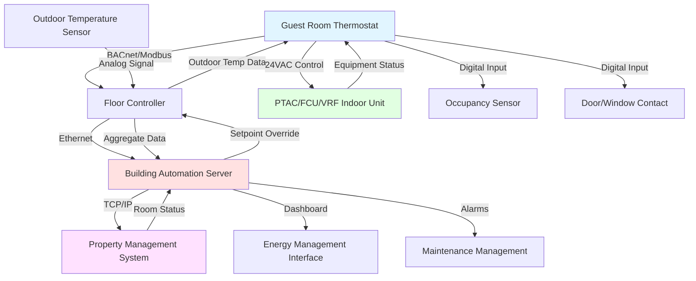

## Thermostat Technology Overview

Hotel guest room thermostats serve dual purposes: providing guests with intuitive climate control while enabling property energy management. Modern thermostats balance user satisfaction against operational efficiency through sophisticated control strategies invisible to occupants. The thermostat represents the primary interface between guests and HVAC systems, making reliability, responsiveness, and ease of use critical to guest experience.

Thermostat selection impacts energy consumption, maintenance requirements, and integration capabilities. Digital thermostats dominate new installations due to superior control precision, communication capabilities, and programmable features. Analog thermostats persist in budget properties and older installations where simplicity and low cost outweigh advanced functionality.

## Digital versus Analog Thermostats

### Digital Thermostat Characteristics

Digital thermostats employ electronic temperature sensors (thermistors or integrated circuit sensors) with precision of ±0.2-0.5°F compared to ±2-3°F for mechanical thermostats. This accuracy enables tighter temperature control with narrower deadbands, reducing temperature swing and improving comfort. Digital displays show current temperature, setpoint, and system status directly, eliminating guest confusion about thermostat position versus actual conditions.

Microprocessor-based control implements complex logic including adaptive algorithms, occupancy detection integration, time-of-day scheduling, and remote communication. Digital thermostats store operating parameters in non-volatile memory, retaining settings through power outages without guest intervention. Display backlighting enhances nighttime visibility, important for hotel guests unfamiliar with room layouts.

Digital thermostats support multiple sensor inputs including remote wall sensors, return air sensors, and outdoor temperature sensors for enhanced control accuracy. Anticipatory algorithms predict heating and cooling needs based on rate-of-change measurements, starting equipment before temperature exceeds deadband limits. This reduces temperature overshoot and cycling frequency.

Cost ranges $80-$300 per unit depending on features and communication capabilities. Installation requires low-voltage wiring identical to analog thermostats but may include network cabling for BACnet or Modbus communication. Programming complexity demands trained technicians for initial setup and troubleshooting.

### Analog Thermostat Operation

Analog (mechanical) thermostats use bimetallic coils or liquid-filled bellows that expand and contract with temperature changes. Mechanical movement actuates mercury switches or snap-action contacts that control HVAC equipment. Simple construction provides reliable operation with minimal failure modes—thermostats function decades without electronic component degradation.

Temperature sensing occurs at thermostat location only, without remote sensor capability. Mechanical hysteresis creates inherent deadband of 1-2°F preventing excessive cycling. Setpoint adjustment uses rotating dial or slide lever with marked temperature scale. Guests understand operation intuitively through physical feedback—dial position directly corresponds to temperature setting.

Analog thermostats lack communication capability, preventing integration with building automation systems or property management systems. Energy management requires manual adjustment or electromechanical timers that physically rotate dials on schedules. This limitation restricts analog thermostats to properties without centralized control requirements.

Cost advantages appear significant at $15-$40 per unit, but lack of integration capability reduces long-term value in managed properties. Analog thermostats suit small motels, extended-stay properties with long-term guests managing their own energy use, and renovation projects where existing wiring cannot support digital controls.

## Thermostat Type Comparison

| Feature | Digital Thermostat | Analog Thermostat |
|---------|-------------------|-------------------|
| Temperature accuracy | ±0.2-0.5°F | ±2-3°F |
| Deadband control | Programmable 0.5-5°F | Fixed 1-2°F (mechanical) |
| Display type | LCD/LED with backlight | Mechanical dial or slider |
| Remote communication | BACnet, Modbus, proprietary | None |
| Setpoint limiting | Software-based, invisible | Mechanical stops, visible |
| Occupancy integration | Supported via digital inputs | Manual adjustment only |
| Energy monitoring | Capable with appropriate hardware | Not available |
| Initial cost | $80-$300 | $15-$40 |
| Installation complexity | Moderate (wiring + programming) | Low (wiring only) |
| Maintenance requirements | Sensor calibration, software updates | Minimal, mechanical adjustment |
| Typical lifespan | 10-15 years | 20-30 years |
| Guest interface | Buttons/touchscreen, intuitive | Physical dial, very intuitive |

## Setpoint Range Limiting for Energy Savings

Unrestricted setpoint adjustment allows guests to select extreme temperatures that waste energy and stress equipment. Effective limiting strategies constrain operation without appearing restrictive to guests.

### Transparent Limiting Approaches

Advanced digital thermostats display full temperature range (60-85°F) but internally limit actual control outputs to narrower ranges (68-76°F cooling, 65-74°F heating). When a guest sets 65°F cooling, the thermostat displays 65°F and activates equipment immediately, providing perception of responsiveness. Internal logic clamps actual control setpoint at 68°F minimum, preventing excessive cooling while satisfying guest expectations.

This approach maintains premium service perception while achieving energy savings. Equipment responds audibly and visibly to guest input, creating psychological comfort through perceived control. Actual temperature stabilizes at controlled minimum rather than extreme setpoint, reducing energy consumption by 15-25% compared to unrestricted operation.

Implementation requires careful calibration of limiting ranges based on climate and equipment capacity. Limits set too tightly cause guest complaints when rooms fail to achieve comfortable conditions during extreme weather. Limits set too loosely provide minimal energy benefit. Typical cooling limits restrict to 68°F minimum, 76°F maximum; heating limits span 65-74°F.

Calculate potential energy savings from setpoint limiting:

$$E_{saved} = \frac{Q \times \Delta T_{limit}}{COP \times 3412} \times t_{occupied}$$

where $Q$ represents room load in BTU/hr, $\Delta T_{limit}$ is temperature difference between unlimited and limited setpoints (typically 3-5°F), COP is equipment coefficient of performance, and $t_{occupied}$ represents annual occupied hours. For a typical room with 12,000 BTU/hr capacity, COP 3.0, limiting setpoints by 4°F over 5,000 occupied hours annually:

$$E_{saved} = \frac{12000 \times 4}{3.0 \times 3412} \times 5000 = 23,450 \text{ kWh/year}$$

### Physical Limiting Methods

Mechanical stops physically prevent dial rotation or slider movement beyond defined limits. This approach applies to both analog and digital thermostats through setpoint lockout screws or removable range limiters. Guests immediately encounter physical resistance when attempting to exceed limits, creating frustration and negative perception.

Physical limiting suits budget properties prioritizing cost control over guest satisfaction, or spaces where extreme setpoints pose equipment damage risk. Conference rooms, back-of-house areas, and storage spaces benefit from locked setpoint ranges preventing accidental misadjustment.

Password-protected digital menus provide adjustable limits changeable by maintenance staff. This enables seasonal adjustment—wider ranges during extreme weather when equipment handles loads, narrower ranges during mild weather maximizing efficiency. Menu access requires button combinations or configuration software preventing guest modification.

## Deadband Settings for Efficiency

Deadband represents the temperature range between heating and cooling activation points. Wider deadbands reduce equipment cycling frequency and energy consumption but increase temperature swing potentially affecting comfort.

### Occupied Mode Deadband Design

Guest-occupied rooms typically maintain 2-3°F deadband in auto mode. A 72°F setpoint initiates cooling when room temperature reaches 73-74°F and heating when temperature drops to 70-71°F. This tolerance prevents simultaneous heating and cooling while accommodating normal temperature drift from solar gains, infiltration, and occupancy metabolic loads.

Calculate deadband impact on cycling frequency:

$$f_{cycle} = \frac{Q_{loss}}{C_{room} \times \Delta T_{deadband}}$$

where $Q_{loss}$ represents average heat loss/gain rate in BTU/hr, $C_{room}$ is room thermal capacitance in BTU/°F (typically 3,000-5,000 BTU/°F for furnished guest rooms), and $\Delta T_{deadband}$ is deadband width in °F. A room losing 3,000 BTU/hr with thermal capacitance of 4,000 BTU/°F and 2°F deadband cycles:

$$f_{cycle} = \frac{3000}{4000 \times 2} = 0.375 \text{ cycles/hour}$$

Increasing deadband to 3°F reduces cycling to 0.25 cycles/hour, decreasing compressor starts and fan energy. Excessively wide deadbands (>4°F in occupied mode) create noticeable temperature swings prompting guest complaints and thermostat adjustments that defeat energy savings intent.

Four-pipe and VRF systems supporting simultaneous heating and cooling still implement deadbands through control logic. Although equipment physically provides concurrent operation, controls prevent wasteful scenarios where adjacent rooms operate in opposite modes with air mixing through corridors or common plenums.

### Unoccupied Mode Deadband Expansion

Vacant rooms implement wide deadbands (15-25°F) minimizing equipment operation while preventing extreme conditions. Cooling setback to 80-82°F and heating setback to 55-60°F creates neutral zone where HVAC remains off until temperature drifts to extremes. This strategy reduces energy consumption 30-45% during vacant periods.

Deadband width balances energy savings against recovery time when guests check in. Wider deadbands maximize savings but extend recovery duration—a room at 82°F requires 30-60 minutes to reach 72°F comfort conditions depending on equipment capacity and outdoor conditions. Hotels must ensure recovery completes before guest room access to prevent negative first impressions.

Optimal setback temperatures vary by climate zone:

- **Hot-humid climates**: 80-82°F cooling setback limits humidity accumulation preventing mold growth
- **Hot-dry climates**: 82-85°F setback acceptable due to low humidity concerns
- **Cold climates**: 55-58°F heating setback prevents freeze damage to plumbing
- **Mild climates**: 80°F cooling / 60°F heating provides balance

## Override Capabilities and Duration Limits

Guest override capability determines whether occupants can defeat automated setback strategies during their stay.

### Timed Override Functions

Timed override permits guest adjustment for limited duration (2-4 hours) before reverting to energy-saving mode. When guests return to rooms during afternoon and demand immediate cooling, thermostat responds to setpoint changes but automatically reverts to setback after preset interval if no additional input occurs.

This approach assumes guest absence when prolonged inactivity occurs. Sophisticated algorithms combine override duration with occupancy sensor inputs—if motion detected, override extends indefinitely; if no motion for 2 hours, system assumes guest departed and initiates setback. False triggers from housekeeping entry require 15-30 minute reactivation delays preventing nuisance setbacks during legitimate occupancy.

Guest perception remains critical. Timed overrides must operate invisibly without displays counting down or announcing impending setback. Gradual temperature drift toward setback over 15-20 minutes rather than abrupt changes at timer expiration maintains comfort while achieving energy goals.

### Manual Override Strategies

Full manual override provides unlimited guest control until checkout. This maximizes satisfaction in luxury properties where guest experience outweighs energy costs. Staff can remotely monitor override status through BAS, identifying rooms with sustained extreme setpoints for guest contact or maintenance investigation.

Partial override permits adjustment within constrained ranges (±3-5°F from automated setpoint) or restricts adjustment authority during specific hours. Night setback from 2-6 AM limits cooling to 74°F minimum even with guest override, reducing load during peak rate periods. Guests sleeping typically accept slightly warmer conditions, especially when temperature change occurs gradually.

No-override approaches apply only to unoccupied floors, out-of-service rooms, or extreme budget properties accepting negative guest feedback. Locked thermostats frustrate occupants and generate complaints, suitable only where cost control absolutely supersedes satisfaction.

## Communication Protocols

Modern hotel control systems integrate room thermostats with central building automation using standardized protocols.

### BACnet Integration

BACnet (Building Automation and Control Networks) provides open-protocol communication supporting multi-vendor integration. Thermostats implement BACnet MS/TP (Master-Slave/Token-Passing) over RS-485 wiring or BACnet/IP over Ethernet infrastructure.

BACnet objects expose thermostat data points for monitoring and control:

- Analog Input: Room temperature, outdoor temperature, humidity
- Analog Value: Setpoint, deadband settings
- Analog Output: Valve position, damper position
- Binary Input: Occupancy status, window contact, service mode
- Binary Output: Fan status, heating call, cooling call
- Multi-State Value: Operating mode (off/heat/cool/auto)

Central systems read room conditions, adjust setpoints based on PMS occupancy data, and trend energy consumption for analysis. BACnet's object-oriented structure enables consistent interface across different thermostat manufacturers, simplifying system expansion and equipment replacement.

Polling intervals of 1-5 minutes provide adequate resolution for guest room monitoring without excessive network traffic. Critical alarms (equipment failure, extreme temperature) transmit immediately via Change-of-Value (COV) reporting.

### Modbus Communication

Modbus RTU protocol operates over RS-485 multidrop networks connecting multiple thermostats to central controllers. Simple register-based communication maps thermostat parameters to numerical addresses read and written by master devices.

Modbus implementation costs less than BACnet due to simpler protocol stacks and reduced processor requirements in field devices. However, lack of object standardization means each manufacturer defines unique register maps requiring custom configuration for integration. This creates vendor lock-in and complicates mixed-manufacturer installations.

Typical Modbus register mapping:

- Register 40001: Room temperature (°F × 10)
- Register 40002: Setpoint temperature (°F × 10)
- Register 40003: Operating mode (0=off, 1=heat, 2=cool, 3=auto)
- Register 40004: Fan mode (0=auto, 1=on)
- Register 40005: Occupancy status (0=vacant, 1=occupied)
- Register 40101: Heating output (0-100%)
- Register 40102: Cooling output (0-100%)

Communication speed typically operates at 9,600 or 19,200 baud, adequate for guest room applications requiring subsecond response times. Network topology supports up to 32-247 devices per segment depending on driver hardware.

### Proprietary Protocols

Many manufacturers implement proprietary communication supporting advanced features unavailable in open protocols. Carrier Comfort Network, Honeywell RedLINK, and LG BECON protocols optimize performance for specific equipment types but prevent multi-vendor integration.

Proprietary protocols suit single-manufacturer projects where performance optimization and feature depth outweigh open-system benefits. VRF installations commonly employ manufacturer-specific protocols enabling refrigerant temperature control, outdoor unit capacity allocation, and advanced diagnostics impossible through generic BACnet or Modbus interfaces.

Gateway devices translate between proprietary and open protocols when integration with third-party BAS becomes necessary. Gateways introduce cost ($500-$2,000 per gateway) and potential communication latency but preserve both manufacturer-specific capabilities and building system integration.

## Thermostat System Integration Architecture

## Guest Interface Design Considerations

Successful thermostat interfaces enable intuitive operation by unfamiliar users within seconds of first encounter.

### Visual Design Principles

High-contrast displays remain readable under varying lighting from dark nighttime conditions to bright afternoon sun exposure. White-on-black or black-on-white LCD displays outperform gray-on-gray or colored displays for legibility. Backlight activation via button press or motion detection aids nighttime visibility without continuous illumination disturbing sleep.

Large numerals (0.5-0.8 inch height) showing current temperature and setpoint enable reading from across room or by visually impaired guests. Icon-based mode indicators (snowflake for cooling, flame for heating, fan symbol) transcend language barriers for international travelers. Minimize text, using universally recognized symbols wherever possible.

Button or touch sensor size must accommodate operation by guests with limited dexterity, wearing gloves, or operating in darkness. Minimum 0.5-inch button spacing prevents accidental adjacent button activation. Tactile feedback through mechanical click or haptic vibration confirms successful button press without requiring visual verification.

### Operational Simplicity

Limit primary interface to four essential functions: temperature increase, temperature decrease, mode selection, and fan control. Advanced features (scheduling, humidity control, filter reminders) hide in secondary menus accessed via long-press or button combinations.

Temperature adjustment must respond within 0.1 seconds with display update and equipment activation within 2-3 seconds providing acoustic feedback that system received command. Even if actual air temperature changes slowly due to thermal mass, immediate fan operation creates perception of responsive system.

Mode selection cycles through logical sequence: Off → Heat → Cool → Auto → Off. Single mode button simplifies operation compared to separate heating and cooling buttons. Auto mode particularly suits shoulder seasons and climates with daily temperature swings requiring both heating and cooling.

### Accessibility Requirements

ADA (Americans with Disabilities Act) compliance mandates tactile differentiation between controls and operable parts distinguishable through touch alone. Raised or recessed buttons enable operation by visually impaired guests. Controls mounted 15-48 inches above floor permit wheelchair access.

Voice-controlled integration through in-room assistants (Amazon Alexa, Google Assistant) provides alternative interface for guests with mobility limitations. Voice commands adjust temperature, change modes, and query current conditions without physical thermostat interaction. Privacy-conscious implementations process commands locally without cloud transmission.

Large-print labels and high-contrast color schemes aid low-vision guests. Avoid reliance on color alone to convey information—use text, symbols, or position in addition to color coding. Red typically indicates heating, blue cooling, but symbols must accompany colors for colorblind accessibility.

## Energy Efficiency Through Thermostat Design

Properly configured thermostats enable 25-40% energy savings compared to basic on/off controls.

### Adaptive Control Algorithms

Microprocessor-based thermostats implement adaptive algorithms learning room thermal characteristics over time. By measuring temperature rise and fall rates under various conditions, controls predict heating and cooling capacity requirements optimizing equipment operation.

Adaptive anticipation starts equipment before temperature exceeds deadband based on rate-of-change predictions. If room temperature rises 0.5°F per hour toward cooling setpoint, thermostat activates cooling when current temperature plus predicted rise equals deadband limit. This prevents overshoot while maintaining comfort.

Self-tuning PID (Proportional-Integral-Derivative) control adjusts modulating valve or damper positions based on error magnitude and duration. Proportional action provides output proportional to current error, integral action eliminates steady-state offset, and derivative action dampens oscillation. PID constants auto-tune during initial operation establishing optimal response for specific room and equipment characteristics.

### Occupancy-Based Optimization

Integration with occupancy sensors, door contacts, and PMS systems enables intelligent operation matching equipment to actual needs. Calculate occupancy-based savings:

$$E_{savings} = P_{HVAC} \times (1 - OF) \times h_{year} \times SF$$

where $P_{HVAC}$ represents average HVAC power in kW, $OF$ is occupancy factor (typically 0.60-0.75 for hotels), $h_{year}$ equals 8,760 hours annually, and $SF$ is setback savings factor (0.30-0.45). For a room averaging 1.2 kW HVAC load with 65% occupancy and 35% setback savings:

$$E_{savings} = 1.2 \times (1 - 0.65) \times 8760 \times 0.35 = 1,287 \text{ kWh/year}$$

At $0.12/kWh electricity cost, annual savings equal $154 per room. A 200-room hotel achieves $30,800 annual savings justifying sophisticated control implementation.

## Installation and Commissioning

Proper installation ensures accurate control and reliable operation throughout thermostat service life.

Mount thermostats 48-60 inches above finished floor on interior walls away from:
- Direct sunlight from windows
- Supply air diffusers creating false temperature readings
- Heat sources (televisions, lamps, exterior walls)
- Cold sources (exterior walls in cold climates)
- Bathroom doors releasing humid air

Location accuracy affects control precision significantly. A thermostat mounted 12 inches from a supply diffuser reads 2-4°F cooler than average room temperature during cooling operation, causing inadequate conditioning and guest complaints.

Verify proper calibration during commissioning by comparing thermostat reading against precision reference thermometer at multiple temperatures across operating range. Adjust calibration offset if necessary to achieve ±0.5°F accuracy.

Test communication with BAS by commanding setpoint changes from central system and monitoring thermostat response. Verify PMS integration by simulating checkout events and confirming automatic setback activation within defined time limits.

Document thermostat configuration parameters including setpoint limits, deadband settings, PID constants, and communication addresses for future reference during troubleshooting and replacement.
