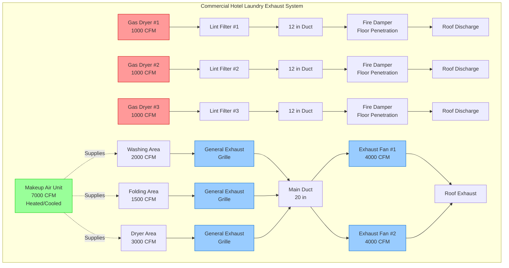

## Overview

Commercial hotel laundries generate substantial heat, moisture, and lint that must be effectively removed through properly designed exhaust systems. Dryer exhaust systems require particular attention to fire prevention through lint control, while general room exhaust manages sensible heat loads from equipment operation. The combination of high-temperature equipment and combustible lint creates fire hazards that mandate compliance with NFPA 90A and manufacturer requirements.

## Dryer Exhaust Requirements

### Exhaust Flow Calculations

Dryer manufacturers specify required exhaust flow rates based on heat input and moisture removal capacity. For gas-fired dryers, the exhaust flow can be estimated:

$$Q_{dryer} = Q_{comb} + Q_{evap}$$

where $Q_{comb}$ represents combustion air products and $Q_{evap}$ represents moisture-laden air from fabric drying.

For a typical 100 lb capacity gas dryer with 200,000 BTU/hr input:

$$Q_{dryer} = 800-1200 \text{ CFM per dryer}$$

Electric dryers require lower exhaust rates since combustion products are not present:

$$Q_{electric} = 400-600 \text{ CFM per dryer}$$

### Duct Sizing and Velocity

Dryer exhaust ducts must maintain minimum velocity to prevent lint accumulation while avoiding excessive pressure drop. The required duct diameter follows:

$$D = \sqrt{\frac{4Q}{\pi V}}$$

where $V$ = duct velocity (1200-1800 FPM recommended for lint transport).

For 1000 CFM dryer exhaust at 1500 FPM:

$$D = \sqrt{\frac{4 \times 1000}{\pi \times 1500}} = 0.92 \text{ ft} = 11 \text{ inches}$$

Standard practice uses 12-inch diameter minimum for commercial dryer exhausts. Ducts must be metal (galvanized steel or aluminum), smooth interior, with all joints in the direction of airflow to prevent lint accumulation.

## Lint Collection and Fire Prevention

### Lint Screen Requirements

Each dryer requires:

- **Primary lint screen** at dryer discharge (cleaned after each load)
- **Secondary lint filter** in exhaust duct (inspected weekly, cleaned monthly)
- **Tertiary lint collection** at exhaust fan inlet (commercial installations)

Lint accumulation represents a severe fire hazard. Lint has an ignition temperature of approximately 450-500°F, well below dryer exhaust temperatures during heavy use.

### Fire Prevention Measures

Critical fire safety requirements include:

1. **Metal ductwork only** - No flexible plastic or foil ducts in commercial applications
2. **Minimum duct length** - Shortest practical route to exterior
3. **Maximum equivalent length** - Typically 50-75 ft including fittings
4. **Clearances to combustibles** - Minimum 6 inches or per manufacturer
5. **No backdraft dampers** in dryer exhaust (lint accumulation risk)
6. **Regular inspection and cleaning** - Quarterly minimum, monthly preferred

### Fire Damper Requirements per NFPA 90A

NFPA 90A Section 5.3.3 requires fire dampers where dryer exhaust ducts penetrate fire-rated assemblies:

- **1.5-hour rated fire dampers** at floor/ceiling penetrations
- **3-hour rated fire dampers** at vertical shaft penetrations
- **Fusible link temperature** - 165°F or 212°F depending on location
- **Access for inspection** - Required at all damper locations

Exception: Individual dryer exhausts may omit fire dampers if ducts are continuously welded steel and penetrations are protected by listed through-penetration firestop systems.

## General Room Exhaust

### Heat Removal Requirements

Commercial laundry facilities generate 15,000-25,000 BTU/hr per dryer from equipment surface radiation and convection. General exhaust requirements:

$$Q_{room} = \frac{Q_{sensible}}{1.08 \times \Delta T}$$

For a laundry with 10 dryers generating 200,000 BTU/hr total sensible heat with acceptable temperature rise of 15°F:

$$Q_{room} = \frac{200,000}{1.08 \times 15} = 12,346 \text{ CFM}$$

This general exhaust is **in addition to** dedicated dryer exhaust flows.

### Recommended Air Changes

Industry standards suggest:

| Space Type | Air Changes per Hour | Notes |
|------------|---------------------|-------|
| Dryer area | 20-30 ACH | High heat generation zone |
| Washing area | 15-20 ACH | Moderate moisture generation |
| Folding area | 10-15 ACH | Lower load, comfort-focused |
| Soiled linen storage | 15-20 ACH | Odor control priority |

## Exhaust Requirements by Equipment

| Equipment Type | Exhaust Flow (CFM) | Duct Size | Connection Type |
|----------------|-------------------|-----------|-----------------|
| 50 lb gas dryer | 600-800 | 10 in | Direct, dedicated |
| 100 lb gas dryer | 800-1200 | 12 in | Direct, dedicated |
| 200 lb gas dryer | 1200-1600 | 14 in | Direct, dedicated |
| 50 lb electric dryer | 300-400 | 8 in | Direct, dedicated |
| 100 lb electric dryer | 400-600 | 10 in | Direct, dedicated |
| Steam pressing | 150-300 | Hood capture | General exhaust |
| Ironing stations | 100-200 per station | Hood capture | General exhaust |

## Stack Effect and Backdraft Prevention

### Stack Effect Challenges

Multi-story hotels create significant stack effect pressure differentials:

$$\Delta P_{stack} = 7.64 \times h \times \left(\frac{1}{T_o} - \frac{1}{T_i}\right)$$

where $h$ = height (ft), $T_o$ and $T_i$ = outdoor and indoor absolute temperatures (°R).

For a basement laundry 40 ft below neutral pressure plane in winter (70°F indoor, 0°F outdoor):

$$\Delta P_{stack} = 7.64 \times 40 \times \left(\frac{1}{460} - \frac{1}{530}\right) = 0.09 \text{ in. w.c.}$$

This negative pressure opposes exhaust flow and must be overcome by exhaust fan static pressure.

### Backdraft Prevention Strategies

1. **Dedicated makeup air systems** - Provide 90% of exhaust volume as conditioned makeup air
2. **Barometric relief dampers** - Prevent excessive negative pressure
3. **Exhaust fan capacity** - Size for peak load plus stack effect
4. **Separate exhaust systems** - Dryer exhaust independent from general exhaust
5. **Gravity dampers at terminals** - Prevent reverse flow when fans off (general exhaust only)

## Exhaust Fan Selection

### Fan Type Selection

- **Centrifugal upblast** - Most common for rooftop installations
- **Inline centrifugal** - For horizontal discharge applications
- **Backward-inclined blades** - Preferred for efficiency and lint handling

### Sizing Criteria

Select exhaust fans for:

$$SP_{total} = \Delta P_{duct} + \Delta P_{hood} + \Delta P_{stack} + \Delta P_{margin}$$

Typical static pressure requirements:

- Dryer exhaust: 1.0-2.5 in. w.c.
- General room exhaust: 0.5-1.5 in. w.c.

### Redundancy Requirements

Critical hotel laundries require:

- **N+1 redundancy** for general exhaust (minimum 2 fans, each 60-75% capacity)
- **Individual dryer exhausts** not typically redundant (equipment-specific)
- **Variable speed control** to maintain space pressure during partial load
- **Emergency backup power** for exhaust fans in critical facilities

## Laundry Exhaust System Layout

## Installation Best Practices

### Duct Installation

- **Continuous slope** toward discharge (1/4 in per foot minimum)
- **Smooth interior joints** to prevent lint accumulation
- **Minimize elbows** - Each 90° elbow adds 5-10 ft equivalent length
- **Support spacing** - Maximum 10 ft centers for horizontal runs
- **Cleanout access** - Every 20 ft and at each elbow
- **Termination height** - Minimum 10 ft above roof, 3 ft above parapet

### Maintenance Access

Provide access panels at:

- All lint filters (daily/weekly access required)
- Fire dampers (annual inspection)
- Exhaust fan motors and drives
- Duct cleanout locations

### Commissioning Requirements

1. **Airflow verification** - Measure actual CFM at each dryer
2. **Static pressure test** - Verify fan capacity and duct resistance
3. **Lint filter inspection** - Confirm installation and accessibility
4. **Fire damper operation** - Test fusible links and closure
5. **Interlock testing** - Dryer shutdown on exhaust failure (if provided)
6. **Documentation** - Provide maintenance schedule and O&M manuals

Proper exhaust system design for commercial hotel laundries ensures fire safety, equipment performance, and occupant comfort while maintaining code compliance and operational efficiency.
