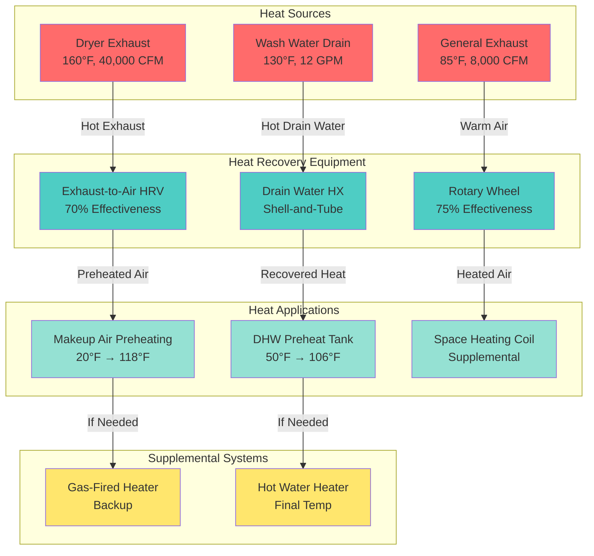

Commercial hotel laundries waste tremendous thermal energy through dryer exhaust, hot wash water discharge, and ventilation systems. Heat recovery technologies capture this waste energy for beneficial reuse, reducing operating costs by 20-40% while decreasing environmental impact through lower fuel consumption and carbon emissions.

## Dryer Exhaust Heat Recovery Systems

Dryer exhaust represents the single largest heat recovery opportunity in commercial laundries, with continuous high-temperature airflows carrying substantial recoverable energy.

### Exhaust Heat Characteristics

**Temperature and energy content:**
- Dryer exhaust temperature: 140-180°F during active drying cycles
- Typical 50-pound commercial dryer: 10,000 CFM exhaust at 160°F
- Sensible heat available: $Q = CFM \times 1.08 \times \Delta T$

For exhaust at 160°F cooled to 100°F:

$$Q_{available} = 10,000 \text{ CFM} \times 1.08 \times (160-100) = 648,000 \text{ BTU/hr}$$

Single dryer operating 8 hours daily provides 5.2 million BTU/day recoverable energy, equivalent to 40 therms natural gas or 1,520 kWh electricity.

**Operational patterns:**
- Cyclic operation creates intermittent availability
- 50-70% duty cycle typical in hotel laundries
- Average recovery potential: 360,000-450,000 BTU/hr per dryer
- Multiple dryers provide more consistent energy source

### Heat Recovery Ventilator (HRV) Systems

Exhaust-to-supply air heat exchangers transfer sensible heat from dryer exhaust to incoming makeup air without mixing airstreams.

**Configuration and performance:**
- Counter-flow plate heat exchangers: 60-75% sensible effectiveness
- Rotary wheel exchangers: 70-85% sensible effectiveness
- Heat pipe exchangers: 45-65% effectiveness with no moving parts

**Effectiveness calculation:**

$$\varepsilon = \frac{T_{supply,leaving} - T_{supply,entering}}{T_{exhaust,entering} - T_{supply,entering}}$$

For 70% effective HRV with 160°F exhaust and 20°F outdoor air:

$$T_{supply,leaving} = 20 + 0.70 \times (160-20) = 20 + 98 = 118°F$$

Makeup air preheating from 20°F to 118°F dramatically reduces supplemental heating requirements.

**System sizing considerations:**
- Size for continuous minimum exhaust flow from base-loaded dryers
- Install bypass dampers for summer operation when heating not required
- Balance exhaust and supply volumes to maintain building pressure control

### Water-to-Air Heat Recovery

Exhaust air heats water loop subsequently used for domestic hot water preheating or space heating.

**Finned coil heat exchangers:**
- Install in exhaust ductwork downstream of lint filters
- 3-6 rows deep coils with aluminum fins on copper tubes
- Glycol solution prevents freezing if outdoor installation
- Heat transfer effectiveness: 40-60% depending on coil rows and approach temperatures

**Heat recovery calculation:**

Water heating from 50°F to 140°F using exhaust at 160°F with 50% effectiveness:

$$Q_{recovered} = \varepsilon \times Q_{maximum} = 0.50 \times 648,000 = 324,000 \text{ BTU/hr}$$

Water flow rate required:

$$\dot{m} = \frac{Q}{c_p \times \Delta T} = \frac{324,000}{1.0 \times (140-50)} = 3,600 \text{ lb/hr} = 7.2 \text{ GPM}$$

This preheats 7.2 GPM continuously, offsetting 65% of typical hotel domestic hot water load during laundry operation hours.

### Lint and Moisture Considerations

Dryer exhaust contains 200-400 grains moisture per pound dry air plus substantial lint loading, creating fouling risks requiring careful design.

**Lint management strategies:**
- Install industrial lint filters upstream of heat recovery equipment
- Specify washable or self-cleaning filter media
- Size filters for 300-400 FPM face velocity limiting pressure drop
- Weekly cleaning schedule minimum to maintain performance

**Heat exchanger selection:**
- Wide fin spacing (4-6 fins per inch vs. 10-12 FPI standard) reduces lint accumulation
- Smooth surfaces minimize fouling sites
- Accessible coil faces for quarterly high-pressure washing
- Epoxy-coated or stainless steel construction resists corrosion from moisture

**Condensation prevention:**
- Maintain heat exchanger surface temperatures above exhaust dewpoint
- Control water flow rates preventing excessive surface cooling
- Install condensate drains at low points even if design prevents condensation
- Monitor pressure drop increase indicating fouling requiring cleaning

## Wash Water Heat Recovery Opportunities

Commercial washers discharge thousands of gallons daily of 120-140°F water containing substantial recoverable thermal energy.

### Drain Water Heat Recovery

**Heat content calculation:**

For 100 loads daily, 3 gallons per pound capacity, 50-pound washers, 130°F drain temperature:

$$Q_{total} = 100 \times 3 \times 50 \times 8.33 \times (130-50) = 9,996,000 \text{ BTU/day}$$

This equals 77 therms natural gas daily or 23,100 therms annually at continuous operation.

### Shell-and-Tube Heat Exchangers

**Configuration:**
- Drain water passes through tube side for easy cleaning
- Clean makeup water flows through shell side
- Counter-flow arrangement maximizes temperature differential
- Stainless steel construction resists detergent and chemical corrosion

**Performance characteristics:**
- Overall heat transfer coefficient U: 150-250 BTU/hr-ft²-°F for water-to-water
- Approach temperature: 10-15°F typical
- Effectiveness: 60-75% depending on sizing

**Sizing example:**

Recover heat from 15 GPM drain water at 130°F to preheat cold water from 50°F:

Assume 70% effectiveness:

$$T_{cold,out} = 50 + 0.70 \times (130-50) = 106°F$$

Heat recovered:

$$Q = 15 \times 60 \times 8.33 \times (106-50) = 419,832 \text{ BTU/hr}$$

Heat exchanger area using LMTD method with U = 200 BTU/hr-ft²-°F:

$$\Delta T_{lm} = \frac{(130-106)-(50-50+24)}{\ln(\frac{24}{24})} \approx 24°F$$

$$A = \frac{Q}{U \times \Delta T_{lm}} = \frac{419,832}{200 \times 24} = 87.5 \text{ ft}^2$$

Select 100 ft² heat exchanger providing design capacity with fouling margin.

### Plate Heat Exchangers

**Advantages over shell-and-tube:**
- Compact footprint: 1/5 the volume for equivalent duty
- Higher effectiveness: 75-85% achievable
- Easy disassembly for cleaning
- Modular design allows capacity expansion

**Design considerations:**
- Install 200-400 micron strainers upstream preventing large particle damage
- Gasket materials resistant to detergents and sanitizers
- Quarterly disassembly and cleaning maintains performance
- Pressure drop 10-20 PSI typical requiring adequate supply pressure

### Lint Separator Integration

Drain water contains residual lint and textile fibers requiring removal before heat exchanger.

**Separator types:**
- Centrifugal separators: 80-90% removal efficiency for particles >50 micron
- Screen filters: 70-85% removal, require frequent backwashing
- Combination systems: centrifugal primary with fine screen polishing

**Installation requirements:**
- Size for peak discharge flow: 20-30 GPM per washer during final spin
- Install upstream of heat exchanger with bypass during cleaning cycles
- Drain provisions for collected solids
- Backwash capability for screen filters maintaining flow capacity

## Air-to-Air Heat Exchangers for Laundries

General space exhaust ventilation removes heat-laden air suitable for heat recovery beyond dryer-specific systems.

### Sensible Heat Recovery Wheels

**Rotating enthalpy wheels:**
- Aluminum or synthetic media slowly rotates between exhaust and supply airstreams
- Sensible effectiveness: 70-85%
- Small moisture transfer (~10-15%) due to slight media carryover
- Self-cleaning action from airflow turbulence

**Application to laundries:**
- Size for general ventilation exhaust (not dryer exhaust due to lint)
- Install after space exhaust filtration (MERV 11-13 minimum)
- Preheat winter makeup air from 0-20°F to 60-80°F
- Pre-cool summer makeup air from 95°F to 75-80°F reducing AC load

**Energy recovery calculation:**

For 8,000 CFM general exhaust at 85°F space temperature, 0°F outdoor air, 75% effectiveness:

$$T_{supply} = 0 + 0.75 \times (85-0) = 63.8°F$$

Heating energy saved:

$$Q_{saved} = 8,000 \times 1.08 \times (63.8-0) = 551,232 \text{ BTU/hr}$$

Annual savings for 5,000-hour heating season:

$$E_{annual} = \frac{551,232 \times 5,000}{100,000} = 27,562 \text{ therms}$$

At $0.80/therm: **$22,050 annual savings**

### Fixed-Plate Heat Exchangers

**Counter-flow plate design:**
- Alternating exhaust and supply passages separated by thin aluminum or polymer plates
- No moving parts reduces maintenance requirements
- Sensible effectiveness: 60-75%
- Zero cross-contamination between airstreams

**Advantages for lint-heavy environments:**
- Smooth flat plates resist fouling better than corrugated media
- Annual washing restores performance
- No motor or belts requiring replacement
- 20-25 year service life typical

**Pressure drop considerations:**
- 0.5-1.5 in. w.c. pressure drop each airstream
- Size fans accounting for additional static pressure
- Energy penalty: 0.3-0.5 HP per 1,000 CFM
- Net energy savings still substantial despite increased fan power

## Preheating Makeup Air with Recovered Heat

Makeup air represents the largest conditioning load in commercial laundries, creating the primary opportunity for heat recovery application.

### Direct Heat Recovery Configuration

**Series arrangement:**
- Dryer exhaust heat recovery preheats makeup air to 80-120°F
- Supplemental heating raises temperature to final 55-60°F minimum discharge
- 60-80% reduction in supplemental heating fuel consumption

**Parallel arrangement:**
- Heat recovery serves domestic hot water load
- Stored hot water subsequently heats makeup air via finned coils
- Buffer storage decouples intermittent exhaust from continuous makeup air demand

### Multi-Stage Heat Recovery

**Primary recovery:**
- Dryer exhaust to makeup air HRV: raises outdoor air 60-90°F
- Achieves 118°F supply from 20°F outdoor with 70% effective exchanger

**Secondary recovery:**
- Supplemental heating using recovered hot water from drain heat exchanger
- Provides final 10-20°F temperature rise to 55-60°F discharge minimum
- Hot water coil supplied by drain heat recovery storage tank

**Tertiary (backup) heating:**
- Natural gas or electric resistance heater provides supplemental capacity
- Operates only when recovered heat insufficient during extreme cold
- Sized for 20-30% of total heating load vs. 100% without heat recovery

### Temperature Control Strategy

**Staged heating sequence:**
1. Heat recovery provides maximum available preheating
2. Monitor supply air temperature downstream of heat recovery
3. Enable supplemental heating when temperature falls below setpoint minus deadband
4. Modulate supplemental heating maintaining 55-60°F minimum discharge

**Bypass control:**
- Install motorized bypass dampers around heat recovery equipment
- Activate bypass during summer when heating not required
- Prevents unnecessary pressure drop and equipment wear
- Temperature-based control: bypass when outdoor air exceeds 55-60°F

## Economic Analysis of Heat Recovery

Heat recovery systems require substantial capital investment justified through operational savings and enhanced equipment lifespan.

### Capital Cost Estimates

| System Type | Capacity | Installed Cost | Cost per BTU/hr |
|-------------|----------|----------------|-----------------|
| Exhaust air HRV | 10,000 CFM | $35,000-$55,000 | $0.05-$0.08 |
| Rotary wheel | 8,000 CFM | $28,000-$42,000 | $0.05-$0.08 |
| Fixed plate exchanger | 8,000 CFM | $18,000-$28,000 | $0.03-$0.05 |
| Drain water heat exchanger | 15 GPM | $12,000-$18,000 | $0.03-$0.04 |
| Water-to-air coil system | 400,000 BTU/hr | $22,000-$35,000 | $0.06-$0.09 |
| Heat pump water heater | 50,000 BTU/hr | $15,000-$25,000 | $0.30-$0.50 |

### Operating Cost Savings

**Natural gas heating savings:**

For facility using 50,000 therms annually for makeup air heating, 70% heat recovery effectiveness:

$$\text{Therms saved} = 50,000 \times 0.70 = 35,000 \text{ therms}$$

Annual savings at $0.80/therm:

$$\text{Savings} = 35,000 \times 0.80 = \$28,000$$

**Electric heating/cooling savings:**

For electric makeup air heating at 70% recovery, baseline 146,000 kWh annually:

$$\text{kWh saved} = 146,000 \times 0.70 = 102,200 \text{ kWh}$$

At $0.12/kWh:

$$\text{Savings} = 102,200 \times 0.12 = \$12,264$$

**Domestic hot water savings:**

Drain water heat recovery reducing hot water heater load by 60%:

Baseline consumption 75,000 therms annually:

$$\text{Savings} = 75,000 \times 0.60 \times 0.80 = \$36,000$$

### Simple Payback Analysis

**Example comprehensive system:**
- Exhaust air HRV: $45,000 installed
- Drain water heat exchanger: $15,000 installed
- Controls and integration: $8,000
- **Total capital cost: $68,000**

**Annual savings:**
- Makeup air heating: $28,000
- Hot water heating: $36,000
- Reduced cooling load: $4,500
- **Total annual savings: $68,500**

**Simple payback period:**

$$\text{Payback} = \frac{\$68,000}{\$68,500} = 0.99 \text{ years}$$

Sub-one-year payback makes heat recovery extremely attractive investment for commercial laundries.

### Incentive Programs

Many utilities and jurisdictions offer incentives improving project economics:

**Utility rebates:**
- $0.50-$2.00 per annual therm saved for gas efficiency projects
- $0.05-$0.15 per annual kWh saved for electric efficiency measures
- Custom incentives for comprehensive heat recovery systems: 20-40% of installed cost

**Tax incentives:**
- Federal 179D commercial building energy efficiency deduction
- State and local energy efficiency tax credits
- Accelerated depreciation for energy conservation equipment

**Example incentive calculation:**

For project saving 35,000 therms at $1.50/therm incentive:

$$\text{Rebate} = 35,000 \times 1.50 = \$52,500$$

Net capital cost after incentive:

$$\text{Net cost} = \$68,000 - \$52,500 = \$15,500$$

Incentive-adjusted payback:

$$\text{Payback} = \frac{\$15,500}{\$68,500} = 0.23 \text{ years (2.7 months)}$$

## Heat Recovery Potential Summary

The following table summarizes typical heat recovery potential for a 1,000 ft² commercial hotel laundry processing 1,200 lb textiles daily:

| Heat Source | Temperature | Flow Rate | Available Heat | Recovery Potential | Annual Savings |
|-------------|-------------|-----------|----------------|-------------------|----------------|
| Dryer exhaust (4 units) | 160°F | 40,000 CFM | 2.6 MMBtu/hr | 1.8 MMBtu/hr (70%) | $25,000 |
| Wash water drain | 130°F | 12 GPM avg | 480,000 Btu/hr | 340,000 Btu/hr (70%) | $18,000 |
| General exhaust | 85°F | 8,000 CFM | 700,000 Btu/hr | 490,000 Btu/hr (70%) | $12,000 |
| Condensing unit waste heat | 120°F | 15 tons | 270,000 Btu/hr | 160,000 Btu/hr (60%) | $8,500 |
| **Total** | — | — | **4.05 MMBtu/hr** | **2.79 MMBtu/hr** | **$63,500** |

## Heat Recovery System Flow Diagram

## Design Best Practices

**Maximize heat recovery effectiveness:**
- Size equipment for continuous base loads rather than peak instantaneous demands
- Install thermal storage buffers decoupling heat generation from usage timing
- Integrate multiple heat sources feeding common distribution systems

**Ensure reliable operation:**
- Specify heat recovery equipment with accessible cleaning points
- Implement fouling monitoring via pressure drop or temperature differential trending
- Train maintenance staff on cleaning procedures and schedules

**Optimize control sequences:**
- Prioritize free heat recovery before enabling supplemental heating
- Implement outside air temperature-based bypass preventing unnecessary equipment operation
- Monitor performance metrics tracking energy savings vs. design predictions

**Plan for maintenance access:**
- Locate equipment allowing coil face access for high-pressure washing
- Provide adequate clearances for filter replacement and heat exchanger servicing
- Install isolation valves permitting equipment servicing without system shutdown

Heat recovery transforms commercial laundries from energy-intensive operations into efficient facilities with sub-two-year payback periods, delivering substantial operational savings while dramatically reducing environmental impact through decreased fossil fuel consumption and greenhouse gas emissions.
