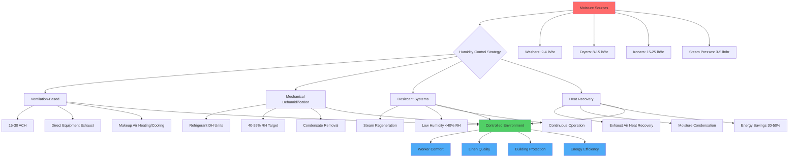

Commercial hotel laundries generate massive moisture loads that create challenging environmental conditions. Proper humidity control protects worker health, prevents structural damage, maintains linen quality, and controls energy costs through strategic dehumidification and ventilation design.

## Moisture Sources in Laundry Operations

Laundry facilities produce moisture from multiple simultaneous sources. Washing machines release steam during high-temperature wash cycles and drain operations. Dryers exhaust significant water vapor even with properly vented systems due to incomplete capture and leakage at door seals. Ironing equipment including flatwork ironers and steam presses generate continuous moisture output during operation.

Wet linen handling between washing and drying stages contributes moisture through evaporation. A typical 100-pound capacity washer extracts approximately 60-70% of water during spin cycles, leaving 30-40 pounds of water in the fabric load that evaporates during transfer and drying operations.

The moisture generation rate from laundry equipment varies by type and capacity:

| Equipment Type | Capacity | Moisture Generation | Operating Hours |
|---|---|---|---|
| Washer-extractor | 100 lb | 2-4 lb/hr | Intermittent |
| Tumble dryer (unvented portion) | 120 lb | 8-15 lb/hr | Continuous |
| Flatwork ironer | 120 in width | 15-25 lb/hr | Continuous |
| Steam press | Single head | 3-5 lb/hr | Intermittent |
| Steam tunnel finisher | Commercial | 20-30 lb/hr | Continuous |

## Target Humidity Levels for Worker Comfort

Commercial laundries should maintain relative humidity between 40-55% for optimal worker comfort and productivity. Higher humidity levels create heat stress conditions when combined with elevated temperatures from equipment operation. The effective temperature (combination of dry-bulb temperature and humidity) should not exceed 80°F in work areas.

OSHA heat stress guidelines apply when wet-bulb globe temperature (WBGT) exceeds threshold values. For moderate work rates typical of laundry operations, WBGT should remain below 80°F. The relationship between temperature, humidity, and heat stress follows:

$$\text{WBGT} = 0.7 T_{wb} + 0.2 T_{g} + 0.1 T_{db}$$

where $T_{wb}$ = wet-bulb temperature (°F), $T_{g}$ = globe temperature (°F), and $T_{db}$ = dry-bulb temperature (°F).

Maintaining lower humidity levels (40-45% RH) allows higher acceptable air temperatures without exceeding heat stress limits. This provides operational flexibility during peak production periods when equipment heat gains are maximum.

## Condensation Prevention on Surfaces

Condensation occurs on surfaces below the dew point temperature of surrounding air. In laundries with 70°F air at 60% RH, the dew point is approximately 57°F. Any surface at or below this temperature will experience condensation, including:

- Exterior walls with inadequate insulation
- Cold water supply piping without insulation
- Metal ductwork carrying supply air
- Windows and metal door frames
- Uninsulated concrete floor slabs

Prevention strategies include increasing surface temperatures through insulation and maintaining lower indoor humidity levels. The required insulation R-value to prevent condensation follows:

$$R_{min} = \frac{T_{indoor} - T_{outdoor}}{h_{i}(T_{indoor} - T_{dp})}$$

where $h_{i}$ = interior surface film coefficient (typically 1.5 BTU/hr·ft²·°F). For 70°F indoor air at 50% RH (51°F dew point) and 20°F outdoor temperature, minimum wall R-value is approximately R-6.3 to prevent condensation.

Cold surface condensation promotes mold growth on building materials and creates slip hazards on floor surfaces. Moisture accumulation in wall cavities degrades insulation performance and causes structural deterioration over time.

## Dehumidification Options for Laundries

Commercial laundries employ multiple dehumidification strategies depending on climate, facility size, and energy cost considerations:

**Ventilation-based dehumidification** introduces outdoor air to dilute and remove moisture when outdoor air has lower absolute humidity than indoor air. This approach works effectively in cold and temperate climates but fails in hot-humid conditions where outdoor air contains more moisture than indoor air.

The ventilation rate required for moisture control follows:

$$Q = \frac{M}{0.68 \times \Delta W \times \rho_{air}}$$

where $Q$ = airflow (CFM), $M$ = moisture generation rate (lb/hr), $\Delta W$ = humidity ratio difference between indoor and outdoor air (grains/lb), and $\rho_{air}$ = air density (0.075 lb/ft³ standard conditions).

**Mechanical dehumidification** using refrigerant-based systems actively removes moisture through cooling and condensation. These systems provide year-round moisture control independent of outdoor conditions. Dehumidifiers should be sized for the total moisture load including equipment generation, outdoor air ventilation, and infiltration.

**Desiccant dehumidification** employs hygroscopic materials to absorb moisture from air through chemical attraction. Desiccant systems excel in applications requiring very low humidity levels (below 40% RH) or when waste heat is available for regeneration. Commercial laundries with steam boilers can use low-pressure steam for efficient desiccant regeneration.

**Heat recovery dehumidification** captures waste heat from dryer exhaust to pre-heat incoming makeup air while condensing moisture from the exhaust stream. This approach reduces both heating and cooling loads while controlling humidity.

## Ventilation for Moisture Removal

Effective ventilation design creates directional airflow from clean areas (linen receiving and folding) toward contaminated areas (soiled linen sorting and washing). This prevents cross-contamination while removing moisture at generation points.

Exhaust ventilation should capture moisture directly at equipment sources. Dryers require dedicated exhaust systems with proper duct sizing and termination. Ironing equipment benefits from overhead exhaust hoods capturing rising steam plumes.

Minimum outdoor air ventilation follows ASHRAE 62.1 requirements:

- Washing area: 0.12 CFM/ft² floor area
- Ironing/pressing area: 0.18 CFM/ft²
- Folding/sorting area: 0.06 CFM/ft²

Total ventilation rates typically range from 15-30 air changes per hour depending on equipment density and moisture loads. Higher rates apply to facilities with poor equipment exhaust capture or high production volumes.

Supply air distribution should deliver conditioned air at worker height to provide cooling and dilution. Ceiling-mounted diffusers using high-velocity throw patterns overcome thermal stratification from equipment heat gains.

## Effects of Humidity on Linen Quality

Excess humidity affects linen quality through multiple mechanisms. High moisture levels during storage promote mildew growth, causing discoloration and fabric degradation. Linen stored above 60% RH for extended periods develops musty odors requiring re-washing.

Ironing and pressing operations require controlled humidity for optimal results. Flatwork ironers operate most efficiently with linen moisture content of 8-12%. Lower moisture requires spray systems adding water during ironing. Higher moisture reduces production rates and product quality.

Humidity affects static electricity generation during folding and packaging operations. Relative humidity below 35% creates excessive static cling, complicating automated folding systems and manual handling. Maintaining 40-50% RH minimizes static issues while preventing mold growth.

Effective humidity control in commercial hotel laundries requires integrated design considering moisture generation rates, dehumidification system selection, ventilation airflow patterns, and the relationship between environmental conditions and both worker comfort and linen quality. Proper implementation reduces operating costs while improving productivity and product quality.
