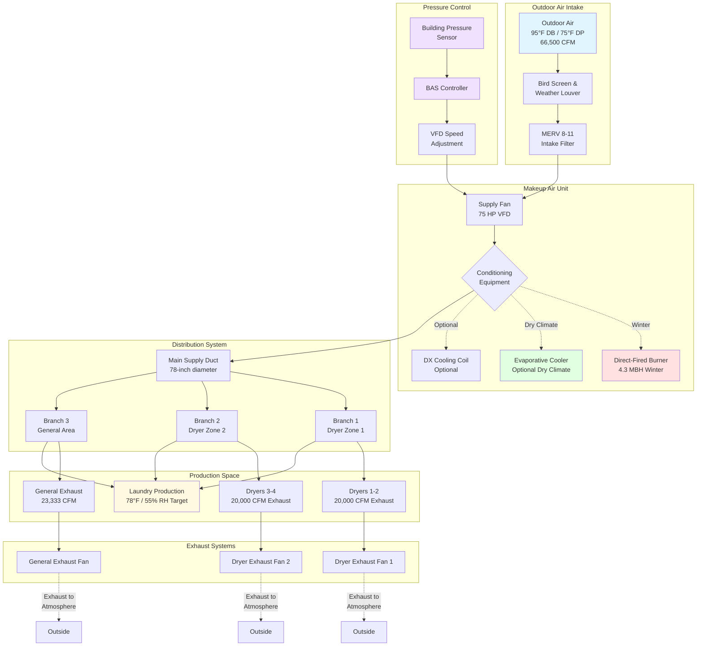

Makeup air systems serve critical functions in commercial hotel laundries by replacing massive exhaust volumes from dryers and general ventilation while maintaining proper building pressurization. Inadequate makeup air creates negative pressure drawing unconditioned outdoor air through unintended pathways, compromising temperature control, increasing energy consumption, and creating unsafe operating conditions.

## Makeup Air Volume Requirements

Makeup air volume must equal or slightly exceed total exhaust to maintain controlled building pressurization preventing infiltration while avoiding excessive positive pressure.

### Total Exhaust Volume Calculation

**Dryer exhaust** dominates total facility exhaust requirements:

Commercial dryers require 150-250 CFM exhaust per pound of rated capacity to maintain proper moisture evacuation and prevent overheating. A typical 50-pound capacity commercial dryer exhausts 7,500-12,500 CFM during operation depending on manufacturer specifications and gas input rates.

Multiple dryer installations compound this requirement. A mid-size hotel laundry with four 50-pound dryers operating simultaneously exhausts:

$$Q_{dryers} = 4 \text{ dryers} \times 10,000 \text{ CFM/dryer} = 40,000 \text{ CFM}$$

**General space exhaust** provides supplemental heat and moisture removal beyond dryer exhaust points. ASHRAE recommends 15-25 air changes per hour for industrial laundry environments depending on heat density and moisture generation rates.

For a 5,000 ft² laundry with 14-foot ceiling height:

$$V = 5,000 \text{ ft}^2 \times 14 \text{ ft} = 70,000 \text{ ft}^3$$

At 20 air changes per hour:

$$Q_{general} = \frac{70,000 \text{ ft}^3 \times 20 \text{ ACH}}{60 \text{ min/hr}} = 23,333 \text{ CFM}$$

**Total facility exhaust:**

$$Q_{total} = Q_{dryers} + Q_{general} = 40,000 + 23,333 = 63,333 \text{ CFM}$$

### Makeup Air Volume Sizing

Design makeup air volume at 100-110% of total exhaust to maintain slight positive pressure:

$$Q_{makeup} = Q_{total} \times 1.05 = 63,333 \times 1.05 = 66,500 \text{ CFM}$$

This 5-10% excess creates positive pressure of 0.02-0.05 inches water column relative to outdoors, sufficient to prevent infiltration through envelope penetrations without creating excessive pressurization affecting door operation or adjacent building spaces.

International Mechanical Code (IMC) Section 508.1 mandates makeup air for exhaust systems exceeding 2,000 CFM, requiring dedicated outdoor air introduction rather than borrowing from adjacent building areas.

## Temperature and Humidity Conditioning

Makeup air temperature and humidity directly impact supplemental space conditioning loads and worker comfort, requiring careful analysis of conditioning economics versus unconditioned outdoor air introduction.

### Winter Heating Requirements

Cold outdoor air requires heating to prevent extreme temperature depression in production areas and thermal discomfort for workers near makeup air discharge points.

**Minimum acceptable discharge temperature:** 55-60°F prevents cold drafts while minimizing heating energy. Lower discharge temperatures create worker complaints and equipment condensation issues.

**Heating capacity calculation** for 66,500 CFM in cold climate (0°F winter design):

Temperature rise from 0°F outdoor to 60°F discharge:

$$Q_{heating} = CFM \times 1.08 \times \Delta T = 66,500 \times 1.08 \times 60 = 4,309,200 \text{ BTU/hr}$$

This represents 4.3 million BTU/hr heating capacity, typically provided by natural gas burners in direct-fired or indirect-fired configurations.

Moderate climates (20°F winter design) reduce heating requirements:

$$Q_{heating} = 66,500 \times 1.08 \times 40 = 2,872,800 \text{ BTU/hr}$$

### Summer Cooling Considerations

**Unconditioned outdoor air** at 95°F dry-bulb introduces substantial sensible heat load requiring supplemental space cooling:

$$Q_{sensible} = 66,500 \times 1.08 \times (95 - 78) = 1,221,210 \text{ BTU/hr}$$

This 102-ton sensible heat load adds directly to equipment-generated heat requiring larger space cooling systems.

**Partial cooling** to 80-85°F discharge temperature significantly reduces space conditioning load while limiting makeup air unit capital cost:

Cooling from 95°F to 82°F (13°F reduction):

$$Q_{reduced} = 66,500 \times 1.08 \times (82 - 78) = 287,280 \text{ BTU/hr}$$

This reduces space cooling load by 933,930 BTU/hr (78 tons) compared to unconditioned makeup air, typically justifying mechanical cooling equipment in high-use facilities.

**Humidity considerations:** Outdoor air at 75°F dewpoint (95°F DB, 55% RH typical summer condition) introduces substantial latent load. Dehumidification to 55°F dewpoint removes moisture before space introduction but requires expensive equipment typically reserved for critical applications like pharmaceutical manufacturing rather than commercial laundries.

### Evaporative Cooling in Dry Climates

Arid regions with outdoor conditions below 30-40% relative humidity present excellent opportunities for evaporative cooling providing 15-25°F temperature reduction at 10-20% of mechanical cooling capital cost.

**Direct evaporative cooling** passes makeup air through wetted media:

At 95°F dry-bulb, 25% RH (65°F wet-bulb), direct evaporative cooling achieves approximately 80°F discharge temperature:

$$T_{discharge} \approx T_{wb} + 0.15 \times (T_{db} - T_{wb}) = 65 + 0.15 \times 30 = 69.5°F$$

Practical systems achieve 70-75°F discharge due to pad efficiency limitations.

**Operating cost comparison:**

- Mechanical cooling: $4-6/hour electricity for 100-ton cooling requirement
- Evaporative cooling: $0.50-1.00/hour (fan power + water consumption)
- Annual savings in hot-dry climates: $12,000-18,000 for 3,000-hour cooling season

Evaporative cooling increases humidity but remains acceptable in laundry applications where space humidity already runs 55-65% from process moisture.

## Direct-Fired vs Indirect-Fired Makeup Air Units

Heating method selection impacts installation cost, operating efficiency, combustion product handling, and space air quality.

### Direct-Fired Makeup Air Units

**Operating principle:** Natural gas or propane burns directly in airstream with combustion products (water vapor, carbon dioxide, trace combustion gases) mixing with supply air and discharging to conditioned space.

**Efficiency advantages:**
- Thermal efficiency: 90-95% (minimal heat lost to flue)
- No separate venting required reducing installation cost $3,000-8,000
- Compact footprint: 30-40% smaller than indirect-fired equivalents
- Lower capital cost: $8,000-15,000 less for 4 million BTU/hr unit

**Combustion product considerations:**

Each cubic foot of natural gas produces approximately 1.1 lb water vapor during combustion. For 4.3 million BTU/hr heating (4,300,000 BTU/hr ÷ 1,000 BTU/ft³ = 4,300 ft³/hr gas consumption):

$$m_{H_2O} = 4,300 \text{ ft}^3/\text{hr} \times 1.1 \text{ lb/ft}^3 = 4,730 \text{ lb/hr water vapor}$$

This massive moisture addition (4,730 lb/hr) discharged into makeup airstream contributes to space humidity. However, the 66,500 CFM airflow dilutes moisture concentration:

$$RH_{increase} = \frac{4,730 \text{ lb/hr}}{66,500 \text{ CFM} \times 60 \text{ min/hr} \times 0.075 \text{ lb/ft}^3} \times 0.01 = 1.6\%$$

Moisture contribution remains minimal in high-volume makeup air applications.

**Carbon dioxide generation** requires verification of space CO₂ levels remaining below 1,000 ppm ASHRAE threshold. The high outdoor air introduction rate (66,500 CFM) prevents CO₂ accumulation in properly designed systems.

### Indirect-Fired Makeup Air Units

**Operating principle:** Gas burner heats heat exchanger with combustion products venting to atmosphere. Supply air passes through heat exchanger without contacting combustion products.

**Design characteristics:**
- Thermal efficiency: 75-82% (heat lost through flue gases)
- Separate venting required: 12-24 inch diameter flue, $5,000-12,000 additional installation cost
- Larger footprint accommodating heat exchanger and combustion chamber
- Higher capital cost but no combustion products in supply air

**Application preference:**

Indirect-fired units suit applications requiring absolute combustion product exclusion:
- Healthcare facilities with sensitive patient populations
- Food processing requiring USDA approval
- Facilities with inadequate makeup air volume for combustion product dilution

Commercial laundries typically tolerate direct-fired units given high air volumes and industrial nature.

## Air Distribution in Laundry Spaces

Strategic makeup air distribution prevents short-circuiting from supply to exhaust while providing effective replacement air at dryer exhaust points.

### Distribution Strategy

**Discharge near dryer locations** provides replacement air closest to exhaust sources preventing excessive air velocities across production floor:

- Position makeup air diffusers within 15-25 feet of dryer exhaust connections
- Multiple discharge points preferred over single large discharge
- Four dryers require minimum three-four makeup air discharge locations

**High-velocity discharge** enables longer throw distances from roof-mounted or wall-mounted makeup air units:

Discharge velocity: 1,200-1,800 FPM allows 40-60 foot throw distances before velocity decays below 150 FPM. This permits fewer discharge points reducing ductwork cost.

**Avoid direct impingement** on workers or process equipment:
- Discharge 8-12 feet above floor elevation
- Angle discharge 15-25° from horizontal preventing direct downward airflow
- Install adjustable deflectors for field adjustment after commissioning

### Ductwork Sizing

**Supply duct velocity** ranges 1,800-2,500 FPM in trunk ducts reducing to 1,200-1,500 FPM in branch ducts. High velocity minimizes duct size but increases pressure drop requiring careful fan sizing.

For 66,500 CFM system at 2,000 FPM trunk velocity:

$$A_{duct} = \frac{66,500 \text{ CFM}}{2,000 \text{ FPM}} = 33.25 \text{ ft}^2$$

Round duct diameter:

$$D = \sqrt{\frac{4A}{\pi}} = \sqrt{\frac{4 \times 33.25}{3.14}} = 6.5 \text{ ft} = 78 \text{ inches}$$

Large duct sizes (60-78 inch diameter) require custom fabrication and structural support analysis.

**Duct insulation** prevents condensation during summer cooling operation (if equipped) and reduces heat gain/loss in unconditioned spaces. Specify R-6 minimum insulation for supply ducts in unconditioned locations.

## Balancing with Exhaust for Slight Negative Pressure

Despite makeup air exceeding exhaust volume by design, commissioning and operational adjustments ensure proper pressure relationships preventing infiltration while avoiding excessive pressurization.

### Target Pressure Relationships

**Production area to outdoors:** +0.02 to +0.05 inches water column
- Positive pressure prevents infiltration of unconditioned outdoor air, dust, insects through envelope penetrations
- Minimal positive pressure avoids forcing conditioned air outward through doors during opening

**Adjacent office/support areas to production:** +0.02 to +0.03 inches water column
- Prevents migration of heat, humidity, lint from production into comfort-conditioned spaces
- Maintains separate environmental control

### Pressure Measurement and Adjustment

**Commissioning procedure:**

1. Operate all dryers and general exhaust systems at design conditions
2. Activate makeup air system at design volume
3. Measure building pressure at multiple locations using manometer or digital pressure gauge (±0.01 in. w.c. resolution minimum)
4. Adjust makeup air volume via VFD or inlet vanes to achieve target pressure
5. Document final airflow rates and pressure readings

**Common pressure issues:**

Excessive negative pressure (below -0.02 in. w.c.):
- Increase makeup air volume 5-10%
- Verify all makeup air units operating
- Check for unexpected exhaust systems (restroom exhaust, spot exhaust)

Excessive positive pressure (above +0.10 in. w.c.):
- Reduce makeup air volume
- Check for reduced exhaust operation
- Verify dryer exhaust duct dampers fully open

### Variable Volume Control

**Demand-based makeup air** reduces fan energy during partial load operation:

Monitor dryer operation via current sensors or control system integration. When dryers cycle off, proportionally reduce makeup air volume maintaining consistent pressure relationship.

Four dryers at 10,000 CFM each plus 23,333 CFM general exhaust:
- All dryers operating: 66,500 CFM makeup air
- Three dryers operating: 56,000 CFM makeup air (one dryer off = 10,000 CFM reduction × 1.05 factor)
- Two dryers operating: 45,500 CFM makeup air

Variable frequency drives (VFD) on makeup air fans modulate airflow continuously. Fan power consumption varies with cube of speed change:

Reducing airflow from 66,500 to 45,500 CFM (68% of design):

$$P_{reduced} = P_{design} \times \left(\frac{45,500}{66,500}\right)^3 = P_{design} \times 0.68^3 = 0.31 \times P_{design}$$

This 69% power reduction during 30-40% of operating hours generates substantial annual energy savings: $4,000-8,000 annually for typical installations.

## Makeup Air Requirements by Laundry Size

The following table provides typical makeup air requirements based on facility throughput capacity:

| Laundry Size | Daily Capacity (lb/day) | Typical Dryers | Total Exhaust (CFM) | Makeup Air (CFM) | Winter Heating (MBH) | Notes |
|--------------|-------------------------|----------------|---------------------|------------------|---------------------|-------|
| Small Hotel | 500-800 | 2 × 35 lb | 18,000-22,000 | 19,000-23,000 | 1,200-1,400 | Single MAU, direct-fired |
| Medium Hotel | 800-1,500 | 3-4 × 50 lb | 38,000-50,000 | 40,000-53,000 | 2,600-3,400 | Single large or dual MAU |
| Large Hotel | 1,500-3,000 | 6-8 × 50 lb | 70,000-95,000 | 74,000-100,000 | 4,800-6,500 | Multiple MAU, zone control |
| Resort Complex | 3,000-6,000 | 10-16 × 75 lb | 125,000-200,000 | 132,000-210,000 | 8,600-13,700 | Central plant, heat recovery |
| Commercial Laundry | 6,000-15,000 | 20-40 × 100 lb | 300,000-600,000 | 315,000-630,000 | 20,500-41,000 | Multiple zones, demand control |

*Heating capacity assumes 0°F winter design temperature to 65°F discharge. Reduce proportionally for warmer climates.*

*Exhaust volumes include dryer exhaust plus general space exhaust at 18-22 ACH depending on facility heat density.*

## System Layout and Integration

Makeup air system architecture varies with facility size and equipment distribution.

**Key design elements:**

1. **Intake location:** Position minimum 30 feet from exhaust discharge points preventing recirculation. Locate 8-12 feet above grade avoiding snow drift interference in cold climates.

2. **Equipment placement:** Roof-mounted makeup air units minimize ductwork runs and provide easy outdoor air access. Ground-level installations require weather protection and longer supply duct routing.

3. **Multiple unit coordination:** Large facilities benefit from multiple smaller makeup air units (3 × 22,000 CFM) versus single large unit (66,000 CFM) providing redundancy and zone-specific control.

4. **Integration with space cooling:** Makeup air system coordinates with recirculating air handlers providing supplemental cooling and dehumidification. Makeup air handles ventilation load while recirculating equipment manages thermal load.

5. **Energy recovery consideration:** Heat recovery from dryer exhaust to preheat makeup air achieves 40-60% heating energy savings but requires careful analysis of lint contamination, cross-contamination risks, and maintenance requirements often limiting application in commercial laundries.

Properly designed makeup air systems transform commercial laundries from uncomfortable, energy-intensive environments into controlled production facilities maintaining worker safety, equipment longevity, and operational efficiency while managing energy costs through strategic conditioning and control strategies.
