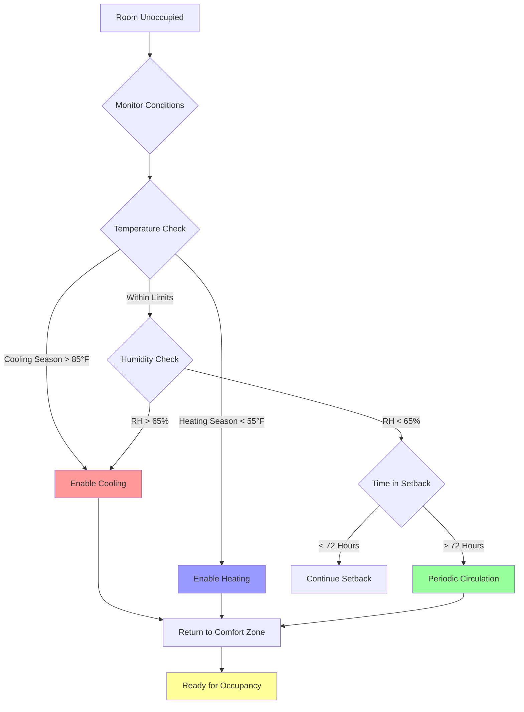

## Guest Comfort Expectations at Arrival

Hotel guests expect immediate comfort upon room entry, regardless of how long the room has been unoccupied. This expectation creates a fundamental challenge for energy management systems that use temperature setback during vacancy periods. The industry standard for acceptable room conditions at check-in requires temperatures within the comfort zone and air that feels fresh and circulated.

Maximum recovery time from setback to occupied comfort conditions should not exceed 15-20 minutes for standard rooms and 30 minutes for suites. This recovery period must account for both sensible and latent load removal, as humidity levels directly affect perceived comfort even when temperature is within acceptable ranges.

The comfort index during recovery can be estimated using:

$$CI = 0.7 \times T_{db} + 0.3 \times T_{wb}$$

where $CI$ represents the comfort index in °F, $T_{db}$ is dry-bulb temperature, and $T_{wb}$ is wet-bulb temperature. Guest complaints typically occur when $CI$ exceeds 78°F upon entry.

## Temperature and Humidity Limits During Setback

Proper setback strategies balance energy savings with the need to maintain conditions that allow rapid recovery and prevent building envelope damage. Temperature setback limits must be established based on climate, building construction, and recovery capability.

### Cooling Season Setback Limits

During cooling season, unoccupied rooms should maintain temperatures no higher than 82-85°F in humid climates and up to 88°F in dry climates. Higher setpoints risk humidity accumulation that leads to condensation, mold growth, and odor development. The relationship between temperature rise and humidity accumulation follows:

$$\frac{dRH}{dt} = k \times (T_{setback} - T_{dewpoint})$$

where $k$ is a constant dependent on envelope tightness and outdoor conditions. When $T_{setback}$ approaches $T_{dewpoint}$, relative humidity rises rapidly.

### Heating Season Setback Limits

Winter setback temperatures should not fall below 55-60°F in most climates. Lower temperatures risk:

- Freezing of water in plumbing fixtures near exterior walls
- Condensation on cold interior surfaces
- Extended recovery times that impact guest satisfaction
- Excessive thermal stress on building materials

The minimum safe setback temperature is calculated as:

$$T_{min} = T_{dewpoint} + \Delta T_{safety} + 5°F$$

where $\Delta T_{safety}$ represents the safety margin above dewpoint to prevent condensation, typically 10-15°F.

## Preventing Extreme Conditions

Extreme conditions develop when setback parameters are too aggressive or when environmental monitoring fails. Proper safeguards include:

**Temperature Override Limits**: Program absolute maximum and minimum temperatures beyond which the system returns to normal operation regardless of occupancy status. These override setpoints typically are 90°F for cooling and 50°F for heating.

**Humidity Monitoring**: Install humidity sensors in representative rooms to detect moisture accumulation. When relative humidity exceeds 65% for more than 2 hours, cooling should engage to remove moisture even in unoccupied spaces.

**Envelope Protection**: Rooms on upper floors, corner locations, and those with large glass areas require less aggressive setback due to higher solar and envelope loads.

## Mold and Moisture Issues from Deep Setbacks

Aggressive setback strategies in humid climates create ideal conditions for mold growth when relative humidity exceeds 70% for extended periods. Mold develops most readily when:

- Room temperature is allowed to rise above 80°F in humid conditions
- Bathrooms lack adequate ventilation during vacancy
- Fresh air is completely shut off for more than 48 hours
- Condensation forms on cold surfaces (windows, exterior walls)

The mold growth index increases exponentially above 70% RH:

$$MGI = e^{0.15 \times (RH - 70)} \times \frac{t}{24}$$

where $MGI$ is the mold growth index and $t$ is time in hours above threshold. An $MGI$ value exceeding 1.0 indicates conditions favorable for visible mold growth.

Prevention strategies include:

- Bathroom exhaust fans on timers (2-hour cycles every 24 hours during extended vacancy)
- Dehumidification mode when RH exceeds 60%
- Air circulation every 12 hours minimum
- Regular housekeeping checks of rooms vacant more than 3 days

## Guest Complaint Prevention

Guest complaints related to room comfort typically stem from:

1. **Insufficient cooling/heating upon arrival** (45% of complaints)
2. **Musty or stale odors** (30% of complaints)
3. **Excessive humidity or "sticky" feeling** (15% of complaints)
4. **Temperature swings during initial occupancy** (10% of complaints)

Minimizing complaints requires:

**Pre-Arrival Conditioning**: Initiate room recovery 30-60 minutes before anticipated check-in time. Property management systems can trigger this based on reservation data.

**Accelerated Recovery Mode**: Use maximum fan speed and full heating/cooling capacity during initial recovery, then modulate to quiet operation once setpoint is achieved.

**Air Quality Management**: Introduce outdoor air during recovery to purge any accumulated odors. The required purge volume is:

$$V_{purge} = \frac{V_{room} \times N_{changes}}{60}$$

where $V_{purge}$ is purge time in minutes, $V_{room}$ is room volume in cubic feet, and $N_{changes}$ is number of air changes (typically 2-3).

## VIP and Suite Special Considerations

Premium accommodations require more conservative setback strategies due to higher guest expectations and larger spaces requiring longer recovery times.

| Parameter | Standard Room | Suite/VIP |
|-----------|---------------|-----------|
| Maximum Cooling Setback | 85°F | 80°F |
| Minimum Heating Setback | 60°F | 65°F |
| Maximum RH During Setback | 65% | 60% |
| Recovery Time Target | 20 minutes | 15 minutes |
| Air Changes During Vacancy | 0.5 ACH | 1.0 ACH |
| Pre-Arrival Conditioning | 30 minutes | 60 minutes |
| Absolute RH Cutoff | 70% | 65% |

**Multi-Zone Coordination**: Suites with multiple HVAC zones require coordinated recovery to ensure all spaces reach comfort conditions simultaneously. Living areas should begin recovery 5-10 minutes before bedrooms to account for higher occupancy loads.

**Enhanced Monitoring**: VIP rooms benefit from continuous monitoring rather than periodic sampling, with alerts sent to engineering staff if conditions deviate from acceptable ranges.

**Backup Systems**: Critical VIP accommodations should have redundant conditioning capability or manual override options to ensure immediate comfort regardless of automated system status.

The energy penalty for these enhanced comfort parameters is approximately 15-25% higher than standard rooms, but this investment is justified by the premium rates and guest expectations for luxury accommodations.
