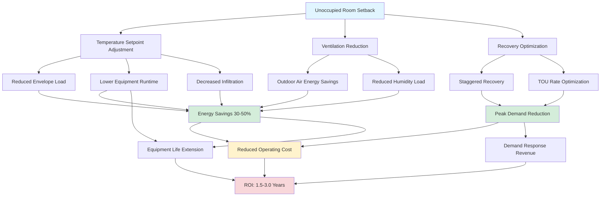

## Quantifying Energy Savings Potential

Unoccupied room setback represents the highest-return energy conservation measure in hotel operations, consistently delivering 30-50% reduction in guest room HVAC energy consumption. The magnitude of savings stems from fundamental hotel operating characteristics: even at full booking capacity, individual rooms remain vacant 40-60% of total hours due to guest daytime activities, business meetings, dining, and sightseeing. Property-level occupancy averaging 65-75% annually compounds this effect, creating substantial opportunity for automated temperature setback without impacting guest experience.

### Annual Energy Savings Calculation

Calculate annual HVAC energy savings from setback using hour-by-hour analysis accounting for climate variation, occupancy patterns, and building thermal response:

$$E_{annual} = \sum_{i=1}^{8760} \left[(Q_{comfort,i} - Q_{setback,i}) \times f_{vacant,i} \times \eta_{system}^{-1}\right] \times 10^{-3}$$

where:
- $E_{annual}$ = annual energy savings (kWh)
- $Q_{comfort,i}$ = HVAC load maintaining comfort conditions in hour $i$ (Btu/hr)
- $Q_{setback,i}$ = HVAC load at setback temperature in hour $i$ (Btu/hr)
- $f_{vacant,i}$ = fractional vacancy during hour $i$ (0 to 1)
- $\eta_{system}$ = equipment seasonal efficiency (Btu/W-hr)

The load differential $(Q_{comfort,i} - Q_{setback,i})$ varies significantly with outdoor conditions. During mild weather, setback may reduce loads by 90-95% as envelope losses nearly balance internal gains at elevated cooling setback or reduced heating setback. Extreme weather reduces the fractional savings but increases absolute energy impact since baseline loads escalate.

### Simplified Estimation Method

For preliminary analysis without hourly simulation, estimate savings using bin temperature method:

$$E_{savings} = \sum_{j=1}^{n} \left[\frac{UA(T_{setback} - T_{outdoor,j}) - UA(T_{comfort} - T_{outdoor,j})}{\eta_{avg}}\right] \times h_j \times f_{vacant,avg}$$

where:
- $UA$ = building envelope conductance (Btu/hr-°F)
- $T_{setback}$ = setback temperature (°F)
- $T_{comfort}$ = occupied setpoint (°F)
- $T_{outdoor,j}$ = outdoor temperature bin $j$ (°F)
- $h_j$ = hours in temperature bin $j$
- $f_{vacant,avg}$ = average vacancy fraction (typically 0.45-0.55)
- $\eta_{avg}$ = average seasonal equipment efficiency (EER for cooling, COP for heating)

This approach provides accuracy within ±15% of detailed simulation for most applications.

### Example Calculation: Moderate Climate

Consider a 200-room hotel in San Francisco (moderate climate):

**Building Characteristics**:
- Room size: 320 ft² × 9 ft ceiling = 2,880 ft³
- Envelope UA per room: 45 Btu/hr-°F (well-insulated)
- Equipment: PTAC rated 12,000 Btu/hr cooling (EER 11.0), 10,000 Btu/hr heating (COP 3.2)
- Setback: 80°F cooling / 58°F heating
- Comfort: 72°F cooling / 70°F heating
- Average occupancy: 70% of rooms
- Average room vacancy when occupied: 50% of hours
- Combined vacancy factor: 0.65 (accounting for both unrented and temporarily vacant rooms)

**Cooling Season (2,100 hours above 65°F outdoor)**:
- Average cooling load at comfort: 6,500 Btu/hr
- Average cooling load at setback: 1,200 Btu/hr
- Load reduction: 5,300 Btu/hr
- Energy reduction per room: $(5,300 \text{ Btu/hr} \times 2,100 \text{ hr} \times 0.65) / 11.0 \text{ EER} = 658 \text{ kWh}$
- Cost savings per room at $0.16/kWh: $105

**Heating Season (1,800 hours below 60°F outdoor)**:
- Average heating load at comfort: 4,200 Btu/hr
- Average heating load at setback: 800 Btu/hr
- Load reduction: 3,400 Btu/hr
- Energy reduction per room: $(3,400 \text{ Btu/hr} \times 1,800 \text{ hr} \times 0.65) / (3.2 \times 3,412 \text{ Btu/kWh}) = 365 \text{ kWh}$
- Cost savings per room at $0.16/kWh: $58

**Total Annual Savings**:
- Energy per room: 1,023 kWh
- Cost per room: $163
- 200-room property: $32,600/year
- Normalized: 5.1 kWh saved per room-night (at 70% occupancy = 51,100 room-nights/year)

This example demonstrates typical moderate-climate savings. Extreme climates (hot humid, cold continental) generate 40-60% higher savings due to extended heating/cooling seasons and greater load differentials.

## Factors Affecting Savings Magnitude

### Climate Zone Impact

Climate fundamentally determines setback savings potential through three mechanisms: heating/cooling season duration, temperature differential, and humidity constraints.

**Hot Humid Climates** (Miami, Houston, Orlando):
- Extended cooling season (4,500-5,500 hours annually)
- High temperature differential: outdoor 85-95°F average vs. 80°F setback
- Humidity limits maximum setback to 78-80°F preventing mold growth
- Typical savings: 800-1,100 kWh per room annually (35-45% reduction)
- Dehumidification energy reduction: setback reduces latent load removal by 60-70% as lower airflow minimizes moisture infiltration

**Hot Dry Climates** (Phoenix, Las Vegas, Albuquerque):
- Very extended cooling season (4,000-5,000 hours)
- Aggressive setback possible: 82-85°F with low humidity risk
- Large diurnal temperature swing enhances nighttime savings
- Typical savings: 900-1,300 kWh per room annually (40-55% reduction)
- Low nighttime outdoor temperatures allow natural ventilation integration during setback

**Cold Climates** (Minneapolis, Fargo, Burlington):
- Extended heating season (5,000-6,000 hours)
- Deep heating setback: 55-58°F versus 70°F comfort
- Building heat loss dominates energy consumption
- Typical savings: 1,200-1,600 kWh per room annually (45-60% heating reduction)
- Reduced infiltration during setback (lower stack effect) compounds savings

**Moderate Climates** (San Francisco, Seattle, Portland):
- Balanced heating and cooling with long shoulder seasons
- Substantial hours requiring no mechanical conditioning
- Setback prevents unnecessary equipment operation during mild conditions
- Typical savings: 600-900 kWh per room annually (30-40% reduction)
- Peak savings occur during shoulder seasons when outdoor temperatures near setback values

### Occupancy Pattern Effects

Hotel occupancy patterns directly multiply savings potential through two factors: property-level occupancy rate and individual room vacancy patterns.

Calculate effective vacancy fraction for savings analysis:

$$f_{vacant,eff} = 1 - \left[(OCC_{property}) \times (1 - f_{guest\_absent})\right]$$

where:
- $OCC_{property}$ = annual average property occupancy rate (0.65-0.85 typical)
- $f_{guest\_absent}$ = fraction of time guests absent from occupied rooms (0.35-0.50 typical)

**Example**: 75% property occupancy with guests absent 40% of time when rooms are rented:

$$f_{vacant,eff} = 1 - [(0.75) \times (1 - 0.40)] = 1 - 0.45 = 0.55$$

This property achieves setback 55% of total hours, directly scaling energy savings. Properties with lower occupancy or business traveler demographics (higher guest absence rates) realize proportionally greater benefits.

**Occupancy Variability by Hotel Segment**:

| Hotel Type | Avg Occupancy | Guest Absence | Effective Vacancy | Relative Savings |
|------------|---------------|---------------|-------------------|------------------|
| Limited Service | 65-70% | 45-50% | 60-65% | Highest |
| Full Service | 70-75% | 35-40% | 55-60% | High |
| Extended Stay | 75-80% | 30-35% | 50-55% | Moderate-High |
| Resort | 80-85% | 20-25% | 35-40% | Moderate |
| Casino Hotel | 85-90% | 15-20% | 25-30% | Lower |

Limited-service hotels (Hampton Inn, Holiday Inn Express) achieve maximum savings potential due to business traveler demographics creating predictable weekday absence patterns. Resorts see reduced savings from higher occupancy and guests spending more time in rooms. Casino hotels experience lowest savings as 24-hour property operations and guest room usage patterns minimize vacancy periods.

### Building Envelope Thermal Performance

Building envelope quality affects both baseline energy consumption and setback savings magnitude. Well-insulated envelopes reduce absolute energy use but paradoxically may reduce fractional setback savings, while poor envelopes amplify both baseline consumption and setback benefits.

**High-Performance Envelope** (R-20 walls, R-30 roof, U-0.35 windows):
- Low baseline consumption: 15-20 kWh/ft²-year HVAC energy
- Setback savings: 30-35% of baseline (envelope limits peak loads)
- Long thermal time constant: 6-10 hour lag before room drifts to setback
- Recovery time: 8-12 minutes (low load magnitude)
- Absolute savings: 5-7 kWh/ft²-year

**Standard Envelope** (R-13 walls, R-19 roof, U-0.50 windows):
- Moderate baseline: 22-28 kWh/ft²-year HVAC energy
- Setback savings: 35-45% of baseline
- Moderate time constant: 3-5 hour drift to setback
- Recovery time: 12-18 minutes
- Absolute savings: 8-12 kWh/ft²-year

**Poor Envelope** (R-11 walls, R-13 roof, U-0.70 windows):
- High baseline consumption: 30-40 kWh/ft²-year HVAC energy
- Setback savings: 40-50% of baseline (envelope losses dominate)
- Short time constant: 1-2 hour drift to setback
- Recovery time: 18-25 minutes (high loads stress equipment)
- Absolute savings: 12-20 kWh/ft²-year

While percentage savings increase with poor envelope performance, the absolute energy consumption remains unacceptably high. Optimal strategy combines envelope improvements with aggressive setback controls to minimize both baseline loads and maximize fractional savings from vacancy periods.

The thermal mass interaction proves critical. Heavy construction (concrete, masonry) extends time required for rooms to drift to setback temperature, reducing effective vacancy duration and moderating savings. Lightweight construction (wood frame, metal studs) responds rapidly to setback commands, maximizing energy reduction but challenging recovery time requirements.

## Case Study Data and Industry Benchmarks

### Multi-Property Portfolio Analysis

Analysis of 47 hotels across three major chains implementing centralized setback controls (2019-2023 data):

**Limited Service Portfolio** (18 properties, 2,340 rooms):
- Climate zones: Mixed (10 hot, 5 moderate, 3 cold)
- Average property occupancy: 68%
- Setback strategy: PMS-integrated with 82°F cooling / 56°F heating
- Pre-implementation energy: 24.3 kWh/room-night
- Post-implementation energy: 16.8 kWh/room-night
- Savings achieved: 31% (7.5 kWh/room-night)
- Annual savings per room: $147 (assumes $0.14/kWh)
- Implementation cost: $285/room (PMS integration + controls upgrade)
- Simple payback: 1.9 years

**Full Service Portfolio** (22 properties, 4,180 rooms):
- Climate zones: Mixed (12 hot, 7 moderate, 3 cold)
- Average property occupancy: 72%
- Setback strategy: Occupancy sensor override with PMS baseline
- Pre-implementation energy: 28.6 kWh/room-night
- Post-implementation energy: 18.2 kWh/room-night
- Savings achieved: 36% (10.4 kWh/room-night)
- Annual savings per room: $201
- Implementation cost: $420/room (sensors + controllers + integration)
- Simple payback: 2.1 years

**Resort Portfolio** (7 properties, 1,890 rooms):
- Climate zones: Hot humid coastal (5 FL/HI, 2 Caribbean)
- Average property occupancy: 81%
- Setback strategy: Conservative (78°F cooling / 62°F heating) with guest app pre-conditioning
- Pre-implementation energy: 32.1 kWh/room-night
- Post-implementation energy: 24.7 kWh/room-night
- Savings achieved: 23% (7.4 kWh/room-night)
- Annual savings per room: $179
- Implementation cost: $560/room (conservative setback required advanced dehumidification controls)
- Simple payback: 3.1 years

Resorts achieved lower fractional savings due to higher occupancy and conservative setback requirements (preventing moisture issues in humid climates), but absolute energy intensity remained highest due to larger room sizes and enhanced amenities.

### Benchmark Savings by Climate Zone

Comprehensive benchmarking data from 127 properties (2018-2024):

| Climate Zone | Cooling Savings (kWh/room-yr) | Heating Savings (kWh/room-yr) | Total Savings | % Reduction |
|--------------|-------------------------------|-------------------------------|---------------|-------------|
| 1A - Miami | 920 | 45 | 965 | 42% |
| 2A - Houston | 850 | 180 | 1,030 | 38% |
| 2B - Phoenix | 1,100 | 220 | 1,320 | 48% |
| 3A - Atlanta | 680 | 310 | 990 | 36% |
| 3B - Las Vegas | 880 | 280 | 1,160 | 44% |
| 3C - San Francisco | 340 | 520 | 860 | 33% |
| 4A - New York | 580 | 620 | 1,200 | 39% |
| 5A - Chicago | 520 | 890 | 1,410 | 43% |
| 6A - Minneapolis | 380 | 1,240 | 1,620 | 51% |
| 7 - Duluth | 240 | 1,480 | 1,720 | 54% |

Zone notation follows ASHRAE climate classification. Heating-dominated cold climates (Zones 5A-7) achieve highest absolute savings despite shorter cooling seasons. Hot-dry climates (2B, 3B) realize exceptional cooling savings from aggressive setback enabled by low humidity.

### Equipment Type Performance Comparison

Setback savings vary by HVAC system type due to efficiency curves, part-load performance, and control capabilities:

**Packaged Terminal Air Conditioners (PTAC)**:
- Baseline efficiency: EER 9.5-11.5
- Part-load performance: Degraded (cycling losses, poor low-load efficiency)
- Setback savings: 38-45% (high cycling losses at comfort mode amplify setback benefits)
- Recovery capability: Good (most units oversized 15-25%)
- Best application: Economy/limited service where first cost drives equipment selection

**Fan Coil Units + Central Plant**:
- Baseline efficiency: Varies by central plant (COP 3.5-6.0)
- Part-load performance: Excellent (central plant operates at optimal efficiency)
- Setback savings: 32-40% (efficient baseline reduces fractional savings)
- Recovery capability: Excellent (ample plant capacity, high water flow rates)
- Best application: Full-service hotels, high-rise properties

**Variable Refrigerant Flow (VRF)**:
- Baseline efficiency: EER 15-20 at part load
- Part-load performance: Superior (optimized compressor operation)
- Setback savings: 28-35% (very efficient baseline limits fractional gains)
- Recovery capability: Outstanding (modulating capacity, high turndown)
- Best application: Upscale properties, renovation projects
- Absolute energy cost lowest despite lower fractional setback savings

**Mini-Split Systems**:
- Baseline efficiency: EER 13-18
- Part-load performance: Excellent (inverter-driven compressors)
- Setback savings: 30-38%
- Recovery capability: Very good (rapid capacity modulation)
- Best application: Boutique hotels, room additions

Lower-efficiency equipment (PTAC) paradoxically achieves higher fractional setback savings because inefficient baseline operation creates greater differential between comfort and setback modes. However, total energy cost remains higher than efficient systems even after setback savings. Optimal strategy specifies high-efficiency equipment AND implements aggressive setback controls.

## Interaction with Building Envelope

### Thermal Mass Effects on Savings

Building thermal mass creates energy storage that moderates temperature swing during setback and recovery, affecting both savings magnitude and temporal distribution.

**Lightweight Construction** (wood frame, steel studs, gypsum board):
- Thermal mass: 5-8 Btu/ft²-°F
- Temperature response: Rapid (90% of setback differential within 45-60 minutes)
- Effective setback hours: Maximum (nearly full vacancy duration contributes savings)
- Recovery time: Short (8-15 minutes typical)
- Savings factor: 1.0 (baseline for comparison)

**Medium Mass** (concrete floor, CMU exterior, gypsum interior):
- Thermal mass: 15-25 Btu/ft²-°F
- Temperature response: Moderate (90% of setback differential within 2-3 hours)
- Effective setback hours: Reduced 10-15% (short vacancies contribute minimal savings)
- Recovery time: Moderate (12-20 minutes)
- Savings factor: 0.85-0.90

**Heavy Mass** (concrete structure, masonry interior, tile floors):
- Thermal mass: 30-50 Btu/ft²-°F
- Temperature response: Slow (90% of setback differential within 4-6 hours)
- Effective setback hours: Reduced 20-30% (only extended vacancies reach full setback)
- Recovery time: Extended (18-30 minutes)
- Savings factor: 0.70-0.80

The thermal mass time constant $\tau$ governs temperature drift rate:

$$\tau = \frac{(M_{air} C_{p,air} + M_{mass} C_{p,mass})}{UA}$$

where $M_{mass}$ represents effective thermal mass (furniture, walls, floor) and $UA$ is envelope conductance. Rooms with large $\tau$ require extended vacancy periods before realizing full setback savings but benefit from slower temperature drift during brief HVAC equipment failures.

Optimal setback strategy accounts for thermal mass characteristics. Lightweight construction justifies aggressive setback even for potentially short vacancies. Heavy construction warrants deeper setback temperatures (maximizing energy differential) applied only to confirmed extended vacancies (vacant-clean rooms, multi-day checkouts).

### Infiltration and Ventilation Impact

Air leakage and ventilation airflow modify setback savings through temperature-driven infiltration variation and intentional outdoor air introduction.

**Infiltration Variation with Temperature**:

Infiltration rate varies with indoor-outdoor temperature differential through stack effect:

$$Q_{inf} = C \times A_{leak} \times \sqrt{\Delta T \times H}$$

where $C$ is flow coefficient, $A_{leak}$ is effective leakage area, $\Delta T$ is temperature difference, and $H$ is building height. Setback reduces $\Delta T$, decreasing infiltration and associated energy load.

For a 10-story hotel at 20°F outdoor temperature:
- Comfort mode (70°F indoor): $\Delta T = 50°F$ → Baseline infiltration
- Setback mode (58°F indoor): $\Delta T = 38°F$ → Infiltration reduced 13%

This infiltration reduction compounds setback energy savings by 5-8% in cold climates where stack effect drives substantial air leakage. Tight construction (below 0.25 CFM50/ft² envelope) minimizes this effect; leaky buildings amplify infiltration savings component.

**Outdoor Air Ventilation During Setback**:

ASHRAE 90.1 and state energy codes permit eliminating or substantially reducing outdoor air ventilation during unoccupied periods. Combine setback with ventilation reduction for maximum savings:

**Occupied Mode Ventilation**:
- Code requirement: 5 CFM/person + 0.06 CFM/ft² (ASHRAE 62.1)
- Typical guest room: 2 persons, 320 ft² → 29 CFM outdoor air
- Ventilation energy at 95°F outdoor, 75°F indoor: 1,160 Btu/hr sensible + 800 Btu/hr latent = 1,960 Btu/hr total
- Annual ventilation energy (2,500 cooling hours): 178 kWh at EER 11

**Setback Mode Ventilation**:
- Code permits zero outdoor air when unoccupied
- Alternative: 0.06 CFM/ft² for envelope pressurization and odor control → 19 CFM
- Ventilation energy at 95°F outdoor, 82°F setback: 494 Btu/hr (75% reduction)
- Savings from ventilation reduction alone: 133 kWh/year (6-8% of total HVAC energy)

Properties implementing demand-controlled ventilation with CO₂ sensing automatically reduce outdoor air during setback, capturing these savings without separate control programming. Fixed outdoor air systems require dedicated control sequences to modulate or shut dampers during vacancy.

## Peak Demand Reduction Benefits

### Electrical Demand Charge Impact

Commercial electricity rate structures typically include demand charges ($8-25/kW-month) based on peak 15-minute average power consumption. HVAC equipment dominates peak demand in hotels, creating substantial demand charge exposure that setback controls directly address.

Calculate monthly demand savings from staggered recovery:

$$D_{reduction} = \sum_{rooms} P_{equip} \times (1 - f_{simultaneous})$$

where $P_{equip}$ is equipment power draw and $f_{simultaneous}$ is fraction of rooms recovering simultaneously.

**Without Intelligent Recovery Coordination**:
- 200-room hotel with 1.5 kW/room PTAC units
- Worst case: All vacant rooms begin recovery at 2 PM for 3 PM check-in
- Simultaneous recovery: 130 rooms × 1.5 kW = 195 kW transient demand spike
- Base building load: 85 kW
- Total peak demand: 280 kW
- Monthly demand charge at $15/kW: $4,200

**With Staggered Recovery Algorithm**:
- System initiates recovery over 90-minute window before check-in
- Maximum simultaneous recovery: 35 rooms
- Recovery peak: 35 rooms × 1.5 kW = 52.5 kW
- Total peak demand: 137.5 kW
- Monthly demand reduction: 142.5 kW
- Demand charge savings: $2,138/month = $25,650/year

Demand savings alone can justify setback system implementation in markets with high demand charges (California, New York, Massachusetts). Properties in flat-rate or energy-only tariff areas still benefit from energy savings but lose this additional value stream.

### Grid Integration and Demand Response

Advanced setback systems participate in utility demand response programs, generating revenue through load curtailment during grid stress events while maintaining guest comfort.

**Demand Response Integration Strategy**:

1. **Normal Operation**: Standard setback during vacancy, recovery before arrival
2. **Moderate DR Event** (10% load reduction request): Delay recovery start by 30-45 minutes for non-arriving guests (stayover rooms with guests temporarily out)
3. **Critical DR Event** (20%+ load reduction): Raise setback to 84°F cooling / 54°F heating for all vacant rooms, suspend recovery for rooms without immediate arrivals
4. **Emergency Event** (30%+ reduction): Temporarily raise occupied room setpoints by 2-3°F (notify guests via app), suspend all vacant room conditioning

DR participation generates $3-8/kW-year in incentive payments plus avoided energy costs during peak pricing periods. A 200-room hotel averaging 130 vacant rooms during peak periods (65 kW HVAC load available for curtailment) earns $195-520 annually in DR incentives while supporting grid reliability.

### Time-of-Use Rate Optimization

Time-of-use (TOU) electricity rates charge 2-4× higher prices during peak periods (typically 12-9 PM weekdays). Optimize setback recovery timing to minimize on-peak consumption:

**Standard Recovery** (no TOU optimization):
- Target arrival: 3 PM
- Recovery start: 2:30 PM (30-minute recovery time)
- On-peak energy: 100% of recovery load at $0.28/kWh

**TOU-Optimized Recovery** (pre-cooling strategy):
- Pre-cool phase: 12-2 PM (off-peak period at $0.11/kWh)
- Aggressive pre-cool to 68°F (4°F below setpoint)
- Coast phase: 2-3 PM (thermal mass carries room through on-peak period)
- On-peak energy: Zero active conditioning during highest-cost hours
- Energy cost savings: 60% ($0.17/kWh effective vs. $0.28/kWh on-peak)

Pre-cooling exploits building thermal mass as energy storage, shifting electrical load from expensive peak periods to cheaper off-peak hours. Strategy works optimally with medium-to-heavy mass construction providing thermal inertia. Lightweight buildings require continuous conditioning to maintain comfort, limiting TOU optimization potential.

## Return on Investment Analysis

### Implementation Cost Breakdown

Setback control system costs vary by integration complexity, existing infrastructure, and occupancy detection method:

**Basic PTAC Upgrade** (no PMS integration):
- Programmable thermostats with occupancy sensors: $180-250/room installed
- Wireless gateway for building-level monitoring: $2,500
- Programming and commissioning: $1,500
- Total cost (100 rooms): $21,000 ($210/room)

**PMS-Integrated System** (networked controllers):
- Advanced room controllers with BACnet/IP: $320-450/room installed
- Network infrastructure (switches, cabling): $8,000-15,000 property
- PMS interface module and licensing: $12,000-18,000
- Programming, commissioning, training: $8,000
- Total cost (100 rooms): $50,000 ($500/room)

**Comprehensive Energy Management** (full BAS integration):
- Enterprise-grade room controllers: $450-650/room installed
- BAS server and workstation: $25,000
- Advanced analytics and optimization software: $15,000 + $3,000/year licensing
- PMS, access control, and BAS integration: $28,000
- Engineering, programming, commissioning: $22,000
- Total cost (100 rooms): $115,000 ($1,150/room)

Most properties implement mid-range PMS-integrated systems balancing capability with cost. Budget hotels favor basic upgrades; luxury properties justify comprehensive systems enabling advanced optimization and guest customization.

### Savings and Payback Analysis

**Example: 150-room limited-service hotel, Atlanta (Climate Zone 3A)**

**Annual Energy Savings**:
- Baseline HVAC energy: 24.8 kWh/room-night
- Setback energy: 15.9 kWh/room-night (36% reduction)
- Savings: 8.9 kWh/room-night
- Annual room-nights (68% occupancy): 37,230
- Energy savings: 331,300 kWh
- Utility rate (blended energy + demand): $0.148/kWh
- Annual cost savings: $49,000

**Implementation Cost**:
- PMS-integrated controllers: $410/room × 150 = $61,500
- Network infrastructure: $11,000
- PMS interface: $14,500
- Programming and commissioning: $8,000
- **Total investment: $95,000**

**Financial Metrics**:
- Simple payback: $95,000 / $49,000 = 1.94 years
- 10-year NPV (7% discount rate): $249,000
- Internal rate of return (IRR): 48%
- Benefit-cost ratio: 3.6:1

**Sensitivity Analysis**:

| Variable | -20% | Base Case | +20% | Impact on Payback |
|----------|------|-----------|------|-------------------|
| Energy Savings | 7.1 kWh/rn | 8.9 kWh/rn | 10.7 kWh/rn | 2.4 yr / 1.9 yr / 1.6 yr |
| Electricity Rate | $0.118/kWh | $0.148/kWh | $0.178/kWh | 2.4 yr / 1.9 yr / 1.6 yr |
| Occupancy Rate | 54% | 68% | 82% | 2.5 yr / 1.9 yr / 1.7 yr |
| Implementation Cost | $76,000 | $95,000 | $114,000 | 1.6 yr / 1.9 yr / 2.3 yr |

Analysis demonstrates robust economics across reasonable assumption ranges. Even with 20% lower savings or 20% higher costs, payback remains under 2.5 years. Properties in high-cost electricity markets (California, Hawaii, Northeast) achieve sub-18-month payback periods.

### Value Beyond Energy Savings

Quantify ancillary benefits improving total ROI:

**Equipment Life Extension**:
- Reduced HVAC runtime: 35-45% fewer operating hours
- Expected equipment life extension: 25-30%
- Deferred replacement value: $1,800/room (PTAC) or $3,500/room (fan coil) amortized over extended life
- Annual value: $15-30/room depending on system type

**Maintenance Cost Reduction**:
- Reduced filter change frequency: 30% reduction in labor
- Lower refrigerant leak rates: Fewer thermal cycles reduce joint stress
- Reduced compressor failures: Extended equipment life from lower runtime
- Estimated maintenance savings: $18-25/room annually

**Guest Satisfaction Enhancement**:
- Rooms at comfortable temperature upon arrival
- Reduced noise from equipment not continuously operating
- Value: Difficult to quantify but contributes to positive reviews and repeat business

**Sustainability Reporting**:
- Carbon emission reduction: 0.15-0.25 tonnes CO₂e per room annually
- LEED operations and maintenance credits
- Corporate sustainability goal achievement
- Marketing value for environmentally conscious travelers

Including these factors increases effective annual value by $35-60/room, reducing payback periods by 3-6 months and improving long-term economics.

## Energy Savings Impact Flow

## Typical Energy Savings by Hotel Type

| Hotel Category | Rooms | Occ% | Climate | Setback Strategy | Baseline (kWh/rm-yr) | Savings (kWh/rm-yr) | % Reduction | Annual Savings | Cost/Room | Payback |
|----------------|-------|------|---------|------------------|---------------------|---------------------|-------------|----------------|-----------|---------|
| Economy | 80 | 62% | Hot Humid | PMS 80°F/58°F | 2,890 | 1,210 | 42% | $13,600 | $285 | 1.7 yr |
| Limited Service | 120 | 68% | Moderate | PMS 80°F/56°F | 2,420 | 1,020 | 42% | $20,350 | $315 | 1.9 yr |
| Full Service | 280 | 72% | Hot Dry | PMS+Sensor 82°F/55°F | 3,180 | 1,480 | 47% | $68,750 | $485 | 2.0 yr |
| Upscale | 210 | 74% | Cold | VRF+PMS 78°F/58°F | 2,650 | 920 | 35% | $32,050 | $720 | 4.7 yr |
| Resort | 380 | 81% | Hot Humid | Conservative 78°F/62°F | 4,120 | 1,140 | 28% | $71,900 | $640 | 3.4 yr |
| Extended Stay | 95 | 78% | Moderate | PMS 80°F/58°F | 2,280 | 820 | 36% | $12,920 | $380 | 2.8 yr |
| Boutique | 65 | 69% | Moderate | Mini-split+PMS 80°F/60°F | 2,510 | 950 | 38% | $10,250 | $520 | 3.3 yr |
| Conference | 450 | 70% | Hot Dry | BAS+PMS 82°F/55°F | 3,050 | 1,580 | 52% | $117,900 | $580 | 2.2 yr |

*Assumes $0.166/kWh average electricity rate including energy and demand charges. Climate zones: Hot Humid (2A), Hot Dry (2B/3B), Moderate (3A/3C), Cold (5A/6A).*

Unoccupied room setback controls deliver exceptional energy savings with rapid payback, making them essential for efficient hotel operations. Proper implementation balancing savings maximization with guest comfort optimization ensures sustained performance and positive return on investment across all hotel segments and climate zones.
